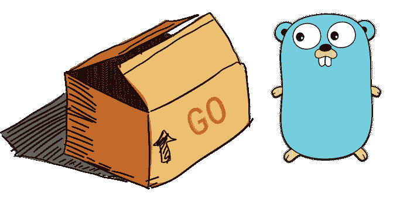

# 学习围棋编程——每月总结 1

> 原文：<https://dev.to/inancx/learn-go-programmingmonthly-recap-af>

嗨，

那是漫长的一个月。我花了 250 多个小时来创作这些文章。我来总结一下我最近写的东西，所以，你没有错过什么。

* * *

# 概述:

**[关于围棋语言——概述](https://blog.learngoprogramming.com/about-go-language-an-overview-f0bee143597c)**
*围棋生态系统及语言概述。*

* * *

# 套餐:

[T2】](https://res.cloudinary.com/practicaldev/image/fetch/s--zl52J4rK--/c_limit%2Cf_auto%2Cfl_progressive%2Cq_auto%2Cw_880/https://thepracticaldev.s3.amazonaws.com/i/rik2paa40qbqrx45vi04.png)

*   **[围棋套餐简介](https://blog.learngoprogramming.com/definitive-guide-to-go-packages-focus-on-the-fundamentals-to-empower-your-skills-d14aae7cd321)**
    *什么是套餐？*

*   **[围棋套餐规则手册](https://blog.learngoprogramming.com/go-packages-summary-6d40ba46a6f4)**
    *总结规则以供参考。*

*   **[如何使用套餐](https://blog.learngoprogramming.com/using-packages-eb70cb61a16a)**

*   **[用包组织你的代码。](https://blog.learngoprogramming.com/code-organization-tips-with-packages-d30de0d11f46)**
    *如何用包设计围棋程序？*

*   **[如何解耦你的包](https://blog.learngoprogramming.com/packages-can-allow-or-disallow-for-reusability-2edb6bd18815)**
    *如何用包增加代码的可维护性。*

*   **[特殊包和目录](https://blog.learngoprogramming.com/special-packages-and-directories-in-go-1d6295690a6b)**
    *关于内部、主、库和厂商目录。*

*   **[修复你的$GOPATH 和$GOROOT](https://blog.learngoprogramming.com/what-are-goroot-and-gopath-1231b084723f)**
    *如何配置它们和它们做什么。*

* * *

# 存储机制:

## 变量:

*   **[可视化引导围棋变量](https://blog.learngoprogramming.com/learn-go-lang-variables-visual-tutorial-and-ebook-9a061d29babe)** *所有关于变量的可视化例子。*

[T2】](https://blog.learngoprogramming.com/learn-go-lang-variables-visual-tutorial-and-ebook-9a061d29babe)

*   **[短变量声明规则手册](https://blog.learngoprogramming.com/golang-short-variable-declaration-rules-6df88c881ee)** *关于如何使用短变量的提示和技巧。*

[T2】](https://blog.learngoprogramming.com/golang-short-variable-declaration-rules-6df88c881ee)

## 常数:

*   **[可视化指南 Go 常量](https://blog.learngoprogramming.com/learn-golang-typed-untyped-constants-70b4df443b61)** *所有关于类型化和非类型化常量的可视化例子。*

[T2】](https://blog.learngoprogramming.com/learn-golang-typed-untyped-constants-70b4df443b61)

* * *

感谢阅读。

*我从 1993 年开始做程序员，从 2016 年开始做在线老师和导师。现在，我在家全职教围棋。*

ðÿ[@金融家](https://twitter.com/inancgumus)T2】ðÿ"š[学习围棋编程博客](https://blog.learngoprogramming.com)