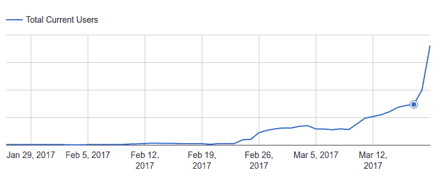

# 构建 2 个 Chrome 插件的经验

> 原文：<https://dev.to/k_ivanow/lessons-from-building-2-chrome-plugins>

#### 4 个小技巧& 6 个对初学者有用的窍门

### 简介:

最近，我的一个插件受到了一些欢迎，主要是因为它被发布在产品搜索上(你可以在这里查看它)，所以我决定分享一些我在制作这个插件时发现的技巧和窍门，以及之前的一个。因为一篇文章，这个插件实际上是在 Medium——[上做的，关于我作为一个开发者如何保持最新状态](https://hackernoon.com/how-do-i-stay-up-to-date-as-a-developer-5ec773e30a82#.5aqn8q60o)。

### 更多一点介绍:

Chrome 插件是影响很多人的一个很好的方式(我发现 Chrome 的市场份额在所有网络使用统计中都超过了 50%)。如果有我错过的，请添加评论或注释。与运行在不同设备上的 Android 相比，Chrome 更加稳定，其 API 在 Windows 和 Linux 上的反应方式相同。

### 关于发展

Chrome 插件脚本在几种情况下运行:

*   后台-后台脚本持续运行。将 persistent 设置为 false 将改为创建[事件页面](https://developer.chrome.com/extensions/event_pages)。
*   在浏览器操作时——当用户点击 chrome omnibar 中的扩展图标时
*   作为[内容脚本](https://developer.chrome.com/extensions/content_scripts)——内容脚本是来自插件的脚本，注入到当前打开的网页中，允许它们在一定程度上使用网页的资源。

让他们交流的最简单的方法是在他们之间传递消息。通过 chrome.runtime.sendMessage(...)或 chrome.tabs.sendMessage(...)

#### 提示#1

内容脚本可以在清单文件中注册，这意味着 chrome 将自己为匹配的网站注入它们，不过你也可以通过编程方式插入它们。这两个都可以，但是请记住，只在清单中注册内容脚本，**将在页面加载后注入它们，并且不会影响用户在安装插件时已经打开的页面。因此，在我看来，坚持程序注射或两者结合更好。**

使用 chrome.tabs.executeScript( null，{file: 'example.js})，可以从任何 chrome.tabs 监听器进行纯编程注入；

就我个人而言，我在清单中描述了我的内容脚本，所以 Chrome 通常可以注入它们，只需通过向它发送消息并检查响应来检查脚本是否确实存在。如果反应不是我所期望的，我会强行注射。

#### 提示#2

Chrome 扩展可以覆盖某些默认的 chrome urls(例如新标签)。这是在插件清单中定义的，因此以后不能更改(例如从设置菜单)。但是，您可以在打开标签页时添加监听器，并检查 url 是否与您想要覆盖的 url 匹配，然后使用 chrome.tabs.update(data，{url: 'yourUrl'})重定向到您想要的 URL；与插件清单中声明的覆盖相比，它足够快，不会造成差异。

#### 提示#3

注意:所有关于 chrome 扩展的东西都使用相对路径。如果你需要插件的绝对路径，你可以使用 chrome . runtime . geturl(' your . html ')；

#### 提示#4

最后但并非最不重要的一点是，关于浏览器扩展的 MDN 文档在某些方面比 [Chrome](https://developer.chrome.com/extensions) 更加详细，并且与 Chrome 不同，其中充满了示例。例如，这里有针对 web 请求的 [MDN](https://developer.mozilla.org/en-US/Add-ons/WebExtensions/API/webRequest/onBeforeRequest) 和 [Chrome](https://developer.chrome.com/extensions/webRequest#event-onBeforeRequest) 的文档。自己对比一下。

### 关于开发后做什么

一旦你把插件上传到 Chrome 网络商店，什么都不会发生。还有成千上万的其他扩展。不要等着某人偶然发现你的分机并爱上它，然后把它展示给他所有的朋友。

#### 义举一

在你开始制作插件之前，首先检查你想出来的名字是免费的，之后也是如此。几周前，[黑暗——美丽的黑暗主题](https://chrome.google.com/webstore/detail/darkness-beautiful-dark-t/imilbobhamcfahccagbncamhpnbkaenm)的创作者联系了我，因为当时我的一个插件也叫黑暗。我写我的时候，他已经发布了他的。所以，在你完成之后，一定要仔细检查，即使你开始的时候这个名字是空的。

#### 义举之二

(Ab)使用 Reddit。尽可能多的提交你的扩展。比如有 [/r/chrome](https://www.reddit.com/r/chrome/) 、 [r/SideProject](https://www.reddit.com/r/SideProject/) 、 [/r/Feedback](https://www.reddit.com/r/Feedback/) 还有这个[线程](https://www.reddit.com/r/startups/comments/5rkpvo/weekly_feedback_and_support_thread/)。找到更多可以用于你的插件。即使它给了你 10-20 个用户，这 10-20 个用户也能带来大量的反馈，并向你展示人们是如何看待你的插件的。

#### 义举三

说到收集反馈，人们不会像你一样理解你的插件。你认为显而易见和容易理解的事情，实际上不是。因此——如果可以的话，总是使用视频，而不仅仅是截图。这将使你不必解释事情。Chrome 网络商店允许上传 YouTube 视频，以及截图。

#### 义举之四

如果 Reddit 能给你一点鼓励和一些反馈，那么 Product Hunt 能给你更多。社区更好，鉴于产品搜索的某些排他性，你的插件可以被更多的观众看到，因为与一些子插件相比，不会有太多其他东西发布。Twitter 上的产品搜索也更加活跃。为了简化起见，这里是[骏利工作区](https://chrome.google.com/webstore/detail/janus-workspace/ibjjadloomfnfbkpdbeiddncgdepdhin)在产品搜寻 2 天之前(蓝点)和之后的用户计数图。

[T2】](https://res.cloudinary.com/practicaldev/image/fetch/s--GYanDH1K--/c_limit%2Cf_auto%2Cfl_progressive%2Cq_auto%2Cw_880/https://cdn-images-1.medium.com/max/738/1%2AlTp_hWAaCC7CtsyYwk2Wpw.png)

公平地说，二月份用户数量的最初增长是由在 Reddit 上发帖引起的。

#### 义举之五

[Typeform.com](https://www.typeform.com/)可以用来制作一个反馈表单，并将其设置为卸载 url，以获得用户关于为什么卸载你的扩展的反馈。这真的很容易定制和编辑，你不需要任何托管和后端。当心你可能(**和【威尔】)**得到许多回应，用不可理解的蹩脚英语，你不会说的语言，或者从“*ok”*和*“puf”*到*“No Me Gusta”*的任何东西。然而，在所有这些不可用的回复中，总有一些是值得的—“*它不会自动捕捉，这将是一个很好的例子”，“预定义的窗口分布将使它更容易管理。”、“写下 URL 时从历史记录中加载它们。”*

#### 义举之六

Google Analytics 可以用在插件中，绝对值得。关于如何在插件中运行谷歌分析的教程可以在[这里](https://developer.chrome.com/extensions/tut_analytics)找到。打开谷歌分析板，看到总是有很多人使用你的插件是一个附带的好处。

#### 开场白

*我猜*

我写这篇文章是为了总结我在制作最新的 2 个副业项目时遇到的一些事情。我不认为自己是制作和推广 Chrome 插件的专家。然而，我相信这对于刚开始涉足 Chrome 网上商店的开发者来说是有用的。

* * *

*本帖最初发表于[medium.com](https://hackernoon.com/lessons-from-my-2-chrome-plugins-1cabea2b8e06)T3】*