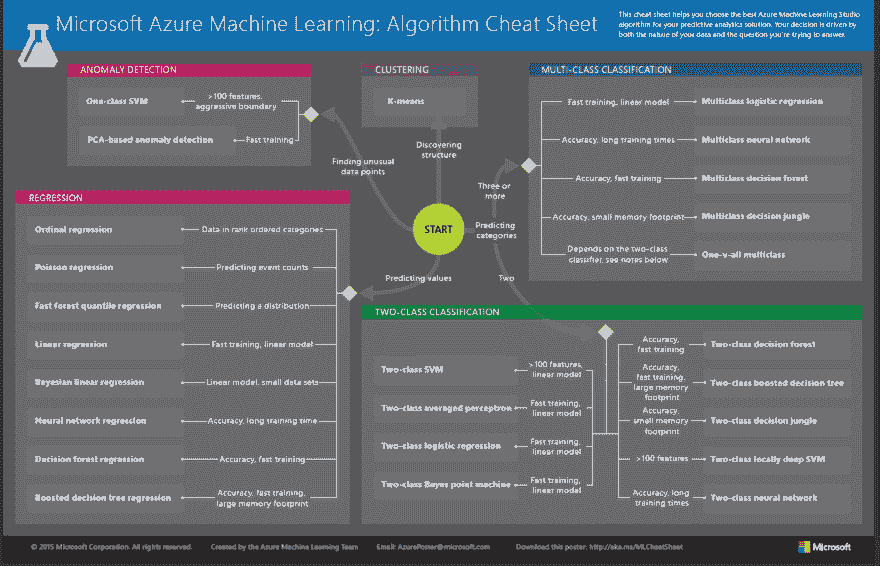
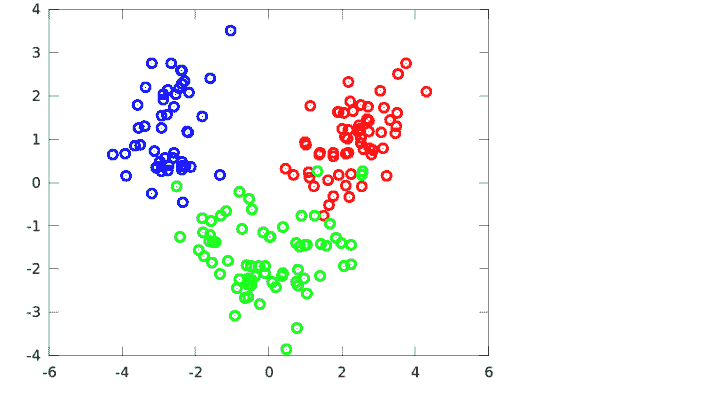

# 机器学习——问题还是解决方案

> 原文：<https://dev.to/japneet121/machine-learning-a-problem-or-solution>

### 本文将分为以下不同部分:

*   机器学习导论
*   解决方案的类型
*   使用朴素贝叶斯分类

## **简述机器学习**

According to the definition by Wikipedia,** Machine learning** is the subfield of [computer science](https://en.wikipedia.org/wiki/Computer_science "Computer science") that, according to [Arthur Samuel](https://en.wikipedia.org/wiki/Arthur_Samuel "Arthur Samuel") in 1959, gives "computers the ability to learn without being explicitly programmed."  Machine Learning defines a set of problems that have to be evolved through the data by implying some algorithm. One factor that has to be kept in mind while defining a solution through ML is accuracy. Accuracy is very critical in case you are developing a solution in medical domain(cancer detection).There should be a threshold set for every solution which can be based on risk %age that is acceptable.

### 来自微软网站的一份有用的备忘单，总结了不同类型问题的不同 ML 算法的使用。

[T2】](https://2.bp.blogspot.com/-xf-9_wVJzc0/WUZw8z43-NI/AAAAAAAABlQ/bvC5rZblonUuwBrS36gE7NCikZ2etcu8gCLcBGAs/s1600/ML_problems.png)

## 解决方案的类型

Machine Learning solutions can be broadly classified into three types 

### 

*   Supervised learning
*   Unsupervised learning
*   Intensive study

监督学习是一种对机器进行一些标记数据的训练，并告知其要解决的问题的类别。学习的模型然后使用其知识来解决未来类似的问题。在这种类型的学习者中，一个主要要求是标签数据的可用性。这种问题的一个例子可以是对象识别问题。 首先训练一个模型，告诉它不同类型的物体，然后要求它识别这些物体。另一方面，无监督学习是一种不向学习者提供任何输入(即标记数据)的类别。他们使用自己的算法，开始解决问题，并自己解决问题。最初他们可能不会提供太多的准确性，但他们最终会学会提供准确的结果。我们可以把这个学习者想象成一个人，他去了某个外国，但事先对那里的语言没有任何了解。他从自己的经历中学到了人们如何互相问候，如何打招呼等等。 强化学习是一种机器通过进行一些预测进行学习，并因做出错误预测而受到惩罚的类别，由于这种惩罚，机器学习不再犯这种错误。以一个无人驾驶机器人为例，它在有障碍的道路上爬行，每次它看到一个物体并撞到该物体时，它都会因为预测到不会采取适当的行动而受到惩罚。下一次，机器人看到它从过去的经验中知道的同样的障碍，并避免再次犯同样的错误。

## 分类问题的机器学习

分类是一组机器学习问题，其中输入被分类成不同的类别，这些类别可以是监督的或无监督的。

[T2】](https://1.bp.blogspot.com/-bFNOwGlrJLI/WUaVHAfs15I/AAAAAAAABlg/-S2D8WFACOQEmwF9z-DoJYtUHSuUDWtvwCLcBGAs/s1600/classification.png)

分类问题举例:

*   情感分析
*   产品分类
*   评论的二元分类(正面、负面)及更多

## 基于朴素贝叶斯算法的电影评论分类

我将使用 nltk，即 python 和电影评论语料库中可用的自然语言处理工具包，该工具包将电影评论的数据分为正面和负面。T2T4T6】

```
import nltk.classify.util

from nltk.classify import NaiveBayesClassifier

from nltk.corpus import movie_reviews

#word_feats will convert the sentence into features

def word_feats(words):

return dict([(word, True) for word in words])

negids = movie_reviews.fileids('neg')

posids = movie_reviews.fileids('pos')

#training data is converted into features

negfeats = [(word_feats(movie_reviews.words(fileids=[f])), 'neg') for f in negids]

posfeats = [(word_feats(movie_reviews.words(fileids=[f])), 'pos') for f in posids]

#data is divided into training and testing data

negcutoff = len(negfeats)*3/4

poscutoff = len(posfeats)*3/4

trainfeats = negfeats[:negcutoff] + posfeats[:poscutoff]

testfeats = negfeats[negcutoff:] + posfeats[poscutoff:]

print 'train on %d instances, test on %d instances' % (len(trainfeats), len(testfeats))

**#naivebayes classifier used for training on training data**

classifier = NaiveBayesClassifier.train(trainfeats)

print 'accuracy:', nltk.classify.util.accuracy(classifier, testfeats)

classifier.show_most_informative_features()
print  'classified as:',classifier.classify("The plot was good,but the characters were not compelling")

```