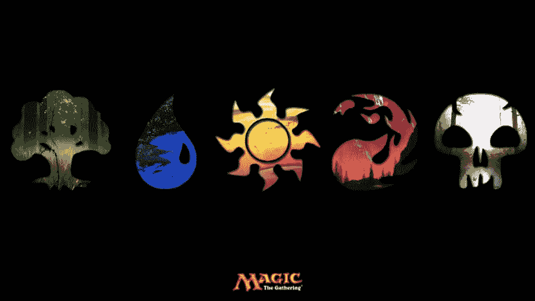
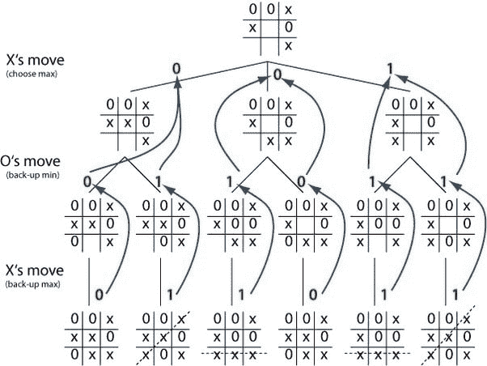
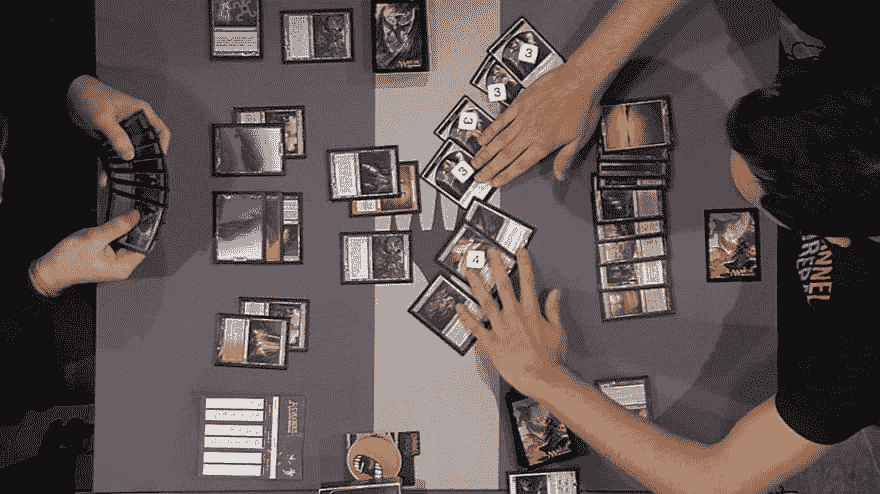
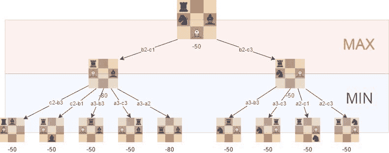
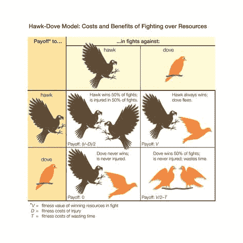
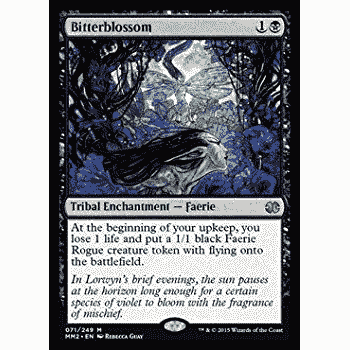

# 魔法聚会，数学和人工智能

> 原文：<https://dev.to/terceranexus6/magic-the-gathering-maths-and-ai-dab>

当我还是个孩子的时候，我经常在漫画店里和店主玩万智牌，用我预先做好的绿色/红色卡牌。目前我重新开始玩 MTG，首先是因为我对代币创造和*改变*感兴趣，但也带着控制*黑白*牌组回来玩。但是现在，作为一名工科学生，我开始好奇**一个人工智能将如何玩魔法**(理论上)以及在这个游戏中涉及到哪种数学。

[T2】](https://res.cloudinary.com/practicaldev/image/fetch/s--QvAhkb5g--/c_limit%2Cf_auto%2Cfl_progressive%2Cq_auto%2Cw_880/http://img1.meristation.as.com/files/imagenes/general/magic.png)

对于那些不知道 **MTG** 的人来说，这是一种由计算机数学家在 90 年代创造的纸牌游戏，几年后变得非常流行。目前，这款游戏在全球范围内举办了大量的锦标赛，而且涉及到大量的金钱。

人工智能的发展在过去的几年里有了很大的发展，创造了令人惊讶的代理人，如扮演围棋的[或被创造来谈判的](https://www.theguardian.com/technology/2017/may/25/alphago-google-ai-victory-world-go-number-one-china-ke-jie)[的](https://futurism.com/a-facebook-ai-unexpectedly-created-its-own-unique-language/)，正如图灵在他的研究 [*计算机机器和智能*](https://www.csee.umbc.edu/courses/471/papers/turing.pdf) 中推测的那样，人工智能期待着未来的巨大发展。

万智牌本身包含许多规则。它不仅有大量的游戏规则，而且每张牌都有自己的规则要考虑。但是，即使人工智能能够在一个巨大的数据库中存储所有这些信息，也有更多的问题需要面对。

**首先每场比赛的信息都不完整**。这意味着，即使知道自己的牌(或者知道对手的牌)，也有随机的成分，因为第一轮开始从牌顶上随机抓七张牌，接下来的几轮抓一张。如果对手的牌是未知的(一种可能的情况)，那就更糟了。

实际上，我是在撒谎。一个人工智能可以用有限数量的卡片轻松地处理“T0”“一系列已知策略中的随机成分”。我发现 Hanafuda Koi Koi 是一个不错的例子，在这个游戏中，玩家需要组织卡片来创建构图。我找到了[这个储存库](https://github.com/xingdi-eric-yuan/hanafuda)，举个例子。无论如何，这种游戏可以使用最大最小编程策略来解决，每次更新表中的信息。

例如，这是一种最小-最大的游戏方式(脚尖-脚尖-脚尖) :

[T2】](https://res.cloudinary.com/practicaldev/image/fetch/s--mujeBeW9--/c_limit%2Cf_auto%2Cfl_progressive%2Cq_auto%2Cw_880/https://qph.ec.quoracdn.net/main-qimg-d40fa96a33d58e91e844e3430cefad35-c)

**那么魔法到底怎么了？**

战略不是那么清晰。寻找更大的点数(如在 Hanafuda 中)可以对牌桌进行数学分析，但这种情况下的策略更复杂。当然有一些玩家通常采取的模式，并且可以通过研究大量游戏进行分析(就像锦标赛中的那些)，但是很常见的是玩家创造他们自己的策略和牌组，这同时创造了越来越多的*几乎*无限数量的策略。这不仅是有问题的，而且玩家可以在游戏中尝试随机应变一个策略。

[T2】](https://res.cloudinary.com/practicaldev/image/fetch/s--ciRqqigk--/c_limit%2Cf_auto%2Cfl_progressive%2Cq_auto%2Cw_880/https://images.vice.com/viimg/articles/meta/2015/05/07/the-mystical-universe-of-magic-the-gathering-000-1431011776.jpg%3Fcrop%3D1xw:0.9991119005328597xh%3Bcenter%2Ccenter%26resize%3D1050:%2A)

此外，玩家接近对手的方式不是决定性的，除非该行动显然是制定一个回合策略，但玩家更有可能制定两个以上回合的策略，该策略可以根据对手每回合的新手牌而变化。在一个**有限的完美信息博弈**(例如[象棋](https://medium.freecodecamp.org/simple-chess-ai-step-by-step-1d55a9266977))中，这种 2+回合分析是可能的，因为所有的信息都已经在表中了(所有的代币和可能的移动)，但在 MTG 不是这种情况，正如我们已经解释过的。

这是一个象棋运动的最小值-最大值的例子。

[T2】](https://res.cloudinary.com/practicaldev/image/fetch/s--PoVd7Hdr--/c_limit%2Cf_auto%2Cfl_progressive%2Cq_auto%2Cw_880/https://cdn-images-1.medium.com/max/1600/1%2AUA5VlNs7s4gl80VknA099w.jpeg)

我们已经说过我们可以在 MTG 的一个游戏中找到无数的策略，我想解释一下我在游戏中看到的一些模式。首先让我解释一个简单的细节。游戏策略对玩家开放，但是每个*颜色*都有特定的角色分配。这意味着，相同颜色的卡片倾向于遵循一个特定的策略，可以方便地操纵和弯曲，但通常决定了一副牌的风格。白色、黑色和蓝色通常表示*控制*(特别是蓝色)；红色和绿色更多用作直接攻击。同样，这是一个一般的想法，因为它可以在具体的策略中改变。

话一说完，我问你一件事。你们听说过"*吃鸡游戏*"吗？这是一个很有代表性的游戏(和囚徒困境一起)，它解释了两个玩家的具体情况。

这个游戏很简单:两个司机在他们的车里面对面。两人都加速了，游戏的积分是这样分配的:

*   如果他们因为谁也不动而挤在一起，双方都得 0 分(咄)
*   如果他们都在最后一刻离开了拥挤的人群，他们都得 3 分。
*   如果他们中的一个离开了挤压，而另一个留在相同的轨迹上，第一个得 1 分，第二个得 5 分。

这可以从《没有原因的反叛》中看到。

[T2】](https://res.cloudinary.com/practicaldev/image/fetch/s--hNga1N20--/c_limit%2Cf_auto%2Cfl_progressive%2Cq_66%2Cw_880/https://1.bp.blogspot.com/-K_Dv_lCPFsI/VvN3SZ10M4I/AAAAAAAAvg0/8c-USEstNWYJF_z12vrfyHMVNQJ3cYkEQ/s640/19%252B%2525282%252529.gif)

这确实是一个非常硬核的游戏，但它可以应用在政治或谈判等日常事务中。这个例子只是描述了游戏中玩家的主导欲望，当然这也可以在 MTG 看到。当玩两副相似的牌(或某些回合)时，我可以看到这种模式，例如，这可能涉及相似的颜色。这种情况，tho，暗示着相似的策略，不一定是相同的颜色暗示的。

说到鸡，还有另一种对行为的数学研究，通常被称为“*鹰和鸽子*”。在这个例子中，鹰在直接攻击中有优势，但是有许多鹰会引起鹰之间的冲突，减少它的数量并再次与鸽子保持平衡。
T3T5】

我在一个特定的控制策略中看到了这一点，它每回合都导致使用者的生命损失，但创造了一个优势，如令牌(可以生成的生物，大多数攻击较低)，没有治疗伤害的卡的支持。如果对手让第一个玩家将生命损失牌放在桌上，这个玩家每回合肯定会受到伤害，但也有数吨生物的牌桌控制权。鹰派类似于玩家把牌放在桌上的时候，鸽派是对手。如果对手在可能的情况下摧毁了这张牌，他/她就移除了他/她的敌人的持续生命损失，同时也拿走了持续牌桌控制权。

[T2】](https://res.cloudinary.com/practicaldev/image/fetch/s--xZzSlyws--/c_limit%2Cf_auto%2Cfl_progressive%2Cq_auto%2Cw_880/https://images-na.ssl-images-amazon.cimg/I/51PahMyHu-L._SL500_AC_SS350_.jpg)

处理这类问题不仅需要人工智能可以确定的逻辑演算，还需要与敌人进行某种合作，以便找到一种方法成为主导者，而不会变得极具侵略性。这是一种微妙的主观行为，对一些人来说可以描述为“直觉”，或者在没有直觉的情况下，可以描述为“经验”。一个和人类一样的人工智能可以通过无数次的学习、胜利和失败来获得经验，但是对于这样一个人工智能来说，学习这种模式是非常困难的。如果我被要求在这件事上为一个 MTG 特工创造一条捷径，我会列出每一张倾向于产生这种策略的牌(就像上面的那张),并创造一种特定的行动方式，但这同样会导致一个愚蠢的行动，取决于上下文。

综上所述，具有随机成分的不完美无限游戏的策略很难由一个 AI 代理来管理，并且该游戏可以有几个已经针对现实生活问题研究过的策略。如果天网占领了我们的世界，那就来一场魔术吧！