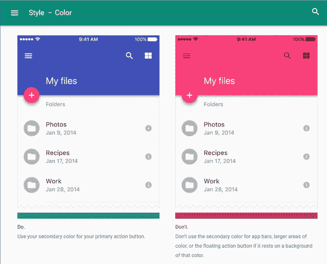
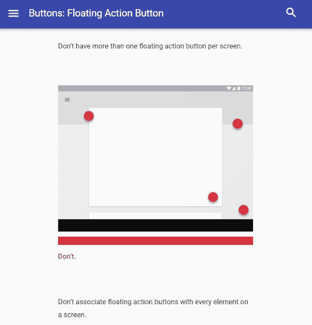

# 灯塔材料设计指南

> 原文：<https://dev.to/mejiamanuel57/material-design-guidelinesthe-lighthouse-5fim>

 

也许，你听说材料设计已经有一段时间了，是的，它从 2014 年就开始了。还有，你已经在你手机和桌面上几乎所有的谷歌应用里看到了。

但是...什么是真正的材料设计，你为什么要利用它的[指南](https://material.io/guidelines/)？

简而言之，材料设计是谷歌描述最佳实践的方式**你的应用程序上的物体和所有东西应该看起来和感觉如何**。关于材料设计的整个事情是在多年研究用户如何对不同应用程序的不同界面做出反应后得出的。

现在，真正的问题是，阅读[材料设计指南](https://material.io/guidelines/)有什么好处？

有时候前端开发人员和 UX/UI 设计人员会遇到这样的问题:在用户界面开发的某个阶段，一个应用程序应该是什么样子的，他们会想到一些问题:

*   应该是这个按钮吧？
*   这个通知在正确的地方吗？
*   当我在这部分执行一个动作时，我能展示什么？
*   我的颜色组合对吗？
*   等等。

[材料设计指南](https://material.io/guidelines/)可以帮助你做出那些模糊的决定，告诉你在你的应用程序中应该放在哪里，放些什么，让它更直观。让我给你一些该做和不该做的例子:

处理颜色:

[T2】](http://2.bp.blogspot.com/-DFMG-tBx47M/WlK6mo53BMI/AAAAAAAAMWA/Xg-vfopmr90Sks7b0HGM1NqIoiUoiRJzACK4BGAYYCw/s1600/colors.JPG)

定位浮动按钮:

[T2】](http://2.bp.blogspot.com/-lEljNVacffE/WlK6v082sGI/AAAAAAAAMWQ/RjdeY1KGgDo67gq_XB9HCCHOROYqbASXgCK4BGAYYCw/s1600/buttons.JPG)

显示消息:

对于用户界面的每一个组件，他们都给出了例子和使用说明，比如:数据表、卡片、列表、菜单、工具提示、按钮等等。就像一座灯塔，指引着船只穿过黑夜，材料设计会给你正确的方向，对于非设计师熟练的开发者来说是一个巨大的帮助。

所以不要跳过它，读一读吧。我向你保证，这将为你节省大量时间，并使你的应用对用户来说更加直观。

另见你框架的材质设计实现:

【material-ui.com】-React

-Vue

[Material . Angular . io](https://material.angular.io/)-Angular