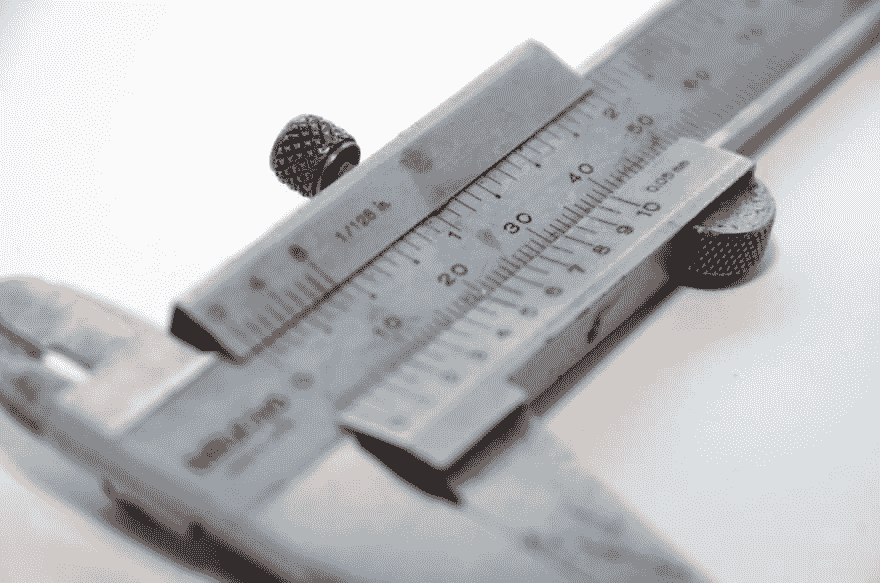

# 衡量什么是重要的

> 原文：<https://dev.to/jezhalford/measure-what-matters-1na7>

[T2】](https://res.cloudinary.com/practicaldev/image/fetch/s--BN32pbVZ--/c_limit%2Cf_auto%2Cfl_progressive%2Cq_auto%2Cw_880/https://cdn-images-1.medium.com/max/1024/0%2AZ9cArQBKt1UdFqal.)

从开始到出货，你将一个特性交付到产品中需要多长时间？

如果你不能很容易地回答这个问题，是时候做一些测量了。随着时间的推移，您可以努力改进这个指标，但是除非您已经知道了，否则您只是在胡乱猜测。

很容易被如何找出这个数字所困扰。一种常见的方法是要求所有开发人员针对他们正在开发的任何功能，一丝不苟地记录他们的每时每刻。

另一个选择是雇佣一个优秀的项目经理团队来记录和分类所有发生的事情。

但是开发人员(事实上大多数其他人)讨厌被测量。这表明缺乏信任。这表明你认为他们很懒。这对任何人来说都是不愉快的。

但我会告诉你一个秘密。你测量的准确性可能并不像你想的那么重要。这是因为交付物品所需的时间——实际上，正确完成并发挥作用——几乎肯定比你想象的要长得多。

30 天？60 天？80?100?这并不罕见。从第一个想法到最后一次部署通常是一个非常长的时间。

当然，并非所有团队都是如此。如果你已经在几天内交付了*完整的*特性(老实说)，那么衡量和改进就是另一回事了。但是考虑到几十天的规模，让您的团队将时间记录到分钟开始看起来有点疯狂。

所以，首先，记笔记。一旦某事被承诺，写下日期。然后一旦每个人都同意完成了，再写下日期。几个月后，您可能会有一个合理的图景，以及可以用来估计未来特性和测试改进效果的硬数据。这一切都不会危及你的团队的信任。

Jez Halford 是一名软件开发顾问，帮助团队更频繁地交付更好的软件。访问 jezhalford.com**了解更多信息。**