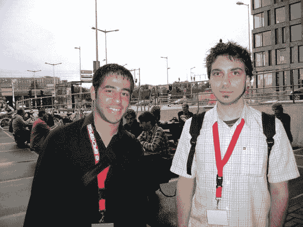
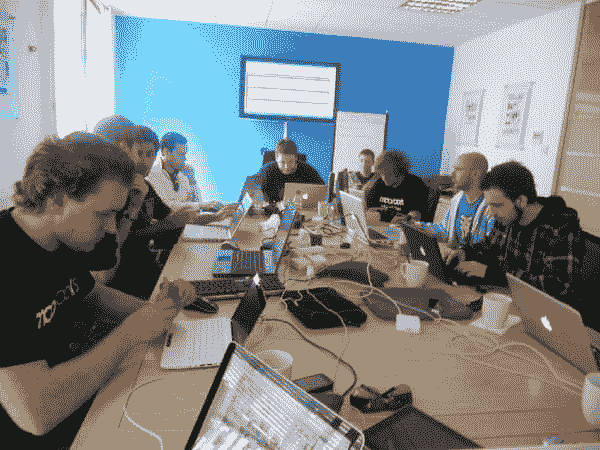
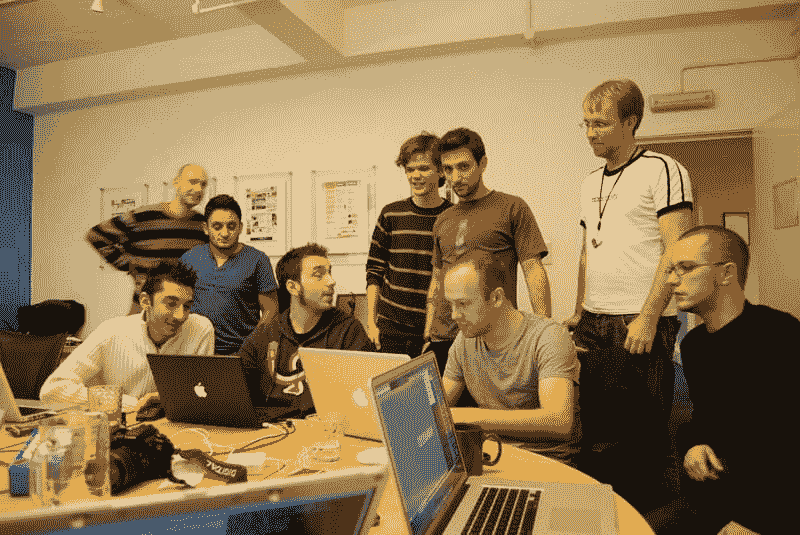
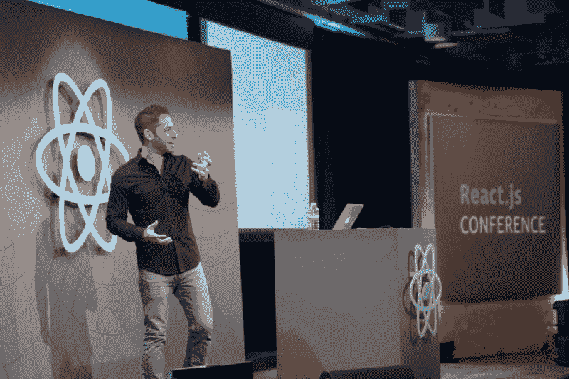

# MooTools

> 原文：<https://dev.to/betweenthewires/mootools>

## 简介

如果你在 2009 年做 web 开发，[*【MooTools】*](http://mootools.net/)*很可能不需要介绍！MooTools 是一个著名的 JavaScript 实用程序库，用于构建“功能强大、灵活的代码以及优雅、文档完善、连贯的 API”。它的* [*核心贡献团队*](https://mootools.net/developers) *是由一群杰出的开发者组成的，今天我们很幸运能和他们中的三位对话:*

以前 MooTools 的核心贡献者，[Sebastian markb ge](https://twitter.com/sebmarkbage?ref_src=twsrc%5Egoogle%7Ctwcamp%5Eserp%7Ctwgr%5Eauthor)， [Tom Occhino](https://twitter.com/tomocchino) 和 [Christoph Pojer](https://twitter.com/cpojer) 现在是 [React](https://facebook.github.io/react/) 社区的活跃贡献者。

## **你能告诉我们一些关于你自己和你们是如何进入编程的吗？**

## T2】

Sebastian: 我的父亲曾经为 Commodore 64 编写游戏代码，我会看着他，修改它们。我真正迷上编程时才十岁。我开始通过 Qbasic for MS-DOS 编程游戏和做小的查找数据库。

汤姆:当我第一次买电脑时，我运行的是 Windows 3.1，然后是 Windows 95。我开始沉迷于重新给窗户换肤。我想让我的电脑看起来不一样，所以我想出了如何破解资源，改变图像。我从 MS Paint 开始，给按钮做了不同的颜色。然后，有一个叫 WindowBlinds 的项目让我开始创作自己的皮肤。最终，我发现了 HTML。这要容易得多，也更好。

Christoph: 所以，我在大约 12 岁的时候开始编程，试图学习如何制作网站。然后，我想当我大约 14 岁的时候，当我的一个中学朋友在网上玩游戏时，我和他打赌我能做到，并且让 T2 变得更好。之后的四个星期，我基本上每天都在做一个网游。这是一种激励，制作一些小游戏，然后让一群人玩。

**面试官:**有意思！游戏似乎是这里的主题，尤其是对于早期接触编程的人来说。

汤姆:是的。你必须在记事本中编辑 HTML 并生成一个`.html`文件。没有语法高亮或类似的东西。我不知道什么是有效的标记，直到网景在 1990 年代，比如 1997 年问世。

<figure>

<figure>

<figure>

<figure>[T3】

<figcaption>网景</figcaption>](https://res.cloudinary.com/practicaldev/image/fetch/s--LzhIfQyy--/c_limit%2Cf_auto%2Cfl_progressive%2Cq_auto%2Cw_880/https://cdn-images-1.medium.com/max/800/1%2AH4Demn1kbefr2BcBUfYJZA.png) </figure>

<figcaption>Â</figcaption>

</figure>

<figcaption>**Tom:** I think it was probably ’98 for me if I had to guess because I was 13\. It seems like it was earlier.</figcaption>

</figure>

<figcaption>**Christoph:** Exactly! I made websites and someone told me that a website I made didn’t work in Firefox. I didn’t even know what Firefox was. That was 2001.</figcaption>

</figure>

是的，93 年是我开始的时候。我想我是从网景 2 开始的。CSS 根本不存在。HTML 已经存在，但是 JavaScript 还没有出现，所以你实际上不能在客户端上编程。你必须在服务器端做所有的事情。一切都是 Perl 和 CGI。

汤姆:你是只恐龙。【T2

[T2】](https://res.cloudinary.com/practicaldev/image/fetch/s--FFkce6vu--/c_limit%2Cf_auto%2Cfl_progressive%2Cq_auto%2Cw_880/https://cdn-images-1.medium.com/max/800/1%2AsmxcdYTdzqEdGm3LczmjZQ.png)

## **回到原点，你知道 Valerio 为什么要创办 MooTools，又是怎么起步的吗？**

<figure>

## T2】

<figcaption>MooTools in 2007</figcaption>

</figure>

汤姆:当瓦列里欧看到一些可以做得更好的事情时，他总是很沮丧。他用的是原型，更确切地说是 [script.aculo.us](http://script.aculo.us/) 。有一个常见问题，如果您创建了一个单击事件处理程序来启动动画，并且您单击了它两次，它将重新启动动画，基本上每次都会启动新的动画，而不能选择继续、将另一个动画加入队列或替换。

事实上，他最初创造的并不是 MooTools。他对于 [Moo.fx](https://moofx.mad4milk.net/) 的全部前提就是能够保留这个实例，并且能够做得比 [Script.aculo.us](http://script.aculo.us/) 默认做的更好。Prototype 在当时相当大，所以他创建了`prototype.lite.js`，它基本上只是类系统加上一些实用程序。最终，他在此基础上建立了 Moo.fx。它今天一定还存在于某个地方，但它就是这样诞生的。从 Moo.fx 开始，有了一个替代方案的基础——Prototype plus[script . aculo . us](http://script.aculo.us/)——后来成为了 [MooTools](http://mootools.net/) 。

<figure>

<figcaption>mootools 库</figcaption>

</figure>

原作者汤姆(左)和瓦莱里奥(右)

## **你们每个人是如何开始为 MooTools 做贡献的？**

汤姆:我正在为一家摄影工作室开发相册应用程序，我们需要一种对照片进行分类的方法。当时， [MySpace](https://myspace.com/) 有一个前八的网格。他们一次性地实现了它，我们希望为它提供更好的支持。

Script.aculo.us 也有类似的内置，但我基本上扩展了 MooTools 的拖放库，并创建了 [Sortable.js](https://docs111.mootools.net/Plugins/Sortables.js) 。我把它给 Valerio 看了，他决定把它放在 MooTools 的核心。

面试官:你当时多大？既然当时没有 Github，你是怎么找到回购协议的呢？

Christoph: 我们用了 [Trac](https://trac.edgewall.org/) 和 [Subversion](https://subversion.apache.org/) 。

<figure>

[T2】](https://res.cloudinary.com/practicaldev/image/fetch/s--x-WFSkWG--/c_limit%2Cf_auto%2Cfl_progressive%2Cq_auto%2Cw_880/https://cdn-images-1.medium.com/max/800/1%2AmBfoaAB5Io_w4SQLyTVWyw.png)

<figcaption>MooTools Trac</figcaption>

</figure>

Tom: 接触 Trac 和 Subversion 是一件大事。当 Valerio 让我投稿时，没有代码评审。你刚刚登记了。

Christoph: 我和 Valerio 有相似的经历。不喜欢原型和剧本. aculo.us 我看了 Moo。Fx 然后 MooTools 出来了。那是 2006 年 9 月——我 16 或 17 岁。

<figure>

<figure> 

<figcaption>克里斯托夫带着恐惧锁ðÿ˜†</figcaption>

</figure>

<figcaption></figcaption>

</figure>

我正值青春年少，有点叛逆。我希望我的代码是完美的，而 MooTools 就是写得如此完美。它是如此的小，但却做了我想要的一切。我非常理想主义。

汤姆:你还记得你的第一笔捐款是什么吗？我不太记得了。

Christoph: 我在 2006 年初开始用它玩游戏。我真的为我的朋友建了一个德国版的[脸书](https://facebook.com/)，尽管我不知道什么是[脸书](https://facebook.com/)或 [MySpace](https://myspace.com/) 。然后我用它做了一些其他的游戏。我贡献不大。

我不太懂英语，但正在努力学习。我在 2009 年成为核心撰稿人，几乎是在汤姆被脸书聘用的时候。他基本上是让我们在那之后接手。从那时起，我开始为 core 做贡献，然后我们开始在伦敦举行黑客马拉松，在那里我们每年聚会一次。那真是太酷了。

Sebastian: 我和 Christoph 差不多同时进来，但我的经历不同。这发生在我第二次使用 JavaScript 的时候。我在 90 年代末开始使用 JavaScript，当时它几乎没什么用。然后在 2005 年左右它有了一次复苏，在仅仅在服务器上呆了五年之后，我开始回到客户端。我在看所有的框架，我需要更多的帮助。我想了解更多，MooTools 帮助我了解了这门语言是如何工作的。它写得非常简洁，你可以研究代码库本身，但我对一些细节感到失望。与这些人不同，我当时实际上正在开发相当复杂的应用程序。我在构建这个复杂的所见即所得编辑器。

汤姆:我正在开发一个内容管理系统。还不是*那*微不足道，加油。

塞巴斯蒂安:我在公共邮件列表上发了一通牢骚。有两个邮件列表——一个是仅供开发人员使用的私有内部列表，另一个是公共列表。在公开列表中，有一个叫亚伦·牛顿的人，他可以说是 MooTools 之父。他之所以是成年人，是因为他当时实际上正在创建创业公司，并试图创建一个社区，因为他明白其中的价值。他花了很多时间在公共论坛上帮助新人，并把他们带进核心圈子。我在公共邮件列表上发表了这些长篇大论，他邀请我加入这个封闭的圈子。

汤姆:我想我们都是从论坛开始的。第一步是获得论坛的版主权限——能够关闭主题并权威地回答问题。我们的名字旁边有小图标，表示我们是版主。我与 Valerio 的第一次接触是在他伸出手来感谢我帮助论坛的时候。从那时起，我开始为代码做贡献。

克里斯托夫:真有趣，因为我还留着那封邮件。我与 Valerio 的第一次互动实际上并不是关于 MooTools 本身。他造出了我真正需要的捆扎机或压缩机，没有其他类似的东西。我们过去只提供 30 个 JavaScript 文件，这个 MooTools 网站有这个捆绑器，你可以把你的文件连接在一起。

> MooTools 构建器。所以在它到来之前。

汤姆:所以在它的时间到来之前，人类，MooTools 的建造者。所以在它到来之前。你选择了你想要的东西，它为你创建了一个定制的脚本。你只需要保存文件并把它放在你的网络服务器上。太棒了。

Sebastian: 因为没有共同的 JS，所以很巧妙。

汤姆:什么都没有。全都是全球性的。

Sebastian: 没有办法从任何人的代码库中判断出需要哪些模块，所以你必须自己检查，但因为它只是一个网站，你可以很容易地做到这一点，而不必试图围绕它制定一个标准。

## **MooTools 身边就有这样一个鲜明而令人难忘的品牌。最初使它脱颖而出的核心价值观是什么，你认为为什么人们今天会如此积极地记住它？**

**Sebastian:** 我们非常重视代码库的可读性，因为这是我们学习的方式。

我们认为 jQuery 是相反的，它的一切都是内联的。没有可重用的抽象，他们试图支持所有的用例。最终，这使得代码更难理解和维护。这就是我们选择不支持那么多用例的原因。

[T2】](https://res.cloudinary.com/practicaldev/image/fetch/s--z3EUAju4--/c_limit%2Cf_auto%2Cfl_progressive%2Cq_auto%2Cw_880/https://cdn-images-1.medium.com/max/600/1%2Aez90JE2z1LQZSWMeGBOEFw.png)

克里斯托夫:这很有趣，因为我们都非常志同道合。我们创造了一些伟大的东西，但我们没有做任何推广。在七年的时间里，我们大概参加了 3-5 次会议。我们并不是真的为其他人建造它。我们试图建立一个完美的框架，一些我们可以使用的东西。这可能不是发展开源项目的最佳方式，但我们只是自己的小社区，试图建立一些完美的东西。

塞巴斯蒂安:还有链条。链接非常明确，一切都是围绕可读性和语法设计的——链接应该模仿英语句子。

Tom: 我们不断地迭代来完善和改进 API。其中一个指导原则是，基于 MooTools 构建的代码应该是可读的、易于理解和易于扩展的。我们头脑中有一个非常严格的风格指南，我们都遵循它。从某种意义上说，这几乎是学术性的。

Christoph: 我认为学术是一个很好的描述。我们太专注于 API 设计，而不是构建人们可以实际使用和采用的东西。

<figure>

[T2】](https://res.cloudinary.com/practicaldev/image/fetch/s--26mckhpo--/c_limit%2Cf_auto%2Cfl_progressive%2Cq_auto%2Cw_880/https://cdn-images-1.medium.com/max/800/1%2Ae8VfMuUFURLsX6rB_U6-_Q.png)

<figcaption>MooTools team hacking away</figcaption>

</figure>

## **你认为在使用 MooTools 时学到的最有影响力或最重要的东西是什么？**

> 正如我们所说，协作对于创建一个非常紧密的团队非常重要——一个在如何编写代码和应该优先考虑什么方面共享相同价值观的团队。这是我们掌握的让我们前进的一件事。

**Sebastian:** 正如我们所说，协作对于创建一个非常紧密的团队非常重要——一个在如何编写代码和应该优先考虑什么方面共享相同价值观的团队。这是我们掌握的让我们前进的一件事。

另一方面，实用主义是我们做得不好的东西，但我们已经学会了。

**Christoph:** 对我来说，因为这是我参与的第一个开源项目，所以我从参与社区和从事开源工作中学到了很多。这种经历会让你精疲力尽。人们讨厌你对他们不理解的 API 进行修改，或者你不得不一直面对人们的质疑。但是，了解这个社区，和每天和我一起工作的人见面，对我来说是最好的事情之一。

汤姆:对我来说，学习 JavaScript 意义重大。有大量的实验，试图以跨浏览器的方式解决问题，我觉得我几乎承担了太多跨浏览器不兼容的问题。我觉得我真的学到了 JavaScript 和函数式编程的概念，这是我在学校学不到的。

> 我们被雇佣是因为我们可以用 JavaScript 解决真正的商业问题。JavaScript 在开始时被人看不起，停滞不前，有性能问题，但它让我们建立了一些富有成效的东西。

Sebastian: 我认为这是过去十年中被低估的一点。有越来越多的像我们一样没有经验的孩子，我们被雇佣了，因为我们可以用 JavaScript 解决真正的商业问题。JavaScript 在开始时被人看不起，停滞不前，有性能问题，但它让我们建立了一些富有成效的东西。

与此同时，有许多学术项目———人们普遍认为它们会成功。这些由大企业支持的商业工具将会取代 JavaScript。但事实并非如此。这表明，你必须注意人们被什么吸引。他们被它吸引是有原因的。

## **MooTools 可能是你最早的大型开源贡献和项目之一。你认为这对你的职业生涯有什么影响？**

汤姆:实际上，对我来说，这很简单。有人在荷兰组织了一个名为[fronters](https://youtu.be/4atCNDQ_qbs?t=92)的会议，他们使用并喜欢 MooTools。所以他们联系了 Valerio，看他是否愿意谈谈 MooTools 和面向对象的 JavaScript。瓦列里欧介绍给我的。我很年轻，20 出头，我从未在会议上发言。我真的不知道我在说什么。我每天都感谢我的幸运星，它没有被记录下来，因为它太尴尬了。结果，一位来自脸书的招聘人员联系了我，说他们正试图用 JavaScript 做更多的事情，并邀请我去面试。

<figure>

[T2】](https://res.cloudinary.com/practicaldev/image/fetch/s--h4OmcBte--/c_limit%2Cf_auto%2Cfl_progressive%2Cq_auto%2Cw_880/https://cdn-images-1.medium.com/max/800/1%2AUoMP-4eZNNw-NOIJiIDeGw.png)

<figcaption>Tom at React.js Conf</figcaption>

</figure>

克里斯托弗:我的故事和汤姆的很相似。我还做了一次[公开演讲](https://youtu.be/6nOVQDMOvvE)。这真的很难，因为虽然我习惯了公开演讲，但我不习惯在外国用英语公开演讲。我没有汤姆那么幸运，我的演讲还在网上。我过去有很重的奥地利口音，像阿诺德·施瓦辛格一样。

演讲结束后，一位脸书的招聘人员找到了我，我最终在脸书实习。汤姆实际上是我的实习经理，所以一切都很顺利。然后，我必须回到大学完成我的学位，然后才能全职加入脸书。等我回来的时候，已经有很多像 Sebastian 这样的 MooTools 人员在脸书全职工作了。

塞巴斯蒂安:我在欧洲工作。Thomas Aylott 在 Cloudera 工作，然后在湾区的 Sencha 工作。他开始跟我说要搬来这里。当时，我不想搬到加州，尤其是湾区。但是，另一个 MooTools 的人推荐我去苹果，所以我去那里面试了。我不太喜欢这家公司的态度。老实说，我根本没想到我会搬来这里。不过，最终，艾洛特离开了森查，开始为脸书工作。在那之后，他又推荐了我，所以我终于飞了出去，接受了采访，这是一个不同的氛围。我所有的 MooTools 朋友都在那里，所以我决定加入进来。

> 人们不理解我为什么想在脸书工作。我必须让他们相信我们在做有趣的事情。过了一段时间，这是推动我们重新进入前端开源世界的部分原因。我们想分享一些我们正在思考和工作的东西。

汤姆:人们不明白为什么我会想到脸书工作。我必须让他们相信我们在做有趣的事情。过了一段时间，这是推动我们重新进入前端开源世界的部分原因。我们想分享一些我们正在思考和工作的东西。即使在 2011 年之后，我们仍然被视为一家 PHP 公司。Hack 直到 2013 年才出现。

Christoph: 人们实际上认为我们不懂 JavaScript。

汤姆:这很有意思，因为我们当时解决的所有问题，在两三年后都成了我们的头等大事。系统，如引导程序和引物。Primer 是渐进式网络应用的前身，Bootloader 是捆绑包拆分的前身。人们正在解决与我们当时正在解决的问题非常不同的问题。

## **能说说 MooTools 2 吗？**

克里斯托弗:哦，天哪。

Sebastian: MooTools 2 是一个重写版本，应该更加简洁。

Sebastian: 我认为它造成的问题是，它试图变得如此干净，以至于每样东西都有一个与之相关的抽象概念。我认为这影响了我的 [JSConf EU 关于避免抽象的谈话](https://www.youtube.com/watch?v=4anAwXYqLG8)。最终它到达了一个没人能理解的点。

事后看来，这似乎不太实际。

Christoph: 你称之为 MooTools 2 很有趣。这实际上是永远无法实现的。这一直是一个假设的、令人向往的目标 MooTools 的实际、完美的最终状态。MooTools 2 基本上是作为 1.2 来发货的，打破了一切。

Sebastian: 我们就是这样认识到升级途径的重要性的。

> 顺便说一句，我们只是在真空中构建框架的理想主义者。我们从中学到了很多，并且我们应用了很多我们学到的东西来应对发展。

Tom: 这实际上就是为什么 React today 是如此渐进的原因，也是为什么每一个版本都提供了详细说明如何从上一个版本升级到这个版本的步骤。Create React App 有从以前版本升级的说明，因为我们当时没有提供一套，这对每个使用该框架的人来说都是一场噩梦。顺便说一句，我们只是在真空中构建框架的理想主义者。我们从中学到了很多，并且我们应用了很多我们学到的东西来应对发展。

Christoph: 那可能是外卖。MooTools 无疑给我们上了很多课，这些课现在对我们的 React 或其他开源项目有所帮助。

#### **你认为你从 MooTools 中学到的东西是开源软件在脸书如此成功的原因之一吗？**

汤姆:是的，我启动了一个名为“感知工程”的项目。我想通过更公开地谈论我们正在做的事情，来改变前端社区对脸书的看法。 [James Pearce](https://twitter.com/jamespearce) 大约在那个时候加入脸书，并开始管理一个开源团队。从那以后我们就一直合作。

然后，[乔丹·沃克](https://twitter.com/jordwalke)递给我们反应。这是我们问题的解决方案。这是一种非常不同的构建 web 应用程序的方式。

> 开源也有助于你在智力上对自己诚实。如果你把想法放在那里，人们会发现缺点，他们会有其他想法。不能光说内部有更好的解决方案。您可以将其与生态系统中的其他解决方案进行比较。它迫使你对自己诚实，也有助于公司。

Sebastian: 开源也有助于你在智力上对自己诚实。如果你把想法放在那里，人们会发现缺点，他们会有其他想法。不能光说内部有更好的解决方案。您可以将其与生态系统中的其他解决方案进行比较。它迫使你对自己诚实，也有助于公司。

> 出于某种原因，就像二十年前一样，游戏走的是即时模式渲染和函数式编程的道路，而应用程序走的是命令式的面向对象编程的道路。然后，我们开始看到，像 React 一样，向声明式、异步、函数式编程的方向转变

Tom: 实际上有很多反对开源的声音。许多人可以列举成本，但他们并不真正了解好处。即使我们试图将招聘作为一种福利来推销，它也总是一种无形的、不可估量的东西。我认为我们没有考虑到我们有能力推动整个行业向前发展——看着来自 React 的想法和概念渗透到其他框架中。

我认为 React 当时并没有和其他任何 JavaScript 库直接竞争。我认为这是在与传统的用户界面构建方式竞争。出于某种原因，就像二十年前一样，游戏走的是即时模式渲染和函数式编程的道路，而应用程序走的是命令式的面向对象编程的道路。然后，我们开始看到，像 React 一样，向声明式、异步、函数式编程的方向转变，现在，每个平台上的每个框架、每个视图系统都考虑到了这些想法。我认为，随着时间的推移，我们会越来越多地看到这种情况。

Christoph: 这也与 MooTools 有关，这是我们从惨痛的教训中学到的。MooTools 的失败是因为我们没有和团队以外的人合作。在 jQuery 中，他们采用了我们的一些动画代码，我们实际上被它冒犯了。尽管它是开源的，但我们认为我们知道如何自己构建完美的系统。我认为开源项目的好处是，它从一定程度的竞争开始，最终导致合作。

## **与 MooTools 相比，或者仅仅是与今天你最初的开源体验相比，有什么变化？**

**Sebastian:** 我去过几个开源社区，我认为那里有很多不同的管理结构。有了 React，我们可以通过与某些我们可以信任的人密切合作来培养他们。它主要由核心团队驱动，而不是 RFC。

但是，这是一个我们不断评估的过程，就像看看 [Ember 如何与 RFC](https://github.com/emberjs/rfcs)一起做这件事。

汤姆:我想我们都非常喜欢 Ember 的 RFC 流程。我们一直在内部讨论它，并且我们已经将它应用到 GraphQL 项目和其他一些项目中。

**克里斯托夫:**纱也一样。

Tom: 另外，MooTools 的资金是由我们自己处理的。与 React 不同，因为脸书非常依赖 React。我们的代码库中有大约 36，000 个 React 组件，并且我们正在支持几十个生产中的现有应用程序。我们不能像 MooTools 2 那样进行大范围的改变。我们必须循序渐进地思考问题。我们必须考虑升级途径。

您可以放心，如果 React 继续为我们工作，它也将继续为您工作。我们必须和你同时提升自己。如果我们停止使用它，如果我们停止投资它，你会很早就知道，我们将不得不有一条前进的道路。有点像安全毯。

> 所以我认为现在，我们正在犹豫是否要成为生态系统中的一个分支。我们在开源中一遍又一遍地看到，每个人都必须一起工作，因为否则你会创建一个更小的、分叉的生态系统。

Sebastian: 有了 MooTools，很多大公司都依赖它，但我们并没有为它们工作。人们不断为旧版本做出贡献，因为他们无法升级——当时没有合理的升级途径。所以我认为现在，我们正在犹豫是否要成为生态系统中的一个分支。我们在开源中一遍又一遍地看到，每个人都必须一起工作，因为否则你会创建一个更小的、分叉的生态系统。

## **那从投稿人的角度呢？你觉得它更容易还是更难？**

> 对于每个项目，仍然有一个人与它相关联。造物主。在推特上，他们总是提到那个人。我觉得这就是让人精疲力尽的原因。这些项目如此伟大的唯一原因是因为有一整个团队的人在为此做出贡献，而不仅仅是一个人。

Christoph: 对于每个项目来说，仍然有一个人与它相关联。造物主。在推特上，他们总是提到那个人。我觉得这就是让人精疲力尽的原因。这些项目如此伟大的唯一原因是因为有一整个团队的人在为此做出贡献，而不仅仅是一个人。作为一个人，仍然有很多人会攻击你，或者制造一些很难处理的问题。我觉得这一点没有改变。老实说，我也希望人们能更好一些。那是很难处理的事情。也许这只是我把这么多我的心投入到这个开源项目。

> …你不能把情感从开源中带走，因为开源和这个社区是由激情驱动的，它有很多情感。

**Sebastian:** 我认为 [Dan Abramov](https://twitter.com/dan_abramov?lang=en) 说得好，你不能把情感从开源中抽离出来，因为开源和这个社区是由激情驱动的，它有很多情感。我对那些刚开始做开源的人最大的建议是不要被创始人的身份所欺骗。从让自己变得可以被取代开始。你正在建立一个生态系统，它应该能够在没有你的情况下运行，否则你会累垮的。这是约翰·瑞斯[做得非常好的一件事。他能够将 jQuery 发展到贡献不多的地步。](https://twitter.com/jeresig)

> 我对那些刚开始做开源的人最大的建议是不要被创始人的身份所欺骗。从让自己变得可以被取代开始。

在我看来，jQuery 在这方面做得比 MooTools 好得多，也比 React 目前做得好。jQuery 有如此多的核心贡献者，从长远来看，他们都有可能朝着正确的方向前进。这就是为什么我认为它仍然如此普遍。大多数网站仍然有 jQuery，它仍然是所有跨浏览器问题的首选。

至于情感方面，你必须能够把自己分开。把你自己从反馈中分离出来，从社区中分离出来，这样你就可以真正地工作了。丹·阿布拉莫夫在这方面做得最好。任何时候有任何焦虑、愤怒或消极情绪，他只是用恶毒的友善来对抗。他实在是太好了，以至于他想知道你为什么会有这种感觉的根源。他的脸皮比大多数人都厚，当然也比我厚。

> 把你自己从反馈中分离出来，从社区中分离出来，这样你就可以真正地工作了。

Christoph: 这完全变成了一次集体治疗。谢谢你。

## **对于从事编程一年或两年的人来说，他们今天才刚刚进入开源领域，你会给他们什么建议？**

> 每个人第一次接触一个项目时都会感到害怕。[……]你需要做的就是问一问你能帮上什么忙，然后找到项目。[……]保持谦逊，从小事做起。

每个人第一次接触一个项目时都会感到害怕。他们不知道自己能帮上什么忙，但他们想参与进来。你所需要做的就是问一问你能帮上什么忙，然后找到项目。

找一些对维护者来说是负担的东西。它可以是简单的事情，比如关闭重复的问题，或者回答问题，或者帮助排列项目的优先顺序。不要表现出想要重写一切。保持谦逊，从小事做起。

塞巴斯蒂安:不要气馁。

汤姆:是啊，别灰心。

> 永远要知道，维护者和核心团队几乎看到了一切，会记住你。你不是隐形的，所以你贡献的越多，即使他们从不回应你的问题，他们也会知道你是谁。

因为经常会有大量的上下文，尤其是在生命周期较长的项目中，而且并不是所有的事情都有文档记录。

也可能只有很少的维护人员来查看问题或端口请求。这是我们正在积极努力的事情。我们有衡量标准来跟踪这一点，并试图做得更好，但仍然存在问题。永远要知道，维护者和核心团队几乎看到了一切，会记住你。你不是隐形的，所以你贡献的越多，即使他们从不回应你的问题，他们也会知道你是谁。当他们需要你的帮助时，他们会知道你贡献了什么，你有什么背景。不要一开始就气馁。

Christoph: 是的，我的意思是，我想人们被恐吓可以追溯到一些人所拥有或感知的英雄创始人身份。通常在会议上认识一些人会有所帮助。你会意识到他们只是真实的人，他们不是世界上最聪明的人。他们只是碰巧参与这个项目的普通人。你可以开始作出贡献，并达到那个目标。

## **今天我们所有人都在这里，因为我们对网络充满热情，所以我们很想知道是什么让你保持警觉，并兴奋地继续为改善网络做出贡献？**

> 我认为你不应该为了构建一个简单的应用程序而学习 3000 种不同的技术。网络是我进入软件行业的途径，我认为它最终也是大多数人能够并且应该进入软件行业的途径。

汤姆:对我来说，我真的想让构建软件变得更容易。我认为无论以何种身份开发软件都非常困难。我认为你不应该为了构建一个简单的应用程序而学习 3000 种不同的技术。网络是我进入软件行业的途径，我认为它最终也是大多数人能够并且应该进入软件行业的途径。网络技术最大的好处是准入门槛非常低。这种高生产率和所有软件开发快速迭代的感觉，无论您是在构建图像解码器后端服务，还是在构建简单的游戏或应用程序，或者复杂的 VR 游戏。我认为，你想要构建的特定平台的复杂性，应该随着时间的推移在你遇到它们时被揭示出来。

克里斯托夫:是的，这就是我们在这里的原因，对吗？

> 我们都知道，太多的分裂，你什么都做不了，最终你会重新加入进来。我希望我们能尽快重新加入。我们不想失去对下一层的跟踪，因为技术从根本上讲是在抽象层之上构建层。我们可能专注于顶层，但有人正在构建下一层，如果我们的层过于分散，他们就无法做到这一点。我们必须能够团结协作。

**Sebastian:** 我要补充的是，我对网络总体上感到兴奋的原因之一是，当我们有新想法时，我们的社区有分歧的趋势，但我们必须在某个点上团结起来。我们都知道，太多的分裂，你什么都做不了，最终你会重新加入进来。我希望我们能尽快重新加入。我们不想失去对下一层的跟踪，因为技术从根本上讲是在抽象层之上构建层。我们可能会专注于顶层，但有人正在构建下一层，如果我们的层过于分散，他们就不能这么做。我们必须能够团结协作。

Christoph: 我想一件很棒的事情是，所有这些工具都是用 JavaScript 编写的。因此，虽然我们试图让软件开发变得更容易是件好事，但总体来说进入门槛要低得多。一切都是用 JavaScript 写的，所以无论你想做什么，你都可以去做并改进它。所有的东西都可以用一种语言编写的前景实际上非常酷。您的 React 框架、您的用户代码、您的测试框架、您的 JavaScript bundler、您的软件包管理器——它们都是用同一种语言编写的。所以，如果你有一个问题，很容易解决。这就是让我兴奋的地方。

这个项目得到了 frontendmasters.com、T2、egghead.io 和 T4 的赞助。

<figure> 

<figcaption>我们的赞助商。</figcaption>

</figure>

*本帖最初发表于[betweenthewires.org](https://betweenthewires.org/2017/02/02/mootools/)T3】*