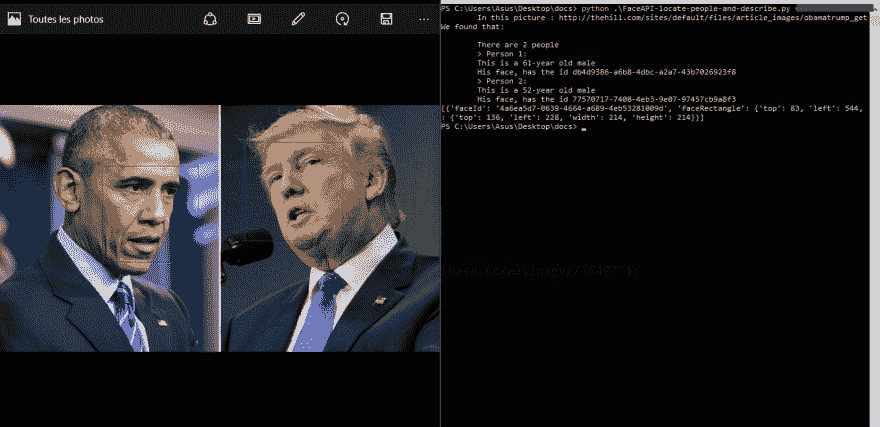

# 使用 Py 和 Azure FaceAPI 进行多人脸识别和数据开发

> 原文：<https://dev.to/hbibzdeploy/multiple-face-recognition--data-exploitation-with-py-and-azure-faceapi-9kb>

再次向 Azure 用户问好，

今天，我将向您展示如何利用强大的 Azure FaceAPI n 来提取图像中的人物数据。我假设你已经阅读了上一篇文章，因为你需要了解一些关于 Azure 的基础知识才能理解。

> [https://S3 curi7y . TN/2017/12/02/azure-face-API-hands-using-python-basic-version/](https://s3curi7y.tn/2017/12/02/azure-face-api-hands-using-python-basic-version/)

另外，你可以在我的库中找到我将要解释的代码。

#### 这段代码到底是干什么的？

实际上，这是一个 Python 代码，允许使用 Azure 的 API 检测和识别人脸。它由两个主要函数 paraMade 和 recogn 组成，每个函数都需要一个键和一个 URL。

#### 它是如何工作的？

该代码由两个函数组成，它们都从 sys.argv 数组中获取参数。

*   **参数:**

该函数负责发送带有图像 URL 的请求，并接收 JSON 格式(JS 对象符号)的检测到的人脸的详细信息

> def paraMade(key，url): #定义函数
> 
> subscription_key = key #获取 API 令牌
> 
> uri _ base = '[https://eastus . API . cognitive . Microsoft . com '](https://eastus.api.cognitive.microsoft.com%E2%80%99)#设置端点 URL
> 
> headers = {
> 
> ' Content-Type ':' application/JSON '，
> 
> ' Ocp-Apim-Subscription-Key ':Subscription _ Key，
> 
> } #设置请求的头
> 
> try:
> 
> response = requests . request(' POST '，uri_base + '/face/v1.0/detect)，json=body，data=None，headers=headers，params=params) #向端点发送 POST 请求并收集响应
> 
> parsed = JSON . loads(response . text)#解析响应
> 
> print("\tIn 此图:% s \ n 我们发现:\n" % url "
> 
> # print (json.dumps(parsed，sort_keys=True，indent=2)) #打印检测到的人脸列表
> 
> 打印(" \ t 有%i 个人" %被分析。 **len** ())#为解析中的人计算检测到的人脸数量
> 
> :#循环通过人脸列表
> 
> print(" \ t>Person %i:\ n \ t 这是一个% I 岁的%s" %(parsed.index(person)+1，Person[" face attributes "][" age "]，Person[" face attributes "][" gender "])#
> 
> if int(Person[" face attributes "][" hair "][" bald

*   重新认可:

> def recogn(KEY，img_url): #定义函数
> 
> CF.Key.set(KEY) #设置 API KEY
> 
> BASE _ URL = '【https://eastus.api.cognitive.microsoft.com/face/v1.0/'】T5】#端点 URL
> 
> CF . baseurl . set(BASE _ URL)#设置端点 URL
> 
> detected = CF . face . detect(img _ URL)
> 
> print(detected)#打印检测到的人脸列表
> 
> def get rectangle(face dictionary):.
> 
> response = requests . get(img _ URL)#下载图片
> 
> img = image . open(BytesIO(response . content))#使用 BytesIO 打开图片
> 
> draw = ImageDraw。Draw(img) #使用 ImageDraw from Pillow
> 
> 为检测到的人脸设置用于绘制的图像:#在检测到的人脸列表中循环
> 
> draw . rectangle(get rectangle(face)，outline='blue') #绘制矩形
> 
> img.show() #输出结果

**USGAE？**

**命令**:python faceapi . py { key } {图片 URL}
