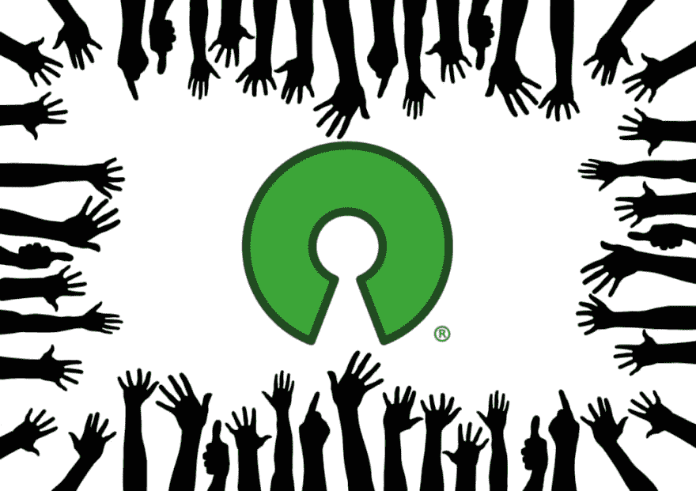
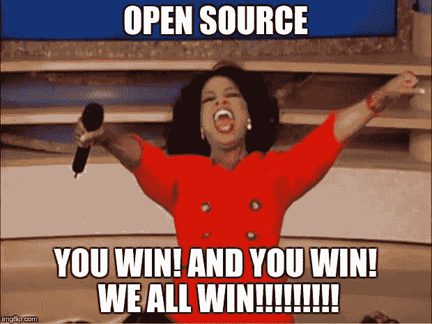
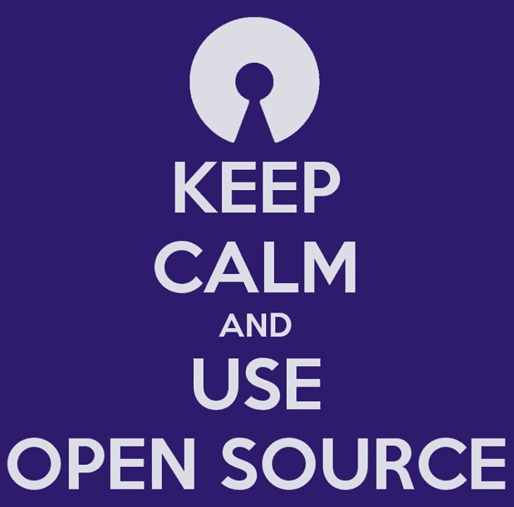

# 关于开源和构建社区

> 原文：<https://dev.to/jerdog/on-open-source-and-building-communities-1ahh>

[T2】](https://res.cloudinary.com/practicaldev/image/fetch/s--rophw6Z7--/c_limit%2Cf_auto%2Cfl_progressive%2Cq_auto%2Cw_880/https://cdn-images-1.medium.com/max/1024/1%2AuPU7iG4_TJYenjuY8J8WWQ.png)

开源是真正的创新发生的地方。那里。我已经说过了。思想的自由交流，来自开源和开源社区的创造性的汁液在私有企业和软件中是无与伦比的。现在我们来谈谈什么是开源以及它能给你和/或你的企业带来的好处，然后我们再来谈谈构建社区的核心部分。

### 开源:什么和为什么

[开源倡议](https://opensource.org/)将开源定义为:

> “任何人都可以自由使用、更改和共享(以修改或未修改的形式)的软件”( [source](https://opensource.org/osd) )

在上个月旧金山的开源峰会上，Linux 基金会的执行董事吉姆·泽姆林分享了以下数据:

*   全球 2300 万开源开发者
*   GitHub 上有 2200 万个账户和 6400 万个存储库
*   四千一百万行代码
*   每天有 1，100 个新的开源项目
*   每天有 10，000 个新版本的开源项目

吉姆接着说:

> Linux 基金会@ Linux 基金会泽姆林:今天，没有人不开源做任何东西。这是现代发展如何运作的事实。[# OSSummit](https://twitter.com/hashtag/OSSummit)2017 年 9 月 11 日下午 16:09911

虽然这似乎是一个宽泛、主观的说法，但我确实相信它有一定的价值。对于任何人来说，不使用某种开源的东西来开发东西几乎是不可能的，无论是库、IDE 还是作为他们产品的基础。此外，不同的许可证允许使用代码的不同方式，这是另一个漫长的讨论，可以在其他时间进行。

### 开源呈现机遇

开源为独立开发者和公司带来了许多机会，同时也带来了许多节约，不仅仅是金钱上的。作为一个公司项目/产品经理，你不需要带着你的想法从零开始重新发明轮子，当其他人经常拥有你的核心想法或实现了它的一部分，你可以把它用于自己。站在前人的肩膀上是开源软件由来已久的传统。通过使用其他人在你的想法中所做的，你可以将开发人员转移到你的核心产品上，在你的时间线中可能会更远的地方。

另一个机会是潜在的**更低的采用成本**。根据您在实施中所处的阶段，您可以降低前期成本来开始实施您的想法。这允许您将成本从购买/许可专有软件转移到定制和实施核心产品。

开源项目通常具有由分布式贡献者开发的优点，这意味着它们通常不受内部政策和其他因素的约束。这几乎转化为**现代的工作方式**，让你的团队或项目发挥优势。从发布到提交，一切都是电子化的，并且是开放开发的，这带来了一定程度的透明度和对活动的意图性，这只会对你和你的项目有益。对于您可能正在使用的核心开源项目，有许多不同的贡献者，多个活动往往同时发生，测试在任何给定的时间由多方完成。再加上现代的 CI/CD 工具，如 [Gitlab](https://gitlab.com/) 、 [Travis CI](https://travis-ci.org/) 和其他工具，上面的许多工具可以在你的开发周期中自动化，从而确保你正在使用的代码是有效的。

开源就在我们身边。见鬼，随着像微软和苹果这样的传统专有公司开源他们的主要开发环境(分别是 Visual Studio Code 和 Swift)，不难理解为什么开源参与持续增长。在移动世界，Android 的爆炸式增长很大程度上是由于它的开源根源，桌面世界的 Ubuntu 也从中受益。**开源是过去、现在、未来！**

保持软件最新对于确保尽快缓解漏洞和安全问题并限制对公众的影响至关重要。然而，当你依赖一个专有软件公司来提供更新时，你就只能任由他们决定何时部署。一个很好的例子是购买谷歌手机(Nexus 或 Pixel ),而不是三星或 HTC 的产品:你将获得更快的软件更新，因为你不会受到原始设备制造商需要修改一切的束缚。而且我们甚至没有将运营商加入其中。通常这些专有公司不会像你一样感到紧迫，即使软件对你和你的企业来说是至关重要的。有了开源软件，你既可以自己贡献补丁，也可以下载补丁，然后按照你的时间表给你的代码打补丁。通过**向上游**贡献补丁，你展示了开源中发生的积极的生命周期，从而为你和其他所有人带来好处——这意味着每个人都是赢家！

[T2】](https://res.cloudinary.com/practicaldev/image/fetch/s--A1lutIJz--/c_limit%2Cf_auto%2Cfl_progressive%2Cq_auto%2Cw_880/https://cdn-images-1.medium.com/max/620/1%2AeGt3nfans6NLcPB5OmNTZw.jpeg)

### 像在演讲中一样自由，而不是啤酒

我们都见过像“FOSS”、“Libre”这样的术语，它们都是指自由、开源软件。术语“免费”并不一定意味着软件是免费的——有时是，有时不是。“免费”更多的是指软件默认提供给消费者的权利，货币成本是各个开发人员/组织的主观感受。例如，像 Adobe Flash 或 Internet Explorer 这样的软件可以免费下载，但完全是非免费的专有软件。

实际自由开源软件(FOSS)是指 [4 个核心自由](https://www.gnu.org/philosophy/free-sw.en.html):

*   为任何目的随心所欲运行程序的自由(**自由 0** )。
*   研究程序如何工作的自由，并改变它，使它按照你的意愿进行计算(**自由 1** )。获得源代码是这样做的先决条件。
*   重新分发拷贝的自由，这样你就可以帮助你的邻居。
*   向他人分发你的修改版本的自由(**自由 3** )。通过这样做，你可以给整个社区一个从你的改变中获益的机会。获得源代码是这样做的先决条件。

当软件不是自由/开源软件时，你作为一个用户很有可能接受风险，因为它是私下开发的，只有发行商控制着它。这是我们有更高的间谍、盗窃等风险的地方。自由和开放源码软件将权力放回到用户手中，确保用户能够控制他们使用的软件，而不是反过来。

开源软件也类似于“给一分钱，拿一分钱”的软件哲学。如果你使用这个软件，不管它是什么，你都有义务回馈社区。可以把它看作是应用于软件的黄金法则。有些人可能还记得早期的软件共享模型。通常在软件的许可证中，通常是在朋友之间或在 BBS 上分发的软盘上，会有一个条款，声明你可以与任何人共享软件(因此是“共享软件”)，如果你发现它有用并想继续使用它，你需要给开发者一些钱。随着时间的推移，随着不同软件许可证和 GitHub 等在线软件回购的出现，这种情况发生了变化，但在 20 世纪 80 年代，这是一种规范。

[T2】](https://res.cloudinary.com/practicaldev/image/fetch/s--aWx7J-TV--/c_limit%2Cf_auto%2Cfl_progressive%2Cq_auto%2Cw_880/https://cdn-images-1.medium.com/max/730/0%2AZNKgQp36g2FaNQ7_.jpg)

### 开源==社区；社区==开源

开源软件项目倾向于自然地促进社区，不管是有意还是无意的。[开源倡议](https://opensource.org/community)有如下声明:

> 无论是开发还是宣传，开源软件和其他合作项目都受益于社区。与需要物理资源的传统项目不同，共享经济通常只受到参与工作的人数以及他们获取和共享知识的能力的阻碍。

通常，一些最成功的社区最终是偶然的，因为环境恰好是正确的，就像一些东西在没有任何特定照顾的情况下生长一样。

几年前，当我的妻子怀孕并在医院短暂停留后回家时，我有点沮丧，因为我不能真正做任何事情，所以我出去让自己有用。在我们的后院，似乎有一个小丛林是从亚马逊移植过来的，所以我开始着手解决这个问题。过了一会儿，当我跑进一个特定的路段时，我注意到草丛中有一个巨大的东西。经过进一步调查，我震惊了:这是一个西瓜。给我两个西瓜。我摘了一个(实际上很大——我们会发现有点太早了),把它拿给我妻子，感觉自己完全是一个骄傲的农民。我们绞尽脑汁想弄清楚这是怎么发生的，并回忆起今年早些时候我的家人是如何过来的，我们吃了西瓜，并在院子里的那个地方进行了吐籽比赛。这似乎是一个特别肥沃的地方，一些种子已经生根。直到今天，院子的那个地方仍然出产一些奇异的蔬菜，但是没有什么能比得上找到这两个西瓜的喜悦。

有时候社区就这么产生了。社区经理的责任是给它浇水，并确保土地有促进生长所必需的养分。你可能不知道结果会是什么，但对我来说，这是社区兴奋的一部分。除非人们参与，否则什么都不会发生。

也就是说，在你的软件项目中有意图是很重要的，让开发者和贡献者容易加入并参与到社区中来。应该消除所有障碍，以便有人能够从阅读您的项目/社区转到注册，然后尽快进入他们可以做出贡献的位置。

### 但真正的“共同体”是什么？

社区通常被定义为一群具有独特的:

*   价值观念
*   人格
*   专业知识
*   兴趣
*   幽默

我不会深入探讨创建社区的基础步骤，但我确实想提一下，因为我觉得它们很重要。当开始一个社区时，这些步骤包括结构、环境、过程和程序等。为了更深入地了解，我鼓励你去看看乔诺·培根的《社区艺术》 ,它列出了早期阶段需要的更多步骤，比如使命、愿景、精英管理等等。

社区咨询公司 Feverbee 着手[确定](https://www.feverbee.com/the-online-community-lifecycle/)一个典型社区的生命周期，并提出:

*   开始
*   确定的
*   成熟
*   有丝分裂

当你的社区经历不同的阶段时，你会发现你自己采取步骤和/或执行任务是那个阶段的一部分，这也将推动你进入下一个阶段。

#### 盗梦

当你开始你的社区时，你将邀请成员加入，创建讨论并参与其中。在这里，建立关系是一个重要的部分，你需要它们来保持社区的活力，并给你维持社区的基础。

#### 成立

内容，内容，内容。此外，还有黑客马拉松、会议、聚会等活动。你在帮助建立社区。你，或者吃/睡/呼吸它的人，将需要钻研关于社区的统计分析，并处理冲突和争端(毕竟这是互联网)。随着你的社区建立起来，所有这些事情都会发生。在此期间，您不要忘记流程和程序，这一点很重要——为了让您的社区取得成功，流程和程序在此阶段非常重要。但是不要在这里变得太严肃，否则你会扼杀过度管理带来的兴奋感。有时候这可能是最乏味的时候，你真的必须小心避免情绪波动。这是 AMAZEBALLS！”还有“我刚断网了！”但是相信我——会好起来的。

#### 成熟

社区将(最终)达到一个其影响力将会增长的阶段，随之而来的是志愿者的涌入。这些志愿者将会加入进来，他们的热情将会推动发展——在这里，确保你的授权是很重要的。在此期间，您还将在社区的帮助下精简目标和愿景，社区成员现在将开始表现出强烈的主人翁意识，并将社区变成他们自己的社区。

#### 有丝分裂

当一个活细胞分裂成一个新的细胞核，或者在一个社区形成更专注的小组或团队的情况下，你就达到了有丝分裂。这是非常重要的一步，应该受到欢迎。因为社区是独一无二的，有他们自己的 DNA，他们真的可以被认为是有机体。生物体两者都是，它们生长，成熟，然后它们分裂并在别处复制自己。这是很自然的，如果这种情况没有发生，那么你很可能处于生命周期的最后阶段，通常不会得到解决。

#### 死亡

死亡。这是自然的。有时候一个社区会自行消亡。有时它需要被埋葬。有时候，在有丝分裂发生后，原来的群落会被新的群落取代。它发生了。这是自然的。

### 透明公开

社区中发生的所有事情都需要以透明和公开为默认。它们不仅是开源的标志，也是建立社区信任的关键。以这种方式运作的社区有几个很好的例子，在我的例子中，Ubuntu 社区和 Gitlab 是最好的。从一开始，他们就努力公开自己的方向和决策。这需要一个有意识的决定，对建立信任大有帮助，而信任对成功至关重要。这也有助于公平竞争，确保社区中的每个人都知道每个人都有自己的角色，每个人都和下一个人一样重要，一样需要。有很多方法可以实现这一点，从使用 wikis 存储文档和程序，到使用 GitHub/Gitlab issues、IRC、Slack，不胜枚举。

### 社区的生命周期

社区就像家庭一样具有世代性，你通常会看到生命周期反映了与下面非常相似的东西。在“升级”之前，社区中的每个角色都没有预先确定的时间框架。有些人会很快读完一部分或全部，而其他人可能会持续地缓慢前进。

> “如果你能创造一个人们可以分享的环境，他们就会分享，其好处也会吸引其他人加入。”——苏珊娜福克斯， [**医疗 2.0:点对点医疗**](http://www.pewinternet.org/2011/09/18/medicine-2-0-peer-to-peer-healthcare/) ，灯塔#3

重要的是不要限制人们在没有注册的情况下从社区中受益，例如免费下载或能够阅读帖子。要求注册才能参与是好的，因为这显示了进入社区的意图和愿望(**新手**)。对一些人来说，下一步可能会很快到来，对另一些人来说可能会更久，在那里他们开始积极参与，并达到成为**正式**会员的水平。这通常会看到他们更多地参与，贡献新的内容或帮助支持他人。最终你会开始看到**领导者**开始脱颖而出，尽早认识到这一点并让他们参与进来是件好事。给他们一些事情做，让他们获得所有权，否则你就有失去他们的风险。你会在社区中认识一个领导者，因为他们体现了社区的精神、愿景和价值观，并且是真正参与的标准。虽然不是每个人都能够在社区中度过稳定的时间，但过一段时间后，你会有**长者**出现，他们往往是那些正在离开的人，通常是因为工作、家庭、缺乏兴趣、生活的新阶段等原因。他们通常会传授明智的建议，或提供建议，当他们说话时，人们会听。但是他们也不再活跃了。你可以把他们看作是一个部落中的长者，他们在这个部落中接近生命的尽头(远没有你想象的那么病态)。获得他们对事情进展的反馈很重要，但是你需要知道他们可能没有以前那样的热情和时间了。

为了进一步阅读关于社区的主题，我在下面列出了一些资源，这些资源在过去很有帮助，而其他的则指导着现在和未来。

*   [Linux 基金会，开源指南](https://www.linuxfoundation.org/resources/open-source-guides/)
*   [开源倡议](http://opensource.org/)
*   [CHAOSS:社区健康分析开源软件](http://chaoss.community/)
*   约诺·培根的《社区艺术》
*   [开源(几乎)一切](http://tom.preston-werner.com/2011/11/22/open-source-everything.html)
*   为什么要开源软件
*   [为什么消费或发布开源软件](https://opensource.com/life/15/12/why-open-source)