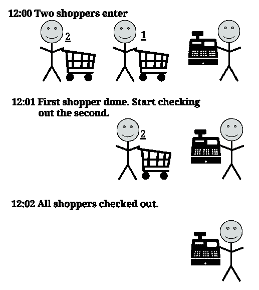
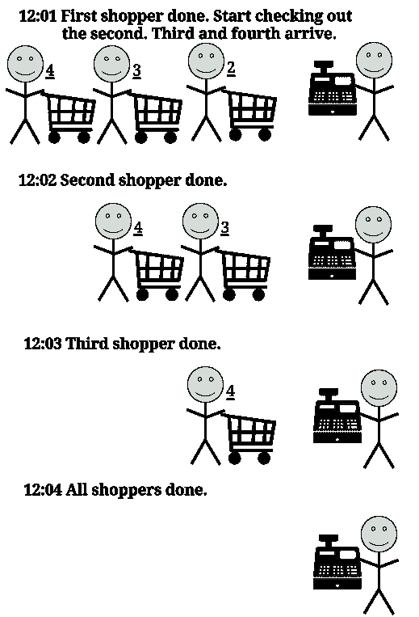
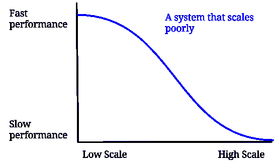
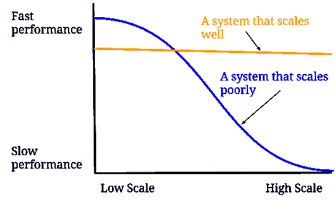
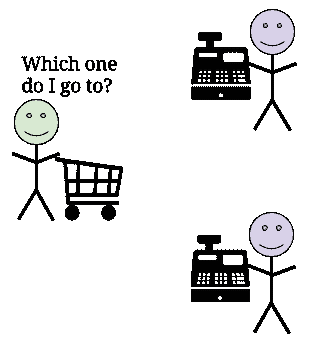
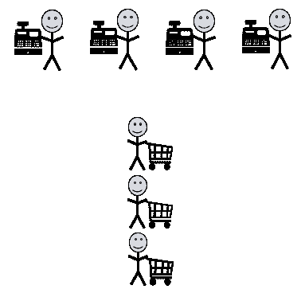
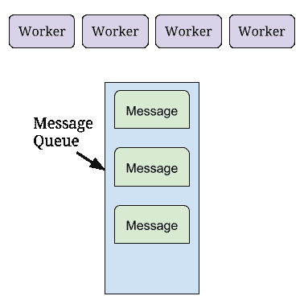

# 性能与可扩展性

> 原文：<https://dev.to/pbeekums/performance-vs-scalability>

在我职业生涯的早期，有一件事让我感到困惑，那就是性能和可伸缩性之间的区别。一开始我以为它们一模一样。当我的第一个扩展系统的项目实际上使我的代码运行得更慢时，我感到非常惊讶…至少在我的开发环境中是这样。

让我们把定义放在一边。可扩展性是指能够处理大量用户/数据/流量。性能关乎速度。虽然光速可能是恒定的，但软件系统的速度远非如此。

一个有用的类比是在超市结账。假设一个收银员每分钟可以为一个顾客结账。假设每分钟不超过一个购物者去收银台，那么一个购物者可以在一分钟内结账。

[T2】](https://res.cloudinary.com/practicaldev/image/fetch/s--bA9kyZSX--/c_limit%2Cf_auto%2Cfl_progressive%2Cq_auto%2Cw_880/https://blog.professorbeekums.com/img/2017/8/one_cash_register.png)

当每分钟都有两个购物者试图去收银台时会发生什么？一位顾客将在 1 分钟内结账，但第二位顾客将需要 2 分钟。

[T2】](https://res.cloudinary.com/practicaldev/image/fetch/s--mpqm-bw3--/c_limit%2Cf_auto%2Cfl_progressive%2Cq_auto%2Cw_880/https://blog.professorbeekums.com/img/2017/8/short_queue.png)

当第二个顾客开始结账时，第三个和第四个顾客会来。第三位顾客需要等待 1 分钟，等待第二位顾客完成，然后花 1 分钟结账，因此第三位顾客也需要 2 分钟。但是第四个顾客需要等 3 分钟。

[T2】](https://res.cloudinary.com/practicaldev/image/fetch/s--Piu3ysnj--/c_limit%2Cf_auto%2Cfl_progressive%2Cq_auto%2Cw_880/https://blog.professorbeekums.com/img/2017/8/short_queue2.png)

第五个和第六个顾客也在第三个顾客开始时到达。第五个顾客等了 3 分钟，第六个顾客等了 4 分钟。这种情况持续的时间越长，购物者等待的时间就越长。

我们关心的性能不是收银员单个人结账的速度有多快。这是普通购物者等待的时间。当人不多的时候，单个收银员的表现对我们来说已经足够好了。当我们增加购物者的速度超过单个收银员的处理速度时，性能会迅速下降。

[T2】](https://res.cloudinary.com/practicaldev/image/fetch/s--MfoMmB-g--/c_limit%2Cf_auto%2Cfl_progressive%2Cq_auto%2Cw_880/https://blog.professorbeekums.com/img/2017/8/performance.png)

可伸缩性是确保性能不变，不管现在有多少人进来。这可能意味着在人不多的时候(低规模)创造一些降低性能的东西。理想情况下，我们的业务是成功的，我们更关心更多人(高规模)的绩效。

[T2】](https://res.cloudinary.com/practicaldev/image/fetch/s--d7uAajX8--/c_limit%2Cf_auto%2Cfl_progressive%2Cq_auto%2Cw_880/https://blog.professorbeekums.com/img/2017/8/scalability.png)

使用的一种策略是添加缓存。在某些情况下，您可能需要为用户处理大量数据。但是，如果数据需要多次完全相同的处理，那么保存最终结果可能是值得的。

以我们的超市为例:假设有许多常客每天都点同样的东西(他们是饥饿的人)。我们可以给他们一张特殊的收据，而不是让他们日复一日地扫描同样的物品。扫描这一张收据将自动扫描他们的整个购物车。我们的收银员可能只需要 10 秒钟来检查收据，而不是花一分钟来检查。这使得一个收银员每分钟可以处理的人数从 1 人增加到 6 人。

但是，接收失败可能有多种原因:

*   购物者与他们购买的东西不一致(数据经常变化)
*   超市有很多第一次购物的顾客(大量不同的数据)
*   收据数据丢失(缓存数据丢失)

在这些情况下，我们有“缓存未命中”,我们的收据不起作用。这意味着我们必须花时间检查收据，然后扫描购物者的购物车。我们的收银员现在花 1 分 10 秒来结账，而不是 10 秒或 1 分钟。

接下来我们可以做的是增加更多的收银员。如果 1 个收银员一分钟可以处理 1 个人，那么 6 个收银员一分钟可以处理 6 个人。单个购物者的业绩可能仍然会下降，因为他们需要决定去哪个收银台。他们可能会花 5 秒钟做决定，所以他们的结账时间是 1 分 5 秒，而不是 1 分钟。

[T2】](https://res.cloudinary.com/practicaldev/image/fetch/s--A4adF0Gc--/c_limit%2Cf_auto%2Cfl_progressive%2Cq_auto%2Cw_880/https://blog.professorbeekums.com/img/2017/8/indecisiveshopper.png)

但是，当购物者数量很少时，我们并不太在乎稍微降低性能。我们关心的是确保当有大量购物者时，我们不会大大降低性能，所以我们将增加更多的收银员。

尽管如此，我们仍然会遇到很多收银员的问题。总有这样的可能，我们总会有比预期更多的购物者，他们会让我们的收银员超负荷工作。人们会开始在每个收银台后面排队。

如果有一个购物者花了很长时间怎么办？那个人后面的购物者会沮丧地看着其他队伍移动得更快。如果每个收银员后面的队伍没有足够的空间怎么办？线条开始融合了吗？当有人在他们面前插队时，我们的购物者会感到沮丧吗？我们的超市开始打架了吗？

如果我们的一个收银员生病了，没有人接替，会发生什么？现在排队的每个购物者都必须插队吗？还是他们什么都不买就走了？

我们可以通过为每个购物者创建一个单独的队列来解决这个问题。现在，每个购物者将按照他们进入队列的顺序开始结账。他们也不必担心被堵在慢购物者或生病的收银员后面。由于只有一个队列，购物者只需去下一个可用的收银台。

[T2】](https://res.cloudinary.com/practicaldev/image/fetch/s--R4xYIKTB--/c_limit%2Cf_auto%2Cfl_progressive%2Cq_auto%2Cw_880/https://blog.professorbeekums.com/img/2017/8/shopperqueue.png)

可能需要更长时间。我们的顾客必须找到排在队伍末尾的路。他们可能不得不从队列的出口走到下一个可用的收银台。但是，对于一个有序而快速的结账过程来说，这只是一个小小的代价。

软件类比就是消息队列。信息代表我们的购物者和他们必须购买的东西。消息被添加到消息队列中，就像购物者走到队伍的后面一样。称为 workers 的软件进程从这个队列中获取消息，并像收银员结账购物一样处理它们。

[T2】](https://res.cloudinary.com/practicaldev/image/fetch/s--oaNUzJRx--/c_limit%2Cf_auto%2Cfl_progressive%2Cq_auto%2Cw_880/https://blog.professorbeekums.com/img/2017/8/messagequeue.png)

还有许多其他技术可以提高可伸缩性。我希望这已经说明了这些技术的样子。此外，结果将是更复杂的代码，在开发人员的机器上运行更慢，所以一开始看起来似乎是毫无意义的努力。当你有一个成功的大规模业务时，你的努力会有回报的。