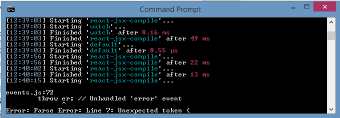

# 防止 Gulp 在异常后停止观看文件

> 原文：<https://dev.to/forforeach/prevent-gulp-from-stopping-watching-of-files-after-exception-44j6>

最近我开发了一些小项目，并决定尝试用 [Gulp](http://gulpjs.com/) 构建自动化工作流。它非常有趣和容易。我非常喜欢它的特性和类似节点的语法。

我的项目包括 [React.js](http://facebook.github.io/react/) ，我使用了他们的 [JSX](http://facebook.github.io/react/docs/jsx-in-depth.html) 技术。我想调试我的代码，因此我需要将 JSX 编译成普通的 JavaScript。这就是 Gulp 拯救我的地方。你可以很容易地安装 gulp-react，它真的很神奇。

在构建了我的任务并集成了编译之后，我想不断地运行我的任务。当你使用 Gulp 的时候，这不是问题。只要用 **gulp.watch()** 就行了。但是在我开始修改代码之后，我明白了，我编译的文件没有更新。当我查看控制台时，我注意到一个异常，之后我的观察任务停止了:

[T2】](https://res.cloudinary.com/practicaldev/image/fetch/s---0R0rnvl--/c_limit%2Cf_auto%2Cfl_progressive%2Cq_auto%2Cw_880/https://dev-to-uploads.s3.amazonaws.com/i/gtvvmhbztv3jan9ddzxr.png)

解决这个问题的方法是另一个叫作 [gulp-plumber](https://www.npmjs.com/package/gulp-plumber) 的 gulp 包。这个插件防止由异常引起的管道破裂。一般来说，它覆盖了 gulp 的管道方法，并删除了默认情况下在出错时取消管道的 **onerror** 处理程序。

综上所述，使用 Gulp 及其插件是一次非常好的体验。

* * *