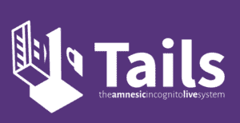

# 隐私等级提高！

> 原文：<https://dev.to/terceranexus6/privacy-level-up>

一台普通用户的计算机似乎需要很少。用户友好的界面，快速的处理，互联网连接，基本的办公套件，也许还有几个游戏...没什么大不了的。这些电脑大多已经安装了 windows 和防病毒软件。

但是这些特征并不像我们想象的那样安全，即使它们很常见。如果我们正在寻找一个更大的安全和隐私，有几件事要考虑。

1 - **操作系统**。在 Linux 中，我们不能不考虑隐私。一旦我们清楚我们需要在我们的机器上安装 Linux，问题是“哪一个？”我们会看到的

2 - **TOR** ，使用 TOR，就像他们自己描述的那样，可能不能解决你所有的隐私问题，但它确实很有帮助。

[T2】](https://res.cloudinary.com/practicaldev/image/fetch/s--tcVGObIK--/c_limit%2Cf_auto%2Cfl_progressive%2Cq_auto%2Cw_880/https://tecnoblog.net/wp-content/uploads/2014/07/tor-logo-700x404-340x191.png)

3 - **将 PGP、虚拟键盘、VPN、KeePass 和其他**技术添加到您的日常工作中

4 - **Protonmail** ，作为一种比 gmail 和其他电子邮件更安全、更免费的电子邮件选择。

5 - **JITSI** ，作为 Skype 或视频通话服务的安全替代方案

那么我们应该选择哪个操作系统呢？在这种情况下，我被要求配置计算机本身，因此它不需要成为一个活动系统(在这种情况下，我也将为 [TAILS](https://tails.boum.org/index.en.html) 活动系统配置一个 pendrive，不过，以防万一)，但我们有几个选项可以考虑。[量子](https://www.qubes-os.org/)、[子图](https://subgraph.com/sgos/)、[头](https://heads.dyne.org/)或 [Whonix](https://www.whonix.org/) 就是其中的一些。

[T2】](https://res.cloudinary.com/practicaldev/image/fetch/s--nDf-XDjL--/c_limit%2Cf_auto%2Cfl_progressive%2Cq_auto%2Cw_880/https://www.cyberciti.biz/media/new/cms/2014/08/Tails_icon.png)

如果我们想要[进一步搜索](https://distrowatch.com/?language=ES)，我建议注意这些细节:

*   Debian 或任何其他基于稳定系统的
*   合理的窗口/桌面管理器，如 Openbox(并避免基于统一的 KDE 和类似的)
*   通过 TOR 连接到互联网
*   如果他们已经有了隐私应用程序包就更好了，但这只是一个优点，因为我们可以在以后实现它。

我们可以在 [TAILS 文档](https://tails.boum.org/doc/index.en.html)中找到一些关于程序和隐私的好建议。

现在，我该怎么办？

*   首先，我正在擦除窗口，我的客户已经做了备份，如果你有有价值的东西和档案，我建议做同样的事情。我要安装上面的一个系统，可能是 Qubes。我也要建立一个 TAILS pendrive。

*   其次，我正在安装 TOR 并建立互联网连接来浏览它。

*   第三，我正在创建一个用于加密和解密的 PGP 密钥。

*   第四，我正在安装 KeePass，虚拟键盘和类似的应用程序。也是一个普通的办公包。

*   最后但同样重要的是，我正在创建一个用户友好的**文档备忘单**，这样客户可以使用任何东西而不会发疯。