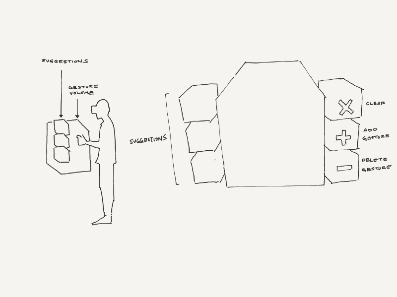
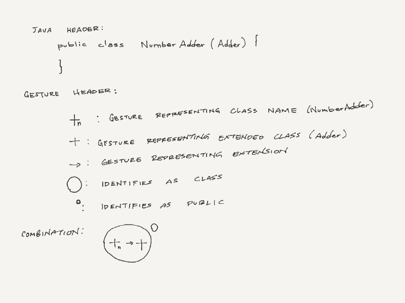
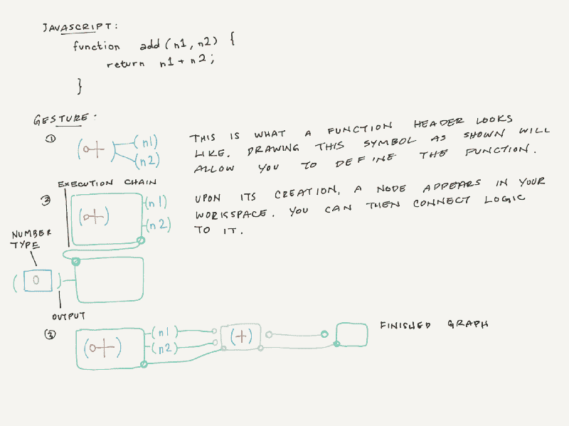

# 虚拟现实编程

> 原文：<https://dev.to/shemit/programming-in-vr>

在我开发 *Snowday* 的过程中，我有机会反思与 VR 相关的编程过程。我想很多人会从让你体验一种环境的意义上来考虑 VR，但我真的很纠结于目前把它作为一种工具的问题。你如何把 VR 变成一个平台，可以创造一个像显示器/键盘/鼠标组合这样多样化的生态系统？

为此，我得出的结论是，做到这一点的唯一方法是从头开始构建一个操作系统，它可以迭代，没有其他必须在 VR 之外接触的外围设备。以下是一些关于 UI 的想法，排名不分先后。

# 手势/象形编程

我在大学学了几年中文，把象形符号结合在一起创造抽象意义的想法对我来说是一个重要的概念。大约在这个时候，我也开始用我的 iPhone 写汉字。用户用手指在屏幕上书写字符，iPhone 提供了各种看起来相似的选项。

一个 VR 编程环境可以潜在地使用这两个概念的组合来达到很好的效果。用户将使用他们的惯用手在靠近他们的手的体积内绘图，并且他们的另一只手将选择想要的手势。

[T2】](https://res.cloudinary.com/practicaldev/image/fetch/s--z7kLD0Jz--/c_limit%2Cf_auto%2Cfl_progressive%2Cq_auto%2Cw_880/https://cdn-images-1.medium.com/max/800/1%2A9oGrDKSLaHULP8h-2w_h9Q.png)

## 识别不同的逻辑结构

与大多数编程语言类似，一组手势不能被覆盖。这些包括标识 if 语句、for 循环等的手势。

这些手势中的一些可以附加到新的手势上，就像在 Java 中将关键字附加到方法头或变量声明上一样。从语言学上来说，这也可以比作汉语中“马”字加在句尾，把一个陈述句变成一个疑问句。这可以用来描述函数、数据类型、类和任何其他需要某种描述的编程结构。

[T2】](https://res.cloudinary.com/practicaldev/image/fetch/s--BkYC43jZ--/c_limit%2Cf_auto%2Cfl_progressive%2Cq_auto%2Cw_880/https://cdn-images-1.medium.com/max/800/1%2AJ6B_bFT4qPTe7GW7hbV6xw.png)

## 连接圆点

最后，如果您不能将参数连接到函数、实例类并将其用作输入，以及向类添加方法，那么这些实际上都没有任何意义。为了解决这个问题，上述的一些手势可以用来表示输入和输出。然后，当用户调用一个功能手势时，他们可以在它们之间拖动线条作为输入。

[T2】](https://res.cloudinary.com/practicaldev/image/fetch/s--fNXi8Nsi--/c_limit%2Cf_auto%2Cfl_progressive%2Cq_auto%2Cw_880/https://cdn-images-1.medium.com/max/800/1%2A-H1pbkKcAGlcFr9JnwNi5Q.png)

# 大量的基础要建立

当然，这种沉思掩盖了许多需要建立的基础，并且在编程的严格性方面还有许多不足之处。我期待探索的一些事情是搜索和数据库手势和符号的方法，3D 手势，笔画顺序，现有代码库的登机难度，使用语音识别在代码中插入注释而无需明确输入的方法，以及 VR 中的自动完成。让我知道你们的想法！