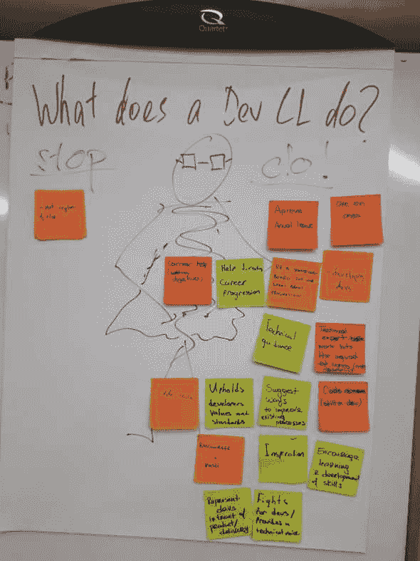
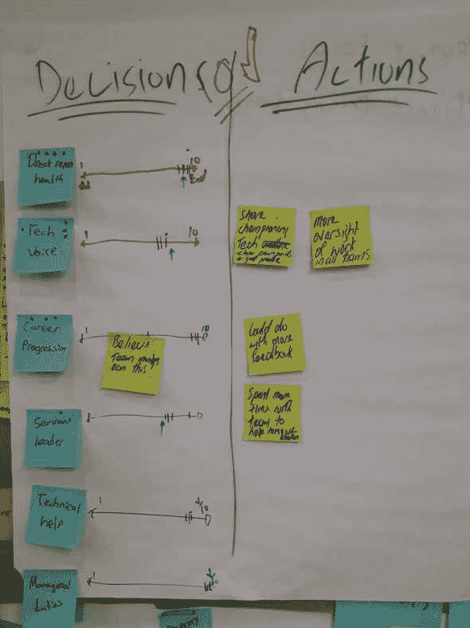

# 实践中的极端坦率

> 原文：<https://dev.to/darraghor/radical-candor-in-practice-16f0>

也就是说，当你坐下来吃蛋糕时，如何从你的直接下属那里获得真相。

你已经当了一年的经理，你不确定一切顺利吗？你不知道你是否为你的团队提供了最大的价值，或者你的人员领导力的哪些方面需要改进？

你可能有定期的跟进，但你没有收到诚实的领导反馈，或者你得到了，但你只是没有听到！

在金·斯科特(Kim Scott)关于激进坦诚的演讲中，她建议召开一次反馈会议，让你的团队和你的经理在你不在场的情况下相互交流。

[https://www.youtube.com/embed/4yODalLQ2lM](https://www.youtube.com/embed/4yODalLQ2lM)

我认为这是一个奇妙的想法，我的团队上周尝试了一下。

### 设置参与模式

我和我的经理以及我的团队预定了一个小时的时间，和我们令人敬畏的敏捷教练 Scott Nepia 在一起。议程大致如下:

10 分钟——介绍和分解 20 分钟——描述你对完美经理的期望 20 分钟——你的经理在这些方面的表现如何——10 分钟——总结

这个过程的一个好处是，我只是去吃蛋糕，而我的团队自己做所有的工作。

一个优秀的团队领导是……Scott 要求团队成员写下他们认为一个分会领导在我们组织中的职责。

我们在 Trade Me 使用的是 Spotify 模式的一个版本。我们称实践引导为“章节引导”。我们有自我组织、自给自足的团队，称为“班”。每个小队大致由 2 名开发人员、1 名 BA、1 名测试人员、1 名设计师和 1 名产品负责人组成。

我是一个开发部门领导，管理着 4 个团队的开发人员。他们都从事不同的项目和技术栈。鉴于此，这是他们想出的…

[T2】](///static/5061e8a26ea22bc2abdc83e1ee0d3190/e5220/whatdoesaCLdo-2-768x1024.jpg)

这里没有太多惊喜。我和我的团队都有一个伟大的开发团队领导的理想。优秀团队领导的要素按主题进行了分组。

真正关心直接下属的健康状况是组织的技术声音支持团队成员的职业发展是仆人式领导而不是微观管理者在需要时提供技术帮助掌握管理行政职责

### 团队领导的彻底坦诚

在会议的后半部分，我的团队根据他们的主题给我打分。

[T2】](///static/ee870c1404481e9686a1baa8cc9e625d/e5220/decisionsactions-2-768x1024.jpg)

直接报告健康状况:9/10 组织的技术声音:7/10 支持职业发展:8/10 是仆人式领导:7/10 提供技术帮助:8/10 管理行政职责:9/10

他们对分数的推理提供了一些清晰的反馈。

### 我应该更像一个技术布道者

在大多数科技组织中，在运输产品以领先于竞争对手和完美地建造东西之间，存在一种健康的折衷。在这方面，我相当务实——我支持开发好的技术，但我也非常赞同快速创造价值。

我的团队告诉我，我最近太专注于提供商业价值而不是技术卓越，或者我专注于一个团队，所以其他人看不到我在支持技术卓越。或者，我没有清楚地解释为什么我们需要比编码最完美的解决方案更快地得到东西。

### 我应该对所有小队有更多的监督

我需要在我们所有的产品和团队中平均分配我的时间。我在一个产品上花了很多时间，因为它有一个团队支持一组相当重要的特性和技术。它正在经历一场我建议并发起的架构变革。

然而，我管理的这个项目只有一个开发人员，这对我团队的其他成员来说是非常不公平的。这是一个我考虑我对企业的价值多于对我的团队的价值的例子。我还管理一个 iOS 开发者和 Android 开发者。我肯定没有尽可能多地接触他们的工作，因为我对技术了解不深。

### 我应该提供更多的反馈，并帮助清除拦截器

我需要给出更多的反馈。同样，我已经专注于一个产品太久了，我需要参与所有的团队和产品，这样我就可以在我们一对一之前了解每个人都在做什么，甚至在一对一之外，这样我就可以提供宝贵的即时反馈。

如果我不参与，我不知道会发生什么。这也适用于清除阻塞。

总的来说，我做了太多的编码工作，却没有足够的领导力。这对开发团队领导来说是一个致命的陷阱，我必须不断提醒自己不要陷入其中。

### 我未来 6 个月的领导目标

在必要的地方为技术而战，但是要确保开发人员和团队明白，当我们不能使代码完美的时候，为什么我们需要把一些东西拿出来，这样他们就不会那么沮丧。我已经离开了我在一个队里做的工作，所以我可以更多地参与到其他队里。我开始参加更多的单口相声，并为其他班做一些非关键路径的小案子。我已经开始阅读面向移动开发者的代码和代码审查。我必须确保这种情况继续下去，并解决上述问题。通过帮助其他团队和参加仪式，我将更好地提供反馈，并在障碍发生时立即识别它们。经历这一过程让我有了更好地为团队成员服务的明确目标，我将在 6 个月后再次这样做。我仍然认为我可以做得更好，但这是一个很好的开始！

如果你有任何从你的团队获得诚实反馈的技巧，请告诉我。