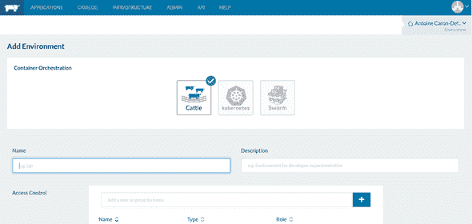
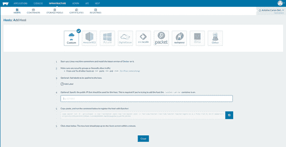
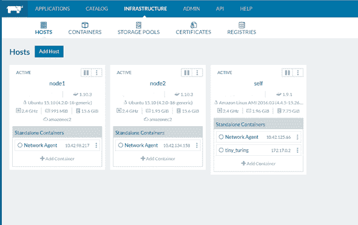
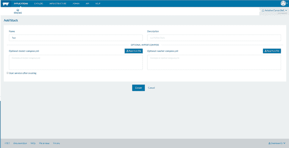
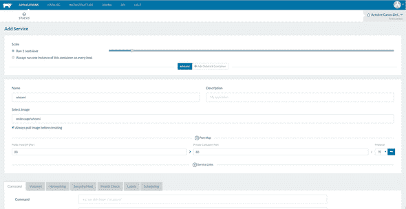
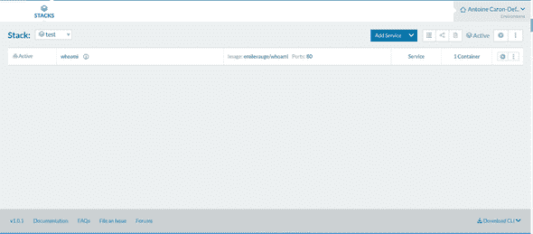
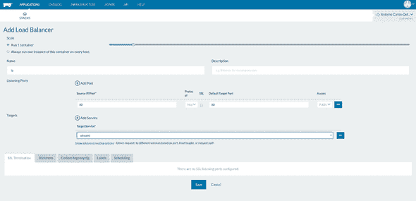
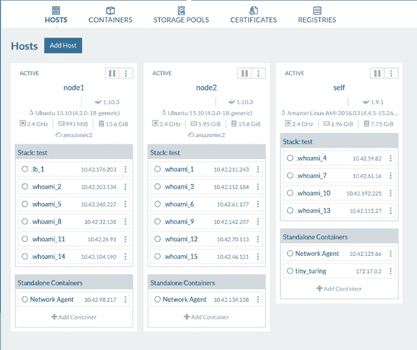
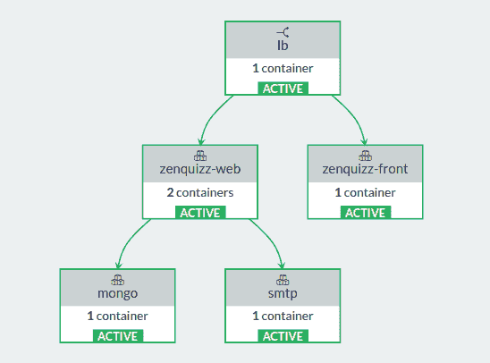
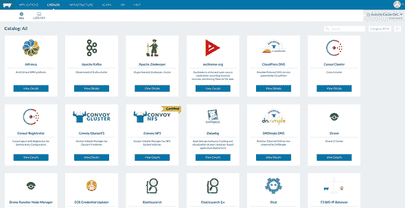

# 牧场主-如何

> 原文：<https://dev.to/slashgear_/rancher-how-to-203n>

我在泽尼卡实习的经验让我用兰彻来整理码头集装箱。在此，我想向您介绍我在此工具方面的经验、兴趣和优势，以及如何部署应用程序的一个小“How to”？

越来越多的坞站用户希望更轻松地处理其容器，并实现持续部署。容器即服务(caas)模型的技术环境非常广泛，有时很难找到。

## 牧场怎么样了？

兰彻是兰彻实验室创建的一个开源项目，是联合国东帝汶办事处(联东办事处)免费提供的坞站容器协调服务。它允许在具有坞站的计算机上交错部署坞站容器。它提供了简单而全面的配置，使您可以轻松地绑定容器以构建服务体系结构。它可以将容器部署到 AWS、Azure、DigitalOcean 等云服务上，也可以部署到大量的定制坞站计算机上，同时依靠 docker-machine。

### 相当简单的安装

要安装蓝丘，您只需安装一台 64 位机器，并且至少有 1GB 的内存。

```
$ sudo docker run -d --restart=always -p 8080:8080 rancher/server 
```

Enter fullscreen mode Exit fullscreen mode

安装几分钟后，兰彻服务器即可使用计算机上的 8080 端口(该映像包含 MySQL 数据库、unzookeeper、Redis 和兰彻服务器)。默认情况下，所有用户都可以登录。然后，您可以启用身份验证，从而轻松地为用户设置帐户。

 [<source type="image/webp">
<source type="image/png">
](///static/7044fcf8b2240abbf24b959028a4f610/77f8f/environnement.png) 

### 与牧场主一起部署简单的应用程序

继 IaaS、SaaS、PaaS、DaaS 和 Patricia Kaas 之后，容器即服务(Caas)时代的到来。其目的是包含其应用程序中的服务并使它们相互作用。为了简单地展示蓝丘引擎，我选择向您介绍部署一个名为 whoami 的非常典型的 web 应用程序，该应用程序位于坞站中心(由 gopar emile vauge 开发)。

为此，我将通过 GUI 向您介绍创建服务的方法。请注意，您可以通过命令行工具(rancher-cli，目前仍然非常有限)或 rest API 与 ranch 进行交互。

#### 添加要部署的主机

第一步是定义要将应用程序部署到的计算机。

 [<source type="image/webp">
<source type="image/png">
](///static/09dee4224d527f5831843599f577d8b3/7970d/machine.png) 

Rancher 提供了多个 web 云服务(如 Amazon EC2、Azure、Digital Ocean)的连接器，但您也可以添加任何将 docker 作为“host”ranch er(“自定义”)的计算机。

在此示例中，我向群集中添加了两台名为 node1 和 node2 的计算机，并添加了一台名为 Rancher 本身的主机(这是可能的，但建议不要这样做)。

 [<source type="image/webp">
<source type="image/png">
](///static/bcd00c6977b0abb9aa112407e39372d8/36c33/host.png) 

#### 创建其服务

现在需要创建一个堆栈来容纳我们的 whoami 服务。在兰彻逻辑中，堆栈是一组服务。

 [<source type="image/webp">
<source type="image/png">
](///static/c862fa4069b40c90035b4b3a02c9addd/9e0ed/stack.png) 

值得注意的是，添加堆栈时，可以不方便地导入`docker-compose.yml`和`rancher-compose.yml`文件。

docker-compose.yml 文件定义堆栈的结构、所有服务及其配置。此文件是复合坞站 api 的本地文件

rancher-compose 文件是 compose dock 的一个“插件”，它允许您配置 ranch 参数，如 loadbalancer (HA-Proxy)配置和服务的横向扩展。这两个文件可以随时导出，对于重新安装来说，这可能非常麻烦(例如，这部分中安装的“T0”堆栈配置)。

一旦创建了只提供一个名称的堆栈，您就可以玩我们的 whoami 服务了。要执行此操作，只需单击“Add service”(添加服务)并将其设置为“add service”(添加服务)。

 [<source type="image/webp">
<source type="image/png">
](///static/48d761834dc232cc35b22955f7da9c22/26c3a/whoami.png) 

请注意，仅定义了服务名称、docker 映像和端口映射(ie:这是一个简单的示例，您可以从下面的选项卡中看到，配置、卷管理、服务网络、运行状况检查等方面都有很大改进。

完成此简单配置后，只需单击“创建”，即可将服务部署到由 cat 选择的主机上。

你要告诉我"什么是牛？"你说得对。牛是兰彻使用的默认编排器。它由蓝丘团队维护，项目是开源的，可通过 Github 访问。

兰彻也和库比涅斯斯斯沃姆和米索斯一起工作但对于这篇文章我只限于用牛。

#### 增压器和负载平衡器

开机一段时间后，你的 whoami 服务应该可以

 [<source type="image/webp">
<source type="image/png">
](///static/e8e9c7193ddbbf5ec9e4e6d47167aa26/b79a5/start.png) 

如果单击“80”，则必须访问 whoami 服务。他会给你很多关于他自己的信息，包括他的名字

现在的目标是升级我们的服务，以便在多台机器上分发。

从服务详细信息中可以看出，目前楼梯设置为 1。所以增加它就足够了？不，我们刚刚定义的服务占用机器的端口 80。因此，每台机器最多只能使用一次。这就是微观服务的问题之一:负载平衡器动态分配端口和“了解”服务。兰彻将为这个问题提供一个简单的解决方案，不用再为它的应用预留体育运动，负载平衡器将通过指挥者了解服务。

因此，必须从服务中删除静态端口配置。

因此，释放端口后，必须创建负载平衡器，以便在 whoami 实例之间分配负载。在堆栈中，单击“添加负载平衡器”

 [<source type="image/webp">
<source type="image/png">
](///static/36278add82f22f1e306be60a799b6681/f33fc/loadb.png) 

因此，在创建 loadbalancer 之后，可以在不存在端口分配问题的情况下增加轮询比例。如果单击 load balancer " 80 "，则必须到达您的服务，然后进行扩展，则主机名应在刷新时更改。

在部署的现阶段，人们可能会问，以前创建的机器的基础架构如何？

 [<source type="image/webp">
<source type="image/png">
](///static/5ac8774826df26dbe266ef830d1b3ff8/27b8e/host2.png) 

兰彻在不同机器之间均衡地部署了对接容器。我们可以定义我们自己的部署规则来决定是否在机器上使用标签。

例如，您可以添加标签“name = frontend”，并为创建的每个服务指定名称是否可以在 machinedont 上启动前端。

在每个容器上，兰彻允许我们访问一个查看日志的 shell，这对于故障非常方便。

虽然这是一个简单的例子，但通过牧场可以轻松地部署更复杂的分层结构，这就是我通过牧场部署的其中一个项目的服务体系结构。

 [<source type="image/webp">
<source type="image/png">
](///static/39e646d632a82cd4ad26d901963a1c11/a58fe/microservices.png) 

### 一个蓝色/绿色部署和“滚动升级”在 5 分钟内完成

在大多数情况下，生产对于开发人员来说往往是一项困难的工作。显然，devops 工具简化了联保部队生命中的这一关键阶段。

rancher 提供了多种方法来更新生产环境中的现有服务，同时确保服务连续性:

#### 滚动升级(一个服务换另一个服务)

[T2】](https://res.cloudinary.com/practicaldev/image/fetch/s--t9wBuWOv--/c_limit%2Cf_auto%2Cfl_progressive%2Cq_66%2Cw_880/https://slashgear.github.io/b30a1750f67a83ef7c8cab4ccdd1b326/indiana.gif)

#### 勒蓝/绿色

Christophe furmaniak ety oucef yekhlef(zenika 的两名建筑顾问)在 2016 年 devoxx 期间介绍了这两种方法。我只能建议你看着她：

### 联合国服务 DNS et 网络覆盖

对于已经很好地停靠码头的人来说，让两个集装箱在没有指挥工具的情况下相互通信并不容易。当然，主机上有端口发布，但听起来很快就到了极限。蓝丘通过 ipsec 隧道提供本机复盖网络功能，允许两个不同的容器位于同一虚拟网络上。蓝丘更进一步，因为他有自己的 DNS 服务，在其中注册他创建的新容器。这样做有几个好处:

*   一个堆栈中的两个服务由其名称标识。
*   一个服务可以通过“`nomService.nomStack`”知道另一个堆栈中的服务。

### 丰富的目录

 [<source type="image/webp">
<source type="image/png">
](///static/ccd638ac43343c2b2dfbacfbdd0cd99f/cb9f4/catalogue.png) 

Rancher 有自己的应用程序目录，这些应用程序以预配置的堆栈组的形式运行，这些堆栈组以 docker hub 中的映像为基础:

*   La stack 松紧带；
*   Janitor，一种基于 docker 的清理服务，用于清理未使用的图像和容器。
*   Traefik，一个负载平衡器，由包含的 Zstartup 的 emile vauge 开发；
*   Gluster，共享卷管理器：
*   odo，著名的开源 erp
*   等等。

也可以添加自己的[企业堆栈目录](http://docs.rancher.com/rancher/v1.5/en/catalog/)

我在这里向大家介绍了兰彻的主要功能，我只能建议你测试一下，让他玩你的码头集装箱。但是，我们今天仍然可以提出这样一个问题:兰彻是否只留下一个玩具来指挥服务？众所周知，橙色和索尼等公司开始将其用于内部使用(参见:Sony 和 PlayStation network[https://www . YouTube . com/watch？v=hwhxXwT6zlw](https://www.youtube.com/watch?v=hwhxXwT6zlw)

请务必与兰彻分享您的经验。

再次感谢 Youcef Yekhlef、Christophe Furmaniak 和我的导师 christophe tardella 协助撰写本文。