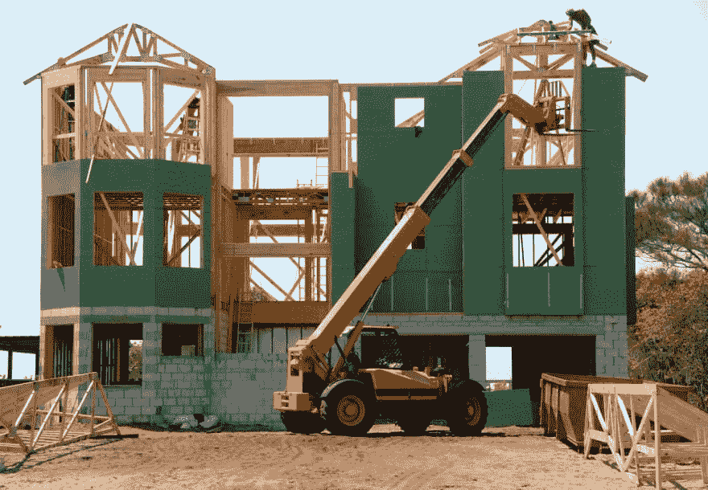

# 反应自然——上船前你应该知道的事情

> 原文：<https://dev.to/brightdevs/react-native---the-things-that-you-should-be-aware-of-before-coming-onboard-291>

React Native 是一项我非常喜欢的技术。使用共享的代码库创建多平台应用程序并拥有一个很好的反馈循环听起来很有前途，在听到这样的事情后，你可能会开始想“为什么我没有使用 React Native？!"。良好的...正如你可能知道的，在你过了快乐之路教程之后，很多事情都不那么光彩了。在这篇文章中，我想给你一些我认为有问题的、令人沮丧的事情，或者我在进入 React Native 世界时没有准备好的事情。然而，这将是 iOS 开发人员的观点，他们在使用 React Native 开发时仍然从中获得了许多乐趣。

请不要把这篇文章误认为是“本土反应——应该阻止你使用它的东西”。事实上，我喜欢 React Native 有很多原因！我的观点是让您意识到在 React Native 道路上您可能会遇到什么困难，这将有望让您更好地为它们做准备，并在您决定跳上 React Native 列车时带来更少的挫折和更好的开发体验！

*   这篇文章写于 2017 年 10 月 13 日，请记住，目前情况可能有所不同！

# 开始吧！

## 1。“自己动手”的方法

如果你一直都是原生开发者，那么进入 React Native 对你来说将是一件全新的事情。你必须记住，很多时候你的用例没有现成的解决方案，推进项目的唯一方法是自己编写完整的解决方案，让现有的开源项目适应你的需求，或者简单地修复库中的一个 bug。良好的...这对于原生开发人员来说并不奇怪，但是请记住，react-native 本身也是一个依赖项，有时可能需要修复。你以前可能不用在 UIKit 里修东西；)来 React Native from native 大概会让你比以前更像一个开源的人；)

## 2。泄漏的抽象

Android 和 iOS 是不同的平台。事情可能会有所不同，这并不奇怪。很难在一个通用抽象下涵盖所有情况。有时你可能甚至不想拥有一个适用于 Android 和 iOS 的通用 API，因为这将意味着放弃一些特定于平台的特性，而这些特性你可能仍然想用 React 原生代码来覆盖。做好准备，你仍然会在一些地方大喊“嘿！我已经在斯威夫特！”。良好的...可能还没有被 React 原生 API 覆盖？

## 3。依赖，依赖，依赖

如果你来自 web 背景，那么你一点也不会感到惊讶，但是如果你是一个本地开发人员，那么我猜你在你的项目中没有那么多的依赖。如果您认为您实际上有许多这样的树，那么就等到您在 React 本地项目中看到依赖树。即使在项目开始时，它们也会达到一个很高的数字。这可能看起来很吓人，但你可能会习惯的。当你开始从事基于 JS 的项目时，你必须改变你的思维方式。通常，您打开 IDE 并编译代码/运行测试。在这里，你将不得不带上你自己的测试运行器/传输器，并使用它。

## 4。事情可能不会总是以同样的方式运行

即使你使用相同的 API，感觉很棒，也要记住这个简单的规则。如果你正在编写一个多平台的应用程序，那么你应该在两个平台上分别进行测试。您会遇到这样的情况，某些实现可以在 iOS 上工作，但在 Android 上的表现略有不同。我能想到的一些基本例子是:

*   在两个平台上滚动(通过编程或用手指)时，scrollView 会产生略微不同的体验
*   默认情况下，Android 视图将呈现透明背景，而 iOS 将呈现白色背景。

## 5。学习反应自然

React Native 是一项相当新的技术。如果你在寻找一个 React 本地开发者，这和你寻找一个 Java 开发者是不一样的。他们的数量根本就没有那么多。所以为了找到一个，你通常需要一个会学习它的人。进入 React Native 的世界有两条常见的途径——要么是 web 开发人员，要么是本地开发人员。哪个更好？这通常很难说，但在我看来，从原生开发转向反应原生将是一项更容易的任务。你肯定需要学习很多关于编程语言、工具和环境的知识，但是，你会有一个优势，知道如何解决关于项目配置的原生问题，使用原生 API，移动世界中的常见实践，如果需要的话，你也将能够有效地桥接原生代码以反应原生(这一天一定会到来)。Web devs！不要气馁！只是要记住，这和为一个更小的设备写网站是不一样的；)

## 6。项目配置

您在 Xcode 中为 React 原生项目更改了一个构建配置的名称，突然您意识到您不能再编译它了。怎么了?良好的...你开始阅读 React 原生库代码(你可以做到，因为它是开源的！)负责构建项目，并且您发现除了`Debug`或`Release`之外的其他配置都不被完全支持。像这样的事情会发生，事先意识到这一点是有好处的。如果你发现这样的问题，记住你并不孤单！有一个伟大的社区一定会帮助你！

但是记住——不要跟来“给我！”接近；)

示例项目配置发布- [Github](https://github.com/facebook/react-native/issues/11813#issuecomment-331519708)

## 7。航行

作为一个原生开发人员，整个导航栈都集中在推动/弹出/解除控制器上。你有一个特定的 API，一切都很好...如果你来到反应原生世界...你会发现许多导航库在等着你。一开始很难找到合适的人选。你可能会得到一些不如你预期的愉快的东西。我目前是 Wix 的 [React 原生导航的快乐用户。对你来说应该没问题，但是如果你错过了什么...投稿！
要知道，你不会发现有一个标准化的方法来解决导航问题，就像你以前在 iOS/Android 应用中做的那样。](https://github.com/wix/react-native-navigation)

## 8。桥接现有的 Android/iOS 库

您在 React Native 中使用的许多特定于平台的库实际上将是桥接到 JavaScript API 的本地库。了解这一点很重要，因为为了使用您最喜欢的 swift 库的新版本，您还需要一个将 API 连接到 JS 的库的更新版本。这可能会导致更新延迟，除非您采用自己动手的方法。

## 9。排除故障

我不得不承认，调试我在 React Native 项目中编写的代码不如在我以前使用的 ide 中那么愉快。一些文本编辑器支持调试，但是我的项目一直使用 TypeScript，这意味着在文本编辑器中设置调试器有点困难。我在 Visual Studio 代码中使用调试器已经有一段时间了，但是，很多时候我都是在 chrome dev tools 中调试代码。无论如何，这都不是一次可怕的经历，但是与在 IDE 中调试相比，您肯定会感觉到不同。

## 10。你对这个应用程序灵活吗？

在任何项目中，你可能会遇到这样的情况，实现某个布局会花费你很大一部分时间，而实际上并不会对项目的价值做出太多贡献。这样的东西通常是对应用程序的一个很好的补充，但是如果你想快速发布你的 MVP 以上市，那么实现整个东西并继续使用一个更简单的布局版本可能是不值得的。如果您想成为 React Native 开发人员，这一点尤其重要，因为在这种情况下，最初的时间投入点也是由您可能需要桥接 React Native 的额外代码或您必须添加到现有库中以支持布局细节的一些额外功能造成的。在 UI 的细节上有一点灵活性是一件好事。

## 11。不一定要用 JS

许多人因为他们将不得不写 JS 的事实而气馁，然而，我不认为那是一个大问题。让我们忽略一个事实，现在 JS 有很多你可能喜欢的好功能。让我们从另一个角度来看这个问题...你实际上不必为你的应用程序使用纯 JS。对我来说，TypeScript 是一个令人愉快的解决方案，它让开发应用程序变得更加愉快。它仍然会向下传输到 JS，但是，你不需要和它有太多的接触。如果你来自 Swift/Kotlin 背景，那么通过使用 TypeScript，你不会感觉到像使用纯 JS 时那样巨大的变化。

看看[打字稿](https://www.typescriptlang.org/)和[流程](https://flow.org/)！

## 12。你不必从头开始设置你的项目

[T2】](https://res.cloudinary.com/practicaldev/image/fetch/s--AhfsnKnI--/c_limit%2Cf_auto%2Cfl_progressive%2Cq_auto%2Cw_880/https://thepracticaldev.s3.amazonaws.com/i/qigzf9s5ufcwvpmzt5yz.jpeg)

建立一个 React 本地项目可能是一件令人畏惧的事情...独自处理所有这些依赖关系真的很费时间。但是不用担心！有一个很棒的工具可以帮助你设置项目- [Create React Native App](https://github.com/react-community/create-react-native-app) 。它将允许您直接开始编写代码，而不是手忙脚乱地进行配置和依赖。了解你的项目是如何构建的当然很重要，但是如果这是你第一次在“JS 环境”中，那么你已经有很多东西需要思考了。

# 总结

这些不应该阻止你进入 React Native 的世界。他们应该让你意识到一些问题，这样你才能更好地做好准备。到目前为止，我已经有了很好的体验，我真的很期待看到这项技术在未来的发展。

嗯...如果你不想在回到本土发展后体验那种渴望的感觉，你一定要避免反应本土。回来后会有很多尝试 React Native 后会觉得不舒服的事情；)

最初发布于 [brightinventions.pl](https://brightinventions.pl/blog/)

由 Eliasz Sawicki，软件工程师@光明发明
[博客](http://eliaszsawicki.com/)，[推特](https://twitter.com/EliSawic?lang=en)