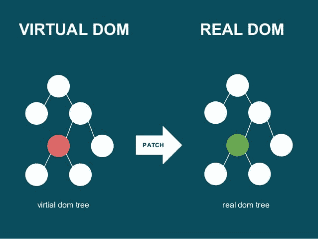
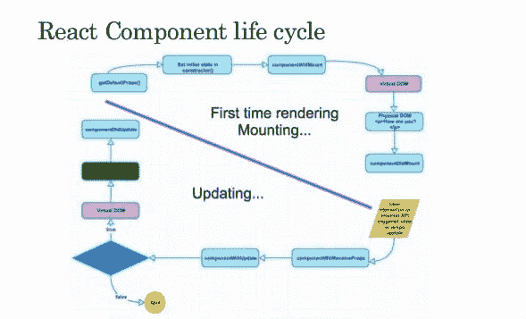

# 反应和解

> 原文：<https://dev.to/ryanbas21/react-reconciliation>

我们来谈谈和解吧！

React 是当今最流行的 UI 库之一。它很快，有 facebook 的支持，也不太难学。但是就像 javascript 一样，对我来说，学习 react 更多的是理解 React 在做什么。我还没有仔细查看 React 在做什么，但是我会尽力跟上变化和未来的变化，看看它的发展方向。我喜欢写 React，当你知道实际发生了什么时，它会变得更加有趣。

我想写得更多和研究的是和解到底是什么，它能做什么？为什么重要？因此，协调是 React 在更新时重新加载数据或整个应用程序的过程，但实际上并不是这样。API 负责处理每次更新时的变化。这也是 React 解决线性而非指数复杂性遍历 DOM 的方法的一部分。因此，如果我们看一下 facebook 的文档，我们可以看到他们基于两个假设建立了虚拟 DOM 算法，以加快这一过程，
不同类型的两个元素将产生不同的树
开发人员可以通过一个关键道具暗示哪些子元素在不同的渲染中可能是稳定的

考虑到这些假设，React 将采用其内部构建的 DOM 树模型(又名 virtual ),并从两个根元素开始将其与实际的 DOM 进行比较。

[T2】](https://res.cloudinary.com/practicaldev/image/fetch/s--Xg_bqynX--/c_limit%2Cf_auto%2Cfl_progressive%2Cq_auto%2Cw_880/http://i.imgur.com/EPzcwT3.jpg)

如果根元素有不同的类型，React 将构建一个新的树，所有之前的 DOM 节点都被销毁，根级别及其以下的组件将接收生命周期方法`componentWillUnmount()`。自然地，React 将会构建一个新的树，组件将会得到你现在所期望的，`componentWillMount()`和`componentDidMount()`。理解这一点也很重要，因为 DOM 节点现在被销毁并重新创建，不仅这些节点消失了，而且它们拥有的任何状态也将消失。

例如，让我们看看这段代码

```
//original
<div>
<Todo />
</div>

//new replaced
<p>
<Todo />
</p> 
```

在这里，我们最初有一个嵌套在 DIV 标记中的 Todo 组件。然后我们用段落标签替换 div 标签。这将彻底摧毁并重建树根。这个例子可能会提出这样一个问题，当 React 检查两个具有相同元素但属性不同的节点时会发生什么？事实上，Well React 确实检查了这一点，在这种情况下，它将*而不是*删除节点，而是相应地更新属性。

那么，如果我们不删除娱乐中的 DOM 节点，那到底意味着什么呢？不用在我们的应用程序中重新创建 DOM 节点有很多好处，这就是这个过程如此酷，反应如此迅速的原因。如前所述，当我们必须删除并重新创建一个 DOM 节点时，保存在该节点上的状态现在丢失了。因为现在我们只是更新节点，所以状态被保留。因此，如果组件已经在页面上，没有被销毁或重新创建，哪些生命周期方法将适用于这一点？在引擎盖下，React 现在将发送组件`componentWillReceiveProps()`和`componentWillUpdate()`。这两个调用都是在调用 render 方法之前在组件的生命周期中进行的。

[T2】](https://res.cloudinary.com/practicaldev/image/fetch/s--phmF10ou--/c_limit%2Cf_auto%2Cfl_progressive%2Cq_auto%2Cw_880/http://i.imgur.com/sk1XlvU.png)

因此，在协调中需要注意的是，从数据可以保存在页面上的意义上来说，算法是很挑剔的，但是如果没有 key prop，更改 DOM 节点和 react 可能看不到这一点，这是我今天不打算讨论的，但是在编写和优化 React 应用程序时要记住这一点。一个很好的例子是一个列表，在 Reacts 文档中，一个`li`从第一个孩子变成第三个孩子，并且在它前面添加了两个节点，React 将重新呈现整个列表，而不是保留仍然存在的节点。钥匙进入了一个全新的领域，什么是好钥匙，什么不是好钥匙，有大量的文章和博客文章。

```
 //original
  <li>testing1</li>
  <li>testing2</li>

  //Full recreation
  <li>testing3</li>
  <li>testing1</li>
  <li>testing2</li> 
```

所以我希望你今天学到了一些关于调和的东西，至少是它是什么，所以如果有人在谈话中提到它，你可以跟着做，也许你会更好地了解某些生命周期方法何时发挥作用，以及何时使用它们。