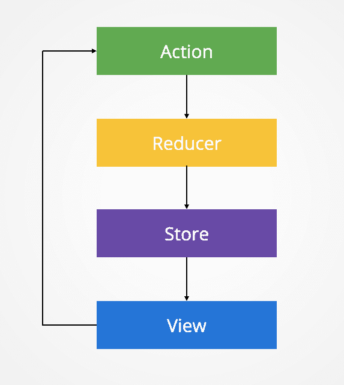

# Redux 比你想象的要容易

> 原文：<https://dev.to/anishkumar/redux-is-easier-than-you-think-15jn>

我看到的对 Redux 的头号抱怨是“样板文件太多”。我也经常看到有人抱怨，要学的东西太多，做任何有用的事情都需要太多其他插件，而且 Redux 在很多方面没有任何意见，因此没有提供任何内置的指导……”

这个评论准确地描述了初学者开始使用 redux 的核心概念是多么的困难。以上文字摘自官方 redux repo 上的一期活动(来源:[https://github.com/reactjs/redux/issues/2295](https://github.com/reactjs/redux/issues/2295))。这个问题从社区得到的回应清楚地表明这个问题是真实的。这不是只有初学者才会面临的问题，事实上，任何高效的开发人员都不喜欢一遍又一遍地重复相同的代码，尤其是当它可以被抽象掉的时候。

重复样板文件/功能的抽象提供了一些额外的好处，例如:

1.  节省时间！
2.  它减少了程序的活动部分，从而减少了犯错误的机会
3.  它使你的代码更干净，因此更容易维护

> *更多选项=更多移动部件=出错几率更高*

## 咱们用(redux *- the noise* )

我将使用经典的 todo-list 示例来说明 redux 有多简单。但在此之前，这里有一个图表，用最简单的术语说明了 redux 的核心理念:

[T2】](https://res.cloudinary.com/practicaldev/image/fetch/s--qiFVe8g---/c_limit%2Cf_auto%2Cfl_progressive%2Cq_auto%2Cw_880/https://blog.apptension.com/wp-content/uploads/2017/04/redux-concept.png)

*<small>来源:blog.apptension.com</small>*

以下是关键点:

1.  有一个普通的 javascript 对象，它包含整个应用程序的状态。(州)

2.  状态是**不可变的**，意思是，它不能被直接改变。比如不能做`state.name="john"`

3.  要改变状态，你必须`dispatch`一个`action`(也是一个普通对象)。

4.  `reducer`(一个函数)监听任何分派的动作，并相应地`mutates`状态。

5.  最后，状态得到更新，视图再次呈现以显示更新后的状态。

## 不要担心这是否令人困惑，有趣的部分现在开始了:

我们的 todo 应用程序有 3 个简单的目标:

1.  用户应该能够添加待办事项
2.  用户应该能够将未完成的待办事项标记为完成，反之亦然
3.  用户应该能够删除待办事项

让我们从一个全新的反应应用开始:

```
create-react-app  todo-redux 
```

此外，让我们拉进`redux-box`来设置 redux、redux-saga、开发工具和更多:

```
npm install --save redux-box 
```

太好了，我们拿到必需品了。让我们通过创建`src/store`文件夹来快速设置我们的 redux-store。这是我们编写任何与商店相关的程序的地方。Redux box 强调模块化商店，即将你的商店分成多个模块，以便于管理物品。

为了简单起见，我们的 todo-app 只有一个模块。姑且称之为`todo.js`。该模块将指定其初始状态、动作和突变，如下所示:

```
const state = {
    items: [],  
}

const actions = {

}

const mutations ={

}

export const module = {
    name : 'todos',
    state, 
    actions, 
    mutations
} 
```

这是我们模块的基本框架。让我们在全球商店注册它:

`src/store/index.js`

```
import {createStore} from 'redux-box';
import {module as todoModule} from './todo'

export default createStore([
    todoModule
]) 
```

我们走吧！我们已经用几行代码建立了我们的 redux 商店，提供了所有需要的附加功能。(您也可以设置 redux-saga，但是因为我们的 todo 应用程序不需要这样做，所以我将跳过演示如何在模块中使用 saga 的代码片段。如果你足够好奇，你可能想参考一下回购协议。)

设置的最后一步是将我们的根组件包装在`Provider`周围，这样应用程序就可以识别我们的商店:
`src/App.js`

```
import {Provider} from 'react-redux';
import store from './store'
import TodoMain from './components/TodoMain'

class App extends Component {
  render() {
    return (
      <Provider store={store} >
        <div className="App">
           <TodoMain></TodoMain>
        </div>
      </Provider>
    );
  }
}

export default App; 
```

这里的`components/TodoMain.js`是我们的主要组件，我们将在这里放置我们的 UI 并将其与我们的`todo module`集成。

在`TodoMain.js`中，我们会:

1.  一个输入，让我们添加新的待办事项
2.  显示所有待办事项的列表
3.  每个列表项旁边有一个删除图标，允许我们删除待办事项

下面是我们最终的`TodoMain.js`的样子:

```
import React, { Component } from 'react'

export default class TodoMain extends Component {
 constructor(){
     super();
 }

 render() {

    return (
      <div className="main">
        <h1>Todos Manager</h1>
        <input type="text"/>

        <ol className="todos">
            // list items go here
        </ol>
      </div>
    )
  }
} 
```

## 编写添加、删除和切换待办事项的逻辑

我们需要三个`mutations`，用于添加、删除和切换待办事项。对于每一个突变，我们将创建一个动作，这样我们的组件就可以调用这些突变(组件可以直接访问任何模块的`state`和`actions`，除此之外别无其他)。因此我们的`todo module`看起来是这样的:

```
const state = {
    items: [],  
    active_todo :
}

const actions = {
    addTodo : (todo) => ({
         type: 'ADD_TODO' , 
         todo }) ,
    toggleTodoStatus : (todo) => ({
        type : 'TOGGLE_TODO', 
        todo}),
    deleteTodo : (todo) => ({
        type : 'DELETE_TODO',
        todo
    })
}

const mutations ={
    ADD_TODO : (state, action) => state.items.push(action.todo),

    TOGGLE_TODO : (state, {todo}) => {
       state.items = state.items.map(item => {
           if(item.id== todo.id)
               item.completed = !item.completed
           return item
       });
    },
    DELETE_TODO : (state, {todo}) => {
       let index = state.items.findIndex(item => item.id==todo.id);
       state.items.splice(index, 1);
    }

}

export const module = {
    name : 'todos',
    state, 
    actions, 
    mutations
} 
```

## 最后，让组件与模块逻辑交互

为了用组件连接我们的商店，我们使用来自`redux-box`的`connectStore`装饰器。装饰者然后将模块附加到组件的道具上:

```
import React, { Component } from 'react'
import {module as todoModule} from '../store/todos';
import {connectStore} from 'redux-box';
import cn from 'classnames';

@connectStore({
    todos : todoModule
})
class TodoMain extends Component {
 constructor(){
     super();
     this.state ={
         todo :  ''
     }
 }

 addTodo = (item) => {
    if(e.keyCode==13)
        todos.addTodo({
           id : Math.random(),
           text: this.state.todo,
           completed: false
        })          
  }

  render() {
    const {todos} = this.props
    return (
      <div className="main">
        <h1>Todos Manager</h1>
        <input type="text" value={this.state.todo}

        onChange={(e)=>{
            this.setState({ todo : e.target.value})
        }} 

        onKeyUp = {(e)=> this.addTodo(e.target.value)}
        />
        <ol className="todos">
            {  
                todos.items.map((item,i) => {
                    return <li 
                    className={cn({'completed': item.completed})} 
                    onClick={()=> todos.toggleTodoStatus(item) }
                    key={i}>
                        {item.text}
                       <i class="fa fa-trash"
                        onClick=  { (item) => todos.deleteTodo(item) }
                        ></i>
                    </li>
                })
            }
        </ol>
      </div>
    )
  }
}

export default TodoMain 
```

## 就是这样...

你看！Redux 很容易。它的目的是让你的生活更容易，所以保持简单:)

是的，如果你认为它真的有帮助，请随意在 GitHub 上使用 [redux-box！](https://github.com/anish000kumar/redux-box)

* * *