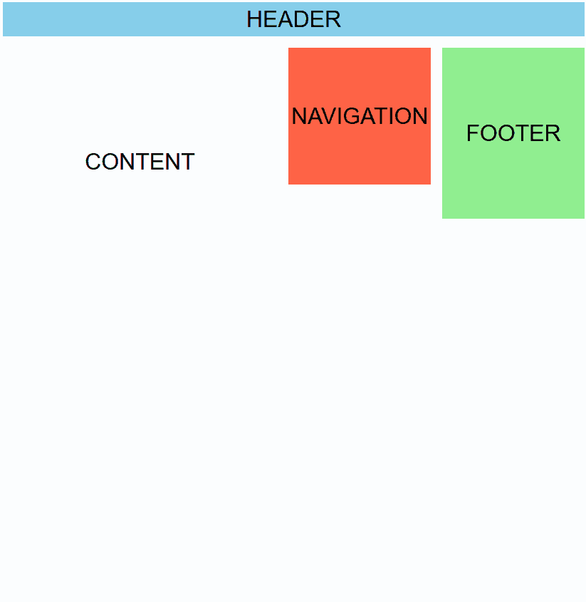
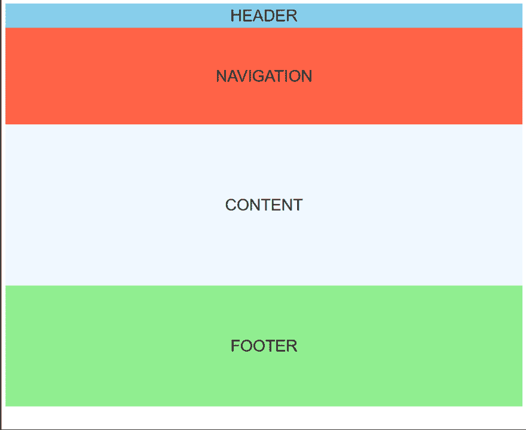
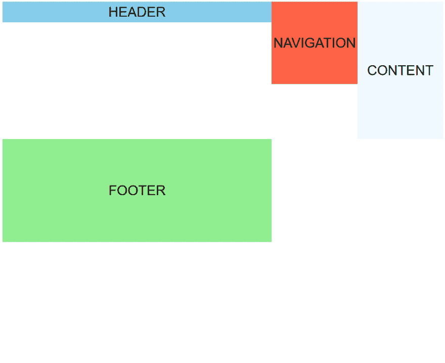
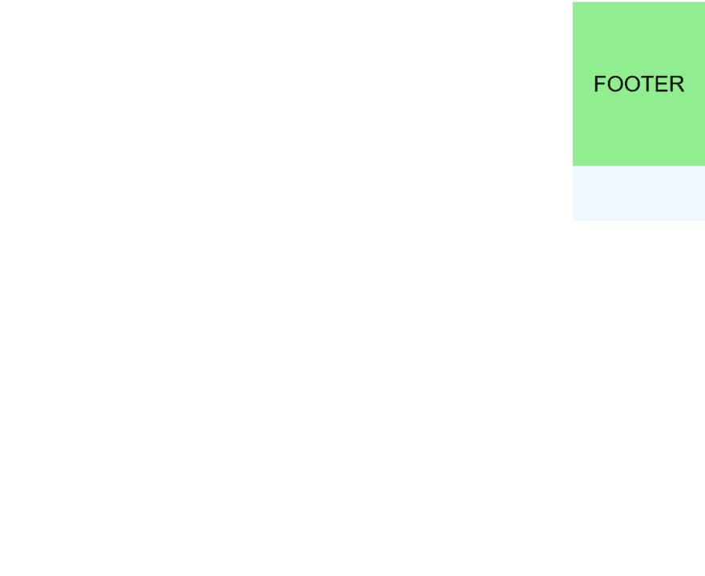
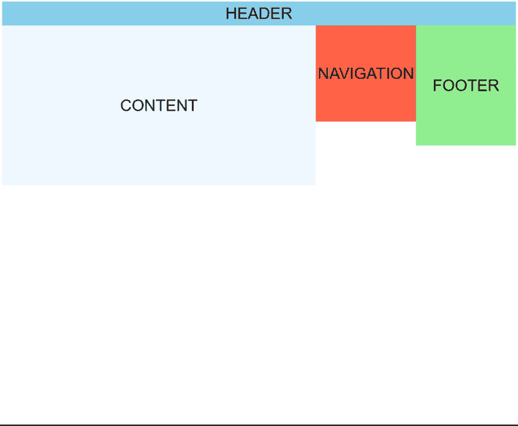
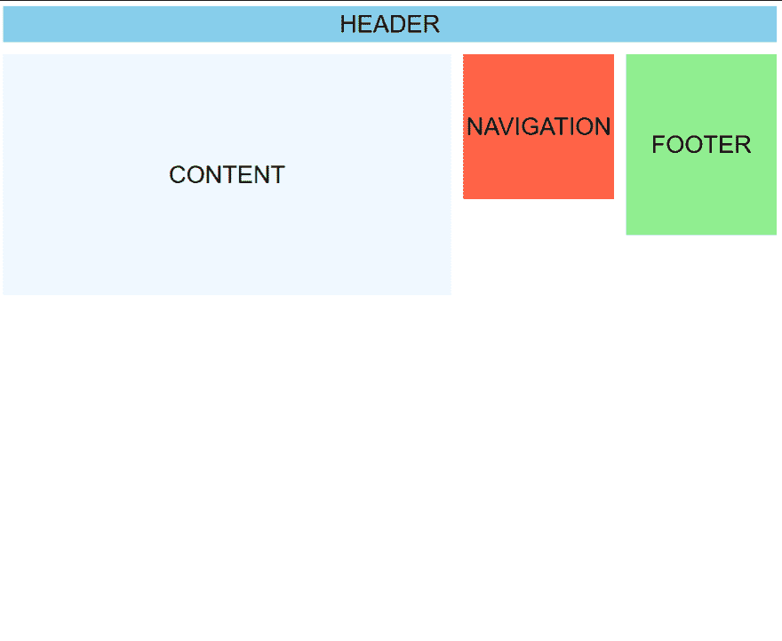
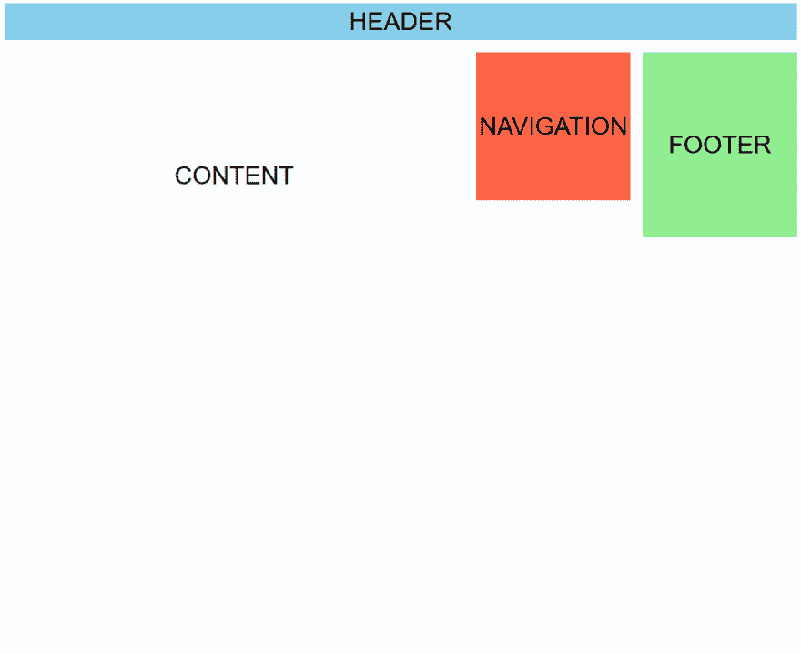

# CSS 网格响应布局，第 1 部分:网格区域

> 原文：<https://dev.to/jonstodle/responsive-layout-with-css-grid-part-1-grid-areas-5632>

当涉及到在网页上布局元素时，CSS 网格是新出现的。我不会解释它与 Flexbox 的不同之处，但是我会向你展示一个比 Flexbox 更容易用 CSS grid 实现的特性。

假设您想创建一个这样的布局，但不想依赖 JavaScript:

[T2】](https://res.cloudinary.com/practicaldev/image/fetch/s--K6ekS6ee--/c_limit%2Cf_auto%2Cfl_progressive%2Cq_66%2Cw_880/https://blog.jonstodle.com/conteimg/2017/11/css-grid-responsive.gif)

使用 CSS 网格可以做到这一点。

让我们从一些简单的 HTML 开始:

```
<div id="container">
  <header>
    HEADER
  </header>

  <nav>
    NAVIGATION
  </nav>

  <main>
    CONTENT
  </main>

  <footer>
    FOOTER
  </footer>
</div> 
```

Enter fullscreen mode Exit fullscreen mode

这应该是一些非常直截了当的东西。我们有`div`容器来容纳将被移动的四个元素。让我们从有趣的东西开始 CSS。

先来点样板:

```
header, nav, main, footer {
  font-size: 2rem;
  font-family: sans-serif;
  display: flex;
  justify-content: center;
  align-items: center;
}

header {
  background: skyblue;
  height: 3rem;
}

nav {
  background: tomato;
  height: 12rem;
}

main {
  background: aliceblue;
  height: 20rem;
}

footer {
  background: lightgreen;
  height: 15rem;
} 
```

Enter fullscreen mode Exit fullscreen mode

这只是一些样式来设置一些背景颜色，使文本容易区分和中心。现在我们得到了这个结果:

[T2】](https://res.cloudinary.com/practicaldev/image/fetch/s--BGi6vMO0--/c_limit%2Cf_auto%2Cfl_progressive%2Cq_auto%2Cw_880/https://blog.jonstodle.com/conteimg/2017/11/Screenshot-171108-084803.png)

我们将`display: grid`添加到`#container`中，使其将子元素显示为网格项目:

```
#container {
  display: grid;
} 
```

Enter fullscreen mode Exit fullscreen mode

元素的显示没有区别。网格的默认行为是将元素堆叠在一列中:

[T2】](https://res.cloudinary.com/practicaldev/image/fetch/s--jD_6SzSM--/c_limit%2Cf_auto%2Cfl_progressive%2Cq_auto%2Cw_880/https://blog.jonstodle.com/conteimg/2017/11/Screenshot-171108-084803-1.png)

我们的布局有三列。为了定义三列，我们使用了`grid-template-columns`属性。您定义了许多空格分隔的值，每个值代表您的网格中一列的宽度:

```
grid-template-columns: 1fr 200px 200px; 
```

Enter fullscreen mode Exit fullscreen mode

这里我们定义了三个指定宽度的列。最后两个值应该是不言自明的，但是第一个是新的。`fr`单位(*分数*的简称)代表*剩余空间*。`1fr`表示剩余空间的 *1 部分。你可以在 [CSS-tricks](https://css-tricks.com/introduction-fr-css-unit/) 阅读`fr`单元。*

结果看起来像这样:

[T2】](https://res.cloudinary.com/practicaldev/image/fetch/s--x2bxq0Mz--/c_limit%2Cf_auto%2Cfl_progressive%2Cq_auto%2Cw_880/https://blog.jonstodle.com/conteimg/2017/11/Screenshot-171108-091126.png)

虽然我们有三列，但元素并没有按照我们想要的方式排列。默认情况下，CSS grid 会在每列中安排一个元素，并在列用完时向下跳转一行。行高被设置为等于该行中最高的元素。这通常被称为*包装*元素。

我们需要定义元素在网格中的排列方式。有多种方法可以做到这一点，但我更喜欢在网格中定义区域，并告诉网格如何安排这些区域。

首先，我们需要定义不同的领域。这是用`grid-area`属性完成的，它被放在子元素上。通过给一个元素命名为
，可以将它定义为网格区域

```
// In header style
  grid-area: header;

// In nav style
  grid-area: navigation;

// In main style
  grid-area: content;

// In footer style
  grid-area: footer; 
```

Enter fullscreen mode Exit fullscreen mode

我已经将元素的名称设置为与它们内部的文本相同。现在的结果是:

[T2】](https://res.cloudinary.com/practicaldev/image/fetch/s--wZtRJMtN--/c_limit%2Cf_auto%2Cfl_progressive%2Cq_auto%2Cw_880/https://blog.jonstodle.com/conteimg/2017/11/Screenshot-171108-105828.png)

这根本不是我们想要的！所有的元素都堆叠在一起。我们需要定义如何在网格中安排区域。这是通过`#container`本身上的`grid-template-areas`完成的:

```
grid-template-areas:
  "header header header"
  "content navigation footer"; 
```

Enter fullscreen mode Exit fullscreen mode

我们定义了两行(每个“字符串”一行)。在行定义中，我们定义了哪个区域应该占据哪个列。我们使用先前定义的区域名称。

我们特别指出`header`应该跨越第一行的所有 3 列。`content`、`navigation`和`footer`应在第二行各占一列。

我们现在有以下内容:

[T2】](https://res.cloudinary.com/practicaldev/image/fetch/s--YXeAnm6d--/c_limit%2Cf_auto%2Cfl_progressive%2Cq_auto%2Cw_880/https://blog.jonstodle.com/conteimg/2017/11/Screenshot-171108-111643.png)

这看起来更像是我们想要的。让我们在元素之间增加一点空间，让它看起来不那么拥挤。我们可以使用`grid-gap`属性来做到这一点。我们把它设置在`#container` :

```
grid-gap: 1rem; 
```

Enter fullscreen mode Exit fullscreen mode

这将元素之间的间隙设置为 1`rem`。我们现在有了这个结果:

[T2】](https://res.cloudinary.com/practicaldev/image/fetch/s--H-8H0urg--/c_limit%2Cf_auto%2Cfl_progressive%2Cq_auto%2Cw_880/https://blog.jonstodle.com/conteimg/2017/11/Screenshot-171108-130814.png)

你有没有注意到创建*槽*(在 Bootstrap 等人的书中是这么叫的)有多容易？

我们快完成了，但是还缺少一样东西。反应灵敏。如果我们现在调整页面大小，它根本不会重新排列:

[T2】](https://res.cloudinary.com/practicaldev/image/fetch/s--X3gNJ81s--/c_limit%2Cf_auto%2Cfl_progressive%2Cq_66%2Cw_880/https://blog.jonstodle.com/conteimg/2017/11/css-grid-non-responsive.gif)

这可以通过一些`@media`查询来解决:

```
@media (max-width: 800px) {
  #container {
    grid-template-columns: 1fr 200px;
    grid-template-areas:
      "header header"
      "content navigation"
      "footer footer";
    }
}

@media (max-width: 600px) {
  #container {
    grid-template-columns: 1fr;
    grid-template-areas: 
      "header"
      "navigation"
      "content"
      "footer";
  }
} 
```

Enter fullscreen mode Exit fullscreen mode

在较低的屏幕宽度上，我们唯一要改变的是网格有多少列以及区域是如何分布的。我们现在得到了想要的结果:

[T2】](https://res.cloudinary.com/practicaldev/image/fetch/s--3UW5vgcI--/c_limit%2Cf_auto%2Cfl_progressive%2Cq_66%2Cw_880/https://blog.jonstodle.com/conteimg/2017/11/css-grid-responsive-1.gif)

您可以在这里看到结果:

参见 [CodePen](https://codepen.io) 上 Jon stdle([@ jonstodle](https://codepen.io/jonstodle))的 Pen [响应式 CSS 网格 pt 1 - Finished](https://codepen.io/jonstodle/pen/VrKMRG/) 。

编码快乐！