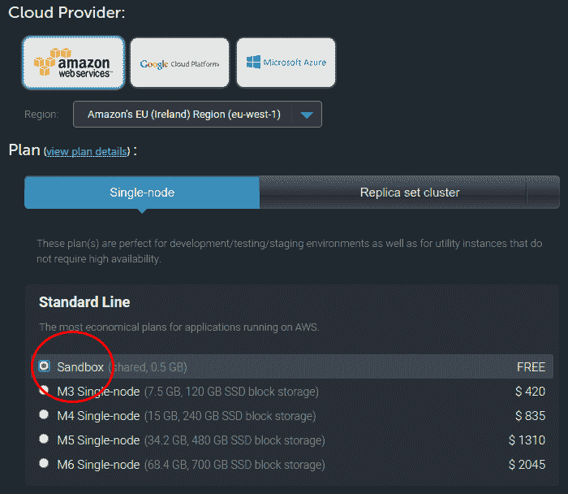
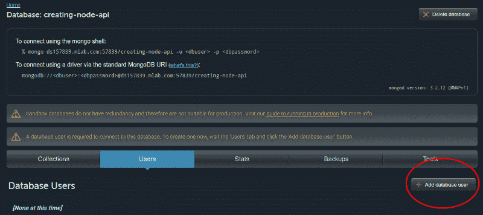
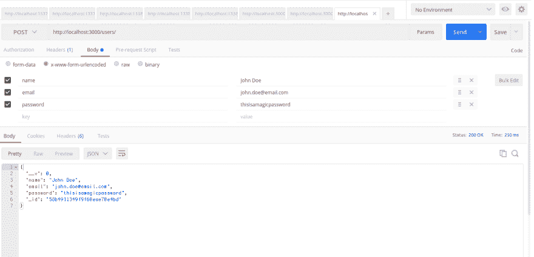
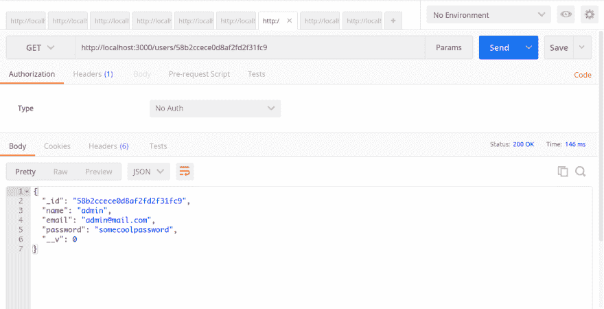
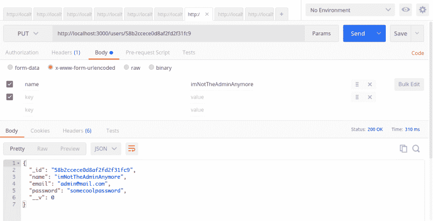
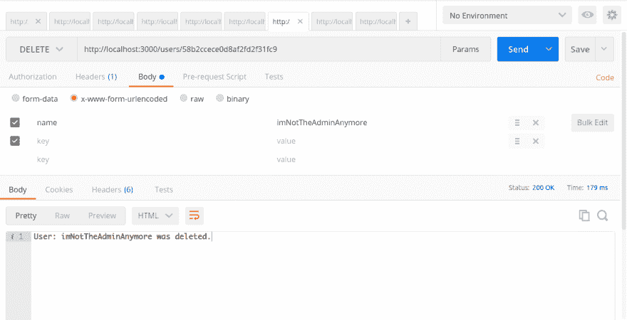

# 使用 Node.js 的 RESTful API 设计

> 原文：<https://dev.to/adnanrahic/restful-api-design-with-nodejs>

这篇文章最初发表在 Medium 上。你可以在这里看一下

Node.js 是一个了不起的工具，如果你是初学者、有抱负的程序员或 It 学生，可能很难理解它，但当你最终习惯它时，它会让你大开眼界。本教程将带您了解 API 设计的基础知识，教您如何建立 REST API 的主干，以及如何以逻辑方式构建代码。

随着教程的进展，我希望你能跟着我一起写代码。每个代码片段后面都会有一个解释，正确理解它的最好方法就是自己一路编码。

在开始之前，您需要了解一些关于 Node.js 和我将在本教程中使用的一些 EcmaScript 标准。我不会使用 ES6，因为我相信它不像传统 JavaScript 那样对初学者友好。但是，我希望您已经了解 Node.js 的基础知识，包括如何设置一个基本的节点服务器，该服务器将根据用户访问的路径返回一些信息。如果不是，请绕道并在继续之前检查[这个](https://medium.com/@adnanrahic/hello-world-app-with-node-js-and-express-c1eb7cfa8a30)。

其次，我将使用 CommonJS 的基本实现。不要担心，这将在下面解释。请随意查看此处的[，以及此处](https://en.wikipedia.org/wiki/CommonJS)的[，以便进一步参考。但是不要忘记回到这个教程。:)
最后，如果你想看完整版，整个演示都在 GitHub 上。文章底部有链接。](https://nodejs.org/docs/latest/api/modules.html#modules_the_module_object)

* * *

**准备好一些代码了吗？**
没有，开玩笑的。我们需要设置和安装应用程序正常工作所需的依赖项和节点模块。由于我们将创建一个 API，显然需要一个数据库。我们将使用 [MongoDB](https://www.mongodb.com/) ，一个 NOSQL 数据库。这是满足我们需求的最佳选择，因为我们不需要关系数据库。为了简单起见，我们不在本地安装和运行它，而是在 [mLab](https://mlab.com/) 上连接一个沙盒数据库。

继续，创建一个帐户，并创建一个新的 MongoDB 部署。

[T2】](https://res.cloudinary.com/practicaldev/image/fetch/s--Iz24ZjCR--/c_limit%2Cf_auto%2Cfl_progressive%2Cq_auto%2Cw_880/https://cdn-images-1.medium.com/max/800/1%2A1QZtJo6SiwbClNEnCT0lxg.png)

选择免费的沙盒数据库，并给它一个你选择的名字。

[T2】](https://res.cloudinary.com/practicaldev/image/fetch/s--uLArPfGu--/c_limit%2Cf_auto%2Cfl_progressive%2Cq_auto%2Cw_880/https://cdn-images-1.medium.com/max/800/1%2ABoaDdspS3gd1H74ZWfypig.png)

干得好，只需再做一件事，你的数据库就可以运行了。单击您新创建的数据库，并按照黄色文本中的说明进行操作。点击“用户”标签，添加新用户。

[T2】](https://res.cloudinary.com/practicaldev/image/fetch/s--rwzjDQBW--/c_limit%2Cf_auto%2Cfl_progressive%2Cq_auto%2Cw_880/https://cdn-images-1.medium.com/max/800/1%2AeUe7td5FymLYuPTbFjHjKw.png)

就是这样。数据库现在可以使用了。您将使用数据库名称下面的 MongoDB URI 连接到它。至此，您已经准备好开始配置应用程序本身了。初始化 npm 并安装以下模块:

```
npm init
npm install express --save
npm install mongoose --save
npm install body-parser --save 
```

Enter fullscreen mode Exit fullscreen mode

我们将在这个应用程序中使用 Express，因为它是当今大多数节点应用程序的事实上的标准。Mongoose 是一个 ORM 对象关系映射器。准确的说是 MongoDB 使用的官方 ORM。为了分解它，我们使用 ORM 来简化应用程序和数据库之间的数据传输。它映射我们应用程序中的数据，以支持数据库设置的一组严格规则。body-parser 模块只是一个中间件，我们用它来解析通过 HTTP 请求发送的数据。

你终于可以写一些代码了。
我们先跳个头好吗？首先，创建一个应用程序文件，编写一个基本的设置。把这个写到你的 app.js 里

```
// app.js
var express = require('express');
var app = express();
module.exports = app; 
```

Enter fullscreen mode Exit fullscreen mode

该文件将用于配置应用程序，仅此而已。所有的逻辑都将被放在与它将要实现的特定特性相关的各自的目录中。当我们使用`require()`调用这个 app 对象时，我们使用`module.exports`使它对程序的其余部分可见。

现在我们需要告诉应用程序在哪里听。继续创建另一个名为 server.js 的文件，并将它记下来。

```
// server.js
var app = require('./app');
var port = process.env.PORT || 3000;
var server = app.listen(port, function() {
  console.log('Express server listening on port ' + port);
}); 
```

Enter fullscreen mode Exit fullscreen mode

这里你需要应用程序，并把它放在一个变量中。该应用是您在`app.js`中创建的实际应用对象。继续选择应用程序运行的端口，最后用`app.listen`启动服务器。继续打开一个终端窗口，测试这是否有效。切换到创建这些文件的目录并运行`node server.js`。您应该看到`Express server listening on port 3000`被记录到命令行。

你已经让服务器运行了，万岁！
两个下来，三个要走。服务器启动并运行后，现在您需要连接数据库。回到您的文本编辑器，创建一个新文件，非常创新地命名为 db.js，因为它将用于存储您的数据库连接。应该是这样的:

```
// db.js
var mongoose = require('mongoose');
mongoose.connect('mongodb://yourDatabaseURI'); 
```

Enter fullscreen mode Exit fullscreen mode

为上面提到的 URI 更改您的 DatabaseURI。回到你的 mLab 账户，复制 MongoDB URI。将它粘贴到您的代码中，在两个引号之间。更改您为创建的用户输入的凭据的和。完成这些后，你现在需要告诉应用程序它有一个可用的连接。只需在`app.js`中加一个`require()`，像这样:

```
// app.js
var express = require('express');
var app = express();
var db = require('./db'); //ADD THIS LINE
module.exports = app; 
```

Enter fullscreen mode Exit fullscreen mode

通过这样指定，我们告诉 require 在`app.js`所在的同一个目录中抓取一个文件并包含它。就是这样。现在我们的应用程序知道它有一个准备好的数据库，等待被访问。

您的程序现在应该有三个文件。一个`app.js`用于配置应用程序，一个`db.js`用于指定到数据库的连接，一个`server.js`用于在您选择的特定端口上启动节点服务器。
现在您已经准备好开始编写程序的业务逻辑了。

**言归正传。**
首先创建一个名为 user 的新文件夹。该文件夹将包含所有与我们和数据库关于用户的通信有关的文件。您将从创建一个用户模型开始。这个模型将作为一个蓝图，展示数据库中所有用户的样子。创建一个名为`User.js`的文件，并编写这段代码:

```
// User.js
var mongoose = require('mongoose');  
var UserSchema = new mongoose.Schema({  
  name: String,
  email: String,
  password: String
});
mongoose.model('User', UserSchema);
module.exports = mongoose.model('User'); 
```

Enter fullscreen mode Exit fullscreen mode

您正在创建一个模式，它将为数据库中的每个用户提供特定的外观。用户将有一个名字，一个电子邮件和一个密码。通过指定`mongoose.model('User', UserSchema)`，您将模式的布局绑定到名为`'User'`的模型。这是您将用来访问数据库中的数据的内容，这也是您将它导出以在程序的其他部分使用的原因。

现在有趣的部分来了，为你的应用程序创建路线，并将它们绑定到各自的动作。

创建另一个文件，命名为`UserController.js`。您将在它的名字中用一个控制器来命名它，这不仅是为了简单，也是因为它将包含控制数据流入和流出数据库的动作。

```
// UserController.js
var express = require('express');
var router = express.Router();
var bodyParser = require('body-parser');
router.use(bodyParser.urlencoded({ extended: true }));
var User = require('./User');
module.exports = router; 
```

Enter fullscreen mode Exit fullscreen mode

上面是用户控制器的裸布局。您将使用快速路由器创建一个路由子集，该子集可以是模块化的，并且独立于整个应用程序。如果你需要重新构建你的程序，你可以很容易地这么做，因为这种方法给你一种能力，只需要从一个地方把它插出来，再把它插在另一个地方。主体解析器模块被用作中间件，以更优雅的方式处理数据。这在使用表单通过 HTTP 请求发送数据时会很方便。

好玩的部分只有`require('./User')`才有。现在您看到了为什么您需要从`User.js`中导出模型。你将在`UserController.js`中真正开始使用它。每当您像上面那样创建一个模型时，它会自动接收与数据库交互的所有必要方法，包括创建、读取、更新和删除操作。最后，在文件的底部，导出路由器，因为 app.js 中需要它。

**我跑题了！**
让我们简单介绍一下 REST，以便更好地理解与数据库交互的 4 个操作。他们被称为 CRUD。代表创建、读取、更新和删除。使用 HTTP 请求，我们可以使用各自的动作来触发这四个 CRUD 操作中的每一个。

*   POST 用于将数据发送到服务器“创建”
*   GET 用于从服务器获取数据 Read
*   PUT 用于发送和更新数据——更新
*   删除用于删除数据——删除

理解这一点的最好方法是直接投入进去。

**回到正题。**

```
// UserController.js
var express = require('express');
var router = express.Router();
var bodyParser = require('body-parser');
router.use(bodyParser.urlencoded({ extended: true }));
var User = require('./User');
// ADD THIS PART
// CREATES A NEW USER
router.post('/', function (req, res) {
    User.create({
            name : req.body.name,
            email : req.body.email,
            password : req.body.password
        }, 
        function (err, user) {
            if (err) return res.status(500).send("There was a problem adding the information to the database.");
            res.status(200).send(user);
        });
});
// RETURNS ALL THE USERS IN THE DATABASE
router.get('/', function (req, res) {
    User.find({}, function (err, users) {
        if (err) return res.status(500).send("There was a problem finding the users.");
        res.status(200).send(users);
    });
});
module.exports = router; 
```

Enter fullscreen mode Exit fullscreen mode

查看第一个方法，您会看到 router 对象有一个带两个参数的`.post`方法。第一个是将被链接到一个函数的路由。这个函数是第二个参数。它需要另外两个参数，分别表示对服务器的请求和来自服务器的响应。在函数内部，您将使用上面所需的用户模型。用户模型有一个 create 方法，它也接受两个参数。第一个是对象，第二个是函数。该对象包含要插入数据库的值。你看，它们的结构就像你在上面创建的模式一样。创建回调函数后，用另外两个参数调用它，一个错误值和一个成功值。您将检查在创建新用户的过程中是否有错误，并做出相应的响应，或者如果一切正常，则使用新创建的用户的数据进行响应。

第二种方法简单一点。路由器对象还有一个. get 方法，该方法也接受两个参数。在该函数中，您现在调用用户模型上的`find()`方法，该方法也接受两个参数。Find 是一种从数据库中返回值的方法。它的第一个参数是一个对象，定义了返回值必须满足的要求。在本例中，对象为空，将返回数据库中的所有用户。

现在，您需要让应用程序知道它有一个用户控制器。将此添加到您的 app.js.

```
// app.js
var express = require('express');
var app = express();
var db = require('./db');
// ADD THESE TWO LINES
var UserController = require('./user/UserController');
app.use('/users', UserController);
module.exports = app; 
```

Enter fullscreen mode Exit fullscreen mode

这到底是什么魔法？我们真的没什么。你要求用户控制器和`app.use`告诉应用程序将它链接到路线`/users`。现在，用户控制器中的`/`路线将被映射到`/users/`。这太酷了，对吧！？

你测试过吗，兄弟？
唷，那可真是屈指可数。让我们休息一下，测试一下我们的应用程序。为了测试 API，我总是使用 [Postman](https://www.getpostman.com/) 。这是一个非常棒的工具，可以测试所有 4 个 HTTP 动作的 URL。它还增加了在 HTTP 请求体中发送数据的可能性。正是你需要测试你的应用。下载、安装并启动 Postman，然后跟随。

Postman 是一个非常基本的工具，你输入想要发送 HTTP 请求的 URL，选择一个方法，如果需要，输入参数。让我们从向`http://localhost:3000/users`发送 POST 请求开始。这意味着您需要在请求正文中输入一组参数。

[T2】](https://res.cloudinary.com/practicaldev/image/fetch/s--MjYDg1k---/c_limit%2Cf_auto%2Cfl_progressive%2Cq_auto%2Cw_880/https://cdn-images-1.medium.com/max/1400/1%2ArkgRt0nyzHd3fO5MhGQkfw.png)

切换到 body 选项卡，输入与您之前创建的用户模型相匹配的键值对。你需要一个名字，一个电子邮件和一个密码。点击发送。瞧！一个回应。如果一切顺利，响应将包含与最近创建的用户相匹配的数据。

现在，继续将 HTTP 方法改为 GET，并再次点击 send。您将看到所有创建的用户都从数据库中返回。继续使用它，添加更多的用户，并观察 GET 请求的行为。

**回码。**
到目前为止，您已经设置了一个服务器，配置了您的应用程序，将它连接到一个数据库，并创建了两个用于与数据库通信的 API。还有三个 API 需要实现。从数据库中检索单个用户，更新用户，最后删除用户。所有这些都有一个共同点。它们都有一个查询参数，通常称为路径参数。不要害怕。它只是一个将随请求传递的值。让我们跳进来。

```
// UserController.js
//...
// GETS A SINGLE USER FROM THE DATABASE
router.get('/:id', function (req, res) {
    User.findById(req.params.id, function (err, user) {
        if (err) return res.status(500).send("There was a problem finding the user.");
        if (!user) return res.status(404).send("No user found.");
        res.status(200).send(user);
    });
});
//... 
```

Enter fullscreen mode Exit fullscreen mode

现在您已经添加了另一个 GET 请求，但是请看 route，router.get 方法的第一个参数。现在，它有一个由冒号后跟一些文本组成的值。这个符号意味着它是一个查询参数的占位符，一个简单的值，它将随请求一起发送。传递给`'/:id'`的值可以通过`req.params`对象访问。其中查询参数的名称将被映射到`req.params`对象上的一个同名属性。
继续，Mongoose 有一个很棒的方法叫做`.findById`，它只需要返回用户的 ID。ID 是第一个参数，回调函数是第二个参数。你能看到一种模式出现了吗？所有的 Mongoose 方法都需要一个值作为第一个参数，一个回调函数作为最后一个参数。这个回调将在数据库返回查询值后被调用。删除请求也可以看到相同的模式。

```
// UserController.js
//...
// DELETES A USER FROM THE DATABASE
router.delete('/:id', function (req, res) {
    User.findByIdAndRemove(req.params.id, function (err, user) {
        if (err) return res.status(500).send("There was a problem deleting the user.");
        res.status(200).send("User "+ user.name +" was deleted.");
    });
});
//... 
```

Enter fullscreen mode Exit fullscreen mode

`router.delete`方法看起来和上面的`router.get`完全一样。甚至猫鼬方法看起来都一样，除了它的名字。您将通过向方法提供您想要删除的用户的 ID 来从数据库中删除用户。`.findByIdAndRemove`方法会像`.findById`一样找到一个用户，但也会从数据库中删除它。

应用程序的最后一步是实现一种更新数据库中现有用户的方法。这是通过 PUT 请求完成的。

```
// UserController.js
//...
// UPDATES A SINGLE USER IN THE DATABASE
router.put('/:id', function (req, res) {

    User.findByIdAndUpdate(req.params.id, req.body, {new: true}, function (err, user) {
        if (err) return res.status(500).send("There was a problem updating the user.");
        res.status(200).send(user);
    });
});
//... 
```

Enter fullscreen mode Exit fullscreen mode

`router.put`请求与您上面写的两个请求非常相似。它还接受一个查询参数，一个 ID。与众不同的是，它还需要主体参数，就像您首先编写的 POST 请求一样。唯一有主体的 HTTP 方法是 POST 和 PUT。记住这一点。

想猜猜`.findByIdAndUpdate`是做什么的吗？你说得对。这个方法和你上面写的有点不一样。它有三个主要参数，一个 ID，一个对应于其值将被更新的用户的对象，当然还有一个回调函数。您将把请求体作为第二个参数传递，即对象，因为它已经被我们需要的中间件正确解析，并在`UserController.js`的顶部使用。更新某些值时，一个好的做法是请求将更新后的值发送给您。这一点很重要，因为您希望能够访问最新更新的值。因此，您添加了另一个第四个参数{new:true}，它代表您想要返回哪个版本的值的选项，在您的例子中是用户。更新前的那个，还是更新后的那个。返回该值将显示您更新的用户。

准备好接受更多测试了吗？
编程往往是混乱与宁静之间的平衡。解决看似不合逻辑的问题时的混乱，与最终解决问题时的平静。测试是你获得平静的方法。我遇到过一句话，这句话深深植根于我见过的所有程序员的思维模式中。

> 编写在第一次尝试、第一次编译或第一次运行时有效的代码被称为编程大奖。每一个程序员

当它真的发生时，如果有的话，你会觉得好像是太阳特意选择照耀在你身上。不要习惯这个。建立这样一种认识:这种事情永远不会发生。你需要点击东西，按下按钮，并投入到开发工具中，才能平息混乱，获得宁静。
准备好了吗？让我们按一些按钮。

再次启动命令提示符，用`node server.js`启动服务器。打开 Postman，继续尝试你刚刚创建的新方法。针对单个用户的普通 GET 请求看起来有点像这样:

[T2】](https://res.cloudinary.com/practicaldev/image/fetch/s--xSjVa75---/c_limit%2Cf_auto%2Cfl_progressive%2Cq_auto%2Cw_880/https://cdn-images-1.medium.com/max/1400/1%2Ac-zJXFbAnxa5_EhKvHXr4Q.png)

将用户的 ID 作为查询参数添加到 URL 中实际上只会返回具有该特定 ID 的用户。
转到 PUT 请求，将方法更改为 PUT，向主体添加值(确保属性与上面创建的用户模式的属性相匹配),然后点击 send。

[T2】](https://res.cloudinary.com/practicaldev/image/fetch/s--W81yImPY--/c_limit%2Cf_auto%2Cfl_progressive%2Cq_auto%2Cw_880/https://cdn-images-1.medium.com/max/1400/1%2AFZCmeX72a6hLfiTtx2VCJA.png)

您已经将*“admin”*的名称更改为*“imnottheminnamore”*。
如果你明白这一点，删除方法将是小菜一碟。将方法更改为删除，并再次点击发送。现在，您将从数据库中删除具有给定 ID 的用户。

[T2】](https://res.cloudinary.com/practicaldev/image/fetch/s--RB6lbPc0--/c_limit%2Cf_auto%2Cfl_progressive%2Cq_auto%2Cw_880/https://cdn-images-1.medium.com/max/1400/1%2AiLV6tsWEbpbU5z2fxZ5k4g.png)

我知道这么快让你明白所有的事情是很困难的。这也是我把所有代码都推给 GitHub 的原因。如果你在任何地方遇到困难，请随意查看整个项目的整体情况。

* * *

所以你认为就这样了？
你只刮到了巨大冰山的一角。但是，现在已经足够了。保持好奇，提出问题，并不断按下按钮。我已经给了你在成为明星的过程中需要知道的许多核心技能的基础。
不要让 Node 吓到你。这只是普通的 JavaScript。用在浏览器中编写代码的方式来查看它。分解一下，它只是一堆事件侦听器和处理程序。比如:

```
router.get('/:id', function (req, res) {
    User.findById(req.params.id, function (err, user) {
        if (err) return res.status(500).send("There was a problem finding the user.");
        if (!user) return res.status(404).send("No user found.");
        res.status(200).send(user);
    });
}); 
```

Enter fullscreen mode Exit fullscreen mode

服务器正在侦听 HTTP 请求，以使用 GET 方法找到路由`'/:id'`。当这样的请求发生时，回调函数将被调用。这个函数中的所有内容都将被计算和执行。很熟悉不是吗？

```
button.addEventListener('click', function (e) {
    console.log("Well it's very familiar for me.");
}); 
```

Enter fullscreen mode Exit fullscreen mode

* * *

希望你们喜欢读这篇文章，就像我喜欢写这篇文章一样。很好奇，它确实帮了我很多。你觉得这个教程会对某个人有帮助吗？不要犹豫分享。

感谢我的父亲，他是我的灵感来源，并一直让我保持好奇。

* * *

[T2】](https://www.buymeacoffee.com/adnanrahic)