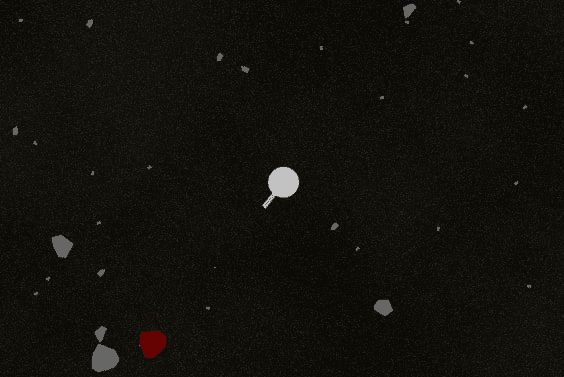

# 岩石-简单的炮塔人工智能

> 原文：<https://dev.to/adamkdean/rocks-simple-turret-ai-5636>

所以我最近几天一直在玩 Unity，我很喜欢它。我不是一个场景编辑器或任何 GUI 东西的粉丝，但我一直在玩 [MattRix](https://twitter.com/MattRix/) 的[无用框架](https://github.com/MattRix/Futile)，能够从代码优先的角度做任何事情是令人敬畏的。

很自然的，我决定做一个简单的游戏模拟，为了科学。有什么比在太空中向岩石射击的炮塔 AI 更简单？

[T2】](https://res.cloudinary.com/practicaldev/image/fetch/s--ZpNLummt--/c_limit%2Cf_auto%2Cfl_progressive%2Cq_auto%2Cw_880/http://i.imgur.com/HEDGi7y.png)

它实际上工作得很好。我想我有 200，000 颗小行星在一个点上漂浮，有最小的滞后。

我喜欢使用 Unity 的一点，也是徒劳的一点是，我不必把所有的时间都花在样板代码上。我可以直接跳进去开始我的游戏。我能更快地看到结果，这就是我喜欢的，结果。

现在，我要么想出一个简单的游戏并完成它，要么继续升级这个网站。艰难的决定。

“岩石”的源代码可以在 GitHub 的[这里找到，演示可以在](https://github.com/Imdsm/Rocks)[这里找到。](http://gamedev.adamkdean.co.uk/Rocks/)。