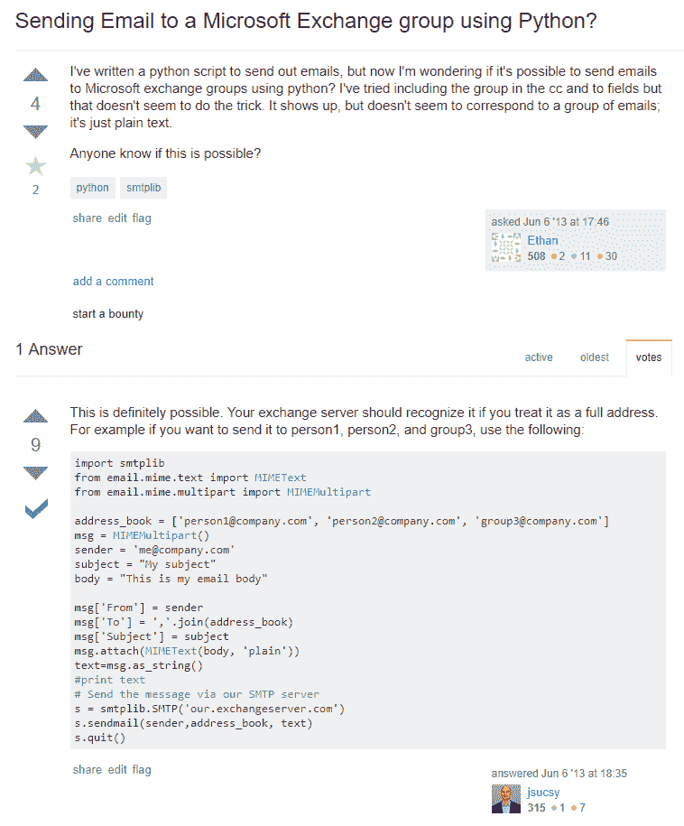

# 使用 Python 发送电子邮件

> 原文：<https://dev.to/jonstodle/sending-an-email-with-python-4h4>

我已经很多年没做过 Python 编程了。我想这可能是 10 年前的事了，那时只是一些基本的学习如何编程的东西。

我正在参与一个工作项目。我们正在用树莓派和一些定制软件做一些原型。虽然该软件运行出色，但我们希望在其上增加一些额外的功能。

# 输入 Python！

我想我要解决的第一件事是发送电子邮件。我认为这将是我必须编写的最复杂的代码。如果我能做到这一点，剩下的就是小菜一碟了。至少我是这么认为的...

我的第一反应当然是终止于堆栈溢出。我的谷歌搜索让我进入了这个问题和答案。

[T2】](https://res.cloudinary.com/practicaldev/image/fetch/s--8PMVHKTN--/c_limit%2Cf_auto%2Cfl_progressive%2Cq_auto%2Cw_880/https://blog.jonstodle.com/conteimg/2017/09/Screenshot-170926-083404.png)

原来真的很简单。不错！

# 发送邮件

通过从标准库中导入`smtplib`,你可以非常容易地发送电子邮件。我不得不查看函数定义的语法，我还花时间查阅了 Python 的[风格指南。我总是喜欢使用一种语言的最佳命名标准。](https://www.python.org/dev/peps/pep-0008/#naming-conventions)

这促使我编写了以下函数:

```
def send_mail(
        sender,
        receivers: List[str],
        subject,
        body,
        username,
        password,
        server_address
):
    """Sends an email to the specified receivers using an Exchange server."""
    message = MIMEMultipart()
    message["From"] = sender
    message["To"] = ",".join(receivers)
    message["Subject"] = subject
    message.attach(MIMEText(body))

    server = smtplib.SMTP(server_address, 587)
    server.starttls()
    server.login(username, password)
    server.sendmail(sender, receivers, message.as_string())
    server.quit() 
```

Enter fullscreen mode Exit fullscreen mode

因为我使用的是 Exchange 服务器，所以我必须启动 TLS。除此之外，一切都很简单。

# 在终端运行脚本

我还希望能够通过在终端中运行脚本来使用它。这可以通过在定义函数后调用它来完成。当 Python 解释器遍历文件时，它将执行对函数的调用。

然而在 Python 中，将调用放在一个`if __name__ == " __main__":`子句中被认为是一个好的做法。这样做是为了检测该文件是直接运行的还是由另一个文件或模块导入的。

当 Python 解释器直接运行文件时(例如在终端中)，它会将全局`__name__`变量设置为`__main__`。当文件被另一个文件或模块导入时，`__name__`将被设置为该文件或模块的名称。

通过将执行代码放在`if __name__ == " __main__":`中，我们确保代码只在文件被直接使用时运行，而不是在它被导入用于另一个代码和平时运行。

## 解析输入

我希望能够在终端中执行文件时通过传递参数来指定`send_mail`函数的参数。原来 Python 也有这样的库！

我爱这种语言！

通过导入`argparse`，我能够定义参数，添加类型提示和帮助文本。`argparse`还会自动添加一个`-h`开关，显示所有可能的参数及其帮助文本。

为了让事情更有趣，我还提供了一个选项来提供文件路径，而不是正文文本。然后，脚本将从文件中获取文本，并将其用作邮件的正文。

```
if __name__ == " __main__":  
    parser = argparse.ArgumentParser(description="Sends an email to the specified receivers using the Sykehuspartner Exchange server.")
    parser.add_argument("sender", type=str, help="Sender's email address.")
    parser.add_argument("receivers", type=str, help="Comma-seperated list of email addresses.")
    parser.add_argument("subject", type=str, help="Subject of the email.")
    parser.add_argument("body", type=str, help="Body text of the email. Can be plain text or a file path when -f is passed.")
    parser.add_argument("username", type=str, help="The username to authenticate with on mail server.")
    parser.add_argument("password", type=str, help="The password to authenticate with on mail server.")
    parser.add_argument("server", type=str, help="The address of the mail server.")
    parser.add_argument("-f", "--file", action="store_true", help="Specifies that the body argument contains a file path instead of plain text")
    args = parser.parse_args()

    if args.file:
        with open(args.body) as file:
            args.body = file.read()

    send_mail(args.sender, args.receivers.split(","), args.subject, args.body, args.username, args.password, args.server) 
```

Enter fullscreen mode Exit fullscreen mode

在这些脚本中没有太多的错误处理，这主要是因为两个原因:它只被一小部分内部人员使用，来自解释器的错误消息必须处理。

* * *

在将近 10 年没有使用 Python 之后，我开始意识到我错过了什么。虽然这是一个很小的例子，但它的摩擦非常小。我开始明白为什么这么多人喜欢 Python，为什么它被一些大学选为入门语言。

我期待着更多地使用 Python。

编码快乐！