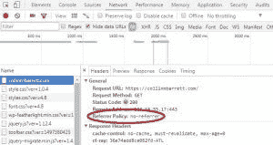

# 使用 NGINX 发送引用策略头

> 原文：<https://dev.to/collinbarrett/sending-the-referrer-policy-header-with-nginx-1bd6>

[T2】](https://collinmbarrett.com/referrer-policy-header-nginx/)

我通过各种测试工具定期运行我维护的网站集合，以监控它们的安全性和性能。这些工具之一， [securityheaders.io](https://securityheaders.com/) ，最近增加了对[新推荐者策略头](https://scotthelme.co.uk/a-new-security-header-referrer-policy/)的检查。我深入研究了一下这个标题，并开始在我的网站上通过 NGINX 发送它。

## 引用头

当我们点击互联网上的链接时，HTTP 规范的一部分是发送一个 referrer 头到你正在访问的下一个页面。这些信息可以让下一页看到你从哪里来，对网站优化引导漏斗、SEO 等非常有价值。然而，消息灵通的、注重隐私的用户可能不希望显示他们访问的最后一个页面。

## 用 noreferrer 阻塞

网站已经有了一种机制，可以通过在链接中添加“noreferrer”关键字来请求不发送 referrer 标头。下面的例子演示了 HTML 的实现。尊重这个关键词取决于浏览器，但据我所知，大多数主流浏览器的现代版本都是这样。

```
&lt;a rel="noreferrer" href="https://collinmbarrett.com"&gt; 
```

Enter fullscreen mode Exit fullscreen mode

## 用引用策略头阻止

但是，如果站点想要在站点范围内指定这个关键字，而不是在每个链接标签上添加关键字，该怎么办呢？新的 Referrer 策略头允许网站定义他们希望 web 浏览器遵循的策略，并且它还为何时发送和包含什么内容提供了更细粒度的选项。

我不会在这里重新发布定义，但有各种各样的策略可供选择，包括以下内容:无引用、降级时无引用、同源、同源、严格同源、跨源时同源、跨源时严格同源和不安全 url。所选的策略对浏览器在包含什么内容以及何时发送引用标头方面有不同的影响和暗示。查看[此处](https://www.w3.org/TR/referrer-policy/#referrer-policies)了解更多政策信息。

请注意，由于这是一个相对较新的特性，在撰写本文时，浏览器支持会有所不同。当我第一次尝试在我的一个网站上实现“同源”策略时，我在 Chrome 控制台上看到了下面的错误。Chromium [目前只支持其中一些策略](https://bugs.chromium.org/p/chromium/issues/detail?id=627968&q=Referrer-Policy%20header%20strict&colspec=ID%20Pri%20M%20Stars%20ReleaseBlock%20Component%20Status%20Owner%20Summary%20OS%20Modified)。在 Chromium 团队解决这个问题之前，我想我会把我的网站放在“无推荐人”的位置，以避免隐私问题。如果“同源”得到更广泛的采用，我会尝试这样做，以保护我的内部分析的完整性。

> 无法设置引用策略:值“same-origin”不是“no-referrer”、“no-referrer-when-降级”、“origin”、“origin-when-cross-origin”或“unsafe-url”之一。推荐人政策保持不变。

## 使用 NGINX 发送引用策略头

用 NGINX 发送 referrer 策略非常简单。只需在 NGINX 的服务器块中添加如下内容。会议文件。然后，重启 NGINX。

```
##
# Referrer Policy
##

add_header Referrer-Policy "no-referrer"; 
```

Enter fullscreen mode Exit fullscreen mode

我们可以通过检查 Chrome 中的资源来验证 NGINX 正在发送报头。打开开发工具，切换到网络选项卡，并刷新页面。单击站点的根文档会显示各种请求详细信息，包括这个头值。

<figure>[](https://collinmbarrett.com/media/referrerPolicyChrome_collinmbarrett.jpg)

<figcaption id="caption-attachment-4199">Chrome 开发者工具中的推荐策略</figcaption>

</figure>

## 挡住不速之客

所有这一切让我开始思考，作为一个用户，我能做些什么来阻止 referrer 头被发送。Web 开发人员可以使用上述两种方法中的一种或两种，但是如果我想让我访问的站点不知道我是从哪里来的，而不考虑他们实现推荐策略的决定，该怎么办呢？看起来可能有一些基于插件的解决方案，如[这个](https://chrome.google.com/webstore/detail/noref/dkpkjedlegmelkogpgamcaemgbanohip)，但这是我当然想进一步研究的领域。