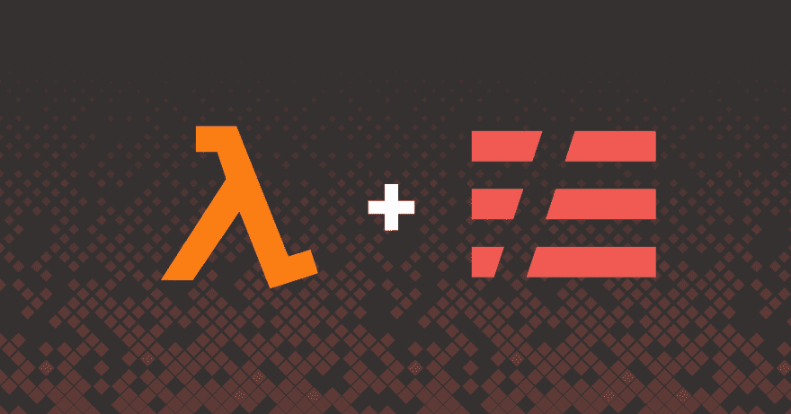

# 无服务器框架介绍项目

> 原文：<https://dev.to/tmclaughbos/serverless-framework-intro-project-192o>

[T2】](https://res.cloudinary.com/practicaldev/image/fetch/s--zSQHIlId--/c_limit%2Cf_auto%2Cfl_progressive%2Cq_auto%2Cw_880/https://www.serverlessops.io/hs-fs/hubfs/blog/twitter-so-lambda-serverless-framework.png)

无服务器是一种云架构，为运营工程师提供了巨大的优势，而[无服务器框架](https://serverless.com/framework/)使其易于上手。这对于那些一直在编写脚本来定期自动化其环境的一部分的操作和开发工程师以及那些刚刚开始编写自动化脚本的人来说非常有用。对于那些经常编写自动化的人来说，在随机 AWS EC2 实例上运行的周期性任务现在可以变成一个独立的系统，具有自动化逻辑和通过 AWS CloudFormation 跟踪的配套基础设施代码。对于那些不熟悉编写自动化的人来说，无服务器架构可以降低基础设施自动化的门槛。

为了演示这一点，让我们为 AWS 环境构建一个简单的服务。出于合规性、审计需求等原因，或者只是为了更好地了解您的环境，您可能希望跟踪 AWS 控制台登录。我们将构建一个 Python 3 服务，将控制台登录 CloudTrail 事件记录到一个 S3 桶中。我们将在未来的博客文章中扩展这项服务，增加更多功能。

这篇博文的项目 aws-console-auditor 位于 GitHub 上。此外，因为 aws-console-auditor 将会发展，所以也有专门针对这篇博文的回购分支。

*   [AWS-控制台-审计员](https://github.com/ServerlessOpsIO/aws-console-auditor)
*   [无服务器-aws-python3-intro](https://github.com/ServerlessOpsIO/serverless-aws-python3-intro)

## 入门

首先，安装[无服务器框架](https://serverless.com/framework/)。它是用 JavaScript 写的，你需要安装 NodeJS 和 NPM 来实现。

```
npm install -g serverless 
```

Enter fullscreen mode Exit fullscreen mode

安装了无服务器框架后，我们将继续创建一个项目。*无服务器*脚本可以使用模板创建不同类型的项目。我们将使用 AWS Python 3 模板创建一个项目，并安装一个插件来处理 Python 依赖关系。

```
serverless create -t aws-python3 -n serverless-aws-python3-intro -p serverless-aws-python3-intro
cd serverless-aws-python3-intro
serverless plugin install -n serverless-python-requirements 
```

Enter fullscreen mode Exit fullscreen mode

将要创建的是一个 *serverless.yml* 模板文件、一个基本的处理程序脚本(我们将丢弃它)和一个. gitignore。

## 图解服务

与其直接构建我们的服务，不如让我们花点时间画一个系统图。这对于一些人来说似乎不合常规，特别是对于简单的服务，但是这迫使我们在开始任何耗时的编码之前，确定我们将要构建什么。

有几个选项可供您使用:

*   [Draw.io](https://www.draw.io/)
*   [Lucidchart](https://www.lucidchart.com/)
*   [Cloudcraft](https://cloudcraft.co/)
*   [Visio](https://products.office.com/en-us/visio/visio-online)

我个人使用 Draw.io，因为它让我可以访问整个 AWS 图标集。让我用熟悉 AWS 生态系统的人通常能认出的图标来画一个系统。

这是即将建立的系统。包含在右边矩形中的是要构建的服务。左侧是将触发服务的工作流。

[T2】](https://res.cloudinary.com/practicaldev/image/fetch/s--ALW3cCO8--/c_limit%2Cf_auto%2Cfl_progressive%2Cq_auto%2Cw_880/https://www.serverlessops.io/hs-fs/hubfs/blog/serverless-aws-python3-intro.png)

系统的流程如下，用户登录控制台，控制台生成一个 CloudTrail 事件，该事件将触发一个 Lambda，该 Lambda 将事件数据写入一个 S3 桶。

## 创建 serverless.yml

现在我们知道了我们将要构建的系统，我们可以开始构建它了。无服务器框架提供了将系统表示为代码(嗯，YAML)、部署和管理系统的能力。 *serverless.yml* 需要定义三件事:

*   AWS Lambda 函数(并定义触发它的事件)
*   S3 水桶
*   IAM 策略(如上图所示)允许 Lambda 写入存储桶。

现在让我们浏览一下 *serverless.yml* 的不同部分。

### 初始配置

我们将从 *serverless.yml* 文件中的一些初始配置开始。我们将用下面的内容替换由模板创建的现有 serverless.yml。模板 serverless.yml 没有任何问题，但它只是更容易理解和解释。

无服务器。yml:T2]

```
service: serverless-aws-python3-intro

plugins:
  - serverless-python-requirements

provider:
  name: aws
  region: us-east-1
  stage: dev

  environment:
    LOG_LEVEL: INFO

  iamRoleStatements:

resources:

functions: 
```

Enter fullscreen mode Exit fullscreen mode

首先，我们开始提供服务的名称。在这种情况下，它被称为*无服务器-aws-python3-intro* 。我们将看到在为此服务创建的许多资源中使用的服务名称。

插件部分列出了一个插件，*server less-python-requirements*。这个插件将处理标准 *requirements.txt* 文件中指定的 python 依赖项的构建和安装。我们目前实际上不需要这个，但是现在引入插件是有用的。我们可能会在以后开发这项服务时用到它。此外，如果你在这之后去写一个你自己的服务，了解这个插件是有用的。

provider 部分定义了无服务器平台提供程序及其配置，以及服务组件资源的其他配置。该部分将使用您在本地配置的[默认 AWS 凭证](https://serverless.com/framework/docs/providers/aws/guide/credentials)在 *us-east-1* 创建一个 AWS 无服务器系统。

*阶段*属性是无服务器框架如何在同一环境中部署同一服务的名称空间。如果*开发*和*生产*共享一个 AWS 账户，或者如果你希望多个开发者能够同时部署他们自己的系统，就可以使用这个账户。

可以在命令行上分别使用 *-区域、* *-阶段、*和 _ - aws-profile_ arguments 来覆盖*区域、* *阶段、*和 AWS 概要文件名称。您可以使用环境变量使区域、阶段和配置文件更加灵活，但我们将在另一篇博客文章中讨论这一点。

*LOG_LEVEL* 环境变量是个人偏好。这使得为调试目的增加函数的日志记录级别变得容易，并在完成时降低日志记录级别。下面是它在我们的处理程序代码中的用法。

我们暂时将 *iamRoleStatements* 留空。在我们创建了 AWS 资源并需要允许 Lambda 函数写入 S3 桶之后，我们将回到这个问题。

[handlers/write-event-to-S3 . py:](https://github.com/ServerlessOpsIO/serverless-aws-python3-intro/blob/master/handlers/write-event-to-s3.py#L13-L15)T2】

```
log_level = os.environ.get('LOG_LEVEL', 'INFO')
logging.root.setLevel(logging.getLevelName(log_level))
_logger = logging.getLogger( __name__ ) 
```

Enter fullscreen mode Exit fullscreen mode

### S3 斗

我们将向下移动到*资源*部分，而不是直接移动到*功能*部分。本节用于添加 AWS 资源。如果你熟悉 CloudFormation，那么好消息是，它使用了与 CloudFormation YAML 相同的语法。

添加我们的服务的 S3 桶很简单:只需添加一个资源并设置*类型*属性。以下是该服务的 S3 存储桶的配置。

无服务器。yml:T2]

```
resources:
  Resources:
    LoginEventS3Bucket:
      Type: AWS::S3::Bucket
      Properties:
        AccessControl: Private 
```

Enter fullscreen mode Exit fullscreen mode

默认情况下，访问控制策略将是*私有的。*为了明确起见，应该设置这个属性，所以我们添加了这个属性。无服务器框架将根据服务和资源名称来命名存储桶。S3 桶在 AWS 帐户中是全球唯一的，无服务器框架将附加一个随机字符串，以帮助确保您不会与部署了相同服务的不同帐户中的桶冲突。

如果名字是用随机字符串生成的，你的 Lambda 函数怎么知道要写入这个 S3 桶呢？我们稍后会展示这一点。

### IAM 角色声明

所有函数都有一个 IAM 角色，在本例中，该角色将包括一个允许我们的函数写入 S3 存储桶的策略。IAM 角色可以用两种不同的方式定义:在 *iamRoleStatements* 下的*提供者*部分，或者在*资源*中作为 AWS::IAM::Role 部分。

在 provider 部分定义 IAM 角色是使用无服务器框架定义 IAM 角色和分配权限的普遍接受的方式。但是，将为服务中的所有 Lambda 函数创建并使用一个 IAM 角色。在本例中，这不是问题。然而，在选择了 monorepo 方法来组织代码的大型服务中，您可能希望进行更严格的控制，并为每个功能创建一个角色。决定权在你。

我们在*提供者*部分的 *iamRoleStatements* 如下:

无服务器。yml:T2]

```
iamRoleStatements:
    - Effect: Allow
      Action:
        - s3:PutObject
      Resource:
        - Fn::Join:
          - '/'
          - - Fn::GetAtt:
            - LoginEventS3Bucket
            - Arn
          - '*' 
```

Enter fullscreen mode Exit fullscreen mode

单个 IAM 角色语句提供了写入 S3 存储桶的能力。我们没有给出部署时自动生成的 S3 存储桶的名称，而是使用 CloudFormation 内置函数来通过资源 ID 获取存储桶的 ARN。

### 功能

有了支持资源，我们开始添加*功能*部分到*无服务器. yml* 。下面定义了。

无服务器。yml:T2]

```
functions:
  WriteEventToS3:
    handler: handlers/write-event-to-s3.handler
    description: "Write  login  event  to  S3"
    runtime: python3.6
    memorySize: 128
    timeout: 15
    role: WriteEventToS3
    events:
      # http://docs.aws.amazon.com/AmazonCloudWatch/latest/events/EventTypes.html#console_event_type
      - cloudwatchEvent:
        event:
        source:
          - "aws.signin"
    environment:
      S3_BUCKET_NAME:
        Ref: LoginEventS3Bucket 
```

Enter fullscreen mode Exit fullscreen mode

*处理程序*的值代表本 repo 中文件*handler/write-event-to-S3 . py*中的 *handler()* 函数。运行时是 python3.6，分配了 128M 内存，执行超时为 15 秒。*角色*值是*资源*部分中的 IAM 角色资源名称(不是要创建的 IAM 角色名称)。

在*环境*部分，我们设置了一个名为*S3 _ 木桶 _ 名称*的 shell 变量，其值为 S3 木桶的名称。因为名称是自动生成的，所以使用 CloudFormation 内置函数 [Ref](https://docs.aws.amazon.com/AWSCloudFormation/latest/UserGuide/intrinsic-function-reference-ref.html) 来获取桶的名称。这个环境值将由处理程序的代码进行[检查，以知道使用什么 S3 桶。](https://github.com/ServerlessOpsIO/serverless-aws-python3-intro/blob/master/handlers/write-event-to-s3.py#L18)

最后，还有*事件*。这是您定义触发函数的地方。在这种情况下，来自事件源 *aws.login* 的单一事件类型 CloudWatch 事件将触发该功能。

### 把所有的东西放在一起

把 serverless.yml 放在一起，系统可能不起作用，没有处理程序代码，但它是可部署的。

```
sls deploy -v 
```

Enter fullscreen mode Exit fullscreen mode

## 处理程序

现在让我们深入到处理程序中。当 CloudWatch 产生控制台登录事件时，它会调用[handlers/write-event-to-S3 . py](https://github.com/ServerlessOpsIO/serverless-aws-python3-intro/blob/master/handlers/write-event-to-s3.py)文件中的 *handler()* 函数。

在我们编写 *handler()* 函数代码之前，让我们添加一些将在第一次调用函数时执行的代码。当执行 Lambda 函数时，AWS 基础设施会为后续请求保持函数实例的热度。对于不需要在每次调用时初始化的 python 对象和变量，例如日志和 boto3 对象，或者来自 shell 环境的设置变量，这些可以在*处理程序()*之外初始化，以加速函数的后续调用。

处理程序应该有一些日志记录。它将获得 LOG_LEVEL 环境变量值，该值在 *serverelss.yml* 的 provider 部分中设置，并创建该级别的日志记录对象。

[handlers/write-event-to-S3 . py:](https://github.com/ServerlessOpsIO/serverless-aws-python3-intro/blob/master/handlers/write-event-to-s3.py#L13-L15)T2】

```
log_level = os.environ.get('LOG_LEVEL', 'INFO')logging.root.setLevel(logging.getLevelName(log_level))_logger = logging.getLogger( __name__ ) 
```

Enter fullscreen mode Exit fullscreen mode

接下来初始化代码的 boto3 S3 客户端对象，并从 shell 环境中获取要使用的 S3 存储桶的名称。

[handlers/write-event-to-S3 . py:](https://github.com/ServerlessOpsIO/serverless-aws-python3-intro/blob/master/handlers/write-event-to-s3.py#L17-L18)T2】

```
s3_client = boto3.client('s3')s3_bucket = os.environ.get('S3_BUCKET_NAME') 
```

Enter fullscreen mode Exit fullscreen mode

每次调用函数时都会执行处理函数。AWS 传递了两个变量，触发 Lambda 的*事件*和调用的*上下文*。上下文变量存储了一些有用的信息，但是在这个例子中并不需要，所以我们忽略它。

处理函数非常简单。如果 *LOG_LEVEL* 被设置为‘调试’,那么该函数将记录接收到的事件。然后，它获取 CloudWatch 事件详细信息，调用一个函数从事件详细信息中返回 S3 对象键路径。接下来，它将事件详细信息写入 S3 存储桶。我们标准日志级别的日志消息 INFO 将记录 CloudWatch 自动获取的事件信息。最后，函数返回

[处理程序/将事件写入 s3.py](https://github.com/ServerlessOpsIO/serverless-aws-python3-intro/blob/master/handlers/write-event-to-s3.py#L37-L65)

```
def handler(event, context):
    '''Lambda entry point.'''
    _logger.debug('Event received: {}'.format(json.dumps(event)))

    # We're going to ignorethe CloudWatch event data and work with just the
    # CloudTrail data.
    event_detail = event.get('detail')

    # Get our S3 object name from the CloudTrail data
    s3_object_key = _get_s3_object_key_by_event_detail(event_detail)

    # Write the event to S3.
    s3_resp = s3_client.put_object(
        ACL='private',
        Body=json.dumps(event_detail).encode(),
        Bucket=s3_bucket,
        Key=s3_object_key
    )

    _logger.info(
        'Console login event {event_id} at {event_time} logged to: {s3_bucket}/{s3_object_key}'.format(
            event_id=event_detail.get('eventID'),
            event_time=event_detail.get('eventTime'),
            s3_bucket=s3_bucket,
            s3_object_key=s3_object_key
        )
    )

    return s3_resp 
```

Enter fullscreen mode Exit fullscreen mode

一旦代码就绪，就可以再次部署服务了。

```
sls deploy -v 
```

Enter fullscreen mode Exit fullscreen mode

现在，每次有人登录 AWS 控制台，登录信息都会被记录下来。您可以查看 cloudWatch 日志以获取简要信息，然后查看 S3 以获取登录详细信息。

## 结论

我们现在从我们的环境中收集 AWS 控制台登录事件，并将它们存储在 S3 中，以便为我们提供谁在访问控制台的审计线索。但你可能想要更多。您可能希望向频道发送一个时差通知，以便让人们知道。如果登录不符合特定标准，您可能需要发送寻呼机工作通知。如何通过搜索事件数据来发现您登录的趋势？我们可以扩展这项服务，增加新的功能，我们将在未来的博客文章中这样做。

如果你想看这篇博客中使用的代码，可以在 github 上查看:

*   [https://github.com/tmclaugh/serverless-aws-python3-intro](https://github.com/tmclaugh/serverless-aws-python3-intro)

或者在此查看 AWS 控制台审计器:

*   [https://github.com/tmclaugh/aws-console-auditor](https://github.com/tmclaugh/aws-console-auditor)

*这最初出现在 [ServerlessOps 博客](https://www.serverlessops.io/blog)上。请访问以阅读更多我们的作品！*

[T2】](https://res.cloudinary.com/practicaldev/image/fetch/s--UoEK_5Qu--/c_limit%2Cf_auto%2Cfl_progressive%2Cq_66%2Cw_880/https://track.hubspot.com/__ptq.gif%3Fa%3D277116%26k%3D14%26r%3Dhttps%253A%252F%252Fwww.serverlessops.io%252Fblog%252Fserverless-intro-project%26bu%3Dhttps%25253A%25252F%25252Fwww.serverlessops.io%25252Fblog%26bvt%3Drss)