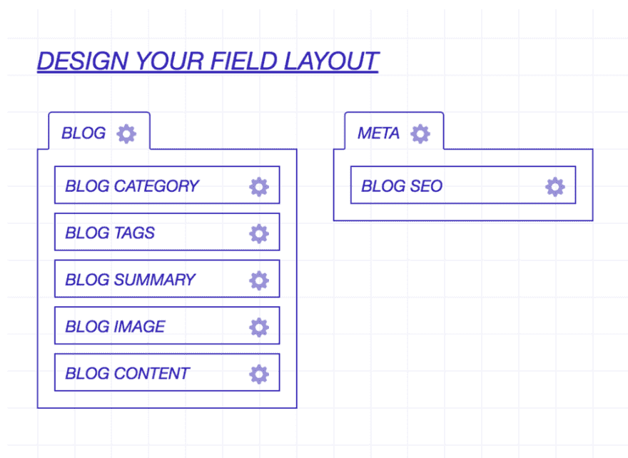
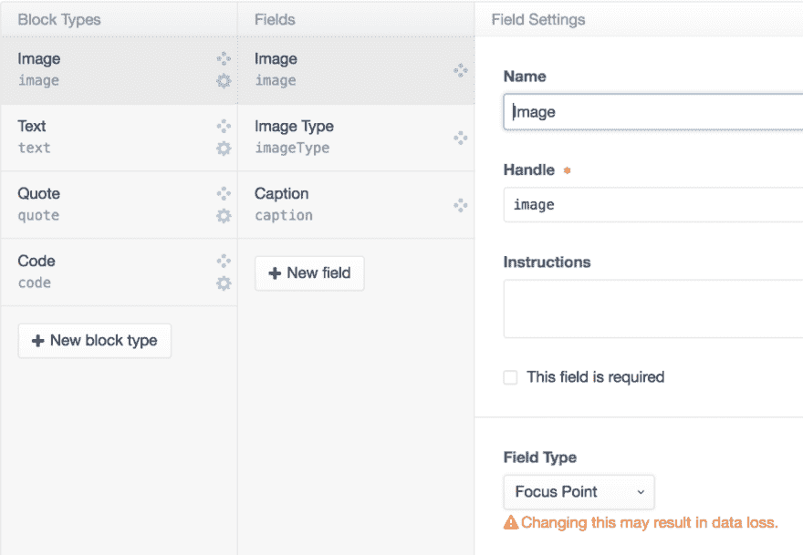
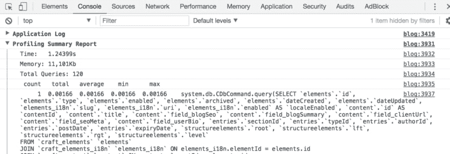
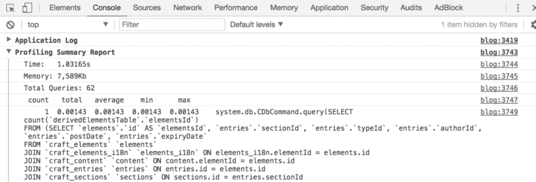

# 加快你的手工艺品 CMS 模板急切加载

> 原文：<https://dev.to/gaijinity/speed-up-your-craft-cms-templates-with-eager-loading-3dm2>

发布: <time>2017.09.30</time> /更新: <time>2019.06.03</time>

# 加速你的工艺 CMS 模板的急切加载

### 通过更有效地从数据库中获取条目，预加载元素可以加快你制作 CMS 模板的速度。

安德鲁·韦尔奇

[T2】](https://res.cloudinary.com/practicaldev/image/fetch/s--txi9WcHp--/c_limit%2Cf_auto%2Cfl_progressive%2Cq_auto%2Cw_880/https://nystudio107-ems2qegf7x6qiqq.netdna-ssl.com/img/blog/_1200x675_crop_center-center_82_line/craft-cms-eager-loading-elements.jpg)

关于 [Craft CMS](https://craftcms.com/) 的一个有价值的事情是你在设计网站的前端和后端时有很大的灵活性。

这在很大程度上是由于克拉夫特对[元素](https://craftcms.com/docs/plugins/working-with-elements)的概念。你在后端交互的大多数东西，比如条目、类别、资产、用户，甚至矩阵块都是元素。元素都是分开存储的，所以从一个元素到另一个元素的引用是一个*关系*。

因此，如果您创建一个包含资产字段的条目，资产实际上并没有存储在条目本身中；相反，条目元素只是指向资产元素。

<aside>This is a key con­cept, because under­stand­ing how Ele­ments are stored allows you to under­stand how they are loaded</aside>

狐狸

*   资产
*   类别 e
*   进入
*   全球集合
*   矩阵块
*   标签
*   用户

还有一些 plu g ins 添加的元素，比如 [Craft Com merce](https://craftcommerce.com/) 产品。

让我们以一个你可能每天都会看到的代码模式为例:

```
 
    
 
```

在这里，我们只是循环遍历`blog`部分中的所有条目，并将`blogImage`资产 url 放在一个``标签中。

为了做到这一点，Craft 必须首先获取所有的`blog`条目，因此它知道有多少个`blog`条目。然后每次通过循环访问`blogImage`资产来获得它的 URL。

但是请记住，资产元素并不实际存储在条目元素中，它是一个*指向*资产元素的关系。因此，每次通过循环，Craft 都必须进行*另一个*数据库访问来获取资产元素。只有这样，它才能输出 URL。

<aside>Data­base access­es are cost­ly, because they require build­ing a query, then access­ing the data­base, which then reads from the stor­age device</aside>

这是一个典型的问题，也就是说，随着事物数量的增加，用它们做一些事情所需的时间也在线性增加。

如果我不能跑去商店给你买些东西，这就相当于问你的签名……然后他们一回来，你就让他们再跑出去买些别的东西。然后重复几十次，甚至几百次。伙计们，不要在家里尝试这个。

[T2】](https://res.cloudinary.com/practicaldev/image/fetch/s--ej9W_wou--/c_limit%2Cf_auto%2Cfl_progressive%2Cq_auto%2Cw_880/https://nystudio107-ems2qegf7x6qiqq.netdna-ssl.com/img/blog/_1200x675_crop_center-center_82_line/woman-headache.jpg)

通常 Craft 做的这种“延迟加载”并不是一件好事，因为它不知道你需要提前访问哪些关系。如果 Craft 每次都装载所有的东西，那就像是买下了整个商店，而不考虑你真正需要的东西。

所以 Craft 只是在你访问它们的时候加载像资产一样的关系。但是如果我们知道我们需要某些东西，这也可能是无效的。

要是有一种方法可以提前告诉飞船我们需要什么就好了…

## 输入急切加载的元素

了解我们的可靠(和潜在的危险)的购物分析。如果我不能为我们想要的每样东西都付钱，而不是为了我们的签名再去一趟商店，如果我们能做一些感觉到的事情，不是很好吗？像提前准备购物清单这样的事情，可能会挽救我们的关系？

<aside>This is exact­ly what Eager Load­ing allows you to do: tell Craft ahead of time what you’re going to need</aside>

Craft CMS 在 Craft 2.6 中引入了[急进元素](https://craftcms.com/docs/templating/eager-loading-elements)的概念。杠杆加载元素，我们的例子会变成这样:

```
 
    
 
```

这里要注意两件事:

*   我们将`.with(['blogImage'])`添加到我们的`craft.entries`中，这告诉 Craft“嘿，当你获取这些条目时，我们也想要所有的`blogImage`资产元素”
*   我们将`.first()`改为`[0]`(技术术语，我们将从对象语法改为数组语法)

这里所发生的是，我们已经请求 Craft 给我们条目，并且在它获取它们的同时，也获取每个条目中的每个`blogImage`资产元素。

在底层，当您请求与其他元素相关的条目时，您得到的是一个 [Ele ment Cri te ri aMod el](https://craftcms.com/docs/templating/elementcriteriamodel) ，它告诉 Craft 如何检索该元素(在本例中是一个资产)。但是在你访问它之前，它不会真正地*检索它。这就是懒加载。*

当您请求与其他需要加载的元素相关的条目，而不是一个`ElementCriteraModel`时，Craft 获取这些关系并返回一个资产元素数组。因此，从`.first()`对象 syn tax 到`[0]`数组语法的变化。

关于你可以用于快速装载的 syn 税的详细信息，请查看工艺帮助文章[快速装载元素](https://craftcms.com/docs/templating/eager-loading-elements)。

## 真实世界的例子

我们想使用快速加载的原因是为了减少加载页面所需的 SQL 数据库查询的数量，从而提高性能。

所以让我们来看一些真实世界的例子。

[T2】](https://res.cloudinary.com/practicaldev/image/fetch/s--lzkdNvFK--/c_limit%2Cf_auto%2Cfl_progressive%2Cq_auto%2Cw_880/https://nystudio107-ems2qegf7x6qiqq.netdna-ssl.com/img/blog/_1200x675_crop_center-center_82_line/welcome-to-the-real-world.jpg)

我们将再次使用你现在正在阅读的这个网站作为我们的试验品。下面是我们的`blog`部分的字段布局:

[T2】](https://res.cloudinary.com/practicaldev/image/fetch/s--uWrpZ1Ot--/c_limit%2Cf_auto%2Cfl_progressive%2Cq_auto%2Cw_880/https://nystudio107-ems2qegf7x6qiqq.netdna-ssl.com/img/blog/_992x724_crop_center-center_100_line/blog-field-layout.png)

以下是实际的字段:

*   博客目录→目录目录*元素*
*   博客标签→标签*元素*
*   博客摘要→富文本字段
*   博客图片→资产*元素*
*   博客内容→矩阵块*元素*
*   博客 SEO → [SEO mat ic](https://github.com/nystudio107/seomatic) Meta

这是一个很简单的设置，我们只有 6 个字段，但这 6 个字段中有 4 个是元素，因此是我们希望加载的关系。博客内容字段是我们博客内容的“内容构建器”矩阵块，如在 Craft CMS 文章中的[创建内容构建器所述。](https://dev.to/gaijinity/creating-a-content-builder-in-craft-cms-29ap-temp-slug-2753628)

博客内容的矩阵块如下所示:

[T2】](https://res.cloudinary.com/practicaldev/image/fetch/s--vLX7tYbX--/c_limit%2Cf_auto%2Cfl_progressive%2Cq_auto%2Cw_880/https://nystudio107-ems2qegf7x6qiqq.netdna-ssl.com/img/blog/_1200x830_crop_center-center_100_line/content-builder-image-block.png)

只有`image`矩阵块类型有关系，因为它有一个资产元素在其中(实际上是一个[焦点](https://github.com/smcyr/Craft-FocusPoint)字段，但这是一回事)。

在解决任何性能问题之前，我们应该做的第一件事是收集数据，看看性能瓶颈在哪里。所有的计时测试都是在我们的[主虚拟机](https://dev.to/gaijinity/local-development-with-vagrant-homestead-5gb0-temp-slug-2094211)上的本地开发中完成的，打开[开发模式](https://craftcms.com/support/dev-mode)，所有的缓存都被禁用，所以我们可以看到原始结果。

因为我们是在启用了各种调试的环境中进行所有这些计时测试的，所以如果我不能在绝对意义上比在生产环境中慢的话，它将会被签署。然而，相对时间应该大致相似。

以下是对[博客索引](https://nystudio107.com/blog)页面的数据库查询:

[T2】](https://res.cloudinary.com/practicaldev/image/fetch/s--dsB-brt6--/c_limit%2Cf_auto%2Cfl_progressive%2Cq_auto%2Cw_880/https://nystudio107-ems2qegf7x6qiqq.netdna-ssl.com/img/blog/_1200x412_crop_center-center_100_line/blog-index-queries-normal.png)

哇，所以我们有`120`数据库查询来显示 9 个最近的博客条目的简单页面，以及每个条目的缩略图。另外不要只看查询次数，看时间:`1.24399s`

下面是加载我们条目的代码:

```
 

         
```

让我们应用一点我们所学的知识，并将条目中的一些元素作为关系来加载

```
 

         
```

所以我们刚刚添加了一行`with: ['blogImage', 'blogCategory', 'blogTags'],`来告诉 Craft 我们想要装载这些东西，因为我们知道我们会用到它们。

请注意，尽管`blogContent`是一个矩阵块元素，因此它可能是一个可立即加载的数据，我们并不要求它立即加载。那是因为我们在博客索引页面上根本没有使用`blogContent`，所以没有理由加载它！

我们表现如何？这是我们添加了急切加载后的计时结果:

[T2】](https://res.cloudinary.com/practicaldev/image/fetch/s--juL13n8m--/c_limit%2Cf_auto%2Cfl_progressive%2Cq_auto%2Cw_880/https://nystudio107-ems2qegf7x6qiqq.netdna-ssl.com/img/blog/_1200x409_crop_center-center_100_line/blog-index-queries-eager-loading.png)

天啊。我们几乎将查询数量减少了一半，从`120`减少到`62`个查询，从`1.24399s`减少到`1.03165s`。这是在查询数量上的`49%`节省，以及在花费的时间上的`18%`节省。

[T2](https://res.cloudinary.com/practicaldev/image/fetch/s--wYr6frTc--/c_limit%2Cf_auto%2Cfl_progressive%2Cq_auto%2Cw_880/https://nystudio107-ems2qegf7x6qiqq.netdna-ssl.com/img/blog/_1200x675_crop_center-center_82_line/in-a-vacuum-of-space.jpg)

虽然在真空中节省时间看起来没什么大不了的，但在现实世界中，如果有很多人正在访问你的网站，那么数据库就会受到影响。每个人都必须排队完成他们的数据库查询，所以任何延迟都会对网站的性能产生严重影响。

我们的博客索引页面无论如何都是轻量级的，它只加载最近的 9 个博客条目。让我们把它放大一点，让它加载页面上所有的博客条目(目前大约有 40 个):

[T2】](https://res.cloudinary.com/practicaldev/image/fetch/s--TWr3iXnv--/c_limit%2Cf_auto%2Cfl_progressive%2Cq_auto%2Cw_880/https://nystudio107-ems2qegf7x6qiqq.netdna-ssl.com/img/blog/_1200x394_crop_center-center_100_line/blog-index-queries-normal-all.png)

现在我们来看一个需要花费`3.25565s`的 whop ping `352`查询。让我们看看，如果我们加上急切的加载，会是什么样子:

[T2】](https://res.cloudinary.com/practicaldev/image/fetch/s--R2xwDv40--/c_limit%2Cf_auto%2Cfl_progressive%2Cq_auto%2Cw_880/https://nystudio107-ems2qegf7x6qiqq.netdna-ssl.com/img/blog/_1200x388_crop_center-center_100_line/blog-index-queries-eager-loading-all.png)

随着急切加载的加入，我们已经将时间从`352`查询减少到`120`查询，从`3.25565s`减少到`2.42931s`。这是在查询数量上的`76%`节省，以及在花费的时间上的`26%`节省。

我认为很明显，随着物品数量的增加，我们从急切的装载中得到的节省会越来越多。这将使我们的网站规模很好地随着客户添加内容。

## 急切的装载所有的东西！

请记住，虽然我们使用的例子是条目元素，但是任何元素都可能与其他元素相关。

[T2】](https://res.cloudinary.com/practicaldev/image/fetch/s--nRwu2ELN--/c_limit%2Cf_auto%2Cfl_progressive%2Cq_auto%2Cw_880/https://nystudio107-ems2qegf7x6qiqq.netdna-ssl.com/img/blog/_768x576_crop_center-center_100_line/eager-load-all-the-things.png)

例如，您可能已经在资产中添加了目录字段。这些也是可以被加载的相关事物，例如:

```
  
```

你甚至可以[像这样](https://craftcms.com/docs/templating/eager-loading-elements#eager-loading-nested-sets-of-elements)急切地加载嵌套元素集合:

```
 

         
```

“dot syn tax”`'blogImage.someCategory'`告诉 Craft 从条目中加载`blogImage`资产，同时也从资产中加载`someCategory`目录。

<aside>Most every­thing in Craft is an Ele­ment; you can Eager Load any Ele­ment into any Ele­ment, even nest­ed Elements!</aside>

最后，这是一种设计带有嵌套元素的后端设备的非常有效的方法，但在加载它们时，却不能提供足够的性能。

告诉克拉夫特你想要什么——不管窝有多深——你就可以走了！

## 自动注入 ed 条目的呢？

Craft 为您做的一件好事是它自动注入一个`entry`或`category`变量，用于输入或分类模板。这是一个很好的便利，因为这样你就可以访问`entry`变量，而无需解析 URL，并加载适当的条目。

唯一的缺点是因为条目已经被加载了，我们没有机会告诉 Craft 我们想要加载什么。

但是，请记住，我们的条目将为任何延迟加载的元素预加载元素 crite ri model。所以我们可以像在第一个例子中那样做一些事情来加载条目中的元素:

```
 

 
```

我们正在做的是要求 Craft 为任何类型为`image`的矩阵块加载带有字段`image`的所有`blogContent`矩阵块元素。

这当然比每次在循环中延迟加载`image`资产要好，但是它可能会成为你的模板中的一个小亮点，特别是如果你的条目中有大量的元素，你必须清楚地加载它们。

[T2】](https://res.cloudinary.com/practicaldev/image/fetch/s--QyahqPpS--/c_limit%2Cf_auto%2Cfl_progressive%2Cq_auto%2Cw_880/https://nystudio107-ems2qegf7x6qiqq.netdna-ssl.com/img/blog/_1200x675_crop_center-center_82_line/eager-beaver.jpg)

于是我在[Eager Beaver for Craft 2.6 . x](https://github.com/nystudio107/eagerbeaver)&[Eager Beaver for Craft 3 . x](https://github.com/nystudio107/craft3-eagerbeaver)写了一个小 plu g。这个插件只是让你对已经加载的`entry`(或其他)元素使用与你自己加载的元素相同的加载 syn tax。

例如，这是我在`_entry.twig`模板上为每个博客条目使用的:

```
  
```

第一个参数`eagerLoadElements()`正是我们想要快速加载的元素，第二个参数`with`与您用于常规[快速加载元素](https://craftcms.com/docs/templating/eager-loading-elements)的参数相同。

我倾向于用这种方式一次性加载所有的东西，而不是通过我的模板一点一点地加载。但无论哪种方法都行得通，用尤尔喜欢的方法。

请注意，在工艺 3 上，你可以使用`craft.app.elements.eagerLoadElements` :
做和“急切的海狸”plu in 完全一样的事情

```
  
```

第一个参数是我们希望加载元素的元素类型的类名(在本例中是一个条目)。第二个参数是一个我们渴望加载元素的数组(在这个例子中，数组中只有我们的条目)。最后，第三个参数指出了我们想要加载的元素。c.f.: [急切加载元素()](http://docs.craftcms.com/api/v3/craft-services-elements.html#method-eagerloadelements)

## element API 呢？

最近越来越常见的是，前端 JavaScript 或其他服务通过 [Ele ment API](https://github.com/craftcms/element-api/tree/v1) 访问 Craft。这正是我们在[的 Ele ment API & Vue JS](https://dev.to/gaijinity/autocomplete-search-with-the-element-api-vuejs-4ae4-temp-slug-4112251) 文章中所做的事情。

嗯，我们也可以在 Ele ment API 中使用渴望加载！我们可以这样做:

```
 <?php
namespace Craft;

return [
    'endpoints' => [
        'api/search' => [
            'elementType' => 'Entry',
            'paginate' => false,
            'criteria' => [
                'section' => 'blog',
                'with' => [
                    'blogCategory',
                    'blogTags'
                ],
                'limit' => 9, 
```

注意`with`键；看起来眼熟吗？是的，我们可以像在其他地方一样在这里装货。

重要的是不要像这样忽略对 API 端点的优化，特别是当它们变得越来越常用的时候。

## 不要太急切

在[Craft``标签深度](https://dev.to/gaijinity/the-craft-cache-tag-in-depth-207b-temp-slug-8529389)和【Craft CMS 静态页面缓存文章中，我们重点介绍了如何使用缓存来提高性能。重要的是不要使用缓存来掩盖或改变性能问题。

[T2】](https://res.cloudinary.com/practicaldev/image/fetch/s--j58TZnHX--/c_limit%2Cf_auto%2Cfl_progressive%2Cq_auto%2Cw_880/https://nystudio107-ems2qegf7x6qiqq.netdna-ssl.com/img/blog/_1200x675_crop_center-center_82_line/varnishing-over.jpg)

我们应该优化我们的模板，在之前添加一个缓存层来帮助并发性。

我们不希望我们的缓存缺失使网站陷入困境，事实上，像急切加载这样的事情很容易做到。

往前走，急切的负荷！

## 进一步阅读

如果你想获得新文章的通知，请在 Twitter 上关注[纽约时报 107](https://twitter.com/nystudio107) 。

版权所有 2020 nystudio107。由 nystudio107 设计