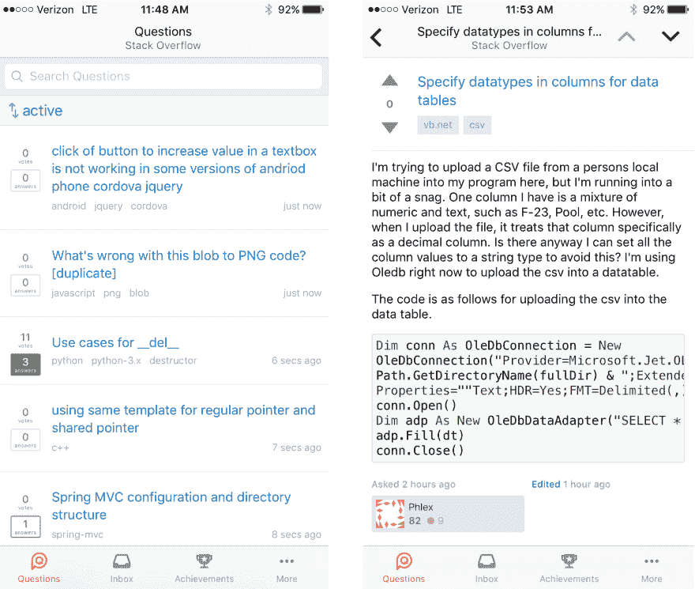

# Stack Overflow 发布了新的移动应用程序

> 原文：<https://dev.to/walker/stack-overflow-released-a-mobile-app>

Stack Overflow 今天发布了一款面向 iOS 和 Android 的移动应用:

> 堆栈溢出@ Stack OverflowQ&一款随身携带的全新堆栈溢出手机 app🍎iOS→[buff.ly/2qo5cma](https://t.co/iNuFRhJd1N)🤖安卓→……[twitter.com/i/web/status/8…](https://t.co/JwUND7EmAJ)2017 年 5 月 16 日下午 15:07

该网站的[博客关于发布](https://stackoverflow.blog/2017/05/16/stack-overflow-official-app-launches-ios-android/)的帖子指出，Stack Exchange 几年前就推出了一款包含 Stack Overflow 访问功能的应用，但这款应用专为访问该公司的旗舰网站而设计。

我的第一个冲动是质疑堆栈溢出应用的实用性，因为我相信绝大多数依赖问答网站的程序员是在个人电脑上而不是在手机上编写代码时这样做的。此外，问一个关于堆栈溢出的问题需要用户遵守一些严格的协议，并经常使用代码块、特殊字符或其他非传统文本，这些文本似乎不容易从手机上抓取。

[T2】](https://res.cloudinary.com/practicaldev/image/fetch/s--tafckiPb--/c_limit%2Cf_auto%2Cfl_progressive%2Cq_auto%2Cw_880/https://thepracticaldev.s3.amazonaws.com/i/wffe8iccuwkgj4s8b1om.PNG)

也就是说，有很多不太复杂的操作对堆栈溢出体验很重要。关于实际产品的“元”帖子很受欢迎，并且经常占据显著位置——事实上，该网站在今天早上的应用发布会上专门用了[一个帖子。此外，在一个问题的评论中有很多来回，这可以通过手机轻松完成。](https://meta.stackoverflow.com/questions/349255/stack-overflow-now-has-its-own-app-on-ios-and-android?cb=1)

同样重要的是要记住，Stack Overflow 的生命线是那些每天花费数小时来帮助社区的超级用户，而不是像我这样偶尔会问问题的人。对于这样的用户来说，移动应用可能更有用，任何扩展他们体验的东西都可能值得栈溢出。

你们觉得怎么样？