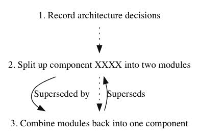

# 现在开始:架构决策记录

> 原文：<https://dev.to/kevinjalbert/start-now-architecture-decision-records-580>

*封面图片[文件柜](https://flickr.com/photos/mightymightymatze/2150298078) by [mightymightymatze](https://flickr.com/people/mightymightymatze) 获[CC BY-NC](https://creativecommons.org/licenses/by-nc/2.0/)T7】授权*

在做任何项目时，你最终都需要对手头的任务做出决定。必须做出的决定在规模和影响方面可能有所不同。通常我们是在一个团队的环境中，这些决定是在与他人协商后做出的。随着时间的推移，随着新老团队成员在项目中的更替，我们将开始质疑过去做出的一些决策。

> 为什么要这样做？
> 
> 我们没有考虑过这个选择吗？
> 
> 做出这个决定的背景是什么？

通过为您的项目开始架构决策记录(ADR ),现在就为团队和您自己节省未来的麻烦，并相应地为这些类型的问题做计划。

# 什么是 ADR？

我第一次读到 ADR 是在由[迈克尔·尼加德](http://thinkrelevance.com/team/members/michael-nygard)撰写的[记录架构决策](http://thinkrelevance.com/blog/2011/11/15/documenting-architecture-decisions)的博客文章中。ADR 是一种文档形式，记录了任何影响项目的*架构上重要的*决策。对于在软件项目环境中被认为是*架构上重要的*影响，Micheal 说:

> …影响结构、非功能特性、依赖性、接口或构建技术的因素。

Michael 的博客文章关注的是敏捷软件项目环境中的 ADR，但是我相信它可以应用于不同的领域。决策可能影响的受影响的值必须被修改以适应适当的域。例如，改变客户支持工作流可以构成决策记录，因为它显著地改变了业务流程。

我最近读到[轻量级架构决策记录](https://www.thoughtworks.com/radar/techniques/lightweight-architecture-decision-records)已经进入 2017 年 11 月版 [Thoughtworks 技术雷达](https://www.thoughtworks.com/radar)的*采用*环。他们注意到 ADRs 的轻量级方面是在他们的存储库中只有文本/降价文件和软件项目。

这里有一个 ADR 的例子(关于开始 ADR，它是相当元的):

```
# 1\. Record architecture decisions

Date: 2018-01-03

## Status

Accepted

## Context

We need to record the architectural decisions made on this project.

## Decision

We will use Architecture Decision Records, as described by Michael Nygard in this article: http://thinkrelevance.com/blog/2011/11/15/documenting-architecture-decisions

## Consequences

See Michael Nygard's article, linked above. For a lightweight ADR toolset, see Nat Pryce's _adr-tools_ at https://github.com/npryce/adr-tools. 
```

Enter fullscreen mode Exit fullscreen mode

我不想深入 ADR 的技术细节，因为这篇博文是为了让人们意识到 ADR，以及与 ADR 相关的工具/技术。通过链接到其他文章，这篇博文中有大量的补充材料。

# ADR 入门

在项目中采用 ADR 时，最重要的事情是与它们保持一致。与任何添加的过程一样，如果新的部分不在你的脑海中，你很容易忽略它们。在我们的软件项目中，我们实际上将 ADR 考虑纳入了我们的 [GitHub pull 请求模板](https://help.github.com/articles/creating-a-pull-request-template-for-your-repository/)。确保所有团队成员都同意使用 ADR 以及何时制定 ADR 是一个好主意。你不想做一个没有记录在案的决定。

## 用`adr-tools`简化 ADR

除了在 pull request 模板中包含关于 ADR 的注释之外，还有更多工具可以提供帮助。本着轻量级记录的精神，降价文件是编写 ADR 的首选方式。 [`adr-tools`命令行工具](https://github.com/npryce/adr-tools)是简化 ADR 创建的一个好方法。如果你在 MacOS 上，回到 2017 年 5 月，我让 [adr-tools 被接纳进家酿](https://github.com/Homebrew/homebrew-core/pull/13081)，所以现在你可以只`brew install adr-tools`。

在`adr-tools`中有很多配置和功能。我将通过例子来回顾一些要点。我强烈建议深入了解工具本身，以充分利用它。

### 初始化知识库

有了新的存储库，您可以从`adr init`开始，它会为您创建下面的`doc/adr/0001-record-architecture-decisions.md`文件。该 ADR 的内容实际上是上面介绍的示例。

### 创建新的 ADR

当您想要添加一个新的 ADR 时，您可以执行`adr new "Split up component XXXX into two modules"`，这将打开一个基本的 ADR 模板进行填写。它创建下一个递增的 ADR-`doc/adr/0002-split-up-component-xxxx-into-two-modules.md`。

### 维护目录

大多数软件项目都有一个`README.md`文件。使用 ADR 时，我会包含一个指向`/doc/adr/README.md`的超链接。这个文件可以使用`adr generate toc > ./docs/adr/README.md`生成，并最终创建一个漂亮的当前 ADRs 目录表:

```
# Architecture Decision Records

* [1\. Record architecture decisions](0001-record-architecture-decisions.md)
* [2\. Split up component XXXX into two modules](0002-split-up-component-xxxx-into-two-modules.md) 
```

Enter fullscreen mode Exit fullscreen mode

### 取代现有 ADR

最终，你会做出一个与另一个 ADR 有某种关联的决定。一个很好的例子是一个新的 ADR 取代了一个旧的决定。首先，让我们制定一个新的 ADR `adr new -s 2 "Combine modules back into one component"`，最终取代我们之前的决定。这实际上会通过添加以下内容来修改 ADR 的*状态*部分:

```
# In 0002-split-up-component-xxxx-into-two-modules.md
Superseded by [3\. Combine modules back into one component](0003-combine-modules-back-into-one-component.md)

# In 0003-combine-modules-back-into-one-component.md
Superseds [2\. Split up component XXXX into two modules](0002-split-up-component-xxxx-into-two-modules.md) 
```

Enter fullscreen mode Exit fullscreen mode

了解 ADR 之间的关系非常有用。在我们的例子中，我们指出一个 ADR 取代另一个 ADR。可以使用`adr link`来专门定制链接，以使用不同的措辞，因此您可以具体说明 ADR 是如何关联的。最终，链接提供了围绕链接决策的附加上下文。

### 可视化 ADR

有了将药品不良反应联系在一起的能力，现在追踪特定药品不良反应的故事成为可能。通过下面的链接，你可以了解架构如何随时间演变的*大图*。一次浏览一个文件可能会很困难，所以对我们来说幸运的是，`adr-tools`能够产生 ADR 的可视化效果。

使用`adr generate graph | dot -Tjpg > graph.jpg`,我们可以生成以下图像(使用我们到目前为止的 ADR 示例):

[T2】](https://res.cloudinary.com/practicaldev/image/fetch/s--_JwDY1mN--/c_limit%2Cf_auto%2Cfl_progressive%2Cq_auto%2Cw_880/https://kevinjalbert.cimg/2018-01-03-start-now-architecture-decision-records/graph.jpg)

在此图中可以很明显地看到 ADR 链接。我个人还没有看到它的伸缩性有多好，尽管它仍然是一个值得注意的好技术。

单独使用`adr generate graph`将返回一个 [graphviz](https://graphviz.gitlab.io/) 输出。使用 [gravizo](https://github.com/TLmaK0/gravizo) 服务将它附加到`/doc/adr/README.md`上会很有趣。这样，ADR 可视化始终触手可及，并且在添加新 ADR 时可以成为正常流程的一部分。我没有亲自做过这种方法，但它看起来很有趣。

## 搜索 ADR

因为我们只是处理降价文件，所以搜索 ADR 变得很简单。文件名就是标题，所以即使只看一眼，也很容易缩小你要找的内容。您甚至可以使用`adr list`来列出所有的 ADR。结合其他命令行工具(如 grep)，您可以过滤列表。我个人喜欢使用 [`fzf`命令行工具](https://github.com/junegunn/fzf)过滤列表，并在 vim: `adr list | fzf | xargs vim`中打开。

如果你想更深入地挖掘，你可以搜索文件的内容来寻找你想要的。例如，`grep -l 'tool' ./doc/adr/*.md | fzf | xargs vim`会查找任何包含*工具*的文件，并显示`fzf`界面进行进一步过滤。

最后，你可以创造性地搜索 ADRs 这里面有很大的灵活性。我通常使用 [`tag`命令行工具](https://github.com/aykamko/tag)在文件中搜索。

## 定制 ADR

在这一点上，你可能会想*“ADRs 听起来不错，但它并没有完全满足我的所有需求”*。ADRs 的概念在本质上是非常通用和灵活的，因此如果您有特定的需求或要求，您可以对其进行定制。在我们的例子中，我们一直使用`adr-tools`，它有一个基础模板。您可以更改它，或者使用不同的模板。例如，浏览[其他模板](https://github.com/joelparkerhenderson/architecture_decision_record)以找到符合您需求的模板可能会很有用。

这篇文章一直在谈论使用降价文件，但你的 ADR 可以保存在任何其他媒体(如 JIRA，谷歌文档等)。我认为应该使用最适合你的团队的方法。在大多数情况下，在一个软件项目中，markdown 方法很好，因为它是非常轻量级的，所有东西都包含在源目录中。

# TL；速度三角形定位法(dead reckoning)

*   ADR 是记录架构决策的好方法
*   ADR 提供了架构决策的背景
*   ADR 可以是轻量级的降价文件，位于项目的存储库中
*   ADR 可搜索和定制

> 启动 ADRs 的最佳时间是在项目开始时；第二好的时间就是现在