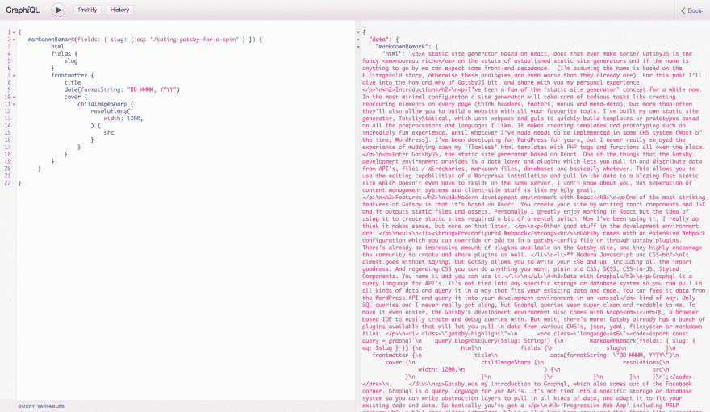

# 带盖茨比去兜风

> 原文：<https://dev.to/ardennl/taking-gatsby-for-a-spin-4je>

一个基于 React 的静态站点生成器，这有意义吗？ [GatsbyJS](https://gatsbyjs.org/) 试图用一个超现代的、功能齐全的、 *jamstacked* 开发工具来回答这个问题，你现在就可以试用！在这篇文章中，我会给你一个快速的介绍和概述我自己对盖茨比的看法。

## 简介:盖茨比

自从我开始关注[盖茨比的推特账户](https://twitter.com/gatsbyjs)，我就想参与其中。这并不是说我真的*需要*一个新工具来创建静态网站，只是每个发关于 Gatsby 的推特的开发者似乎都认为这是网络上最令人兴奋的事情，因为他们知道他们可以结合`marquee`和`blink`标签。叫它 FOMO 吧。此外，这些开发者展示的网站都是如此的快速和简洁，我不得不去看看到底是怎么回事。

让我们跳进来。以下是《盖茨比》的一些重要特征:

### 做出反应

GatsbyJS 基于 React，这意味着你几乎可以用 JavaScript / JSX 编写任何东西。这并不意味着尽管你需要大量的 React 经验来开始学习 Gatsby,[教程](https://www.gatsbyjs.org/tutorial/)是一个很好的资源，并且会在这个过程中教会你一些 React。如果你已经喜欢 React，你肯定会喜欢用 Gatsby 创建静态站点。由于您的最终 JavaScript 包包含 React 库，您可以包含 React 组件，就像它是一个常规的 React 应用程序一样。

### Graphql

盖茨比是我第一次接触 GraphQL，我已经爱上了它。GraphQL 是 Gatsby 使用的一种查询语言，让您可以连接到各种 API。有了它作为一个抽象层，你就可以把你能想到的所有数据拉进来，并在你的应用中加以利用。Gatsby 带有插件，可以从几个 API、CMS 系统和本地文件中获取数据。使用 GraphQL，您能够以一种清晰易读的方式从所有这些来源查询数据。数据可以立即在您的组件中获得，这真是太酷了。此外，它还附带了一个基于浏览器的 IDE，名为 Graph*i*QL，与您的开发环境一起启动。您可以使用它来查看哪些查询可用，测试它们，并查看这些查询返回什么数据。

[T2】](https://res.cloudinary.com/practicaldev/image/fetch/s--Y1YH-T7O--/c_limit%2Cf_auto%2Cfl_progressive%2Cq_auto%2Cw_880/https://thepracticaldev.s3.amazonaws.com/i/tkf88yvqh330s2wewsh7.png)

### 进步的网络应用和 PRPL 模式(如火如荼)

着眼于未来，Gatsby 已经实现了许多谷歌所谓的' **P** ush、 **R** ender **P** re-Cache 和 **L** azy-load 模式(PRPL，我不确定这个缩写是否会流行)。Gatsby 负责预加载和代码分割，这使得浏览 Gatsby 站点成为一种非常快速的体验。PRPL+Gatsby 离线插件意味着你的网站将被视为 PWA，在任何设备上都能以惊人的速度加载，在 Google lighthouse 中得分也很高。阅读更多关于 PRPL 的信息。

### Webpack 和插件

不用 webpack 能说 React 吗？没有 webpack，我几乎不能说`hello world`了，尽管我仍然不确定如何一开始就正确地配置它。Gatsby 附带了一个广泛的 webpack 配置，如果你不想接触，你真的不需要接触。如果您这样做了，您可以用插件或在`gatsby-node`文件中修改并添加到默认配置中。已经有很多插件了，所以很可能任何 webpack 的调整都是一个插件安装。有了这么多好的例子，编写自己的插件通常也很简单。

### 社区

尽管盖茨比很新，但使用它的开发人员似乎真的很投入。盖茨比博客上有不少[文章。人们似乎很乐意在 Twitter 上回答你的盖茨比问题，在 Github 上你可以问任何问题，而不会被拒绝。每个人都被鼓励以插件和拉请求的形式做出贡献，这给了我信心，我们将在未来看到很多的添加和改进。](https://dev.to/blog/)

## 关于盖茨比的一些想法

很能说明问题的是[大部分用 Gatsby](https://github.com/gatsbyjs/gatsby#showcase) 做的网站都是开发者作品集和文档网站。这表明盖茨比仍然处于早期采用阶段。但是看到已经有了盖茨比的网站，我相信未来是光明的。我和盖茨比一起创建了一个自己的网站([点击这里查看 github repo】)，最终它不超过一个周末就完成了，包括做](https://github.com/aderaaij/ardennl-gatsby)[教程](https://dev.to/tutorial/)和试验[盖茨比启动器](https://dev.to/docs/gatsby-starters/)。

我和盖茨比一起工作时的一些其他想法:

### 真快

盖茨比绝对是速度型的。整个 PRPL 模式似乎创造了奇迹。我试着在谷歌 Chrome 浏览器中浏览了用 Gatsby 创建的网站列表，这些网站的性能仍然令人印象深刻。

### GraphQL 很神奇

来自任何地方的静态输出数据。这是一种圣杯，不是吗？现在，我在这个网站上使用的数据来自 markdown 文件，但我已经看到使用 GraphQL 切换到另一个内容源将是轻而易举的事情。这些查询清晰易读，Graph*i*QL IDE 是完美的助手。在某种程度上，GraphQL 允许您将前端从数据源类型中分离出来。

```
export const query = graphql`
    query BlogPostQuery($slug: String!) {
        markdownRemark(fields: { slug: { eq: $slug } }) {
            html
            fields {
                slug
            }
            frontmatter {
                title
                date(formatString: "DD MMMM, YYYY")
                cover {
                    childImageSharp {
                        resolutions(
                            width: 1200,
                        ) {
                            src
                        }
                    }
                }
            }
        }
    }
`; 
```

Enter fullscreen mode Exit fullscreen mode

### 部署和内容管理可以这么好！

在阅读了盖茨比网站上的一些文章后，我决定在 [Netlify](https://www.netlify.com/) 的免费计划上建立我的盖茨比主机(顺便问一下，这真是慷慨得可笑，有什么条件吗？)这是一次有趣的经历。Netlify 已经支持 Gatsby 开箱即用，这意味着您只需点击几下鼠标就可以使用`git`配置自动部署。每次我推给 master，网站都会被 Netlify 重建和上传。*魔法*。还可以基于您的分支来配置临时服务器，因此您可以在合并到主服务器和部署之前测试您的更改。

但是等等，还有更多。如果您使用 [Contentful](https://www.contentful.com/) 作为内容管理系统，使用 Netlify 作为您的主机，您可以很容易地创建一个 Webhook 来触发每次内容更新时的重建！我自己还没有尝试过，但是[这个由](https://www.halfelectronic.com/post/setting-up-gatsby-js-contentful-and-netlify/) [Fernando Poumián](https://twitter.com/fernandopoumian) 发布的是一个很好的资源让你开始。

增量构建还不可能，所以每次更新都意味着一次完整的重建。我敢肯定，对于较小的网站来说，这没有什么可担心的，但是对于经常更新的较大的网站来说，这可能是个问题。幸运的是，增量构建将成为 Gatsby[‘宜早不宜迟’](https://twitter.com/gatsbyjs/status/937053640652611584)的一部分，它将解决这个问题。

### 盖茨比图片插件很酷

在图像加载之前，您看到 SVG 跟踪的图像了吗？如果没有，你可能在 Safari 上，而我还没有实现`intersection observer` polyfill。但在其他浏览器中，你用 [gatsby image](https://using-gatsby-image.gatsbyjs.org/) 组件添加的图像将默认包含模糊或描摹的 svg 占位符效果。它还有`srcset`和`webp`。它可以做一些工作，尽管它在你的图像周围添加了一些包装器，如果不使用`!important`很难重新配置。哦，注意，它默认使用`object-fit`，IE11 和更老的浏览器不支持。当然，你不一定要使用这个插件，每一个添加/修改都可以在 Github 上讨论。

### 关注输出

首先，我承认我还没有验证过我自己网站的 HTML，但是我确信这需要一些工作。我觉得 JSX 和使用 React 组件的结合会让 HTML 输出变得非常快。结合使用 Gatsby 插件来操纵您的输出，我认为关注生成的代码是非常重要的。我知道盖茨比很大程度上是关于现代网络的，但这就是为什么我们有了*渐进增强*。

### 当你最喜欢的工具是锤子…

在 React 里做什么都是福也是祸。你可以用 JavaScript 解决所有问题，但这并不意味着你必须用 JavaScript 解决所有问题。有时，我发现自己正在编写 JavaScript，以至于我倾向于用它来解决问题，而这些问题本可以用 CSS 中的`hover`选择器来解决。

### JavaScript 里的 CSS，我能挖。

你可以用任何东西来设计你的 Gatsby 站点；CSS、SCSS、样式组件、CSS-in-JS，应有尽有。我想让整个“在你的 JavaScript 中使用 CSS”有一个旋转，并选择了一个名为 [emotion-js](https://github.com/emotion-js/emotion) 的库，因为我喜欢它页面上的 Bowie 表情符号。试用了几天后，我不得不承认我真的很喜欢它。在同一个地方创建和设计组件是一种很好的工作方式。即使没有使用 React state 切换 CSS 值的聪明之处，它也是一个很好的工具。考虑到自动完成和语法突出显示，还有一些工作要做，但是当使用这样的组件时，它很有意义。

## 总之

我喜欢盖茨比，我喜欢它所宣扬的思想。正如承诺的那样，与盖茨比一起创建的网站正在飞速发展。开发环境是一个大聚会，GraphQL 让我重新思考我的生活。我真的很期待与 Gatsby 一起开发更多的网站，我希望找到一个机会，用一个可以获取 WP 数据的 Gatsby 网站来取代传统的 WordPress 安装。到时候，我会回来报告的。

如果你对这篇文章有任何疑问，请不要犹豫，通过 Twitter 或 T2 邮件联系我。感谢阅读！