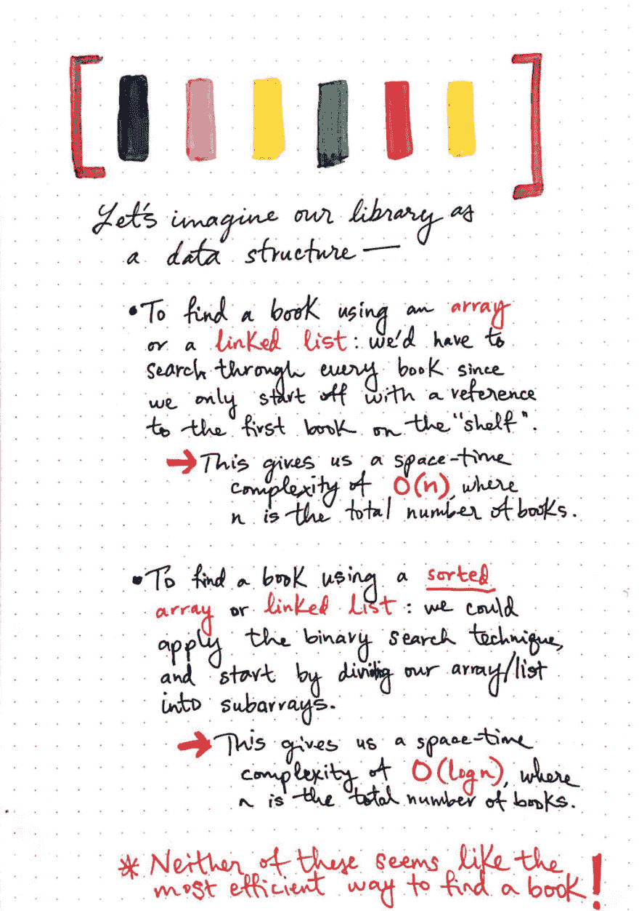
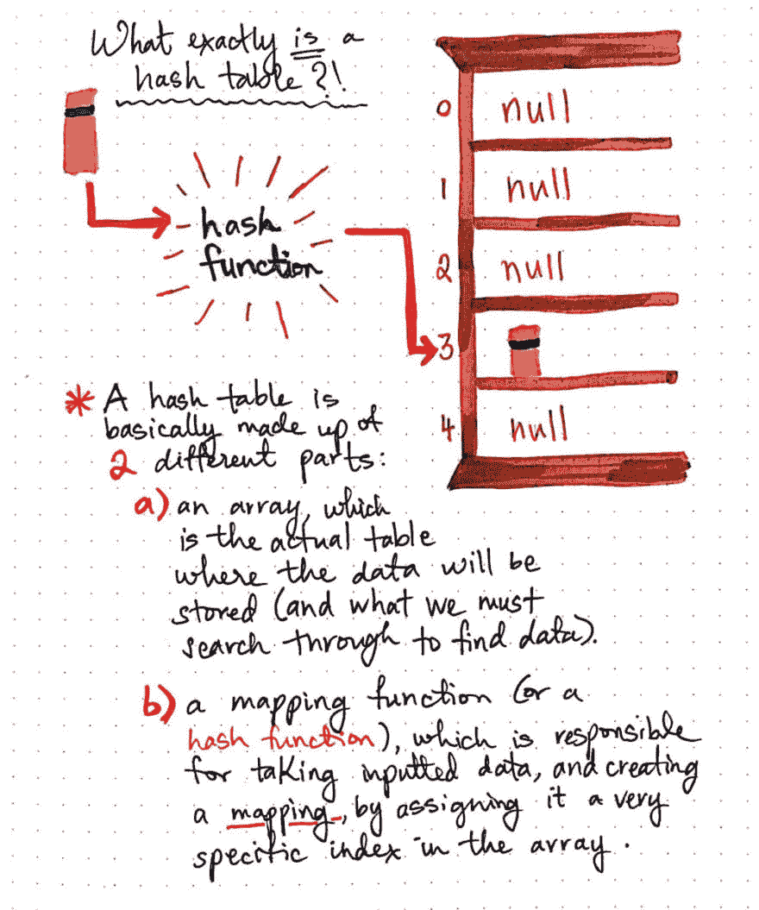
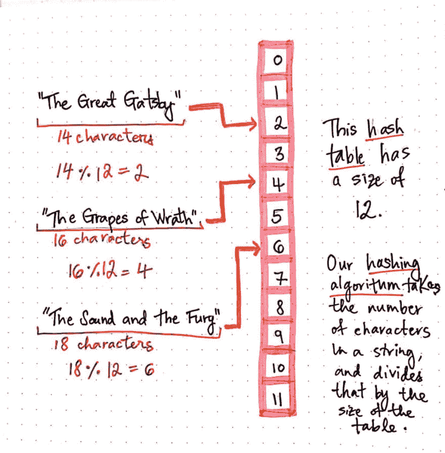
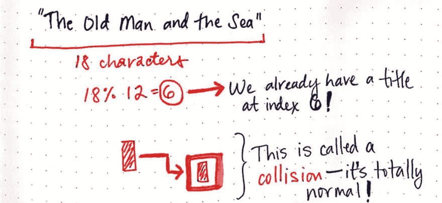
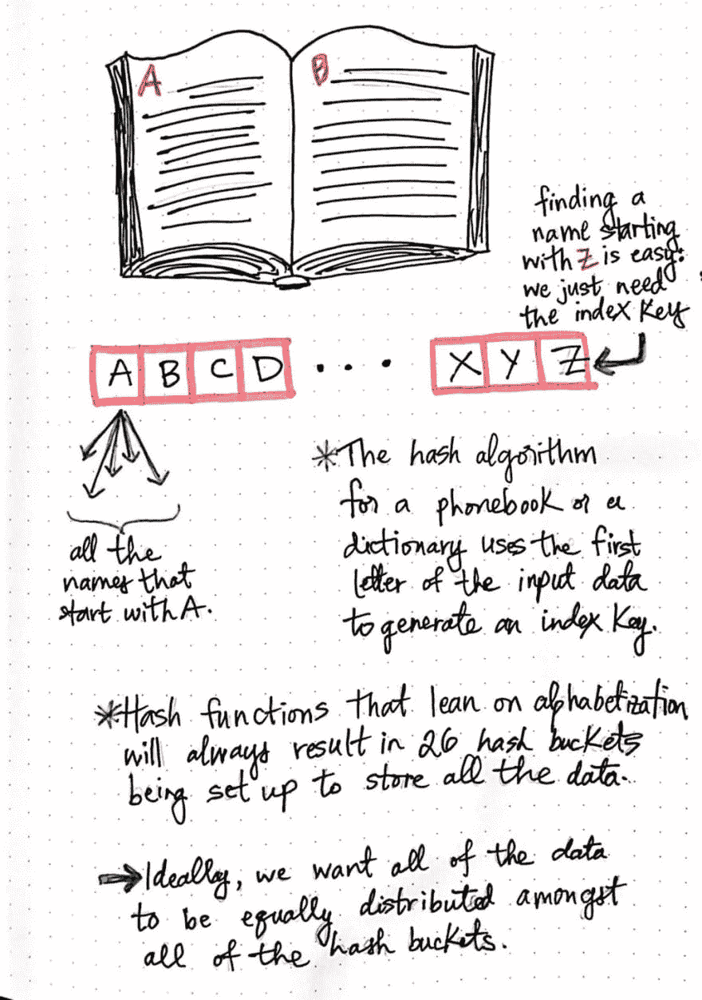
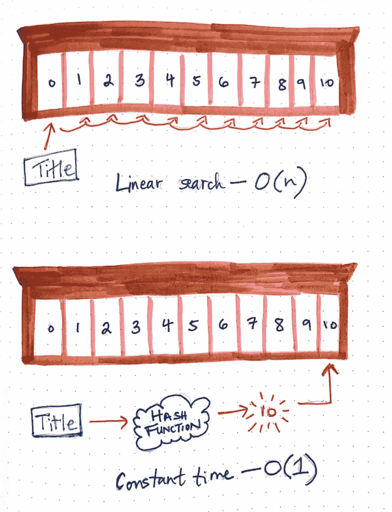
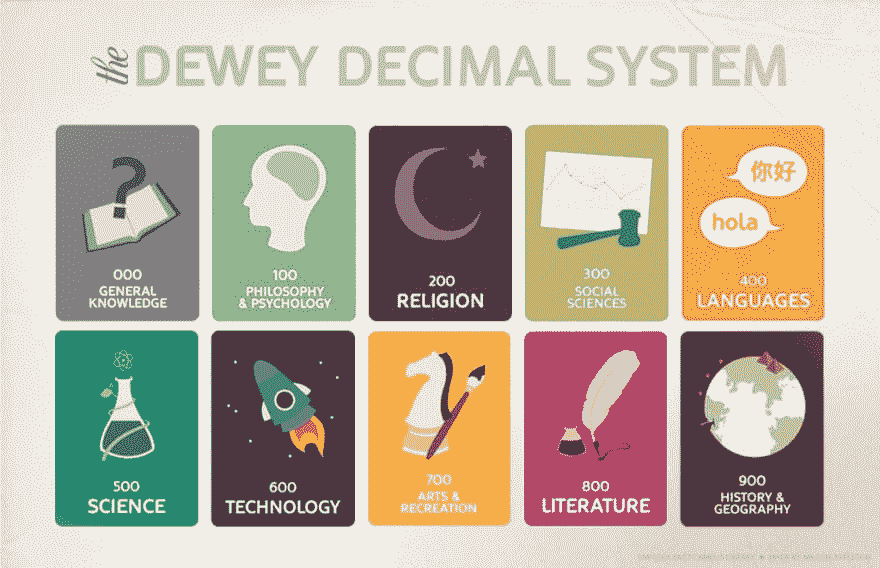

# 从货架上取下散列表

> 原文：<https://dev.to/vaidehijoshi/taking-hash-tables-off-the-shelf>

真相时间:每周学习理论性的东西会变得有点单调。尽管了解疯狂背后的方法很重要，但理解我们为什么要走上疯狂之路也同样重要。换句话说，我们在这里一起学习的理论的第*点*是什么？

有时候，这可能有点难以解释。如果你还不知道大 O 符号，就很难理解广度优先搜索。大 O 符号对你来说没有任何意义，除非你在一个算法的环境中看到过它的作用。

但是偶尔，我们会幸运地发现最完美的比喻。隐喻是通过类比学习的好方法，并且它们在解释复杂的概念时很有用。我花了几天时间试图理解一个我最近才接触到的数据结构，只有在这个比喻的背景下，我才真正开始掌握它。

那么，让我们看看我们是否能一起打开包装。

### 书本上的书本上的书本

如果你像我一样最近搬到了全国各地，你可能对试图打开所有东西的恐怖记忆犹新。或者，也许你已经把它全部屏蔽掉了，在这种情况下:干得好！上周，我打开所有书籍的包装，发现自己把它们随意地放在书架上，没有任何顺序或逻辑。

<figure>[](https://res.cloudinary.com/practicaldev/image/fetch/s--6LCHtS9V--/c_limit%2Cf_auto%2Cfl_progressive%2Cq_auto%2Cw_880/https://cdn-images-1.medium.com/max/1024/1%2Ay9Fo5s3IMCnq1BsQtxLwJg.jpeg) 

<figcaption>我们可以把我们的藏书想象成一个数据集。</figcaption>

</figure>

当然，我有很多书，但是我没有那么多书，所以很难找到一本。这让我想到了图书馆和他们庞大的藏书，以及他们实际上应该有多有条理。

想象一下，如果世界上所有的图书馆都不整理或分类他们的书？或者，想象一下，如果它们按照超级复杂的东西来分类，比如按照 ISBN 号？

我们都变得更好，因为图书馆是如此有条不紊地组织。但是他们是怎么想出来的呢？事实上，*任何人*如何想出一个好办法在大量的东西中整理和找到一个项目？

但愿你的脑海里突然灵光一现，你和我想的一样:*这是一个计算机科学问题！*

如果我们把这个问题抽象成程序性的术语，我们可以把我们的藏书想象成我们的数据集。你可以想象，如果我们根本不整理我们的书，很有可能在找到我们要找的书之前，我们不得不翻遍书架上的每一本书。如果我们按照 ISBN 号或出版年份来组织我们的书籍，我们仍然需要浏览它们的子集，因为从书架上的所有项目中找到一个项目仍然有点困难。

在这一点上，我们已经熟悉了这么多不同的数据结构——也许我们可以使用其中的一种来处理我们的数据集？让我们试试它们的大小。

<figure>[](https://res.cloudinary.com/practicaldev/image/fetch/s--emL_yOsL--/c_limit%2Cf_auto%2Cfl_progressive%2Cq_auto%2Cw_880/https://cdn-images-1.medium.com/max/1024/1%2AsKUDs2I33jQqTHeRM8X5mQ.jpeg) 

<figcaption>把一个库想象成一个数据结构</figcaption>

</figure>

使用数组或者链表怎么样？

嗯，从*保存*我们所有的数据来看，这可能会很好。然而，这真的解决了我们在数据集中搜索的问题吗？让我们考虑一下。为了使用链表或数组找到一本书，在最坏的情况下，我们仍然必须通过*搜索每个节点*，我们要寻找的数据在最后一个节点中。这基本上意味着我们搜索所有书籍所花费的时间与我们有多少本书直接相关，即*线性时间*或 O(n)。

如果我们对链表进行排序，而不是随机添加数据，会怎么样？这可能会更有帮助，因为我们可以在链表上实现*二分搜索法*。请记住，我们可以将二分搜索法应用于任何分类数据集合[，这就是我们在这种情况下所拥有的。我们可以将我们的大型排序链表或数组分割成更小的子数组，并缩小我们要找的书的范围。然而，即使在最好的情况下，二分搜索法也只能让我们达到对数时间，即 O(log n)。当然，这比线性时间更好，但是…这些看起来都不是搜索一本书的最有效的方法。](https://dev.to/vaidehijoshi/leaf-it-up-to-binary-trees)

如果有一种方法可以在不搜索所有内容的情况下，立即查找一本书，那就太棒了。当然，一定有更好的方法来做这件事。

### 映射让我们的生活更轻松

好吧，好吧，我们今天只是学习一个很酷的数据结构——不是发明一个新的！我想我应该最终让你知道这个秘密:有一种更好的方式来搜索我们的数据集。正如你可能已经猜到的，它被称为**散列表**。

哈希表由两个不同的部分组成:**一个数组**，你已经熟悉了，和**一个哈希函数**，这可能是一个新概念！那么，为什么是这两部分呢？嗯，数组实际上保存我们的数据，哈希函数或多或少是我们决定*我们的数据将存放在哪里的方式——以及当时间到来时，我们如何将它从数组中取出！*

<figure>[](https://res.cloudinary.com/practicaldev/image/fetch/s--66y27Xxu--/c_limit%2Cf_auto%2Cfl_progressive%2Cq_auto%2Cw_880/https://cdn-images-1.medium.com/max/1024/1%2AVpyF36EOjuhqnwVHMMpOVQ.jpeg) 

<figcaption>到底什么是哈希表？</figcaption>

</figure>

在上面的例子中，我们将书架重组为一个散列表！我们的书架一开始是空的，为了向其中添加书籍(我们的数据)，我们将书籍传递给一个哈希函数，该函数告诉我们应该将它放在哪个书架上。

哈希表有趣的原因有很多，但让它们对我们的目的如此有效的是它们创建了一个**映射**，这是两组数据之间的关系。哈希表由一组对组成:一个键和一个值，通常被称为 *(k，v)* 。这里的想法是，如果你有一组数据中的关键字，你可以在另一组数据中找到与之对应的值。

> 在哈希表的情况下，是哈希函数创建映射。因为我们使用的是数组，所以键是数组的索引，值是位于该索引的数据。哈希函数的工作是接受一个条目作为输入，计算并返回该条目在哈希表中的位置的键。

好的:如果我们真的要深入这个话题，我们需要一个例子。让我们把之前的书架抽象出来，进一步简化。在下面的例子中，我们看到了书名的散列表。哈希表有两个可预测的部分:一个数组和一个哈希函数。

<figure>[](https://res.cloudinary.com/practicaldev/image/fetch/s---nwNkost--/c_limit%2Cf_auto%2Cfl_progressive%2Cq_auto%2Cw_880/https://cdn-images-1.medium.com/max/1024/1%2A88wdGX8QKZDrGPEFkFuYrw.jpeg) 

<figcaption>一个大小为 12 的哈希表</figcaption>

</figure>

我们的哈希表大小为 12，这最终意味着每本书都需要存储在这 12 个槽内的某个地方，也称为 T2 哈希桶。

等等:哈希函数是如何决定把这些书放在哪里的！？如果您仔细观察，您会注意到我们正在使用模运算符%，您可能已经见过了。模运算符返回一个数被另一个数除时的余数(或者，如果该数可以被整除，则返回 0)。那么我们的哈希算法在做什么呢？可能你已经搞清楚这里的模式了！

我们的 hash 函数获取标题中的字符数，将它们相加，然后用表的大小除以总和。例如，“了不起的盖茨比”中有 14 个字符(忽略空格)，当除以表的大小 12 时，余数为 2。因此，我们的哈希函数将确定“了不起的盖茨比”应该位于索引为 2 的哈希桶中。

我们可以写出散列函数在代码中的样子:

```
function bookHashing(bookTitle, hashTableSize) {
  // Remove any spaces from book title.
  var strippedBookTitle = bookTitle.replace(/\s/g, '')

// Divide the length of the title by the hash table size.
  // Return the remainder.
  return strippedBookTitle.length % hashTableSize;
}

bookHashing("The Grapes of Wrath", 12);
// 4

bookHashing("The Sound and the Fury", 12);
// 6 
```

好吧，这很简单！事实上，这几乎太简单了。我觉得现在要出问题了。让我们继续下去，看看我们的散列函数能走多远。我们再试试另一本书的书名:《老人与海》:

<figure>[](https://res.cloudinary.com/practicaldev/image/fetch/s--B9kMPORX--/c_limit%2Cf_auto%2Cfl_progressive%2Cq_auto%2Cw_880/https://cdn-images-1.medium.com/max/1024/1%2AJsEXAcTSgOi6DSRxTA9uzQ.jpeg) 

<figcaption>当两个元素应该被插入到数组中的同一个位置时，就会发生冲突。</figcaption>

</figure>

哦，不。我有一种感觉，这是要发生的！

当我们将“老人与海”输入我们的哈希函数时，它返回 6。这是不好的，因为我们已经有一个“声音和愤怒”在哈希桶 6！那个*就是*不好吧？

事实证明，这一点也不坏。其实挺正常的。事实上，这很正常，这种现象甚至有一个名字:一个**冲突**，当两个元素应该被插入到一个数组中完全相同的位置——换句话说，在同一个散列桶中——时，就会发生这种情况。

关于我们的散列函数，这告诉了我们什么？

> 首先，我们可以确定没有一个哈希函数会总是为每个给出它的条目返回一个惟一的哈希桶值。事实上，散列函数总是将多个元素输入到同一个输出(散列桶)，因为数据集的大小通常会大于哈希表的大小。

但是为什么会这样呢？

### 超酷常数时间

如果我们在实际环境中更多地考虑哈希表，就会很清楚地看到，我们几乎*总是*在每个哈希桶中有多个元素。

哈希表应用于现实问题的一个很好的例子是电话簿。电话簿是海量的，包含住在某个地区的每个人的所有数据和联系信息。

它是如何组织的？当然是姓。字母表中的每个字母都有很多人姓这个姓，这意味着我们在每个字母的哈希桶中会有很多数据。

<figure>[](https://res.cloudinary.com/practicaldev/image/fetch/s--o4-0vsXe--/c_limit%2Cf_auto%2Cfl_progressive%2Cq_auto%2Cw_880/https://cdn-images-1.medium.com/max/1024/1%2AxoBQCFLQ_iIIbzTdH9endQ.jpeg) 

<figcaption>依赖字母顺序的哈希函数总是产生 26 个哈希桶。</figcaption>

</figure>

电话簿或字典的散列函数总是将任何输入的数据分组到 26 个桶中的一个——字母表中的每个字母一个桶。这最终变得相当有趣，因为这实际上意味着我们永远不会有空的哈希桶(或者在这种情况下，字母表中的一个字母)。事实上，我们将有*接近*的姓氏平均分布，以字母表中的每个字母开始。

事实上，这是一个好的哈希算法的重要组成部分:*在所有可能的哈希桶中平均分配数据。*但现在请保持这种想法——我们将在下周深入探讨！

现在，让我们来看看哈希表的另一个很酷的部分:它们的效率！无论我们处理的是电话簿、字典还是图书馆，方法都是一样的:我们的散列函数将告诉我们*将数据放在哪里*，以及*将数据从哪里*取出！

<figure>[](https://res.cloudinary.com/practicaldev/image/fetch/s--PVucQ7Se--/c_limit%2Cf_auto%2Cfl_progressive%2Cq_auto%2Cw_880/https://cdn-images-1.medium.com/max/1024/1%2AsuYwtGcnm7ZlclRlshz7mg.jpeg) 

<figcaption>哈希表利用常量时间搜索，这就是它们如此强大的原因。</figcaption>

</figure>

如果不使用哈希表，我们必须搜索整个数据集，可能从数组或链表中的第一个元素开始。如果我们的商品在清单的最后———那么，祝你好运！我们可能在寻找一个*长的*时间。事实上，有多少时间就有多少元素！这就是使用链表、栈、队列、数组的主要问题所在:在它们中搜索某些东西总是以时间上的线性或者 O(n)结束。

与哈希表相比，在两者之间做出选择似乎很容易，因为我们已经了解了哈希函数是如何工作的！如果我们要寻找一个元素，我们只需要将该元素传递给 hash 函数，它会准确地告诉我们数组中的哪个索引——也就是说，要在哪个 *hash bucket* 中查找。这意味着，即使我们要找的项在哈希表数组的最末端，我们找到它所花的时间也和找到数组中的第一个元素一样多！

不需要遍历一个庞大的列表，或者浏览图书馆的所有书架:我们可以在恒定的时间或 O(1)内快速轻松地查找我们的数据。在哈希表中插入或删除一个条目也只需要恒定的时间，因为我们总是要依靠我们的哈希函数来确定在哪里添加或删除一些东西！

搜索时间不变的算法和数据结构非常强大。更重要的是，它们就在我们周围。事实上，你甚至可能不会注意到它们。让一切回到我们开始的地方:想想图书馆是如何组织事物的！世界各地的图书馆都使用[杜威十进制分类系统](https://en.wikipedia.org/wiki/Dewey_Decimal_Classification)，它实际上只是一个有 10 个桶的哈希表(当然，还有一个复杂的哈希函数，我现在还不太明白)。

<figure>[](https://res.cloudinary.com/practicaldev/image/fetch/s--ea7qXK1V--/c_limit%2Cf_auto%2Cfl_progressive%2Cq_auto%2Cw_880/https://cdn-images-1.medium.com/max/1024/1%2A01sNV8LRu7TBZCDfUTOr-A.jpeg)

<figcaption>*玛吉·阿普尔顿，**[【www.teachertube.com】](http://www.teachertube.com)*</figcaption>

</figure>

下周，我们将深入探讨哈希函数及其冲突，并发现如何解决这些冲突，这些冲突如此普遍，以至于有*完整的*T2 算法来处理它们。在那之前，试着忍住整理书架的冲动吧！

### 资源

我很难缩小与你分享的资源范围，因为它们实在太多了！这是个不错的问题。如果你想了解更多关于散列表和它们是如何工作的，可以查看这些链接。

1.  [哈希表基础知识](https://www.hackerearth.com/practice/data-structures/hash-tables/basics-of-hash-tables/tutorial/)，Prateek Garg
2.  [数据结构和算法——哈希表](https://www.tutorialspoint.com/data_structures_algorithms/hash_data_structure.htm)，教程要点
3.  [哈希表](https://www.cs.auckland.ac.nz/software/AlgAnim/hash_tables.html)，约翰·莫里斯教授
4.  [CS210 实验室:哈希表](http://www.cs.uregina.ca/Links/class-info/210/Hash/)，里贾纳大学，计算机科学系
5.  [哈希表](http://www.sparknotes.com/cs/searching/hashtables/section1.rhtml)，SparkNotes
6.  [哈希表介绍](http://cs.boisestate.edu/~scutchin/cs321_spring2015/lectures/0305_hashtables.pdf) s，Steve Cutchin 教授

* * *

*本帖最初发表于[medium.com](https://medium.com/basecs/taking-hash-tables-off-the-shelf-139cbf4752f0)T3】*