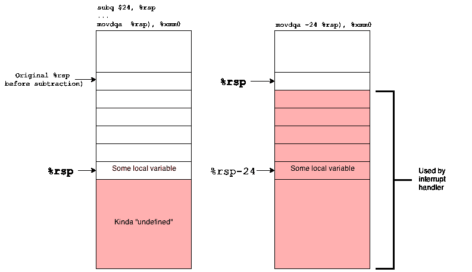

# 关于数据损坏、堆栈和红区的故事

> 原文：<https://dev.to/dzeban/tale-about-data-corruption-stack-and-red-zone-4bmb>

这是一个美好而平静的工作日，突然一个狂野的同事出现在我的办公桌前，问道:

> 嘿，嗯，你能帮我做些奇怪的事情吗？
> 
> 当然，怎么了？
> 
> –我的数据遭到破坏，而且这种情况正在以一种非常疯狂的方式发生。

如果您不知道，数据/内存损坏是您的程序中可能发生的最令人讨厌和最可怕的错误。尤其是当您是存储开发人员时。

情况是这样的。我们有 RAID 计算算法。没什么特别的——只是一堆指向缓冲区的函数，对缓冲区做一些数学运算，然后返回它。最初，计算算法是在用户空间编写的，以便进行简单的调试、正确性证明和分析，然后移植到内核空间。这就是问题开始的地方。

首先，当从 [kbuild](http://www.linuxjournal.com/content/kbuild-linux-kernel-build-system) 构建时，gcc 正在崩溃 <sup id="fnref:gcc">[1](#fn:gcc)</sup> 吃掉所有可用的内存。但是考虑到文件的大小，我一点也不惊讶——几十个文件，每个大约 10 兆字节。是的，10 MB。尽管这对我来说并不意外。这些源代码是由汇编生成的，实际上是一堆[内部函数](http://en.wikipedia.org/wiki/Intrinsic_function)。无论如何，如果 gcc 不只是崩溃，那会好得多。

所以我们只是编写了单独的 Makefile 来构建稍后将在内核模块中链接的目标文件。

其次，数据并不是每次都被破坏。当你从磁盘上读取 1 GB 的数据时，这是没问题的。当您读取 2 GB 时，有时可以，有时不行。

彻底的源代码阅读一无所获。我们看到在计算函数中内存缓冲区被破坏了。但是函数是纯数学的:只是一个没有副作用的计算——它没有调用任何库函数，除了传递缓冲区和局部变量之外，它没有改变任何东西。对 buffer 的修改是正确的，而 corruption 确实是 corruption——calc 函数不能生成这样的数据。

然后我们看到了纯粹的魔术。如果我们给 calc 函数添加单个

```
printk(""); 
```

Enter fullscreen mode Exit fullscreen mode

那么数据根本没有被破坏。我以为这种事情只是 DailyWTF 故事或开发者笑话的主题。我们在不同的主机上检查了几次，数据都是正确的。好吧，除了反汇编目标文件来确定`printk`有什么特别之处之外，我们别无选择。

所以我们在有和没有`printk`的两个目标文件之间做了一个比较。

```
-------- Calculation.s    2014-01-27 15:52:11.581387291 +0300 +++ Calculation_printk.s 2014-01-27 15:51:50.109512524 +0300 @@ -1,10 +1,15 @@
    .file   "Calculation.c"
+   .section    .rodata.str1.1,"aMS",@progbits,1
+.LC0:
+   .string ""
    .text
    .p2align 4,,15
 .globl Calculation_5d
    .type   Calculation_5d, @function
 Calculation_5d:
 .LFB20:
+   subq    $24, %rsp
+.LCFI0:
    movq    (%rdi), %rax
    movslq  %ecx, %rcx
    movdqa  (%rax,%rcx), %xmm4
@@ -46,7 +51,7 @@
    pxor    %xmm2, %xmm6
    movdqa  96(%rax,%rcx), %xmm2
    pxor    %xmm5, %xmm1
-   movdqa  %xmm14, -24(%rsp) +   movdqa  %xmm14, (%rsp)
    pxor    %xmm15, %xmm2
    pxor    %xmm5, %xmm0
    movdqa  112(%rax,%rcx), %xmm14
@@ -108,11 +113,16 @@
    movq    24(%rdi), %rax
    movdqa  %xmm6, 80(%rax,%rcx)
    movq    24(%rdi), %rax
-   movdqa  -24(%rsp), %xmm0 +   movdqa  (%rsp), %xmm0
    movdqa  %xmm0, 96(%rax,%rcx)
    movq    24(%rdi), %rax
+   movl    $.LC0, %edi
    movdqa  %xmm14, 112(%rax,%rcx)
+   xorl    %eax, %eax
+   call    printk
    movl    $128, %eax
+   addq    $24, %rsp
+.LCFI1:
    ret
 .LFE20:
    .size   Calculation_5d, .-Calculation_5d
@@ -143,6 +153,14 @@
    .long   .LFB20
    .long   .LFE20-.LFB20
    .uleb128 0x0
+   .byte   0x4
+   .long   .LCFI0-.LFB20
+   .byte   0xe
+   .uleb128 0x20
+   .byte   0x4
+   .long   .LCFI1-.LCFI0
+   .byte   0xe
+   .uleb128 0x8
    .align 8
 .LEFDE1:
    .ident  "GCC: (GNU) 4.4.5 20110214 (Red Hat 4.4.5-6)" 
```

Enter fullscreen mode Exit fullscreen mode

好吧，看起来没什么变化。字符串声明在`.rodata`段，最后调用到`printk`。但是对我来说真正奇怪的是`%rsp`操作的变化。看起来我们也在做同样的事情，但是在 printk 版本中，他们移动了 24 个字节，因为在开始的时候确实是`subq $24, %rsp`。

我们一开始也没怎么在意。在 x86 体系结构上，堆栈向下扩展，即扩展到更小的地址。因此，要访问局部变量(这些变量在堆栈上)，你可以通过在`%rbp`中保存当前的`%rsp`并移动`%rsp`来创建新的堆栈框架，从而在堆栈上分配空间。这被称为函数序言，在没有 printk 的汇编函数中是没有的。

您稍后需要这个堆栈操作，通过从`%rbp`中减去来访问您的本地变量。但是我们是从`%rsp`开始的，这不是很奇怪吗？

等一下…我决定画栈帧，得到了！

[T2】](https://res.cloudinary.com/practicaldev/image/fetch/s--TK2_Mni_--/c_limit%2Cf_auto%2Cfl_progressive%2Cq_auto%2Cw_880/https://alex.dzyoba.com/img/red-zone.png)

天哪！我们正在处理未定义的记忆。所有指令都是这样的

```
movdqa -24(%rsp), %xmm0 
```

Enter fullscreen mode Exit fullscreen mode

将对齐的数据从`xmm0`移动到地址`rsp-24`实际上是对栈顶的访问！

[T2】](https://res.cloudinary.com/practicaldev/image/fetch/s--_QrKldsM--/c_limit%2Cf_auto%2Cfl_progressive%2Cq_auto%2Cw_880/https://mlpforums.com/uploads/monthly_03_2012/post-2103-0-68261500-1332210132.png)

**为什么？**

我真的很震惊。震惊到我甚至在 stackoverflow 上问[。答案是](http://stackoverflow.com/questions/20661190/gcc-access-memory-above-stack-top)

[**红区**](http://eli.thegreenplace.net/2011/09/06/stack-frame-layout-on-x86-64/)

简而言之，*红区*是栈顶上一个大小为 128 字节**的内存块，根据 [amd64 ABI](http://www.x86-64.org/documentation/abi.pdf) 它不应该被任何中断或信号处理程序访问。这是千真万确的，但是对于用户空间来说。当你在内核空间的时候，把希望留给额外的内存——在这里，堆栈是物有所值的。这里有很多中断处理。**

当中断发生时，中断处理程序使用当前内核线程的堆栈框架，但为了避免线程数据损坏，它将自己的数据保存在堆栈顶部。当我们自己的代码在红区支持下编译时，线程数据和中断处理程序数据一样位于栈顶。

这就是内核编译使用`-mno-red-zone` gcc 标志的原因。由`kbuild` <sup id="fnref:cmd">[2](#fn:cmd)</sup> 隐式设置。

但是请记住，我们不能用`kbuild`来构建，因为它每次都会因为巨大的文件而崩溃。

总之，我们刚刚添加了 Makefile 文件`EXTRA_CFLAGS += -mno-red-zone`,它现在可以工作了。但是我仍然有一个问题，为什么添加`printk("")`会导致不能用`subq
$24, %rsp`为局部变量使用红区和空间分配？

所以，那天我学到了一个非常棘手的优化方法，以潜在的内存损坏为代价，可以为每个叶函数节省一些指令。

就这些了，伙计们！

* * *

1.  仅在 kbuild 中崩溃，并且仅在 4.4 版中崩溃。<sup>【返回】</sup>
2.  要获得 kbuild 设置的所有标志，只需查看`.<source>.o.cmd`。<sup>【归来】</sup>