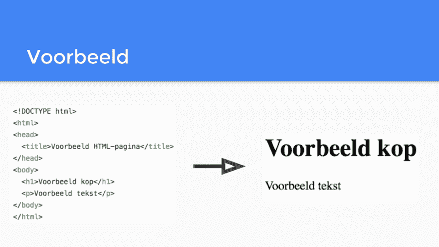
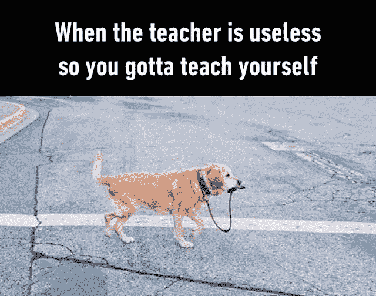

# 教孩子们如何编码

> 原文：<https://dev.to/rgo/teaching-kids-how-to-code-5cbb>

[现在是](http://lifehacker.com/how-and-why-to-teach-your-kids-to-code-510588878) [一个](http://www.apple.com/retail/code/) [巨大的](https://code.org/) [炒作](https://www.microsoft.com/en-us/education/students/code/default.aspx)学习如何编码这几天。虽然我不认为每个人都应该学习编码，但我认为它可以帮助孩子们以一种逻辑的方式思考。

这就是为什么当 Rietveld Lyceum 邀请我做一次客座演讲时，我愉快地答应了。

## 事前

Rietveld 中学为学生组织了各种各样的客座课程。这个想法是，学生可以对他们周围存在的工作和职能有一个概念(我真的很欣赏这一点)。课程的种类非常多样，人们可以选择乘坐救护车，学习如何行动，如何耕作，如何创业等等。我加的课是“编程”。我还不知道课程的完整计划，但我计划教他们如何建立一个(非常)简单的网站。

我认为我开设这门课的优势在于学生们自己选择了主题。如果他们对学习如何编码不感兴趣，他们就不会选择学习这门课程。

该课程连续 4 节课，每周四从 14:45 到 16:15。有容纳 15 名学生的空间。

## 第一课

开发第一课是最难的。我不知道学生的水平。我选择允许任何班级(VMBO，HAVO，VWO)申请该课程，但我不知道编程水平是否会有差异(我见过比 HBO 程序员更好的 MBO 程序员)。

> VMBO(voorbereidend middelbaar beroepsonderwijs；从字面上看，“预备中级应用教育”)教育持续四年，从十二岁到十六岁。[5]它将职业培训与语言、数学、历史、艺术和科学方面的理论教育结合起来。
> 
> 中等教育从 12 岁开始，从 2008 年起，在 18 岁之前都是义务教育，分几个级别提供。通向高等教育的两种普通教育方案是 HAVO(五年制)和 VWO(六年制)。学生根据他们的能力入学，虽然 VWO 更严格，但 HAVO 和 VWO 都可以被称为选择性中等教育。

我决定让第一堂课学习一些基本的 HTML 标签，并为那些更快掌握简单材料的学生提供一些额外的材料。

我首先介绍了我自己，我在学习什么，我在做什么(最终忘了告诉我的名字)以及我们将在课程中做什么。我解释说，根据学生掌握材料的速度，课程会随着时间而变化。

简单介绍完自己后，我开始解释为什么编程很重要。我想出了三个理由:

*   建造任何你想要的东西
*   学会用逻辑的方式思考
*   许多职业机会

我知道还有很多很多的理由说明为什么编码很重要，但是你有没有遇到过喜欢听老师喋喋不休地谈论某个话题的学生？

接下来我发现非常困难的是将我自己关于编码的知识翻译给那些一生中从未编程的学生。

> 如何设计一个页面的样式？只需添加一个样式标签，在 CSS 中创建一个类，并将该类附加到您想要设置样式的 HTML 标签中。抱歉。什么？🤔

我想防止上述情况发生。

所以，这就是为什么我解释 HTML 只不过是你电脑(或者服务器)上的一个文件。通过这种方式，我试图让学生们模糊的术语“HTML”变得有形。我展示了一个非常基本的 HTML 页面的例子，并解释了在用。你创建了你的第一个 html 文件。

[T2】](https://res.cloudinary.com/practicaldev/image/fetch/s--mdi1p9q9--/c_limit%2Cf_auto%2Cfl_progressive%2Cq_auto%2Cw_880/https://blog.rubeng.nl/conteimg/2016/11/Les-1.png)

然后，在列出一些关于 HTML 的基本规则(结束标签，标签是什么，关于包括 HTML，head 和 body 标签)后，我决定把学生扔进深水区。

我创建了一个空的 JSFiddle，其中再次陈述了基本规则，并要求学生创建他们的第一个 HTML。我在这里的目标是让学生尽快与代码互动。

当然，我可以先讨论每一个 HTML 标签，展示六个例子，然后让他们自己做。我想那时我会成为非常无聊的学生。

## 第一课的成绩

你可能会想象有很多问题。这是我非常非常欣赏的。学生们渴望了解*如何创造出下一个东西*。在本课的后面，我解释了如何使用标题标签(h1、h2、h3 等)，如何向页面添加文本(p 标签)，如何向页面添加链接(href)以及如何向页面添加图像(img 标签)。

真正让我震惊的是，我开始上课的时候，学生们根本不知道 HTML 是什么，结束课的时候，学生们正在搜索新的标签，有些人已经开始摆弄简单的 JavaScript 代码片段了。

对第一课的演示感兴趣吗？[查看](https://docs.google.com/presentation/d/e/2PACX-1vQtc2DnPdQLN9Iha0a25RqTXhuQLgW6iawlFtcOLNcYWXeDZjDinME1eHH-i952QYtxFo-c-z6tCA7M/pub?start=false&loop=true&delayms=60000&slide=id.p)这里吧。

[T2】](https://res.cloudinary.com/practicaldev/image/fetch/s--7fPJ_Mrz--/c_limit%2Cf_auto%2Cfl_progressive%2Cq_auto%2Cw_880/https://blog.rubeng.nl/conteimg/2016/11/IMG_1752-kopie.jpg)

## 连续上课

第二课是以简短重复第一课开始的。虽然不深入。然后，我让学生们做一个小“测试”。六个关于 HTML 的问题，几个是两个 HTML 代码的例子，学生必须在这些和几个理论问题之间做出选择。所有的问题都是选择题。

**结果:**

*   平均评分为 **5/6** ，相当于 **8.3** 。
*   大多数人弄错的问题是，如何在新窗口中打开一个链接。(target="_blank ")。

我参加测试的原因是想看看人们是否理解这个问题。如果每个人都忘记了如何创建页面，他们(a)不感兴趣或者(b)缺乏解释。

从结果来看，我可以说学生们已经明白了。学生们在一周前的一个半小时里学了一些东西，并且仍然(几乎)正确地记得所有的东西。

在第三课中，我从 Bootstrap 开始，课程的最终目标是能够创建一个简单的网站。到目前为止，他们能够创建一个简单的*页面*，但那不是一个*网站*。我选择 Bootstrap 是因为(再次)它是可访问的。我本可以告诉他们如何使用 Flexbox，但我认为这需要 6 个小时的实践时间。

使用 Bootstrap 也带来了一些挑战。学生们必须把这个框架下载到他们的电脑上，创建一个 HTML 文件，然后他们就可以使用这个框架了。

出于这个特殊的原因，我选择首先解释外部 CSS 如何链接到 HTML ( `<link href="" rel="stylesheet">`)，然后为它们提供一个托管的引导程序(感谢 [BootstrapCDN](https://www.bootstrapcdn.com/) )

此时，学生们也在从独立的 JSFiddle 转向使用编辑器。我选择 Atom 是因为它的用户界面非常简单，安装也非常容易。然而，在学校的电脑上安装并不像我希望的那么容易。计算机速度太慢，安装 Atom 有时需要 10 分钟，或者计算机停止工作，需要重新启动。最终我们成功地在所有的电脑上安装了它。

## 最后一课

在我意识到课程已经结束之前。在上一课中，我想参加一个考试，澄清一些关于 HTML 的事情，并学习他们如何使用引导导航条。

#### “考试”

我认为对学生来说，奖励他们的辛勤工作是很有趣的。这就是为什么我为最后一课设计了一个考试。

 考试由 15 个问题组成，学生总共有 15 分钟的考试时间，最低分数为 50%。此外，考试的设计使得每个学生都有不同的考试。为了参加考试，我使用了 [ClassMarker](https://www.classmarker.com/) ，这是少数几个符合我要求的考试软件之一。大约有 40 个问题，软件随机挑选了 15 个问题呈现给学生。当学生通过考试时，他们会收到一封附有分数和证书的电子邮件。如果失败，他们可以再次参加考试(因为问题会不同*和*他们看不到他们所做问题的正确答案)。

考试的结果和我预料的一致。有的同学分数非常非常高(💯%)还有一些少一点的。一名学生第一次没有通过，但第二次以 7.5 分(75%)通过。虽然我设计的问题在难度上没有区别，当然有些问题更难。

## 倒影

这是我第一次教书的经历。此外，这是我第一次从头到尾解释 HTML，我帮助过其他学生，但他们都已经知道了基本知识。有时很难用外行人的话来说话(并一直说下去)。

我也试图在解释和要求学生自己谷歌东西之间找到平衡。如果你与它互动，比如通过谷歌搜索你的方式，你会更快地理解它。但有时学生们会被卡住，他们试图找到解决办法，但就是找不到。在这种情况下，我非常乐意再解释一遍。你不想成为一个从不解释任何事情的老师。

[T2】](https://res.cloudinary.com/practicaldev/image/fetch/s--EKnvggnb--/c_limit%2Cf_auto%2Cfl_progressive%2Cq_auto%2Cw_880/https://blog.rubeng.nl/conteimg/2017/01/16122664_1332902800108645_7476974498202255360_n.jpg)

*They exist* 😉

## 备注

我把课程设计成有很多实践时间，你不会通过无休止地看老师的幻灯片来学习编码，而是通过实践和研究来学习。

## 学生的反应

> 我认为这个解释很全面。>棒极了！；)>如果能多上几堂课就太好了，这样我们就能以真正的产品结束了。>我发现这是一门非常令人愉快的课程，它设计得很好，我学到了很多东西。
> 
> * * *

经学生许可发表的照片。

对这篇文章有什么评论吗？请让我知道！给我写封短信到 [ruben@rubeng.nl](mailto:ruben@rubeng.nl)

特别感谢:

*   让我使用他们伟大的考试软件💯
*   伟大的时代🤘
*   感谢学生们的承诺🏃

首次发布于 [blog.rubeng.nl](https://blog.rubeng.nl/teaching-kids-how-to-code/)