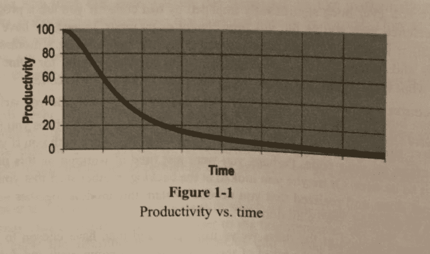

# 技术债务:我们需要更好的沟通，而不是更好的隐喻

> 原文：<https://dev.to/bosepchuk/technical-debt-we-need-better-communication-not-better-metaphors-d65>

作为一个比喻，技术债务并没有很好地服务于我们的职业。它旨在帮助我们与业务人员交流，并对我们的软件项目做出更好的决策。但这在很大程度上是失败的。问题的一部分在于，商人并不害怕未来的利息支付。

在商学院，我了解了[杠杆](https://en.wikipedia.org/wiki/Leverage_(finance))的力量:它是什么，如何获得，如何衡量，如何管理。债务是一种工具。我的商学院毕业生们对杠杆和债务感到很舒服。因此，当程序员向业务人员抱怨技术债务时，业务人员并不关心。为什么会这样？这个比喻具有误导性；技术债务只是表面上与金融债务相似。

### 危在旦夕

我注意到，业务人员往往更善于说服程序员为了短期利益而损害他们代码库的长期健康，而程序员则更善于说服业务人员拥有健康软件的重要性，这种健康软件具有很少的混乱和低水平的技术债务。

这是非常不幸的，原因有三:

1.  一旦你让你的项目变得一团糟，就很难清理干净了(在很多情况下这是不可能的)
2.  从长期来看，为了短期利益而走捷径或制造混乱的决定往往是次优的。如果业务人员真正理解这些捷径的风险和成本，他们可能会做出更好的选择
3.  试图维护和扩展一个充满蹩脚代码的软件项目是令人沮丧的，令人心碎的工作。许多程序员辞职是为了远离低质量的代码——这很严重

不管你的项目有多少技术债务，你总是可以让它变得更糟。您总是会面临内部和外部的压力，在这里走捷径，在那里避免重构，并且在没有自动化测试的情况下发布新特性。

因此，**我们需要和业务人员一起更好地捍卫代码**。宣传商业目标是他们的工作，而作为程序员，宣传代码是我们的工作。不相信我？阅读这个:[软件工程道德和专业实践准则](https://www.computer.org/cms/Publications/code-of-ethics.pdf)

### 如何主张为代码

你需要对公司的利益相关者进行软件开发过程的教育。在你确定他们理解走捷径的利弊和风险之前，你的工作还没有完成。我将在这篇文章的剩余部分分享我的策略。

### 找到一个钩子，让商务人士对你的公司如何创建和维护软件感兴趣

你需要让业务人员参与到你的过程中来。他们越是内化你的挣扎和挑战，就越好。

#### 诉诸效率

你很难找到一个不想讨论让软件开发人员交付的机会的商业人士:

*   更多功能，更快
*   更少的缺陷
*   对变更请求的响应速度更快
*   更可预测的发布时间表
*   降低开发成本
*   降低程序员流动率

你在这里的主旨可能是你的公司错过了高价值的机会。您希望从业务人员那里获得一些建议，告诉他们如何利用这些机会，让事情变得更加顺利/高效/有效。

#### 诉诸风险规避

根据你的听众，你可能会找到另一种更有说服力的方法。商务人士接受过管理风险的培训，你可以将这种情况描述为管理不断增加的风险，从而利用这一点。

以下是在代码中制造混乱的一些风险:

*   竞争对手发布高级软件
*   缺陷激增
*   成本飙升
*   无法满足监管要求
*   无法添加新功能
*   进展逐渐停止
*   数据丢失/损坏/泄露
*   诉讼/罚款
*   失去顾客
*   负面宣传
*   完全无法使用该软件
*   优秀的程序员离开项目
*   最大的问题是:**风险以不可预测的非线性方式相互作用**

这两个策略中的一个可能会引起你的业务人员的注意。

### 让他们参与你的会议

我的团队做过的最好的事情就是采用了 SCRUM。我们的产品负责人参加了几次这样的会议后，他真的“明白了”。在这些会议中，他也成了每周一小时左右的忠实听众。我充分利用这个机会，尽我所能增加他的理解。

这些会议使“进展缓慢”或“糟糕代码”的抽象概念变得更加具体。例如，我们在回顾会上查看所有与我们的估计相差很大的故事，并讨论为什么会发生这种情况。但是听一个程序员花 20 分钟解释为什么一个简单的系统改变要花 40 个小时(是估计的 10 倍)完全是另一回事。当这种情况接二连三地发生时，业务人员会情不自禁地买进。我发现如果你让他们参与到根本原因分析中来，并帮助你制定问题的解决方案，那会特别有帮助。

这些会议也让商务人员对团队有所了解。程序员如何处理自己？他们有能力吗？他们是抱怨者吗？士气如何？他们懒吗？他们关心业务吗？这些问题的答案远不如让业务人员得出一个必然的结论重要，即“编程这件事”比表面上看起来要难。

### 区分技术债和蹩脚代码

技术债务已经从最初的定义扩展到包括几乎所有不良的代码质量。在我的工作场所，我们正在抵制这种趋势。我们区分技术债务和蹩脚代码。

技术债务:

> 是以不可知的长期成本为代价，走捷径实现短期目标的深思熟虑的决定。

蹩脚代码:

> 是任何一种不是技术债的捷径。

我们的政策是，只有在业务人员和程序员做出深思熟虑的决定后，才允许技术债务进入代码库。我们的软件相当成熟，所以我们只允许技术债务进入代码库，以应对紧急情况。例如，如果我们在产品中发现了一个严重的缺陷，我们可能会“侵入”一个解决方案来立即解决这个问题，并且称之为技术债务。然后我们会编一个故事来适当地修复它。

尽管我们允许有限数量的技术债务进入我们的代码库，但我们对蹩脚代码采取零容忍政策。经过长时间的讨论和根本原因分析，我们制定了这个政策。我们决定继续我们的项目的唯一合理的方法是停止允许蹩脚的代码进入代码库。最后，所有的代码都被审查，直到它满足我们的质量目标，它才与 master 合并(参见我们的[代码审查清单](https://smallbusinessprogramming.com/code-review-checklist-prevents-stupid-mistakes/))。如果这意味着改变需要比我们最初估计的时间长十倍的时间，那就这样吧。

当然不是那么非黑即白。程序员每天都要做出判断。但是我们的谈话、行动和行为都是为了产生零行的蹩脚代码。我们已经让它成为我们文化的一部分。

### 给他们看蹩脚代码成本的研究

商业人士通常不知道蹩脚的代码对他们软件的健康有多坏。所以，我把教育他们作为我的工作。

我把我的《软件项目生存指南》(Steve McConnell)借给了我公司的两位资深人士。这本书已经过时了，但前 5 章绝对物有所值。

我给任何愿意关注我的人看“干净代码”的第 4 页(罗伯特·c·马丁)。在这一页，鲍勃叔叔描述了拥有一个烂摊子的总成本。我特别喜欢指着页面底部的图表(复制如下)问他们认为我们在哪里。

[T2】](https://res.cloudinary.com/practicaldev/image/fetch/s--hhxv3wMR--/c_limit%2Cf_auto%2Cfl_progressive%2Cq_auto%2Cw_880/https://thepracticaldev.s3.amazonaws.com/i/32f6xs21m14mnvbis1pi.JPG)

我还向人们展示了我的《软件工程的事实和谬误》(罗伯特·格拉斯)，并用它来激发软件工程的讨论。

我积极倡导我们的代码、我们的团队和我们的理智。我真的在努力表达三点:

1.  开发软件是困难的，昂贵的，并且容易彻底失败，所以我们应该认真对待它
2.  作为一种职业，我们对哪些实践影响软件开发的风险、进度、质量和成本有所了解
3.  我们应该采用与我们想要的结果相关的实践

### 向他们展示你项目中蹩脚代码的例子

让人们相信蹩脚的代码在理论上是不好的是非常容易的。但是让他们相信他们拥有蹩脚的代码是另一回事。

我甚至用电子邮件把我 IDE 里的截图发给我们的高层。我发现我去年写的一封电子邮件中有截图显示:

*   我们的一个项目的所有静态分析错误。它显示了一千多个严重警告和错误，以及几千个弱警告和通知。
*   包含 5 种语言和 500 多个警告的单个 3，189 行文件的静态分析错误
*   单个文件的所有错误和警告都标记在编辑器窗口的右侧。它的 95%都覆盖了警告标志

我写了那封邮件给:

*   让我们的代码质量问题可见
*   展示为什么我们的代码改变起来如此昂贵
*   倡导不要让情况变得更糟

### 质量和速度并不对立

我喜欢这个。史蒂夫·麦康奈尔(Steve McConnell)发表了一篇名为[软件质量为最高速度](http://stevemcconnell.com/articles/software-quality-at-top-speed/)的文章。他认为:

> 在软件中，更高的质量(以更低的缺陷率的形式)和减少的开发时间是携手并进的。

这篇文章有很好的论证，由专家撰写，并且有研究支持，在脚注中有明确的引用。读一下。把它收藏起来。并且意识到，如果你的团队停止做这么多的 QA 或上游规划，他们会走得更快，这是你武器库中的一个强大武器。

### 竭尽全力使生意成功

如果商业人士认为你的业务的最大利益不是你的首要任务，那么你所有的努力都将是徒劳的，哪怕只有一秒钟。你不能只是说无论如何，从现在开始你都不会接受任何技术债务。你不能说从现在开始你将会以“正确的方式”做事，他们将不得不克服它。

你们都是一个团队的。你的目标是为你的公司赚尽可能多的钱。因此，当业务人员说他们在 5 周内需要一个新特性，而你认为需要 20 周，你(集体)有一个需要解决的问题。

作为软件专家，你可以做出很多贡献。他们为什么需要这个功能？他们需要一次获得全部功能吗？能否将其分成几个阶段，然后在 5 周内交付第一阶段？你能改变规格使特性更容易实现吗？你能在五周内开发出一个完全不同的功能，并带来同样的销售和利润效果吗？你能集成一个 API 并减少你的开发工作量吗？你能在五周内发布一个最小版本的特性，然后立即发布一个增强版本吗？你能外包一些工作吗？

除了把一些东西拼凑在一起，然后把它踢出去，还有很多可能性。如果你已经为其他步骤打下了良好的基础，也许你可以避免事情发展到那一步。

### 时刻表现得像个专业人士

如果你想被当作专业人士对待，你需要表现得像个专业人士。发牢骚和抱怨不是专业人士的行为。但这还不是全部。您需要一个计划来有效地管理您的软件开发过程并交付结果。你需要做出诚实的估计。你需要对你团队的结果负责。你需要真实，避免夸张。

例如，我避免对我们的代码库进行笼统的陈述。有些代码很糟糕，有些没那么糟糕，而有些实际上相当不错。所以我从来没有说过我们不能改变。但我要说的是，这种改变需要对那个非常丑陋的模块进行实质性的修改，而不需要我上周告诉你的测试。原作者早已不在人世，我们也不知道它是如何运作的。我会说这种改变需要很多个月的努力；你想要我做一个详细的估价吗？

在这种情况下，我的估计将包括一个范围，传达这种幅度的变化所涉及的不确定性。我对这种变化的估计可能是 3-8 个人月，85%的信心。这意味着我认为我们有 85%的机会在 3-8 个人月内实现这一改变，并且有 15%的机会实际工作可能超过这一范围。

不，我不能做得更好。这是估计值。如果我们修改变更的范围，我们可以创建另一个评估，但是我总是在第一时间给出我最好的评估。我不允许自己被胁迫降低它。

当你[了解业务人员试图去哪里，并且你可以提出建议和计划来帮助他们更快到达那里](https://smallbusinessprogramming.com/10x-programmer/)或者至少避免沿途的地雷时，真正的胜利就来了。

### 当其他方法都失败时，你可能不得不退出

有时候，你就是无法让你的同事相信，除了一个又一个的黑客之外，任何事情都是可能的。他们不关心软件工程研究。他们不关心最佳实践。他们不在乎你是否必须处理蹩脚的代码。他们不在乎你的生活是否悲惨。他们不想谈论你如何开发软件。他们只想要结果，而且越便宜越好。

如果你发现自己处于这种情况，你需要做一些决定。让我只说两件事。首先，有些公司确实关心他们软件的质量和他们开发人员的士气。第二，高质量的软件开发人员需求量很大，所以如果你想改变，找另一份工作应该不会有太大的困难。

### 包装完毕

研究和来之不易的经验表明，当程序员向一个预期寿命很长的项目添加蹩脚的代码时，他们几乎肯定会承担比他们意识到的更多的成本和风险。您将面临各种内部和外部压力，以更快地交付特性。但是永远记住，倡导代码和业务的最佳利益是你的工作。