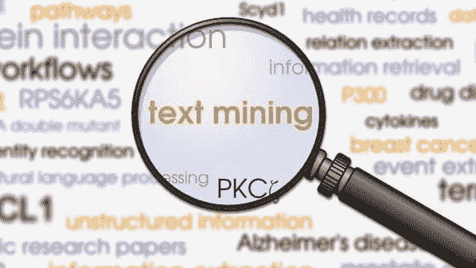

# 文本分析

> 原文：<https://dev.to/japneet121/text-analytics>

[T2】](https://1.bp.blogspot.com/-b6oEfHpnNZo/WYbl77A-x2I/AAAAAAAABps/CemAjXZhbDUdcuPVcibYL3pVujMLUtn9wCEwYBhgL/s1600/text-mining.jpg)

亲爱的读者们，最近我在工作中经历了一些文本分析活动，学到了一些文本分析和挖掘的技术。

在这一系列的文章中，我将分享我的经历和学习。

## 介绍

首先，术语文本分析和文本挖掘是术语数据挖掘的子领域，在大多数情况下可以互换使用。
广义上的**文本分析**指的是，
从文本数据中提取信息，将我们想要获取数据的问题牢记在心。
和**文本挖掘**是指，
获取文本数据的过程。

如今，大量的数据是由人类产生的。数据正以前所未有的速度增长，到 2020 年，地球上的每个人每秒将产生大约 1.7 兆字节的新信息，这些数据的主要组成部分之一将是文本数据。文本数据的一些主要来源是

*   博客
*   文章
*   网站
*   脸谱网
*   评论
*   论坛
*   复习

[T2】](https://2.bp.blogspot.com/-jgpbpNjeirM/WYbozkEV7wI/AAAAAAAABp4/R_6bOwPd2MUv34iObsXsf83IUBjZdoIlQCLcBGAs/s1600/observer.png)

在上图描述的场景中，每个观察者可能以不同的方式感知现实世界，并相应地表达，例如，不同的人可能对某个话题有不同的看法。因此，在分析文本数据时，必须记住这种类型的偏差。

#### 可以从文本中提取并转换成可操作知识的信息类型可以是

*   挖掘数据内容
*   挖掘关于语言的知识
*   挖掘关于观察者的知识
*   推断其他现实世界的变量

## 自然语言处理

NLP 代表自然语言处理，是机器学习的一个子域，处理人类所说的自然语言并使其为机器所理解。

这是一个相当复杂的问题，因为理解自然语言涉及机器所缺乏的常识。人类所说的许多句子都涉及常识，并且是在某种上下文中说出的，这种上下文派生出句子的意思。例如

*   他是我的掌上明珠。(短语)

#### 

*   John is a star.

(电影明星或天体)对自然语言的分析可以大致分为 4 种类型的分析

1.  词汇分析-识别词类、单词关联、主题挖掘
2.  句法分析-连接单词和创建短语，然后连接短语
3.  语义分析-提取关于句子的知识
4.  语用分析——理解句子的意图

## 词汇分析

根据定义，词法分析意味着将一个字符序列转换成具有某些定义含义的单词序列。

单词的定义可以是

*   词性标签(名词、动词、副词等)
*   单词关联(两个单词是如何连接的)
*   主题(段落的上下文)
*   组合词

在这篇文章中，我将写关于**单词关联**的内容，这是对不同单词如何相互联系的分析。看下面的句子

*   杰克驾驶一辆汽车，T1 汽车与驾驶相关联
*   *我喜欢猫*
*   “*我喜欢狗*”，在这些句子中，猫这个词与狗有关，因为它们可以互换使用，构成一个有效的句子

在第一句“*杰克驾驶汽车”中，*“汽车”与“驾驶”的关系类型称为
**组合关系**。

如果两个词在同一个句子中出现的概率很高，那么这两个词就称为组合相关。例如

*   鲍勃*吃*T2【的】食物
*   约翰*驾驶*一辆*汽车*
*   他*坐*在*沙发*上

这些类型的关系对于根据一个单词在一个句子中出现的另一个单词来发现该单词在该句子中出现的概率是很重要的。

这个问题在数学上可以简化为*预测一个随机变量 v，其中如果单词出现在句子中，v=1，如果单词不出现在句子中，v-0。*

这个变量越随机，预测这个变量就越困难。例如,*在一个句子中出现的概率,*在另一个单词已经出现在该句子中时，可以很容易地预测为“*”,*是一个非常常见的单词，另一方面，单词“eat”在一个句子中出现的概率很低，并且很难预测它出现的概率。

随机变量的随机性可以用**熵来度量。**

 **T2】**

**H(Xw)= med\\- P(Xw = V)logP(Xw = V)**
**(V { 0，1})**
X sub w 是单词 w 在句子中出现的概率
H(Xw)是变量 X sub w 的熵
P(Xw=V)是变量存在的概率(V=1)反之亦然(V=0)

现在我们知道了熵的概念，以及如何用熵来预测一个单词在句子中的存在，下面我们再介绍一个叫做**条件熵的概念。**
定义为已知 V 在句子中出现时，单词 W 的熵。
这有助于减少熵，从而减少随机变量的随机性。
条件熵可以定义为

**H(Xmeat | Xeats = 1)=-P(****Xmeat = 0 | Xeats = 1****)logP(****Xmeat = 0 | Xeats = 1****)**
**-P(****Xmeat = 1 | Xeats = 1****)logP(****Xmeat = 1 | Xeats = 1)**

 **### 聚合关系

词与词之间的另一种关系是聚合关系。如果两个词可以互相替换并且仍然构成一个有效的句子，那么这两个词就被认为是聚合相关的。例如

*   我喜欢猫
*   我喜欢狗

在第一个句子中，如果“猫”被替换成狗，它仍然是一个有效的句子，这意味着猫和狗是聚合相关的。

为了在句子中找到这种类型的关系，我们首先需要找到**左上下文，**表示出现在单词左边的单词，然后我们需要找到**右上下文，**表示出现在句子右边的单词。

一旦我们有了这些上下文，我们就可以找到上下文的相似之处。语境相似度越高的词，聚合相关度越高。这个问题可以通过将上下文中的每个单词表示为向量来进行数学定义，其中向量的值由该单词在上下文中出现的频率来表示

现在这两个上下文可以表示为

d1=(x1，x2，x3，x4，........xn)

d1=c(wi，d1) / |d1|

c(wi，d1)是 d1 中字 wi 的计数，

|d1|是 d1 中的字数

d2=(x1，x2，x3，x4，........xn)

d2=c(wi，d2) / |d2|

c(wi，d2)是 d2 中字 wi 的计数，

|d2|是 d2 中的字数

并且上下文相似性可以被计算为

Sim(d1，d2)=d1.d2

Sim(d1，d2)=x1y1+x2y2+x3y3+......................................+xnyn

Sim(d1，d2)=伊稀，其中 i=0 至 n

相似度是从 d1 和 d2 中随机选取的单词相同的概率。

很快将为这些关系挖掘的程序模型添加一些链接，在下一个系列中将写关于主题挖掘的文章。

敬请关注......**