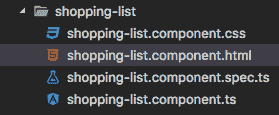

# 视角:在网络上

> 原文：<https://dev.to/michaelsolati/the-angular-view-on-the-web>

欢迎来到 Angular View 的第一篇文章，这一系列文章讨论了 Angular 框架如何在我们的 MVC ( [模型视图控制器](https://medium.freecodecamp.com/model-view-controller-mvc-explained-through-ordering-drinks-at-the-bar-efcba6255053))结构化应用程序中处理视图。这个月，我们将对 web 应用程序中的角度视图的工作方式进行深入探讨。让我们直接跳进来吧！
当创建一个 Angular 应用程序时，你在 NgModule 中‘声明’了你的应用程序可以使用的所有组件(类和视图)。

```
@NgModule({
     declarations: [
          AppComponent
     ],
     imports: [
          BrowserModule,
          FormsModule,
          HttpModule
     ],
     providers: [],
     bootstrap: [AppComponent]
})
export class AppModule { } 
```

NgModule 提供了您的应用程序的定义，或者只是我们应用程序的一部分。为了构建和处理我们编写的代码，我们的 Angular 应用程序需要的服务、模块和其他必需品都要经过我们的 NgModule。在上面的代码片段中，您可以看到一个最初由 Angular CLI 创建的组件 AppComponent 被立即加载到我们的应用程序中，并带有一个声明(在这里我们定义了所有的视图)和引导程序(在这里我们定义了初始视图)。然而，有三个模块也被导入到我们的应用程序中；BrowserModule、FormsModule 和 HttpModule。后两者为 Angular 开发人员提供了一些对我们的应用程序非常重要的功能，但是 BrowserModule 才是真正的明星(至少对于这篇博文来说)。

与其他流行的 JavaScript 框架(主要是 React)相比，Angular 有一个非常清晰的视图抽象。下面是来自 [React 教程](https://facebook.github.io/react/tutorial/tutorial.html)的一个例子，它是在 components 类中构造的一个视图。

```
class ShoppingList extends React.Component {
     render() {
          return (
               <div className="shopping-list">
                    <h1>Shopping List for {this.props.name}</h1>
                    <ul>
                         <li>Instagram</li>
                         <li>WhatsApp</li>
                         <li>Oculus</li>
                    </ul>
               </div>
          );
     }
} 
```

如果您从 React 教程中提取样本片段，并在 Angular 中实现它，可能需要更多的文件，但是应用程序的结构仍然非常有组织。

[T2】](https://res.cloudinary.com/practicaldev/image/fetch/s--UiXRepq0--/c_limit%2Cf_auto%2Cfl_progressive%2Cq_auto%2Cw_880/https://thepracticaldev.s3.amazonaws.com/i/yqlhc4w53mvjjkl7xa55.png)

Angular CLI 提供的自动生成组件。HTML 文件将保存与 React render 函数的返回非常相似的内容。

```
<div class="shopping-list">
     <h1>Shopping List for {{props.name}}</h1>
     <ul>
          <li>Instagram</li>
          <li>WhatsApp</li>
          <li>Oculus</li>
     </ul>
</div> 
```

整个视图在一个单独的 HTML 文件中管理，该文件通过组件装饰器与我们的组件相关联。即使您对组件装饰器不是很熟悉，您也可能在没有意识到的情况下看到过它的运行。

[decorator 是 ES7](https://medium.com/google-developers/exploring-es7-decorators-76ecb65fb841) 的一个特性，ES7 于 2016 年 6 月完成，但在最终规范之前很久就在 TypeScript 中实现了，以便 Angular 开发人员可以利用它。Decorators 允许我们做的是为我们的类提供元数据。元数据描述了我们类的功能和其他细节。在 Angular 中，我们的组件装饰器允许我们关联我们想要的组件样式，HTML 选择器应该是什么，最重要的是组件的模板是什么！下面是一个例子:

```
@Component({
     selector: ‘app-shopping-list’,
     templateUrl: ‘./shopping-list.component.html’,
     styleUrls: [‘./shopping-list.component.css’]
})
export class ShoppingListComponent {} 
```

那么这是如何工作的呢？这如何回到我们的 browser 模块？别担心，我们快到了。

如果你花时间深入研究你的 [BrowserModule](https://github.com/angular/angular/blob/master/packages/platform-browser/src/browser.ts#L91) ，你会发现它包含了一系列操作我们的 DOM 和创建元素的服务。最重要的类是 DefaultDomRenderer2 类，其他一些类实际上是从它扩展而来的，主要用于我们的 DomRendererFactory2 服务。

这里发生了两件不同的事情。首先，我们的 [DefaultDomRenderer2](https://github.com/angular/angular/blob/master/packages/platform-browser/src/dom/dom_renderer.ts#L102) 类有几个直接操作 DOM 的函数，以便创建和操作我们的视图。这个类并不排斥我们的角组件；请记住，我们的定制元素可能会调用标准的 HTML 组件(想想你的 H1 标签，P 标签，div 等。)，createElement()将调用原生 DOM APIs，使用 [document.createElement()函数](https://developer.mozilla.org/en-US/docs/Web/API/Document/createElement)生成标准 HTML 组件，或者使用 [document.createElementNS()函数](https://developer.mozilla.org/en-US/docs/Web/API/Document/createElementNS)生成您定制的组件。

```
createElement(name: string, namespace?: string): any {
     if (namespace) {
          return document.createElementNS(NAMESPACE_URIS[namespace], name);
     }
     return document.createElement(name);
} 
```

事实上，如果您在没有 JQuery 的情况下学习了 DOM 操作，您可能会看到许多操作 DOM 节点/组件的函数，以及允许您添加子节点和定位父节点的函数。它是干净、纯粹的 JavaScript，已经被抽象到你甚至不需要考虑或担心它！

```
appendChild(parent: any, newChild: any): void { parent.appendChild(newChild); }

parentNode(node: any): any { return node.parentNode; }

addClass(el: any, name: string): void { el.classList.add(name); }

removeClass(el: any, name: string): void { el.classList.remove(name); } 
```

一些其他的类和服务扩展了 DefaultDomRenderer2，但是它主要用于 [DomRendererFactory2](https://github.com/angular/angular/blob/master/packages/platform-browser/src/dom/dom_renderer.ts#L62) 服务。如果你不熟悉什么是工厂，工厂在面向对象编程(OOP)中被用来创建和/或返回新的对象。在这种情况下，我们的视图组件是在工厂的构造函数中创建的，供我们使用。

结果是我们的 BrowserModule 能够获取我们编写的所有代码，并构建在浏览器中显示的视图。它使用纯 JavaScript 通过 DomRendererFactory2 和 DefaultDomRenderer2 创建和管理我们的视图，但它也允许我们将事件关联到我们的视图中。这由各种服务来处理,这些服务也使用纯 JS 将事件监听器添加到我们的 web 元素中。要知道，对于我们的数据绑定和事件监听器来说，还有其他重要的部分，它们可以是非浏览器特定的行为，由 Angular [公共库](https://github.com/angular/angular/blob/master/packages/common/src/common.ts)和[核心库](https://github.com/angular/angular/blob/master/packages/core/src/core.ts)处理。

```
addEventListener(element: HTMLElement, eventName: string, handler: Function): Function {
     element.addEventListener(eventName, handler as any, false);
     return () => element.removeEventListener(eventName, handler as any, false);
} 
```

## TL；博士；医生

我们的 Angular 应用程序允许我们构建组件，这些组件清楚地将我们的视图从代码中分离出来，但是通过 decorators 关联起来。所有这些组件都被导入到我们的 NgModule 中，这实际上是我们应用程序的入口点。我们的 NgModule 类使用 BrowserModule 获取元数据，并使用本机 JavaScript 构建我们的视图。

这一切都很好，但你们中的一些人可能想知道我们为什么要做这些。为什么要使用一个抽象的模块来生成我们的视图，甚至从我们的控制器/类中抽象出我们的视图呢？嗯，我们不需要仅仅为网络构建我们的应用程序。我们可以在许多其他平台上运行 Angular 代码，下个月我们将讨论这个模型如何允许我们用 Angular 编写本地应用程序！