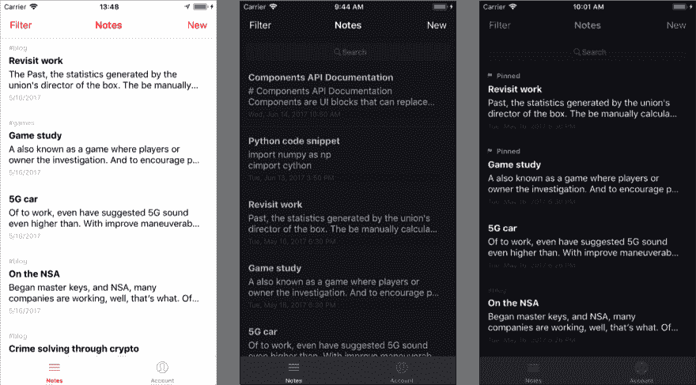

# 我见过天堂。而且是用 JavaScript 写的。

> 原文：<https://dev.to/devtouser432/the-beauty-of-react-native-920>

### 为什么反应土著是未来

我描述软件的方式很奇怪。你要么明白我的意思，要么不明白。这有点奇怪，但是软件界面感觉像有一个*重量*。当我使用一个界面时，它可能感觉很重，也可能感觉很轻。谁也不比谁强。看情况而定。Chrome 很轻。Safari 感觉比较重。而火狐感觉最重。这可能是胡说八道，但这就是我的感觉。

我软件开发生涯中最重的一次感受体验，就是在 Xcode 中使用 Swift。哦，痛苦。延误了。永不让你完成的 Kanye-West 编译器。在过去的几年里，我一直生活在这个笨拙的世界里，用我唯一知道的方式构建应用程序:原始的、手动的、单一平台的代码。去当地吧！对吧？

当我了解到 React Native 时，我持怀疑态度。用 JavaScript 写一次代码，在 iOS 和 Android 上都部署原生 app？这一定很糟糕。所以我忽略了。相反，他们最终编写了两个独立的原生应用，一个是用于 iOS 的 Swift，另一个是用于 Android 的 Java/Kotlin。除此之外，还有一个用 JavaScript 编写的网络应用和一个基于电子的桌面应用。(该应用程序是一个加密的跨平台 notes 应用程序，因此在每个平台上的可用性是关键。)

这在一段时间内运行良好，但也有其困难。我可以编写 web 应用程序和 iOS 应用程序，但我对 Android 毫无经验。事实上，我一生中使用安卓设备的时间从未超过一个小时。幸运的是，一位社区贡献者很乐意帮助构建基础，这让我放弃了从头编写应用程序，而是通过增量更改来维护它。

任何时候需要做出改变，或者添加一个特性，我都需要进入三个独立的代码库，用三种不同的语言编写相同的代码。作为一个人，这并不总是很有效率。即使是最简单的跨平台更改也可能需要一周时间。结果是应用程序永远不会有好东西。例如，一些用户要求在应用程序中添加密码和指纹锁——对于注重安全性的 notes 应用程序来说，这是一个非常合理的要求。但是实现起来并不容易:首先，除了输入界面之外，还需要一个密码设置界面。然后，使用密码加密离线用户数据。然后，在移动设备上，指定何时应该请求密码或指纹(立即或在应用程序退出时)。一想到要用 Swift，然后是 Java，然后是 JavaScript 来编写所有代码，就像一场噩梦。我无法说服自己去做。

一定有更好的方法。

### 输入 React Native

我不得不描述不得不为一个应用程序维护单独的代码库的感觉背后的背景和情感，这样你就可以知道当我开始使用 React Native 时我有多高兴。在 Atom 中编写原生应用**的第一周(！)，我张着嘴。我不敢相信这有多容易。没有 Xcode，没有 Swift，即时重新加载更改，用非常容易使用的 JavaScript 编写——我简直是在天堂。当我写代码的时候，我会把 iOS 模拟器和 Android 模拟器放在一起，花一半的时间完全不相信所有的*都正常工作了*。我从来没有想过，*嗯，这在 iOS 上看起来不错，我想知道它在 Android 上是否会工作得很好？*在很大程度上，如果它能在一个平台上运行，几乎不需要调整就能在两个平台上运行。**

最美的部分？我重用了我的 WEB 应用程序中的整个类！我能够复制复杂的类，包括模型、控制器和加密逻辑，几乎不做任何改动。app 的整个同步引擎？直接从网络应用程序复制过来的。加密和解密？从 web 应用程序。模特和关系？从 web 应用程序。

我非常非常高兴没有从头开始写这些东西。同步很难，加密同步也不容易。web/desktop 代码库是我们的旗舰产品，经过测试，能够重用这些组件的信心是巨大的。

使用本机 ide 构建本机应用程序最难的部分之一是用户界面。在 iOS 上，开发界面是如此的煞费苦心耗时。你可以通过代码来做，但是会涉及*很多*代码。用代码管理动态布局约束比大多数任务都要糟糕得多。您可以使用界面构建器，但是，您会失去代码提供给您的细粒度控制和灵活性。祝您在 git 中提交和协作界面构建器变更时好运。

在 React Native 中，动态接口轻而易举。你使用类似 CSS 的语法来构建你梦想的设计:

```
let containerStyles = {
    backgroundColor: “red”,
    display: “flex”,
    alignItems: “center”,
    width: “100%"
}

let childStyles = {
    fontSize: 14,
    color: “black”,
    fontWeight: “bold"
}

<View style={containerStyles}>
     <Text style={childStyles}>Hello, future.</Text>
</View> 
```

Enter fullscreen mode Exit fullscreen mode

这是在 React Native 中构建所有接口的基础。而且真的就像看起来那么简单。最糟糕的部分呢？

主题化。

本质上，您的整个接口就是一堆 JSON 属性。您可能已经注意到，从服务器或文件中提取一个 JSON 样式的 blob 并完全改变应用程序的外观并不难。所以这正是我所做的:

[T2】](https://res.cloudinary.com/practicaldev/image/fetch/s--Ew-Oly6G--/c_limit%2Cf_auto%2Cfl_progressive%2Cq_auto%2Cw_880/https://thepracticaldev.s3.amazonaws.com/i/3ow2glqvkfeyi63jzenu.png)

你知道这在本地代码中有多难吗？一想到它我就心痛。

### 有什么蹊跷？

在我穿越天堂的旅途中，当我带着极度的惊奇和好奇向四面八方张望时，我一直在想，这是怎么回事？构建原生应用程序不可能这么容易。这感觉几乎是有罪的。

现在，这是软件，而且是软件开发工具，所以没有完美的东西。React Native 仍在积极开发中，所以你会遇到一些问题。我的前几个问题感觉存在。“狗屎！这就是结局！我就知道。我知道这太好了，不可能是真的。这个问题会彻底毁掉我的项目。幸运的是，没有解决不了的问题。

例如，我遇到的一个更恼人的问题是，React Native 的 TextInput 组件在 Android 上对于 notes 应用程序来说不够好。滚动很慢，任何时候你滚动阅读便条，它都会自动调出键盘。极其沮丧。我花了几天时间试图解决这个问题，通过操纵 JavaScript 代码来防止这两个问题。但是完全没有效果。然而，我了解到这并不是你项目的结束。这是开始。

React Native 允许您轻松地为您想要的任何东西构建本机组件。原生组件或模块意味着您可以使用原生 Swift/Objective-C 或 Java/Kotlin 编写接口和业务逻辑，并轻松创建用于控制这些模块的 JavaScript 接口。在我的例子中，我用 Java 编写了一个定制的 textview 模块，使滚动更加平滑，并且不会将输入集中在滚动上。这是直接用 Android Studio 编写的 Java。我用 JavaScript 将其导入，添加到视图层次结构中，然后 boom，React Native 中一个漂亮的滚动文本输入。问题解决了。

我还在其他方面使用了原生模块，包括加密模块(iOS 和 Android 的独立模块)和指纹认证模块。

### 该不该用 React Native？

是的，是的，100%是的。即使你正在构建一个单一平台的应用程序，我也会使用 React Native。感觉这是编写应用程序的更好方式。尽管 Swift 很新，但与用 JavaScript 编写应用程序的灵活性相比，它显得过时和笨重。我真的希望苹果专注于让它更容易编写伟大的应用程序，而不是引入我一段时间以来遇到的最深奥的编程语言。Xcode 是围绕 Objective-C 打造的，Swift 在里面还是感觉格格不入。

在构建原生移动应用程序时，我能够重用我们 web 应用程序中大约 70-80%的代码。剩下的是不能重用的接口代码。我甚至可以瞄准 iOS 和 Android 的较低版本。我们最初的 Swift Standard Notes 应用程序使用了核心数据的最新实现，因此需要 iOS 10。新的 React 原生实现可以在 iOS 8 和 Android 5 上开箱即用。

想看看一个 React 原生 app 是什么感觉？可以下载成品，[标准笔记](https://standardnotes.com):加密笔记 app，适用于 [iOS](https://itunes.apple.com/us/app/standard-notes/id1285392450?mt=8) 和 [Android](https://play.google.com/store/apps/details?id=com.standardnotes) 。你也可以查看完整的[源代码](https://github.com/standardnotes/mobile)。如果您对 React 原生开发流程有任何疑问，请不要犹豫[联系 Twitter](https://twitter.com/bitario) 。