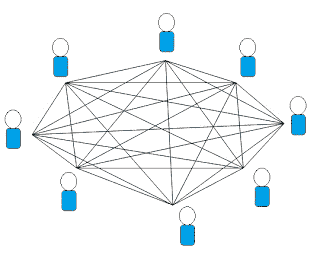

# 欺骗性的复杂问题

> 原文：<https://dev.to/briannipper/the-deceptive-complex-problem-4kla>

||
|

当每个人都与

其他人“交流”时，复杂的交流就产生了。|

不久前，我写了一篇关于公司面临的“真正大”问题的文章，以及他们如何寻求像 SharePoint 2010 这样的工具来帮助他们解决这个问题。在我的文章中，我提到了《T2》杂志上的一篇文章，作者是 Fog Creek 软件的创始人兼首席执行官 Joel Spolsky。这篇文章的标题是 *[少一点对话](http://www.inc.com/magazine/20100201/a-little-less-conversation.html)* 通过一个简单的概述，这篇文章解释说，当你在一个小组中处理任何给定的问题时，如果小组可以很小，那是最好的，如果不能很小，那就试着保持对沟通渠道的“控制”。

当我思考“真正大的”问题，也就是团队内部的沟通时，我开始欣赏这篇文章中提出的另一个观点，即在大公司工作时，每个人都需要尊重其他人在特定问题领域的专业知识。正如文章中所提到的，在大公司，人们往往高度专业化，这意味着他们专注于特定的领域，如数据库、服务器管理、网络、安全等。；然而，我开始欣赏的方法是，它在沟通方面创造了一个欺骗性的复杂问题。或者换一种说法，它产生了一个“隐藏”的问题。我说隐藏的或欺骗性的复杂性的原因是，对于所有的专业人员来说，你似乎不需要所有的团队成员来真正了解一幅完整的画面，不是吗？

人们通常会认为，每个团队成员都必须专注于自己的小部分，而不需要关注全局。我的意思不是说你不希望每个人都能接触到问题的全部要求或书面记录；然而，当你创建这种责任划分时，它会导致一种文化，在这种文化中，每个人“只”对难题的一小部分负责，因此没有人真正对整个难题负责。

那么，如何解决这个欺骗性的复杂问题呢？就像大多数问题一样，沟通似乎是关键。当项目开始时，典型的做法是引入团队来确定正在做什么以及谁将处理每个部分；然而，如果认为应该举行每周一次的“团队”会议，并且在 Inc .杂志的文章中从沟通成本的角度说明了原因，这是不明智的。相反，最好是确定各个部分之间的联系，然后“鼓励”这些较小的小组在解决方案上进行合作。

在这一点上，如果你以前从事过软件开发项目，你可能会开始设想一个由部件、数据库、应用服务器、网络服务器、终端用户等组成的交叉网络。然后是负责这些部分的人，以及他们如何相互作用，你可能会得出和我一样的结论，那就是作为一名开发人员，你是核心部分，需要所有这些部分走到一起。那么我是不是在建议开发人员应该在确保团队内部的交流以有意义的方式发生中扮演关键角色？是的。

作为开发人员，我们应该关心整体解决方案的每一部分。为什么你会问，我们写的代码会影响什么…一切。表达这种想法的另一种方式是问一个应用程序工作需要什么？至少一个服务器和代码(技术上你需要用户，否则你为什么做你正在做的事情，但这是另一篇文章的主题)。您可能想要不止一台服务器，最好将安全和网络等问题与关注这些领域的其他人分开，但是作为一名开发人员，所有的事情都围绕着您正在做的事情，如果您认为您不需要有效地沟通来实现开发人员“运送代码”的永恒目标，那么请联系我，这样我就可以避开您的项目，因为我相当确定您已经屈服于欺骗性的复杂问题。