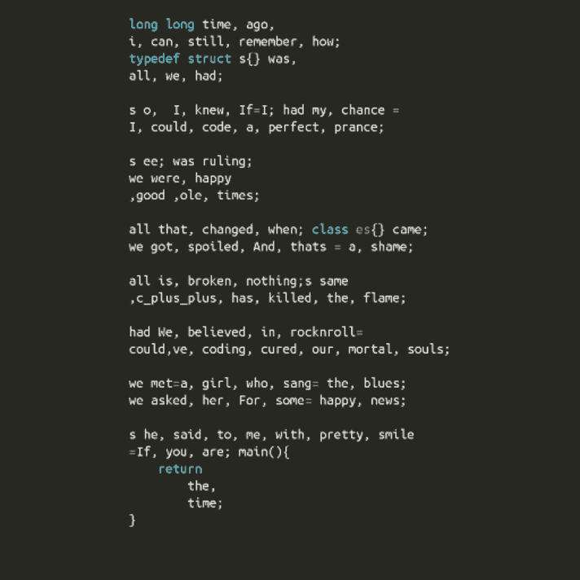
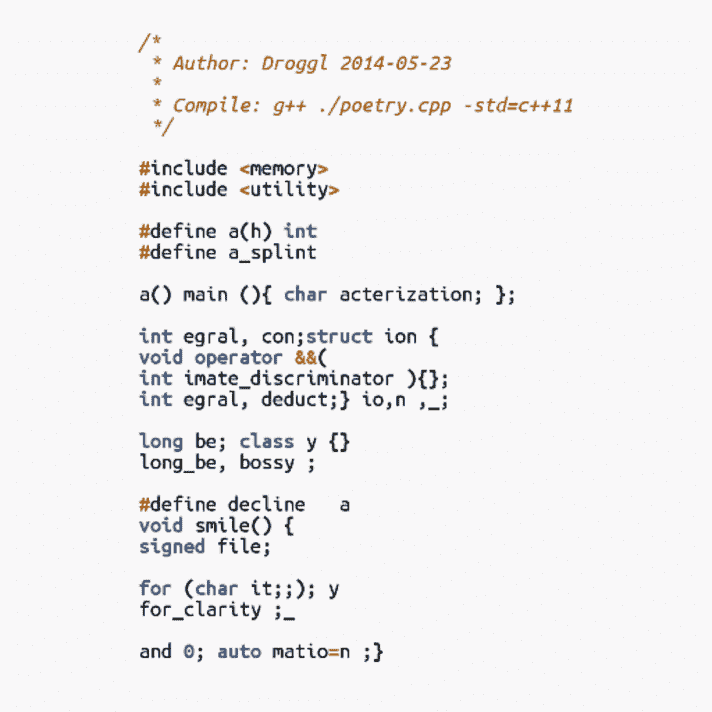
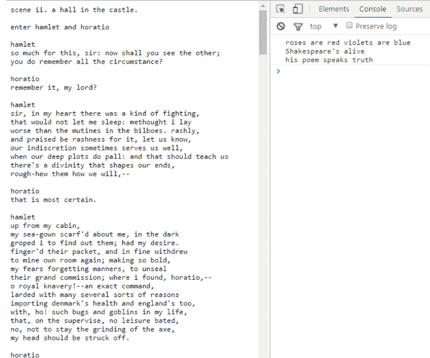

# 代码的诗意

> 原文：<https://dev.to/poetrycode/the-poetry-of-code>

这不是一个关于编程要像莎士比亚的短歌集一样美好的哲学观点。这是用代码做出来的真正的诗。作为立陶宛维尔纽斯 Java 开发者社区的一项非官方活动，[源代码诗歌挑战赛](http://www.sourcecodepoetry.com/)于 2013 年首次举办，此后一直在不断发展。

源代码诗歌是一项倡议，它鼓励软件开发人员编写押韵的、有诗意节奏的、让我们着迷的代码。我们展示了开发人员的创造力和多维编程语言的能力。

让我们检查一些历史性的意见书。这些确实比任何语言都响亮。

[T2】](https://res.cloudinary.com/practicaldev/image/fetch/s--LTyjW5_z--/c_limit%2Cf_auto%2Cfl_progressive%2Cq_auto%2Cw_880/http://res.cloudinary.com/db3xv3aov/image/upload/c_scale%2Cw_712/v1464779680/Done_lean_yfgygp.png)

这是一首 C++诗，讲述了作者对已经逝去的经典 C 时代的深深的怀旧之情；以及 C++带来的新的可怕时代——它“破坏”和“打破”了古代软件开发艺术的纯真。

从技术角度来看，这首诗是一个纯粹的金块:既没有`#includes`也没有`#defines`，也没有任何其他样板代码——整个文本是一个流畅的人类可读文本。作者只使用“class”关键字来表达他的观点——对于编写好的代码来说，类是不必要的(没有什么东西不能用字节码来编码)。

[T2】](https://res.cloudinary.com/practicaldev/image/fetch/s--wpQPJfVI--/c_limit%2Cf_auto%2Cfl_progressive%2Cq_auto%2Cw_880/http://res.cloudinary.com/db3xv3aov/image/upload/c_scale%2Cw_712/v1464779878/10302637_302516546581698_3477359028805837702_n_nr7bt6.png)

另一个来自 2014 年，由德国学者 Droggl 编写的令人费解的 C++代码:这是一个明显的尝试，旨在引发 C/C++程序员大脑中的认知失调。

当试图对这段代码进行代码审查时，当你从一行到另一行，从一个关键字到下一个关键字时，所有不稳定的片段都会在你的脑海中形成韵律——一路说服自己不应该编译它，但它仍然以某种方式编译了。要知道为什么它会在不该编译的时候编译，你必须读它几次。

很难确切地说出它的诗歌价值；然而，在花了足够的时间分析这些东西之后，你可能再也不会是同一个 C++程序员了:你已经知道很多年的 cpp 关键字确实押韵。

比雅尼·斯特劳斯特鲁普一定是故意这样设计语言的。

每年的比赛都与以往不同。今年是为了纪念莎士比亚逝世 400 周年。因此，提交的作品必须以某种方式与伟大的语言大师相关。就像今年 Lector George 提交的一样:我们收到的只是一个 HTML 文件，里面有完整的“哈姆雷特”文本。在检查了控制台标签后，我们发现了一些我们从未想过会发现的东西——一个隐藏的“玫瑰是红色的……”消息。

[T2】](https://res.cloudinary.com/practicaldev/image/fetch/s--HAZa0lXB--/c_limit%2Cf_auto%2Cfl_progressive%2Cq_auto%2Cw_880/http://i.imgur.com/Z4I6Tac.png)

“这很简单。这些 Javascript 代码所做的就是破译不朽的哈姆雷特的英文文本中隐藏的信息。如你所见，这条信息一直藏在那里——长达四个多世纪。”作者说。

在挑选最佳作品时，评审团很难做出决定。重要的方面——如幽默、技术实现、整体情感影响、故事情节、原创性、诗歌价值——都是人类诠释的主题。

比赛仍在进行中。虽然只剩几天了，但也欢迎大家提交自己的大作。陪审团正屏息以待。

在[sourcecodepoetry.com](http://www.sourcecodepoetry.com/)查看更多提交材料、奖品、结识评审团成员

请在 6 月 6 日之前将您的参赛作品提交到[art@sourcecodepoetry.com](mailto:art@sourcecodepoetry.com)。