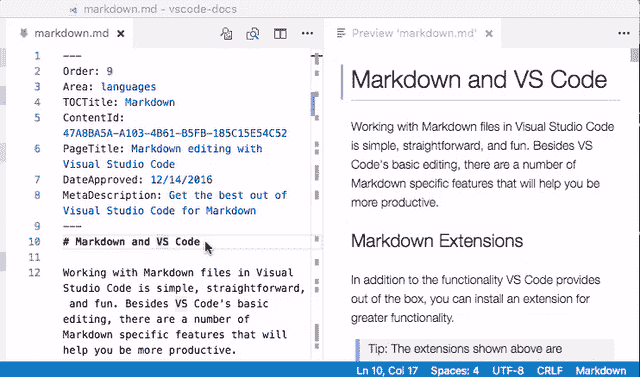

# VS 代码的力量

> 原文：<https://dev.to/rafalpienkowski/the-power-of-vs-code-492>

我想先问几个问题...

> 你用的是 [VS 代码](https://code.visualstudio.com/)编辑器吗？你在给[发展](https://dev.to/)写文章吗？或者你在用[降价](https://en.wikipedia.org/wiki/Markdown)记录你的工作/代码吗？

我想你会回答我上面所有的问题。但是...

> 你知道 VS 代码已经内置了对 Markdown 的支持吗？

如果你的答案是`no`,我会给你一个不错的提示。我来透露一个秘密。我开玩笑的，这不是秘密。它在官方文件中，但是我以前没有读过。如果你已经创建了一些文档，并且用`*.md`扩展名保存，你可以触发 VS 代码来显示该文件的实时预览。你只需要按下`Ctrl+Shift+V`，实时预览就会出现在新标签页。在我看来，更强大的是按钮组合:`Ctrl+K+V`，以并排的实时预览结束。现在，您可以安心地撰写下一篇 dev.to 文章了。

[T2】](https://res.cloudinary.com/practicaldev/image/fetch/s--WFUroVH3--/c_limit%2Cf_auto%2Cfl_progressive%2Cq_66%2Cw_880/https://code.visualstudio.com/assets/docs/languages/Markdown/selection-preview-scroll-sync.gif)

你知道那些捷径吗？如果没有，就试着和他们一起玩。希望这个提示对你有帮助。

### 加贺:

*   [关于降价和 VS 代码的更多信息](https://code.visualstudio.com/docs/languages/markdown)
*   ***注意*** 如果`Ctrl+Shift+V`和/或`Ctrl+K+V`组合不起作用，请检查您是否保存了扩展名为`*.md`的文件。没有那个预览是不行的。

最后我想告诉你一些有趣的事情。我想告诉你我是如何找到这个好建议的。我计划更多地使用 VS 代码，所以我打印了一份 VS 代码快捷方式备忘单。它在我的桌子上。今天在我每天站起来的时候，我想吃一个橘子。顺便说一句，我知道那很淘气。果汁弄脏了这条捷径旁边的纸，所以这就是我找到它的方式。它一直在我旁边，我没看见。幸运的是，事故导致我发现了它。