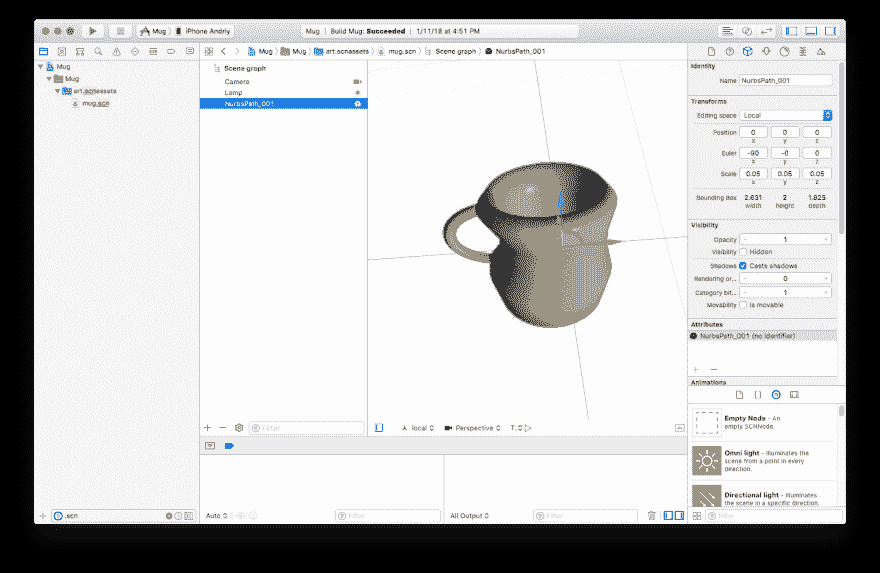
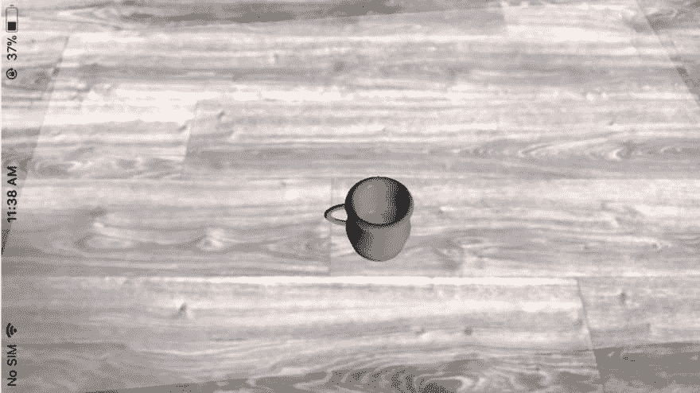
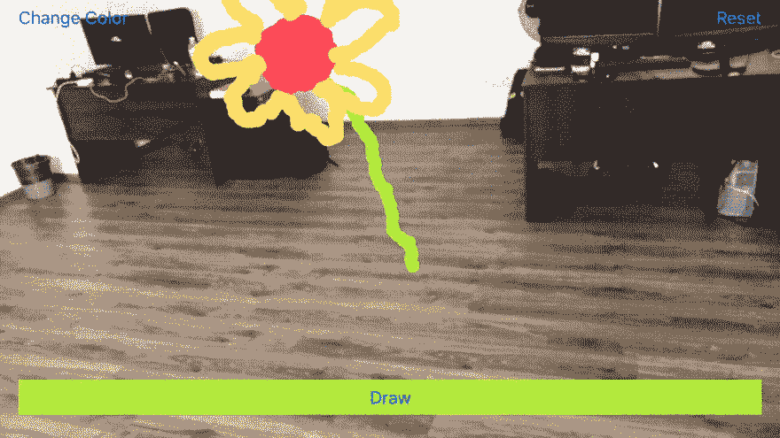
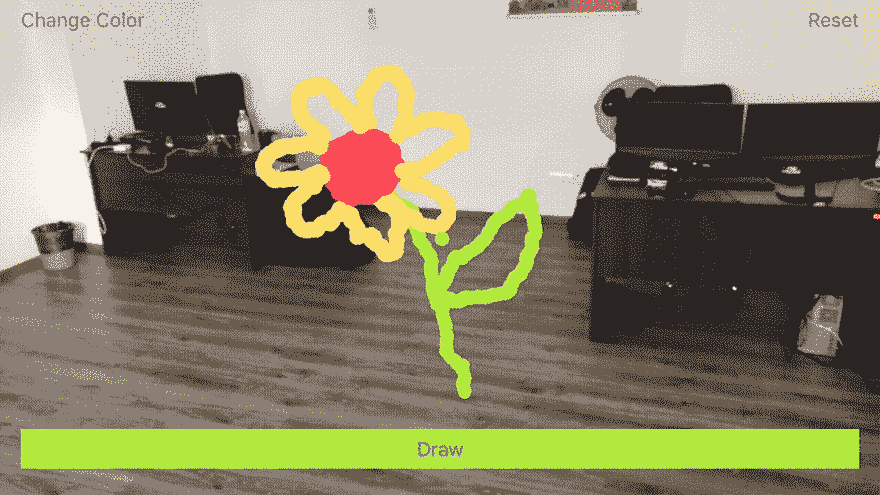

# 增强现实应用的兴起

> 原文：<https://dev.to/galyna_chekan/the-rise-of-augmented-reality-apps-1c6c>

这一切都始于 2017 年，当时苹果推出了其最新的增强现实框架——ARKit。显然，主要目标是简化 AR 应用程序的创建，这些应用程序试图使用户能够通过在 iOS 设备(可用于 Apple A9 或更新的处理器)屏幕上呈现的 2D/3D 对象与现实世界进行交互。ARKit 的应用确实是无止境的——从简单的娱乐到实际帮助教育过程和解决全球数百万人的日常问题。但是，我们不要急于求成。我们从一些基本的东西开始慢慢来。

## ARKit # 1 的业务应用:飞机上的物体

自 ARKit 发布以来，许多优秀的应用程序被发布，但是，最受关注的可能是 [IKEA Place](https://itunes.apple.com/us/app/ikea-place/id1279244498?mt=8) 。嗯，我们想向你展示它是如何制作的。

让我们从基础开始——为 ARKit 制作一个 3D 模型。在我们继续应用程序之前，我们需要一个我们可以使用的实际三维模型。令人欣慰的是，它可以很容易地用 Blender 或任何其他你选择的 3D 建模软件来渲染。只要确保它支持。DAE 扩展。

*提示:用于 AR 的 2D 图形由 SpriteKit 支持，3D 由 SceneKit 支持。*

所以我们需要。具有 3D 模型的 SCN SceneKit 文件。的。DAE 文件应转换为。Xcode 中的 SCN 格式。为了执行这个动作，选择 ***编辑器*** 菜单并点击 ***转换为 SceneKit 场景文件格式(。*SCN)**。 

下一步是确定可以放置 3D 对象的水平面。为你的 ARSCNView 确定一个委托:增强现实将被渲染的视图。然后实现委托方法 **didAdd** 、 **didUpdate** 和 **didRemove** 。

下面是方法 **didAdd** 的一个例子:

func renderer(_ renderer:scnscenerender，didAdd node: SCNNode，for anchor: ARAnchor) {

guard let planeAnchor = anchor as？ARPlaneAnchor else { return }

node . addchildnode(horizontal surface(plane anchor:plane anchor))

}

确保添加了一个平面锚点，而不是另一个锚点。这就是我们使用 guard 语句的原因。现在，让我们看看上面代码中使用的方法 **horizontalSurface** :

func horizontal surface(plane anchor:ARP lane anchor)-> SCN node {

设 horizontalSurface = SCNNode(几何图形:SCNPlane(

宽度:CGFloat(planeAnchor.extent.x)，

高度:CGFloat(planeAnchor.extent.z)))

水平表面.几何？。原始材料？. diffuse.contents =

ui color . blue . with alphacomponent(0.4)

水平表面.几何？。原始材料？。isDoubleSided = true

horizontal surface . position = sc invector 3(

平面锚. center.x，

planeAnchor.center.y，

planeAnchor.center.z

horizontal surface . Euler angles = sc invector 3(90.0 度弧度，0，0)

返回水平表面

}

蓝色的“漫射”使得在现实生活中看到飞机成为可能。如果没有定义颜色，它们将是透明的，因此你看不到它们。

当用户点击 AR 视图时，预计会出现一个新对象。在我们的例子中，它是一个杯子的 3D 模型。为了实现它，我们需要添加一个手势识别器到 **ARSCNView** 并处理用户的触摸。处理点击的方法是这样实现的:

@objc func handleTap(sender: UITapGestureRecognizer) {

if let tappedSceneView = sender . view as？ARSCNView {

let tapLocationInView = sender . location(in:tappedSceneView)

let plane hittest = tappedsceneview . hittest(tapLocationInView，

类型:。existingPlaneUsingExtent)

如果！planeHitTest.isEmpty {

add furniture(hitTest:planeHitTest)

}

}

}

在方法 **addFurniture** 中，将使用以下代码添加家具:

如果让 furnitureNode = SCNScene(名为:

“第 1 条(流通设备)”。scn”)？。根节点{

let position = hitTest.first！.世界变换.列. 3

furniture node . position = SCR vector 3(position . x，position.y，position.z)

sceneView.scene.rootNode.addChildNode(furnitureNode)

}

现在，用户只要在屏幕上轻轻一点，就可以把一个物体放在水平面上。酷吗？你打赌。但是等着看我们还为你准备了什么。

[T2】](https://res.cloudinary.com/practicaldev/image/fetch/s--boT9t16Q--/c_limit%2Cf_auto%2Cfl_progressive%2Cq_auto%2Cw_880/https://perfectial.com/wp-content/uploads/2018/01/Perfectial-RnD-Cup-Rendered.png)

## ARKit # 2 的商业应用:3D Paint——让你的周围充满创意

将物体放置在水平表面上并不是我们可以用 ARKit 做的唯一事情。我们也可以把它们挂在半空中。但是，我想在这个问题上更进一步。让我们创建一个 3D 版本的画图。

首先，每当我们触摸屏幕时，我们必须在空中悬挂一个像点一样的小节点。实现这一点的最佳方式是使用**willrendersscene**，这是 **ARSCNViewDelegate** 方法之一:

设 dotNode = SCN node(geometry:SCN sphere(radius:this . dot radius))

dotnode . position = currentPositionOfCamera

dotNode.geometry？。原始材料？. diffuse . contents = this . selected color()

this . scene view . scene . red node . addchild node(子节点)的名称

[T2】](https://res.cloudinary.com/practicaldev/image/fetch/s--Y7adST_6--/c_limit%2Cf_auto%2Cfl_progressive%2Cq_66%2Cw_880/https://perfectial.com/wp-content/uploads/2018/01/ar2.gif)

但是，如何确定摄像机的当前位置呢？瞧:

if let point of view = scene view . point of view {

设 orientation = SCNVector3(

-pointOfView.transform.m31，

-pointOfView.transform.m32，

-pointOfView.transform.m33)

设 location = SCR factor 3(

pointOfView.transform.m41，

pointOfView.transform.m42，

pointOfView.transform.m43)

返回方向+位置

}

[T2】](https://res.cloudinary.com/practicaldev/image/fetch/s--fImhEE-m--/c_limit%2Cf_auto%2Cfl_progressive%2Cq_66%2Cw_880/https://perfectial.com/wp-content/uploads/2018/01/ar3.gif)

最棒的是——我们可以创造真实的 3D 涂鸦。艺术家应该喜欢这个。现在，让我们继续下一个。

增强现实应用的崛起。ARKit 的商业应用实用指南首先出现在[软件开发公司 perfecial](https://perfectial.com)上。