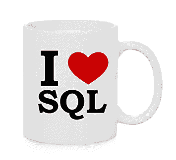

# 我喜欢的 SQL。具有 100 万条记录的表的高效分页

> 原文：<https://dev.to/backendandbbq/the-sql-i-love-chapter-one>

*最初发表于我的博客:* [你所需要的只是后端](http://allyouneedisbackend.com/blog/2017/09/24/the-sql-i-love-part-1-scanning-large-table/)。

[T2】](https://res.cloudinary.com/practicaldev/image/fetch/s--gYm9D7kT--/c_limit%2Cf_auto%2Cfl_progressive%2Cq_auto%2Cw_880/https://thepracticaldev.s3.amazonaws.com/i/9bxt8z38ti40ft78j0l5.jpg)

我是数据库的超级粉丝。我在大学的时候甚至想自己做 DBMS。现在，我既使用 RDBMS 解决方案，也使用 T2 NoSQL 解决方案，我对此非常感兴趣。你知道，没有[金锤](https://en.wikipedia.org/wiki/Law_of_the_instrument)，每个问题都有自己的解决方案。或者，解决方案的子集。

在系列博客文章**我喜欢的 SQL<3**中，我将带您浏览一些用 SQL 解决的问题，我发现这些问题非常有趣。我们使用一个包含超过 1 亿条记录的表来测试这些解决方案。所有的例子都使用 MySQL，但是思想也适用于其他关系数据存储，比如 PostgreSQL、Oracle 和 SQL Server。

这一章的重点是使用主键为`offset`的分页来有效地扫描一个大表。这也被称为**键集分页**。

* * *

## 背景

在本章中，我们以下面的数据库结构为例。关于用户的典型例子应该适用于任何领域。

```
CREATE TABLE `users` (
  `user_id` int(11) unsigned NOT NULL AUTO_INCREMENT,
  `external_id` varchar(32) NOT NULL,
  `name` varchar(100) COLLATE utf8_unicode_ci NOT NULL,
  `metadata` text COLLATE utf8_unicode_ci,
  `date_created` timestamp NOT NULL DEFAULT CURRENT_TIMESTAMP,
  PRIMARY KEY (`user_id`),
  UNIQUE KEY `uf_uniq_external_id` (`external_id`),
  UNIQUE KEY `uf_uniq_name` (`name`),
  KEY `date_created` (`date_created`)
) ENGINE=InnoDB DEFAULT CHARSET=utf8 COLLATE=utf8_unicode_ci; 
```

Enter fullscreen mode Exit fullscreen mode

关于结构的几点意见:

*   `external_id`列以 UUID 格式存储对其他系统中同一用户的引用
*   `name`代表`Firstname Lastname`
*   `metadata`列包含带有各种非结构化数据的 JSON blob

该表相对较大，包含大约 100，00 0，00 0 条记录。让我们开始我们的学习之旅。

## 扫描一张大桌子

**问题**:你需要遍历表格，提取每条记录，在你的应用程序代码中进行转换，然后插入到另一个地方。我们关注后*中的第一阶段，扫描桌子*。

**明显而错误的解决方案**

```
SELECT user_id, external_id, name, metadata, date_created
FROM users; 
```

Enter fullscreen mode Exit fullscreen mode

在我有 100，00 0，00 0 条记录的情况下，查询永远不会结束。数据库管理系统会杀了它。为什么？可能是因为它导致了将整个表加载到 RAM 中的尝试。在将数据返回给客户端之前。另一个假设——发送前预加载数据花费了太多时间，查询超时。不管怎样，我们试图及时得到所有记录的努力失败了。我们需要找到其他的解决方案。

**解决方案#2**

我们可以试着把数据分成几页。由于不能保证记录在物理或逻辑级别的表中是有序的——我们需要在 DBMS 端用`ORDER BY`子句对它们进行排序。

```
SELECT user_id, external_id, name, metadata, date_created
FROM users
ORDER BY user_id ASC
LIMIT 0, 10 000;

10 000 rows in set (0.03 sec) 
```

Enter fullscreen mode Exit fullscreen mode

太好了。成功了。我们查询了 10 000 条记录的第一页，只用了`0.03`秒就返回了。但是，对于第 5000 页，它是如何工作的呢？

```
SELECT user_id, external_id, name, metadata, date_created
FROM users
ORDER BY user_id ASC
LIMIT 50 000 000, 10 000; --- 5 000th page * 10 000 page size

10 000 rows in set (40.81 sec) 
```

Enter fullscreen mode Exit fullscreen mode

的确，这是非常缓慢的。让我们看看获取最新页面的数据需要多少时间。

```
SELECT user_id, external_id, name, metadata, date_created
FROM users
ORDER BY user_id ASC
LIMIT 99 990 000, 10 000; --- 9999th page * 10 000 page size

10 000 rows in set (1 min 20.61 sec) 
```

Enter fullscreen mode Exit fullscreen mode

这太疯狂了。但是，对于在后台运行的解决方案来说，这是可以的。这种方法还有一个隐藏的问题，如果在扫描过程中试图从表中删除一条记录，就会暴露出来。假设您完成了第 10 页(已经访问了 100，00 0 条记录)，打算扫描 100，001 到 110，00 0 条记录。但是记录 99 998 和 99 999 在下一次`SELECT`执行之前被删除。在这种情况下，以下查询将返回意外结果:

```
 SELECT user_id, external_id, name, metadata, date_created
 FROM users
 ORDER BY user_id ASC
 LIMIT 100 000, 10 000;

 N, id, ...
 1, 100 003, ...
 2, 100 004, ... 
```

Enter fullscreen mode Exit fullscreen mode

如您所见，查询跳过了 id 为 100 001 和 100 002 的记录。应用程序的代码不会使用该方法来处理它们，因为在两次删除操作之后，它们会出现在前 100 000 条记录中。因此，如果数据集是可变的，该方法是不可靠的。

**解决方案 3——今天的最后一个**

这种方法与前一种非常相似，因为它仍然使用分页，但是现在我们不再依赖于扫描的记录数量，而是使用最近访问的记录的`user_id`作为`offset`。

简化算法:

1.  我们从表中得到`PAGE_SIZE`条记录。起始偏移值为 0。
2.  使用批处理中`user_id`的最大返回值作为下一页的偏移量。
3.  从`user_id`值高于当前`offset`的记录中获取下一批。

该查询在第 5000 页进行，每页包含约 10 000 个用户的数据:

```
SELECT user_id, external_id, name, metadata, date_created
FROM users
WHERE user_id > 51 234 123 --- value of user_id for 50 000 000th record
ORDER BY user_id ASC
LIMIT 10 000;

10 000 rows in set (0.03 sec) 
```

Enter fullscreen mode Exit fullscreen mode

> #### Wow, it's obviously faster than before. More than 1000 times.

注意，`user_id`的值不是连续的，可以有间隙，比如 25 348 紧接在 25 345 之后。如果删除了未来页面中的任何记录，该解决方案也可以工作——即使在这种情况下，query 也不会跳过记录。很可爱，对吧？

## 讲解表演

为了进一步学习，我建议调查每个查询版本的`EXPLAIN EXTENDED`结果，以获得 50，0 00，0 00 条记录之后的 10，0 00 条记录。

```
| Solution          | Time      | Type  | Keys       | Rows | Filtered | Extra
-----------------------------------------------------------------------------------
| 1\. Obvious        | Never     | ALL   | NULL       | 100M | 100.00   | NULL
| 2\. Offset paging  | 40.81 sec | index | NULL / PRI | 50M  | 200.00   | NULL
| 3\. Keyset paging  | 0.03 sec  | range | PRI / PRI  | 50M  | 100.00   | Using where 
```

Enter fullscreen mode Exit fullscreen mode

让我们来关注一下第二个和第三个解决方案的执行计划之间的主要区别，因为第一个解决方案对于大型表实际上没有什么用处。

*   **加入类型** : `index` vs `range`。第一种方法是扫描整个索引树来查找记录。`range` type 告诉我们，索引只用于查找指定范围内的匹配行。所以，`range`型比`index`型要快。
*   **可能的按键** : `NULL` vs `PRIMARY`。该列显示了 MySQL 可以使用的键。顺便说一下，查看**键**列，我们可以看到最终`PRIMARY`键被用于两个查询。
*   **排** : `50 010 000`对`50 000 000`。该值显示在返回结果之前分析的记录数。对于第二个查询，该值取决于我们滚动的深度。例如，如果我们试图在第 9999 页之后获取下一个`10 000`记录，那么`99 990 000`记录将被检查。相反，第三个查询具有常数值；我们是否为最后一页的第一页加载数据并不重要。它总是桌子的一半大小。
*   **过滤后的** : `200.00` vs `100.00`。该列指示处理前要筛选的表的估计百分比。值越高越好。`100.00`的值意味着查询会遍历整个表。对于第二个查询，该值不是常数，并且取决于页码:如果我们要求第一页，过滤列的值将是`1000000.00`。最后一页是`100.00`。
*   **号外** : `NULL` vs `Using where`。提供了有关 MySQL 如何解析查询的附加信息。在`PRIMARY`键上使用`WHERE`使查询执行得更快。

我怀疑**连接类型**是对性能贡献最大的查询参数，它使第三个查询更快。另一件重要的事情是，第二个查询非常依赖于要滚动的页数。在这种情况下，更深的分页会更慢。

关于理解`EXPLAIN`命令输出的更多指导可以在[RDBMS](https://dev.mysql.com/doc/refman/5.6/en/explain-output.html)的官方文档中找到。

## 总结

这篇博文的主题是关于使用带有主键(键集分页)的`offset`扫描包含 100，00 0，00 0 条记录的大表。总的来说，在相应的数据集上审查和测试了 3 种不同的方法。如果需要扫描可变的大表，我只推荐其中一种。

此外，我们修改了`EXPLAIN EXTENDED`命令的用法来分析 MySQL 查询的执行计划。我确信其他 RDBMS 也有类似的功能。

在下一章中，我们将关注数据聚合和存储优化。敬请期待！

你扫描大表格的方法是什么？

您还记得在主键上使用 offset 的其他用途吗？