# 旅行推销员的艰难困苦

> 原文：<https://dev.to/vaidehijoshi/the-trials-and-tribulations-of-the-traveling-salesman-30c>

<figure>[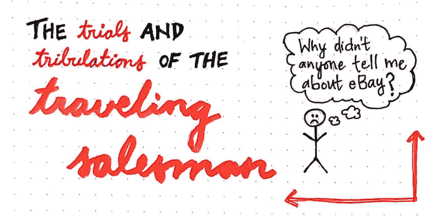](https://res.cloudinary.com/practicaldev/image/fetch/s--C7kQtnLO--/c_limit%2Cf_auto%2Cfl_progressive%2Cq_auto%2Cw_880/https://cdn-images-1.medium.com/max/1024/1%2AjMNwKMBZLT4eUb0cGtEamw.jpeg) 

<figcaption>旅行推销员的风雨历程！</figcaption>

</figure>

随着我们越来越深入计算机科学的世界，有一件事开始变得非常清楚，非常迅速:一些问题似乎以最奇怪的形式一次又一次地出现。事实上，计算机科学史上一些最著名的问题没有任何人知道的具体起源。相反，同样的问题在不同的时间、不同的地点以不同的形式和形象出现。

软件中最难的问题是解决起来最有趣的——其中一些问题甚至还没有解决！其中一个难题是旅行推销员问题，这取决于你问谁，它可能是所有问题中最臭名昭著的。

几年前，我第一次听说旅行推销员的问题，当时对我来说，这似乎是一个令人生畏的问题。老实说，即使现在又回到这个话题上来，感觉还是有点令人生畏，对你来说也可能有点吓人。但这次有些不同:我们有大量的知识和背景可以借鉴！在本系列中，我们一直在建立计算机科学的基础核心，并反复回到一些相同的概念，试图从更技术性的角度“理解”——但只有当我们觉得完全有能力这样做的时候。对旅行推销员问题的研究也是如此。

为了理解为什么这个问题如此臭名昭著，我们需要思考它是什么，我们如何解决它，它为什么重要，是什么让它如此困难。这听起来可能有些难以承受，但我们会一起度过难关，一步一步来。

所以，让我们开始吧！

### 几何、电路和一个名叫汉密尔顿的纨绔子弟

***旅行推销员问题*** ( *TSP* )背后的想法，根植于一个很多人可能实际遇到过的相当现实的问题。论点很简单:一个销售人员必须去一个地区的每一个城市，每个城市只去一次。此外，他需要在他开始旅行的同一个城市结束旅程。

<figure>[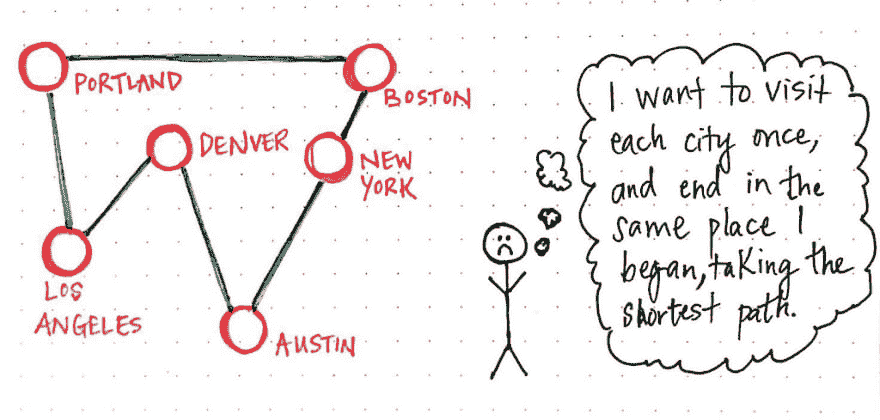](https://res.cloudinary.com/practicaldev/image/fetch/s--yuyQqogC--/c_limit%2Cf_auto%2Cfl_progressive%2Cq_auto%2Cw_880/https://cdn-images-1.medium.com/max/1024/1%2Aby3MgdkmamEAxlCaIH68Xg.jpeg) 

<figcaption>旅行推销员想去每个城市旅行一次，结果却在他出发的同一个地方。</figcaption>

</figure>

旅行推销员问题中的实际“问题”是为推销员找到最*有效的*路线。显然有许多不同的路线可供选择，但找到最佳路线——需要我们的销售人员花费最少的成本或距离的路线——是我们正在解决的问题。

从多个方面来看，这个问题的实际方面让人想起了[柯尼斯堡的七座桥](https://dev.to/vaidehijoshi/knigsberg-seven-small-bridges-one-giant-graph-problem)，这是一个我们已经熟悉的数学问题，它是欧拉发明“位置几何”领域的基础，也就是我们今天所知的*图论*。

<figure>[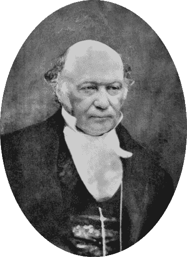](https://res.cloudinary.com/practicaldev/image/fetch/s--CYMO1PQg--/c_limit%2Cf_auto%2Cfl_progressive%2Cq_auto%2Cw_880/https://cdn-images-1.medium.com/max/373/1%2AqhkJNlAZPzcqhbh08tkLnQ.png)

<figcaption>【William rowan Hamilton】[【维基媒体共用】](https://en.wikipedia.org/wiki/William_Rowan_Hamilton#/media/File:William_Rowan_Hamilton_portrait_oval_combined.png)</figcaption>

</figure>

但是图论并没有随着欧拉和柯尼斯堡城而终结！事实上，七桥问题仅仅是个开始，而旅行推销员问题是一个很好的例子，说明人们是在前人思想的基础上发展起来的。

这个场景中的“某人”不是别人，正是[威廉·罗恩·汉密尔顿](https://en.wikipedia.org/wiki/William_Rowan_Hamilton)，一位爱尔兰物理学家和数学家，他受到了在他之前的数学家的启发，并随后继续他们的研究，以创建一个与我们今天熟悉的旅行推销员问题直接相关的数学问题子集。

<figure>[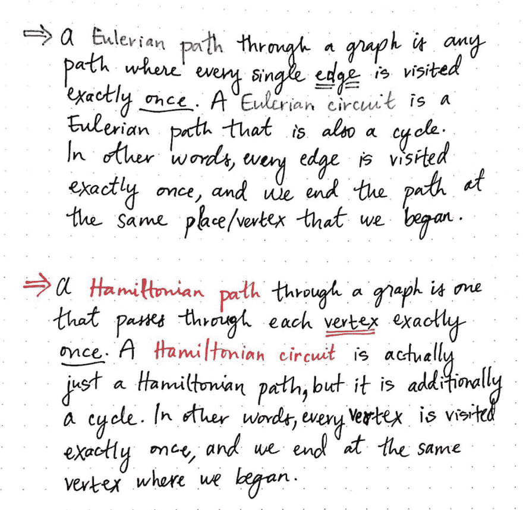](https://res.cloudinary.com/practicaldev/image/fetch/s--opD6fEBm--/c_limit%2Cf_auto%2Cfl_progressive%2Cq_auto%2Cw_880/https://cdn-images-1.medium.com/max/1024/1%2ABkKwcorM1hLalRcGbZZGlQ.jpeg) 

<figcaption>比较欧拉路径和哈密顿路径。</figcaption>

</figure>

在 19 世纪晚期，汉密尔顿和英国数学家托马斯·柯克曼都在研究从根本上类似于 TSP 的数学问题。汉密尔顿的成名是因为他推导了一条叫做 ***的汉密尔顿路径*** ，它与欧拉著名的[欧拉路径](https://dev.to/vaidehijoshi/knigsberg-seven-small-bridges-one-giant-graph-problem)相似。

欧拉路径是图中的每条边都被访问一次的路径，而哈密尔顿路径是每个顶点都被访问一次的路径。

出于同样的原因，欧拉回路是一条欧拉路径，在它开始的同一个顶点结束，接触每条*边*一次。另一方面，一个 ***哈密顿回路*** 是一个哈密顿路径，它在它开始的同一个顶点结束，并且恰好接触每个*顶点*一次。

<figure>[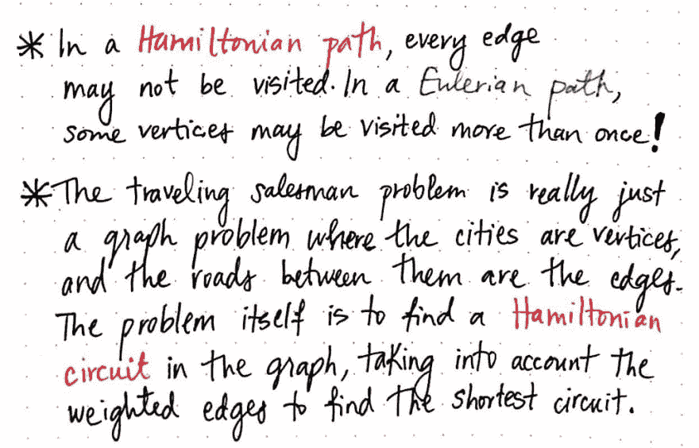](https://res.cloudinary.com/practicaldev/image/fetch/s--q6d1JpyQ--/c_limit%2Cf_auto%2Cfl_progressive%2Cq_auto%2Cw_880/https://cdn-images-1.medium.com/max/1024/1%2AzEjo3E2FWo02ptzgwermRA.jpeg) 

<figcaption>TSP 作为哈密顿回路问题。</figcaption>

</figure>

判断图中的路径是哈密尔顿路径还是欧拉路径的一个很好的经验法则是:

> 在 ***哈密尔顿路径*** 中，不需要访问每条边，但是必须访问每个节点——但只能访问一次！相比之下，在*欧拉路径*中，一些顶点可以被访问多次，但是每条边只能被访问一次。

基于欧拉公式的汉密尔顿的工作出现在著名的旅行推销员问题的背景下的原因是，推销员的工作——恰好旅行到每个城市一次，并在他开始的地方结束——实际上只不过是一个图问题！

<figure>[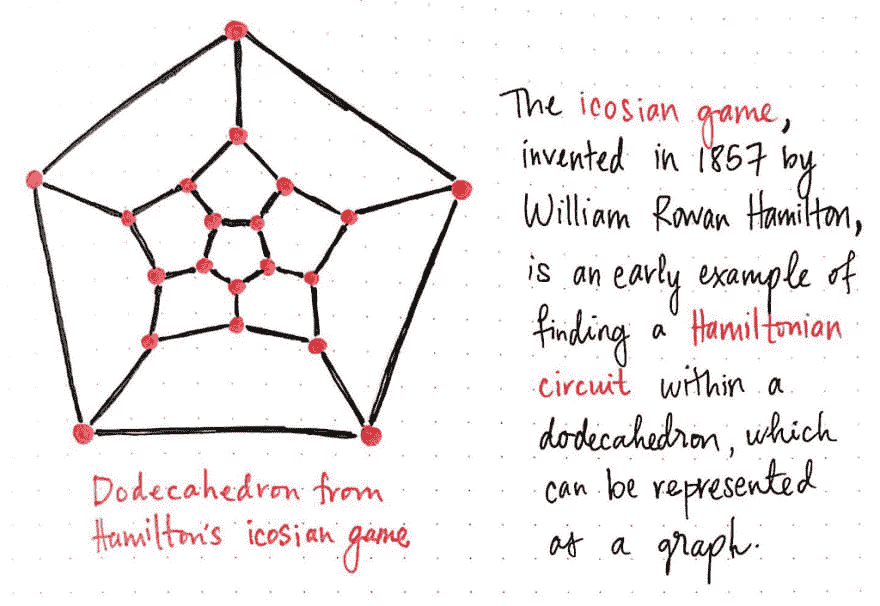](https://res.cloudinary.com/practicaldev/image/fetch/s--3srK7vbv--/c_limit%2Cf_auto%2Cfl_progressive%2Cq_auto%2Cw_880/https://cdn-images-1.medium.com/max/1024/1%2A9TQJJIkru11AQv8ZETrMgw.jpeg)</figure>

汉密尔顿的工作将图论扩展到了这样一个程度，即在 TSP 真正成为事物之前，他实际上已经在解决它了。汉密尔顿发明了一个类似于旅行推销员问题的游戏，他称之为 ***icosian game*** ，其目标是找到一条通过十二面体或有 12 个平面的多边形的点的路径。

汉密尔顿的游戏最终变成了真正的棋盘游戏。而且，如果我们仔细想想，即使是 icosian 游戏实际上也只是旅行推销员问题的另一种变体！正如十二面体有 20 个顶点一样，我们可以把汉密尔顿的游戏想象成 20 个城市的地图。使用这个类比，我们的旅行推销员将需要找到一条穿过 20 个城市的路，访问每个城市一次，并准确地到达他开始的地方。

<figure>[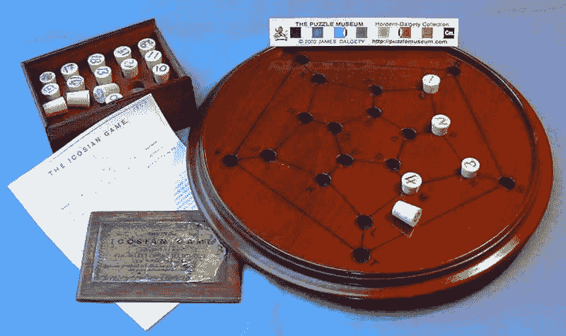](https://res.cloudinary.com/practicaldev/image/fetch/s--4-BYyQHG--/c_limit%2Cf_auto%2Cfl_progressive%2Cq_auto%2Cw_880/https://cdn-images-1.medium.com/max/800/1%2ArrK4wDKr3NIaQmgrHkkNoA.jpeg) 

<figcaption>汉密尔顿的 icosian 游戏，谜题博物馆</figcaption>

</figure>

因此，旅行推销员问题实际上可以被重新表述为一个图。幸运的是，我们已经[涵盖了](https://dev.to/vaidehijoshi/a-gentle-introduction-to-graph-theory) [一整](https://dev.to/vaidehijoshi/from-theory-to-practice-representing-graphs) [lot](https://dev.to/vaidehijoshi/spinning-around-in-cycles-with-directed-acyclic-graphs-4p7) [不同](https://dev.to/vaidehijoshi/deep-dive-through-a-graph-dfs-traversal) [主题](https://dev.to/vaidehijoshi/finding-the-shortest-path-with-a-little-help-from-dijkstra-cmi)说到[复杂图形](https://dev.to/vaidehijoshi/going-broad-in-a-graph-bfs-traversal)。我们已经有了一个坚实的基础，就像汉密尔顿一样！

一旦我们认识到旅行推销员问题实际上只是一个图的遍历问题，我们就可以开始谈正事了。换句话说，我们可以开始尝试*解决*这个问题。就我们的目的而言，我们不会担心试图获得最佳解决方案或使用最有效的方法。相反，我们将从简单地尝试获得某种解决方案开始。用肯特·贝克的古老格言[来说，我们必须首先“让它工作”，然后才能开始考虑让它“正确”或“快速”。](http://wiki.c2.com/?MakeItWorkMakeItRightMakeItFast)

所以，让我们开始工作，让我们的销售人员上路吧！

### 蛮干开始

在我们的示例问题中，旅行推销员非常幸运——他只需在四个城市之间旅行。为了简单起见，我们将这四个城市称为 w、x、y 和 z，因为我们知道 TSP 是一个图问题，所以我们可以将我们的业务员的可能路线以 ***的形式可视化为一个带权无向图*** 。我们将回忆起，*加权的*图是其边具有与其相关联的成本或距离的图，而*无向图是其边具有双向流的图。*

查看我们的销售人员图表的图示示例，我们将看到一些路线比其他路线具有更大的距离或成本。我们还会注意到，我们的销售人员可以轻松地在任意两个顶点之间穿行。

<figure>[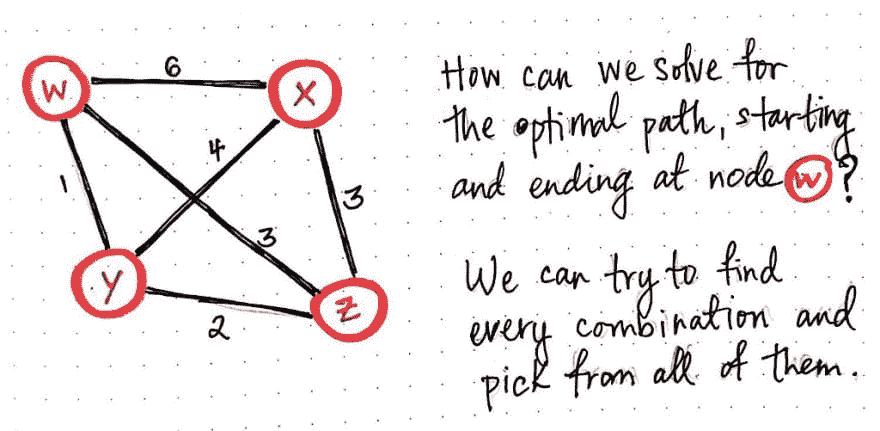](https://res.cloudinary.com/practicaldev/image/fetch/s--5NYyYdVx--/c_limit%2Cf_auto%2Cfl_progressive%2Cq_auto%2Cw_880/https://cdn-images-1.medium.com/max/1024/1%2AJyVtzhhK457Vy-bzqLrasQ.jpeg) 

<figcaption>如何求解起始和终止于节点 *w* 的最优路径？</figcaption>

</figure>

假设我们的销售人员住在 w 市，那么他将从那里开始他的旅程。因为我们在寻找一个哈密尔顿循环/回路，我们知道这也是他在冒险结束时需要到达的地方。那么，我们如何求解最优路径，使我们的销售人员在城市(节点)w 开始和结束，但在这个过程中还要访问每一个城市(x、y 和 z)？

请记住，我们不会考虑最有效的策略——只考虑*有效*的策略。既然我们将使用蛮力方法，让我们考虑一下我们在这里真正想要解决的是什么。强力方法实际上意味着我们将通过计算出每一种可能性，然后从中选出最好的一个来解决我们的问题。换句话说，我们希望找到我们的销售人员可能采取的每一个单个 ***排列*** 或 ***可能路径*** 。这些潜在路线中的每一条基本上都是有向图；我们知道我们将从节点 w 开始，到节点 w 结束，但是我们还不知道节点 x、y 和 z 将以什么顺序出现在中间。

<figure> 

<figcaption>每一个排列本身就是一个有向图。</figcaption>

</figure>

因此，我们需要解决每一个可能的组合，以确定不同的方式，我们可以安排 x，y，z，以取代目前充满的节点？这似乎并不太可怕。

但是我们如何解决这些问题呢？准确地说是节点。好吧，尽管我们使用的是不太理想的强力方法，我们可以依靠*递归*使我们的策略更优雅一点。

> 递归 TSP 方法的基本思想是，对于我们访问的每个节点，我们跟踪下一个可以导航到的节点，然后递归地访问它们。

最终，我们将不再检查更多的节点，这将是我们的递归基本情况，有效地结束我们对访问节点的递归调用。不要担心这会儿这看起来复杂和有点混乱；举个例子会更清楚。因此，让我们递归蛮力通过这些城市，并帮助我们的推销员安全回家！

我们已经知道我们的销售人员将从节点 w 开始，因此，这是我们将首先开始并访问的节点。对于我们访问的每个节点，我们需要做两件事——我们需要记住我们已经访问过它的事实，并且我们需要跟踪我们接下来可能*访问的节点。*

<figure> 

<figcaption>为 TSP，part 1 生成递归调用。</figcaption>

</figure>

这里，我们使用一个列表符号来跟踪我们可以从节点 w 导航到的节点，首先，我们可以导航到三个不同的位置:{x，y，z}。

回想一下，递归的基本思想是“函数从自身内部调用自身”。换句话说，作为解决这个问题的一部分，我们将不得不对每个节点一次又一次地应用相同的过程和技术。所以这正是我们接下来要做的！对于我们可能导航到的每个节点，我们将递归地访问它。

<figure>[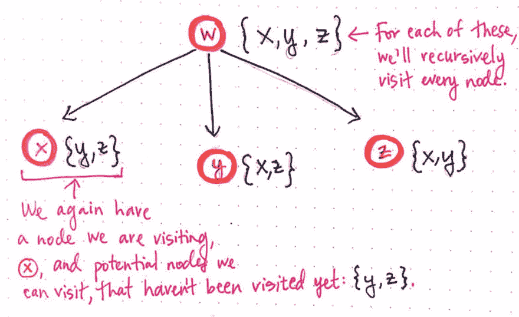](https://res.cloudinary.com/practicaldev/image/fetch/s--UPaq3lI3--/c_limit%2Cf_auto%2Cfl_progressive%2Cq_auto%2Cw_880/https://cdn-images-1.medium.com/max/1024/1%2A0ozT9ohr3dB3e4gIYSqh_Q.jpeg) 

<figcaption>为 TSP，part 2 生成递归调用。</figcaption>

</figure>

请注意，我们开始创建一个树状结构。对于从起始节点 w 开始访问的每个潜在节点，我们现在有三个潜在的子“路径”可以选择。同样，对于这三个顶点中的每一个，我们跟踪我们正在访问的节点本身，以及我们接下来可以访问的任何潜在节点，这些节点在该路径中还没有被访问过。

递归是关于重复的，所以我们要再做一次同样的事情！递归的下一步再次扩展了我们的树。

<figure>[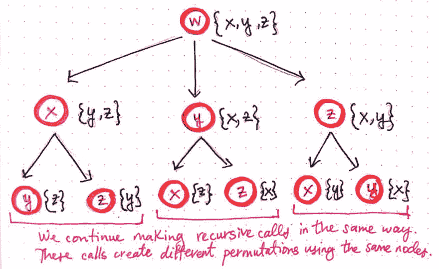](https://res.cloudinary.com/practicaldev/image/fetch/s--8jktpwAj--/c_limit%2Cf_auto%2Cfl_progressive%2Cq_auto%2Cw_880/https://cdn-images-1.medium.com/max/1024/1%2AEJgeCEQoLtpsCWsQmR_21Q.jpeg) 

<figcaption>为 TSP 生成递归调用，partβ3。</figcaption>

</figure>

我们会注意到，由于三个节点 x、y 和 z 中的每一个都有两个我们接下来可能要访问的节点，它们中的每一个都产生了两个自己的递归调用。我们将继续以同样的方式进行递归调用，在这个过程中，我们将开始看到我们正在使用相同的节点创建不同的排列。

我们会注意到，我们现在处于递归调用的第三层，每个节点只有一个可能的下一步访问位置。我们大概可以猜到接下来会发生什么——我们的树将再次增长，每个底层节点将产生一个自己的递归调用，因为每个节点只有一个未访问的顶点可以检查。

下图说明了递归调用的下两个级别。

<figure>[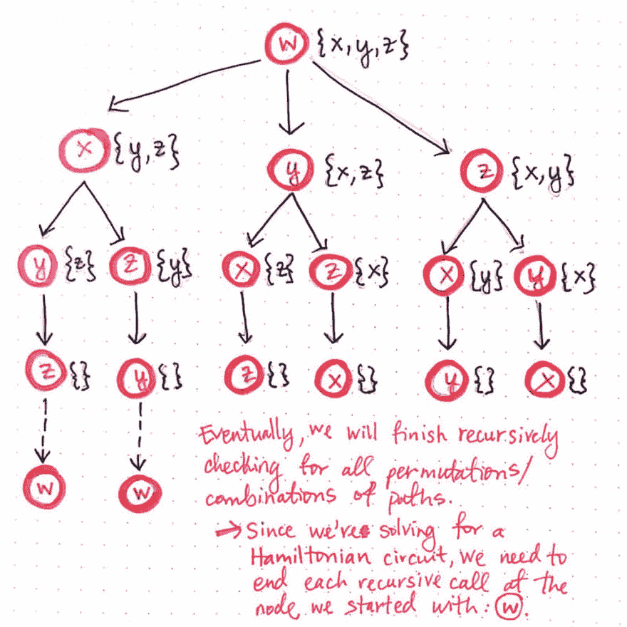](https://res.cloudinary.com/practicaldev/image/fetch/s--dlM8V_vb--/c_limit%2Cf_auto%2Cfl_progressive%2Cq_auto%2Cw_880/https://cdn-images-1.medium.com/max/1024/1%2AzRPUKxE8zHwD1axNiD0dpA.jpeg) 

<figcaption>为 TSP 生成递归调用，partβ4。</figcaption>

</figure>

注意，当我们到达第四层子节点时，就没有地方可去了；每个节点都有一个可以访问的空节点列表({})。这意味着我们已经完成了对所有路径排列的递归检查。

> 然而，因为我们正在求解一个哈密顿圈，我们还没有完全完成这些路径。我们知道我们想要回到我们从节点 w 开始的地方，所以实际上，这些最后递归确定的节点中的每一个都需要链接回顶点 w。

一旦我们将节点 w 添加到每个可能路径的末尾，我们就完成了所有排列的扩展！万岁！还记得我们之前是如何确定这些潜在路线中的每一条都是有向图的吗？所有这些有向图现在都显露出来了。如果我们从根节点 w 开始，沿着这个“树”的每个可能的分支向下，我们会看到有六个不同的路径，这实际上就是六个有向图！很酷，对吧？

那么，接下来是什么？我们已经扩展了所有这些路径…但是我们如何知道哪一个是所有路径中的短路路径呢？

到目前为止，我们还没有真正考虑这个加权图的成本或距离，但这一切都将改变。既然我们已经扩展了这个问题并找到了所有可能的排列，我们需要考虑每条路径的总成本以找到最短的一条。这时，原始图的邻接矩阵表示就派上用场了。回想一下，一个 ***邻接矩阵*** 是[图中哪些节点之间包含边的确切*的矩阵表示*](https://dev.to/vaidehijoshi/from-theory-to-practice-representing-graphs)。我们可以调整我们典型的邻接矩阵，这样，不仅仅是 1 和 0，我们实际上可以存储每条边的权重。

<figure>[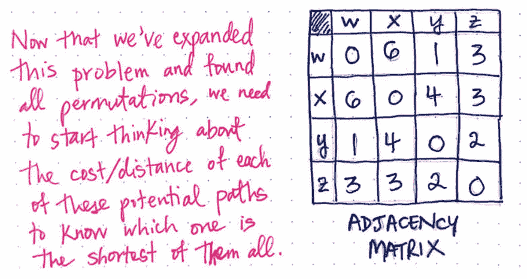](https://res.cloudinary.com/practicaldev/image/fetch/s--MxnMjKok--/c_limit%2Cf_auto%2Cfl_progressive%2Cq_auto%2Cw_880/https://cdn-images-1.medium.com/max/1024/1%2Aftd4VZ4Gs25pXZyOi0bwIw.jpeg) 

<figcaption>我们可以使用邻接矩阵来帮助我们跟踪边成本/距离。</figcaption>

</figure>

现在我们有了一个邻接矩阵来帮助我们，让我们用它来做一些数学——也就是一些*递归*数学！

### 镜子墙上的镜子，哪一个是所有路径中最短的？

为了确定这六条可能路径中哪一条是最短的——也是我们销售人员的理想选择——我们需要计算每一条路径的成本。

<figure>[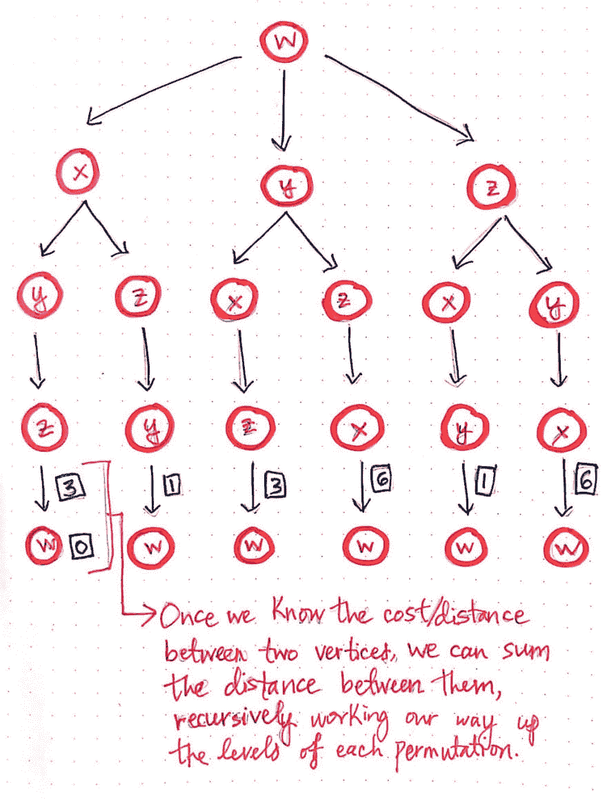](https://res.cloudinary.com/practicaldev/image/fetch/s--r3vehAvS--/c_limit%2Cf_auto%2Cfl_progressive%2Cq_auto%2Cw_880/https://cdn-images-1.medium.com/max/1024/1%2AlvnpHMLSdbg_QmVbez9dYQ.jpeg) 

<figcaption>使用递归计算 TSP 的递归成本，第 1 部分。</figcaption>

</figure>

因为我们已经使用递归来扩展这些路径，直到我们达到“没有更多节点可访问”的基本情况，所以我们可以开始封闭这些递归调用，并计算沿途每条路径的开销。

一旦我们知道了两个顶点之间的代价，我们就可以对它们之间的距离求和，然后从树上删除这个节点。这对于一个例子来说更有意义，所以让我们从这个树的最底层开始，直到找到最短路径的解决方案。

我们知道，这些分支中的每一个——每一个都代表这个特定问题的一种排列——都以我们开始的节点:节点 w 结束。我们将从节点 w 开始，并计算我们的销售人员前往那里的成本。

嗯，由于我们的销售员*从*节点 w 开始，到节点 w 的旅行成本实际上仅为 0。如果我们仔细想想，这是有道理的，因为我们的销售人员已经在这个顶点*，所以他去那里旅行不会“花费”任何东西！所以，底层的数学很简单——从 w 到 w 的成本是 0。接下来，我们将再次应用相同的技术，但这一次，我们将向上移动一个级别。*

<figure>[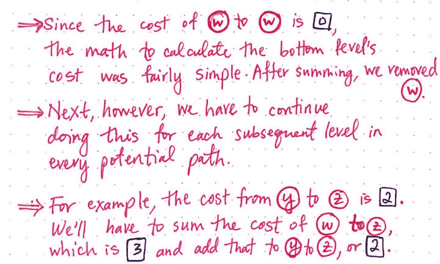](https://res.cloudinary.com/practicaldev/image/fetch/s--4Q1Ep3Fu--/c_limit%2Cf_auto%2Cfl_progressive%2Cq_auto%2Cw_880/https://cdn-images-1.medium.com/max/1024/1%2ALowOjtCs8n1RVh9RtioZkA.jpeg) 

<figcaption>理解 TSP 递归加法背后的逻辑。</figcaption>

</figure>

例如，如果我们参考上一节的邻接矩阵，我们会看到从 w 到 z 的旅行成本是 3。因为我们是从 w –> w –> z 开始旅行的，所以我们可以一边走一边计算每个顶点之间的距离。从 w –> w 行进是 0，从 w –> z 行进是 3，所以我们本质上是在计算 0 + 3。同理，从 z 到 y 的成本是 2。所以，我们需要计算 w –> w –> z-> y，也就是 0 + 3 + 2。

下图展示了这个加法是如何慢慢地沿着树向上进行的，压缩了最初构建它的递归调用。

<figure>[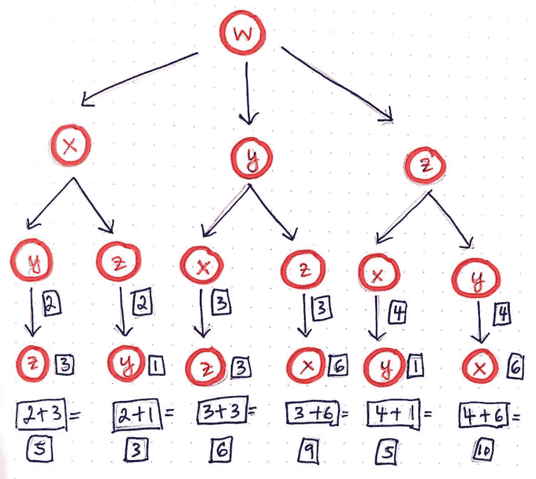](https://res.cloudinary.com/practicaldev/image/fetch/s--ADjENzOZ--/c_limit%2Cf_auto%2Cfl_progressive%2Cq_auto%2Cw_880/https://cdn-images-1.medium.com/max/1024/1%2AdD5z1tCS4nz36H3-HsbRGw.jpeg) 

<figcaption>使用递归计算 TSP 的递归成本，第 2 部分。</figcaption>

</figure>

通过这个过程，我们有效地构建了每条路径的成本或距离，一次一级，使用我们的树形结构。每次我们合计两个节点之间的距离时，我们可以从树中移除底部节点(两个节点中较深的一个被加在一起),因为我们不再需要使用它。

<figure>[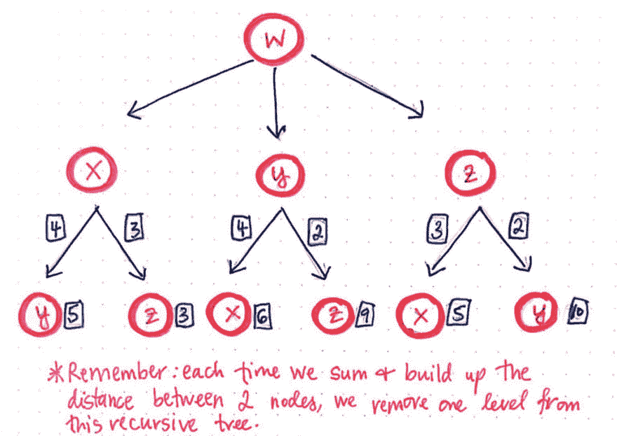](https://res.cloudinary.com/practicaldev/image/fetch/s--AJGOEG89--/c_limit%2Cf_auto%2Cfl_progressive%2Cq_auto%2Cw_880/https://cdn-images-1.medium.com/max/1024/1%2A3d9wGCv2i6wUUlN2b8V27A.jpeg) 

<figcaption>使用递归计算 TSP 的递归成本，第 3 部分。</figcaption>

</figure>

值得一提的是 ***我们需要跟踪这些路径*** 中的每一条，即使在我们完成了将它们的成本相加的工作之后。为了简洁起见，路径本身没有包括在这里显示的插图中。但是，跟踪哪些节点位于树的底部是至关重要的，否则，我们会丢失整个路径本身！

我们将继续这个过程，但在某个时候，一件奇怪的事情将会发生。在这个递归加法的下一次迭代中，我们会注意到我们来到了一个有趣的岔路口——字面上的意思！当我们到达第三层并压缩了树的底部时，我们有两种可能的选择来继续添加。

<figure>[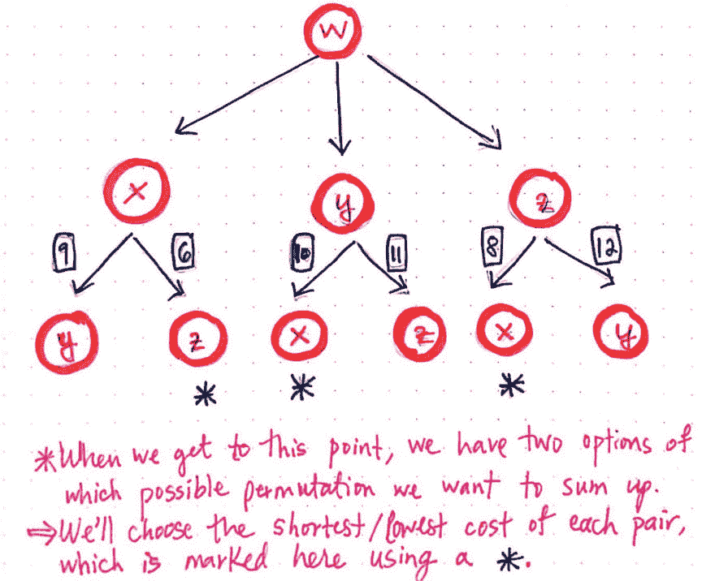](https://res.cloudinary.com/practicaldev/image/fetch/s--4SLZLlMF--/c_limit%2Cf_auto%2Cfl_progressive%2Cq_auto%2Cw_880/https://cdn-images-1.medium.com/max/1024/1%2AoK6wk5WUGgWiL8CaheTpig.jpeg) 

<figcaption>使用递归计算 TSP 的递归成本，第 4 部分。</figcaption>

</figure>

例如，查看来自节点 x 的子路径/分支，我们可以求和从 x 到 y 的距离，或者求和从 x 到 z 的距离。那么，我们如何决定选择哪一个呢？

<figure>[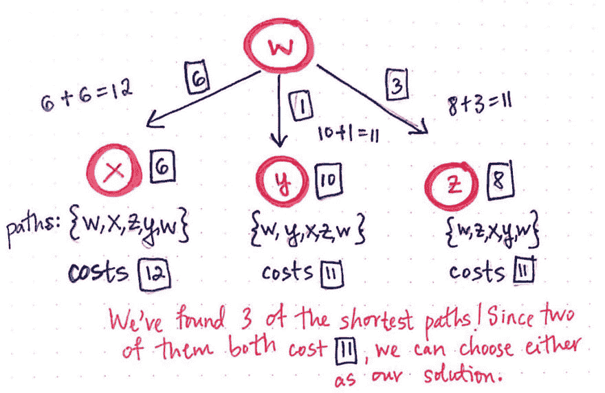](https://res.cloudinary.com/practicaldev/image/fetch/s--r2MJbTp0--/c_limit%2Cf_auto%2Cfl_progressive%2Cq_auto%2Cw_880/https://cdn-images-1.medium.com/max/1024/1%2AzKlrzo-c-Nior11lE6KEjw.jpeg) 

<figcaption>使用递归计算 TSP 的递归成本，第 5 部分。</figcaption>

</figure>

我们的直觉会告诉我们，我们正在寻找*最短路径*，这可能意味着我们会选择两个值中较小的*。这正是我们要做的！我们将选择从 z 到 x 的路径，因为该路径的开销是 6，这肯定小于从 y 到 x 的路径，后者是 9。*

 *一旦我们在“岔路口”选择了两条路径中最小的一条，我们就只剩下三条了。剩下要做的就是算出从 x 到 w，y 到 w，z 到 w 的总开销，参考我们的邻接矩阵，我们会看到这些距离分别是 6，1，3。

我们可以把这些加到我们一直在递归求和的路径的总成本上。在上图中，我们会看到，为了方便起见，我们确定的三条最短路径实际上都被记了下来。事实证明，有一条路径的开销是 12，有两条路径的开销都是 11。其中一个从 w 到 y，走 w -> y -> x -> z -> w 的路线，而另一个从 w 到 z，走 w -> z-> x -> u -> w 的路线。

> 因为我们三条路径中的两条在尺寸上相当小，所以我们选择哪一条并不重要；两者都是解决旅行商问题的“最短路径”。

我们做到了！我们已经通过寻找距离/成本为 11 的最短路径解决了哈密尔顿回路，该最短路径在节点 w 开始和结束。

<figure>[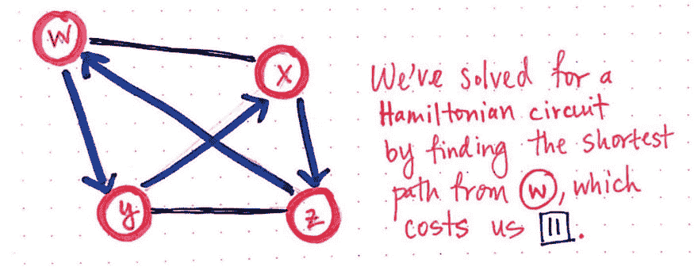](https://res.cloudinary.com/practicaldev/image/fetch/s--RK-3nP0e--/c_limit%2Cf_auto%2Cfl_progressive%2Cq_auto%2Cw_880/https://cdn-images-1.medium.com/max/1024/1%2AcYNjGZIwvWtH8cvQDuuPXA.jpeg) 

<figcaption>我们已经求解了一个哈密顿回路！</figcaption>

</figure>

解决这个问题很棒，对吧？一开始这看起来非常令人畏惧，但是随着我们的努力，每一步都变得越来越容易。但问题是:我们必须采取很多步骤来做到这一点。我们从一开始就知道，我们不会有这个问题的最优雅的解决方案——我们只是试图让*的东西*工作。但是暴力方法到底有多痛苦呢？

那么，如果不是一个推销员必须去四个城市，而是我们试图帮助一个必须去更多城市的推销员呢？如果他们要去的城市数量是 n 个会怎么样？我们的暴力技术会有多糟糕？

在第一个例子中，n = 4。我们还记得，因为我们已经访问了我们的第一个城市(节点 w)，我们只需要进行三次递归调用。换句话说，我们必须进行 4-1 或 n-1 次递归调用。

<figure>[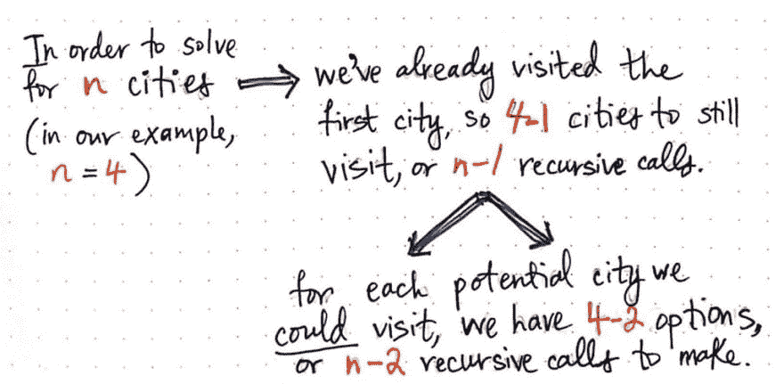](https://res.cloudinary.com/practicaldev/image/fetch/s--uNwu7_AD--/c_limit%2Cf_auto%2Cfl_progressive%2Cq_auto%2Cw_880/https://cdn-images-1.medium.com/max/1024/1%2AtC2-pOQxqooCSkEWmpib7g.jpeg) 

<figcaption>求解 n 个城市中的 TSP。</figcaption>

</figure>

但是，对于每一个递归调用，我们必须再生成两个递归调用！也就是说，对于我们*可以从三个节点 x、y 和 z 访问的每个潜在城市，我们有 4-2 = 2 条路径可供选择。从抽象的角度来说，在我们树的下一层，我们实际上有 n -- 2 个递归调用。*

<figure>[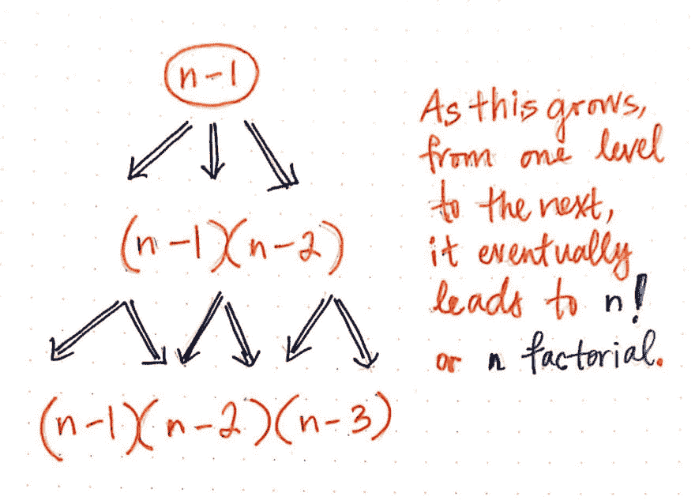](https://res.cloudinary.com/practicaldev/image/fetch/s--YePkIKcT--/c_limit%2Cf_auto%2Cfl_progressive%2Cq_auto%2Cw_880/https://cdn-images-1.medium.com/max/1024/1%2Av3p7WJqal4mvqhG_CKf6Jg.jpeg) 

<figcaption>构建一个不可扩展的“n 阶乘”问题。</figcaption>

</figure>

如果我们继续计算，我们会看到，在树的每一层，我们基本上都在寻找一个将要成为阶乘的数。更具体地说，我们将以 n 结尾！，或 ***n 阶乘*** 。

现在，当我们与一个只需要访问四个城市的销售人员打交道时，这真的不是太糟糕的情况。但是，当 n 比 4 大得多时，会发生什么呢？大多数销售人员不会只去四个城市旅行；几乎在所有现实情况下，n 都将是一个大得多的数字！

<figure>[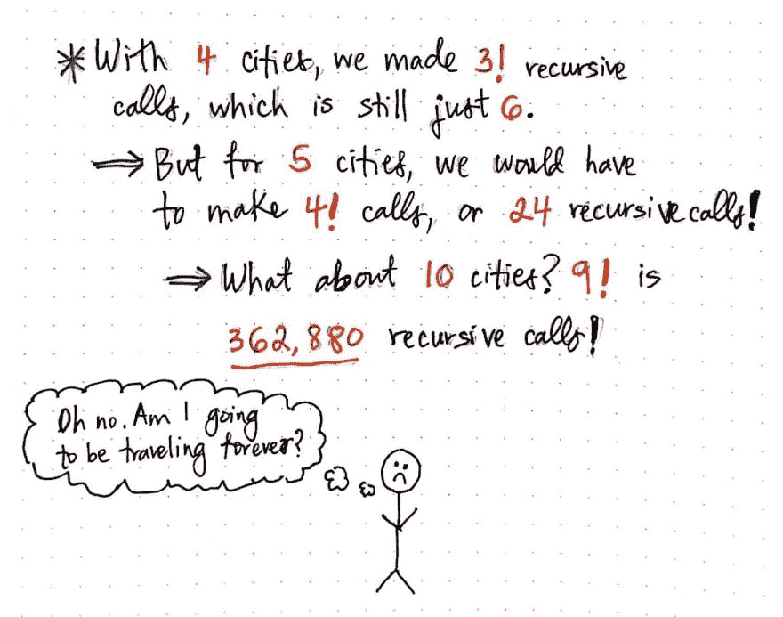](https://res.cloudinary.com/practicaldev/image/fetch/s--8WeKL_57--/c_limit%2Cf_auto%2Cfl_progressive%2Cq_auto%2Cw_880/https://cdn-images-1.medium.com/max/1024/1%2AVrIcOkBbzUAowT5U-IThFQ.jpeg) 

<figcaption>这位旅行推销员不是阶乘算法的粉丝！</figcaption>

</figure>

为了了解阶乘算法的不可伸缩性，我们不需要把 n 的值增加那么多。比如 n = 4 的时候，我们做了 3！或者 6 次递归调用。但是如果我们稍微增加一点，使 n = 5，我们将得到 4！或者 24 次递归调用，这将导致一个非常非常大的树。当 n = 10 时呢？这将导致 9！递归调用，这是一个非常大的数字:确切地说是 362，880。我们可能甚至无法想象，如果我们的销售人员不得不走遍这个国家的每一个城市，甚至是 10 个城市，会发生什么！

当然，一定有更好的方法来帮助我们的旅行推销员，使他不会永远旅行？当然有。但下周会有更多。与此同时，真的应该有人告诉这位销售人员关于易贝的事情——这可能会解决他很多的心痛！

### 资源

不出所料，有许多关于旅行推销员问题的资源。但是，并不是所有的都一定容易理解！其中一些深入问题的理论和数学，很难找到初学者友好的内容。这里有一些相当容易理解的资源，如果你想了解更多关于 TSP 的知识，这是一个很好的起点。

1.  [旅行推销员问题](https://www.youtube.com/watch?v=_51ot-Ri0ng)，0612 TV w/ NERDfirst
2.  [编码挑战#35.1:旅行销售员](https://www.youtube.com/watch?v=BAejnwN4Ccw)，编码列车
3.  [历史 TSP](http://www.math.uwaterloo.ca/tsp/history/index.html) ，滑铁卢大学数学系
4.  [旅行推销员问题](http://cs.indstate.edu/~zeeshan/aman.pdf)，阿曼努尔·拉赫曼教授说
5.  [旅行推销员问题简史](http://www.theorsociety.com/Pages/ORMethods/Heuristics/articles/HistoryTSP.aspx)，奈杰尔·卡明斯
6.  [旅行推销员问题及其变种](https://books.google.com/books?id=JBK_BAAAQBAJ&pg=PA1&lpg=PA1&dq=karl+menger+messenger&source=bl&ots=kXpnLrQ-0N&sig=A2KptpUYHRStauw4WRN7UcjYb9A&hl=en&sa=X&ved=0ahUKEwi419-si6nXAhUNwWMKHafyDkYQ6AEIPDAC#v=onepage&q=karl%20menger%20messenger&f=false)，格雷戈里·古丁和亚伯拉罕·p·彭宁

* * **