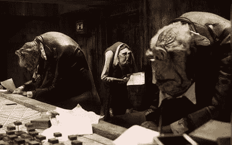

# 工程师有两种类型。兼而有之

> 原文：<https://dev.to/anotherdevblog/there-are-two-types-of-engineers-be-both>

不久前，我听了这个演讲。作者是[迈克尔·洛普](https://www.linkedin.com/in/michaellopp)——一位工程主管，曾在网景、苹果、Pinterest 等公司工作，现在是 Slack 的工程副总裁。很聪明的家伙。无论如何，在他的演讲中，他把工程师分成了两个基本原型:马厩和挥发物。

## 马厩——沃刚人

[T2】](https://res.cloudinary.com/practicaldev/image/fetch/s--i9XNw666--/c_limit%2Cf_auto%2Cfl_progressive%2Cq_auto%2Cw_880/http://anotherdevblog.net/asseimg/vogons.jpg)

他对马厩的描述如下:

*   愉快地有方向地工作
*   欣赏似乎有一个计划
*   比如时间表
*   与他人友好相处
*   有效率地运营非戏剧团队
*   冷静评估风险
*   小心地工作以减少失败(无论它是多么遥远或不可能)
*   倾向于生成过程，因为已知的过程创建可预测性和可测量性

如果我要画一幅这种类型的漫画，那就是《银河系漫游指南》中的沃贡人。

## 挥发物-牛仔

[T2】](https://res.cloudinary.com/practicaldev/image/fetch/s--Dm5EsWsM--/c_limit%2Cf_auto%2Cfl_progressive%2Cq_auto%2Cw_880/http://anotherdevblog.net/asseimg/cowboy.jpg)

他是这样描述挥发物的:

*   更喜欢定义策略，而不是遵循它
*   无法想象失败
*   在风险中寻找刺激
*   通常不构建可预测或稳定的东西，但他们肯定构建了很多
*   只有符合他们的利益时，他们才是可靠的
*   认为与他人合作既费时又费力
*   喜欢在小型自治团队中工作
*   我不在乎你的感受

想想马克·扎克伯格的老话，“快速行动，打破常规。”我在业内最常听到的描述 volatiles 的术语是“牛仔开发者”

## 不可避免的冲突

思维方式如此不同，必然会有冲突。洛普指出，马厩和挥发物确实互相讨厌。"挥发性物质认为马厩是缓慢、懒惰和政治官僚."我认为厩另一方面“视挥发物为不持有任何神圣的东西，为所欲为的*^#！他们想要。”在不得不与对方共事的压力下，两人总是会感到恼火。

但是 Lopp 指出“这种冲突是一件好事。”

## 不被一方蹂躏。你两者都需要

[T2】](https://res.cloudinary.com/practicaldev/image/fetch/s--XutAn7yA--/c_limit%2Cf_auto%2Cfl_progressive%2Cq_auto%2Cw_880/http://anotherdevblog.net/asseimg/balance.jpg)

Lopp 指出，初创公司通常从少数挥发性物质开始——思维敏捷的创新者可以非常非常快地制作出一个工作 1.0 产品。他们做荒谬的事，完成不可能的事，用新的想法震撼每个人。但一旦公司开始获得牵引力，这些将他们的生命倾注到 1.0 turn 中的挥发物就会变成马厩。当一个新的热门人物进来，想要开始修剪和建造下一个危险的，令人惊讶的东西时，旧的马厩推回来，保护他们运行良好的产品免受新一代挥发物的干扰。

“这就是公司死亡的方式，”他说它们完全从挥发物转变成稳定物质。他们开始保护运行良好、可靠的产品免受新一代挥发物的随意“创新”的破坏。新雇佣的挥发物加入，但很快离开。他们觉得繁琐的手续让他们不堪重负。他们嗅到了死亡和停滞。这就是几年前苹果发生的事情。这就是为什么史蒂夫·乔布斯被重新请回来——因为他从来没有成为一个稳定的人。他始终是一个反复无常的人，正因为如此，他拯救了一家濒临倒闭的公司。

确保挥发性物质和稳定物质在你的公司里都感到舒适和自在是至关重要的。没有挥发性物质，就不会有激动人心的事情发生，没有稳定性，就不会有足够长的时间来建立一个企业。“挥发物，”他说，“提醒你没有什么是永恒的。他们认为，取代低效、无聊、无趣的东西是他们生活中的使命。”你需要那个。“马厩，”他补充道，“提醒你现实，定义过程。它们为您的执行带来了可预测性、可信度和可重复性。”你也需要这一点，一旦你达到一定规模，就需要同等的代表性。他说，公司面临的挑战是“创造一个(挥发性物质)可以扰乱的世界，每个人都清楚他们扰乱的价值”，同时对“栅栏另一边”的稳定和挥发性物质给予同等的重视。"

## 最好的公司两者兼得。最好的开发商*是*两者

[T2】](https://res.cloudinary.com/practicaldev/image/fetch/s--i3RTQwV4--/c_limit%2Cf_auto%2Cfl_progressive%2Cq_auto%2Cw_880/http://anotherdevblog.net/asseimg/super-dev.jpg)

Lopp 将稳定和不稳定的开发人员的原型呈现为一个谱系，大多数工程师倾向于这一方或那一方，少数人在中间找到了平衡。然而，我不同意这一点。我合作过的最好的开发人员不仅仅是在两个极端之间——他们同时是两者。挥发性物质不会看着他们，看到一个有点太重过程的好开发人员，马厩不会看到一个受约束的牛仔。他们同时完全符合两种原型的所有优点。他们大胆、勇敢，并且愿意做一些疯狂和新奇的事情。但他们也对产品和让他们走到今天的摇钱树保持着健康的尊重。他们创新，但他们创新得很聪明。

我仍然在试图找出我最适合这个“开发人员性格测试”的原型早些时候，我的同事们可能会，不，肯定会说我在领导反复无常的牛仔们。但是随着时间的推移，我觉得我已经开始远离这一点了。当有一个仓促的项目，一个不断变化的截止日期，或者没有时间对单元测试、设计和重构进行尽职调查时，我发现自己在拉缰绳，并在电子商务开发所需的极快的速度面前犹豫不决。也许我正在向中间移动。但如果我两者兼而有之会更好。

那么，你的立场是什么？

* * *

这篇文章最初出现在另一个开发者博客上