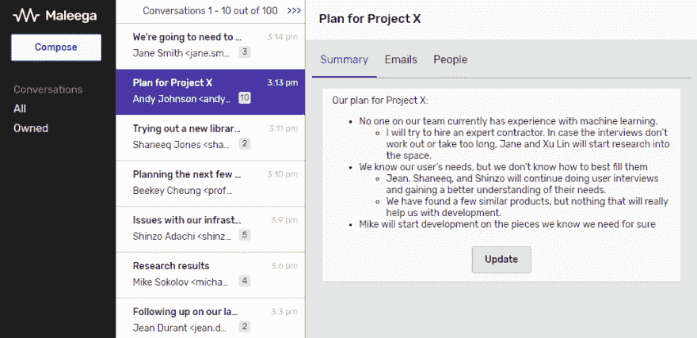
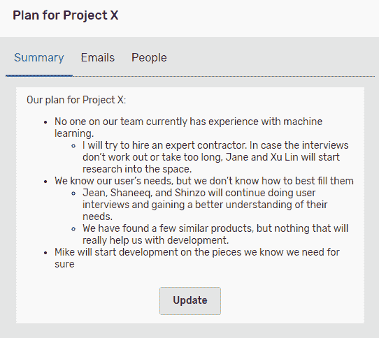
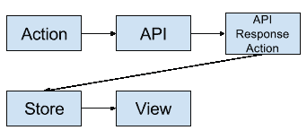
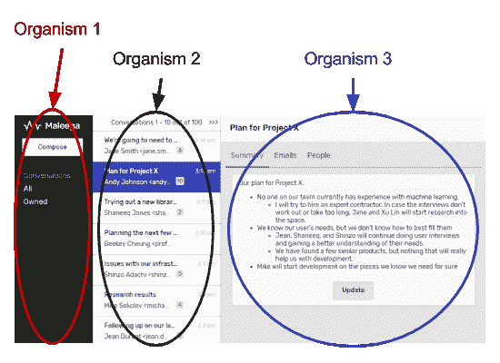
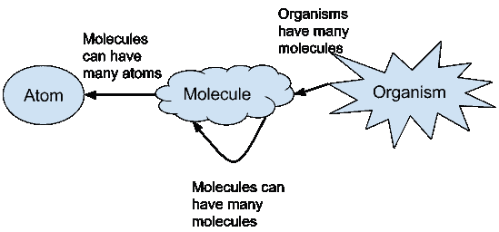
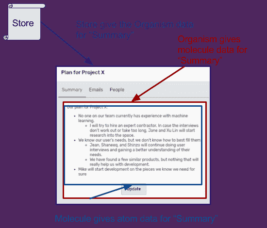
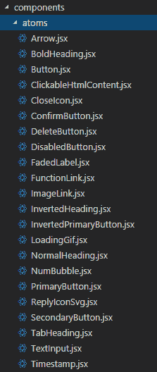
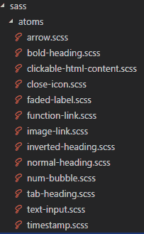

# 关于前端架构的思考

> 原文：<https://dev.to/pbeekums/thoughts-on-front-end-architecture-7k8>

九月初，我决定重建我新产品的前端。我做出这个决定的部分原因是，我建造我的 alpha 时，就打算重建它。这个决定很大程度上是因为我想对我的内容页面做些什么。

我个人不喜欢大多数主页和内容页。他们有很多内容，但最终很少谈到产品的实际功能。我害怕创建这种内容的想法。

[T2】](https://res.cloudinary.com/practicaldev/image/fetch/s--M9U8GJkI--/c_limit%2Cf_auto%2Cfl_progressive%2Cq_auto%2Cw_880/https://blog.professorbeekums.com/img/2017/10/architecture.jpg)

然后我注意到[几乎每个](https://trix-editor.org/) [富文本](https://quilljs.com/) [编辑器](http://neilj.github.io/Squire/)的主页上都有他们富文本编辑器的演示。多完美啊！他们只是提前向你展示产品，而不是东拉西扯。你可以立刻看出你是否喜欢它。没有必要跳过许多营销演讲。

试图模仿这一点的问题是 RTEs 演示真的很好，因为该产品是一个纯粹的前端组件。能够在任何网页上轻松显示它是一个很大的挑战。我的产品有一个后端处理。允许一个面向公众的演示影响你的后端会涉及到各种各样的问题，并且仅仅为了演示就需要大量的定制开发。

所以我的目标是以一种允许我重用生产前端代码并使用演示数据而不是实际后端的方式重建我的前端。这里的另一个要点是，整个应用程序不能很好地适应网页上的组件:

[T2】](https://res.cloudinary.com/practicaldev/image/fetch/s--nuV1lkHc--/c_limit%2Cf_auto%2Cfl_progressive%2Cq_auto%2Cw_880/https://maleega.com/static/img/hero_screen.png)

这意味着我需要能够从应用程序中提取一个组件，并让它[完全可用:](https://maleega.com/howitworks#summaryarea)

[T2】](https://res.cloudinary.com/practicaldev/image/fetch/s--0R292MyJ--/c_limit%2Cf_auto%2Cfl_progressive%2Cq_auto%2Cw_880/https://maleega.com/static/img/home_summary.png)

为此，我受到了原子设计和 T2 通量的重大影响。简单地说，原子设计就是将面向对象的原则应用于前端组件。前端中最小的组件是原子。这些是字面上的按钮，输入字段，文本字段等。接下来是包含多个原子的分子。生物体包含分子。模板包含生物体。页面包含模板。

Flux 本质上是数据单向流动的概念。您的视图包含按钮、文本字段和图像。按钮实际上不会影响视图。它触发一个操作存储中的数据的动作。商店然后告诉视图显示什么。

Flux 留给开发人员决定的部分是如何实现对后端的 API 调用。这是对我影响最大的部分，因为我的目标是有一个后端免费演示。天真的解决方案是为 API 调用创建一个新的类，并把它放在动作和存储之间。  但是如何处理 API 响应呢？在 API 类内部。为了有一个后端免费演示，我还需要将调用后端的代码与处理数据的代码分开。这里的解决方案是一种不同类型的动作，它不是由 UI 触发的，而是由 API 调用的响应触发的。  我还需要另一个类来决定我想要的 API 的实现。这样我就可以无缝地用服务器 API 替换演示 API。那么原子设计在哪里发挥作用呢？

不知何故，商店应该告诉观众展示什么。但是视图是由许多组件组成的。商店应该和哪一个人谈？对于我的应用程序，我知道我希望某些组件是独立的应用程序。这些可以做我的演示。

我判断这些组件是我的有机体。对我来说，有机体是可以完全自给自足的东西，不需要其他有机体的背景。[T2】](https://res.cloudinary.com/practicaldev/image/fetch/s--ieGdy99M--/c_limit%2Cf_auto%2Cfl_progressive%2Cq_auto%2Cw_880/https://blog.professorbeekums.com/img/2017/10/maleega_organisms.png)

顶层是原子，底层是原子，我们只剩下分子了。考虑到我的一些屏幕有多复杂，我需要的不仅仅是 3 层组件。这意味着分子可以包含其他分子以及一个或多个原子。

[T2】](https://res.cloudinary.com/practicaldev/image/fetch/s--Ndudrcp2--/c_limit%2Cf_auto%2Cfl_progressive%2Cq_auto%2Cw_880/https://blog.professorbeekums.com/img/2017/10/atomic_design.png)

与此同时，商店将永远只与有机体交流。有机体有责任将任何数据传递给它的分子。

[T2】](https://res.cloudinary.com/practicaldev/image/fetch/s--GWTE8v84--/c_limit%2Cf_auto%2Cfl_progressive%2Cq_auto%2Cw_880/https://blog.professorbeekums.com/img/2017/10/store_organism.png)

现在，如果我需要一个生产应用程序，它包含服务器 API 和所有 3 个有机体的代码。

如果我想要一个演示应用程序，它包含一个演示 API 和一个有机体的代码。

一个演示应用程序的代码量少于 50 行+一些内容的 JSON 数据。哦，几乎所有的演示应用程序的代码都是锅炉板的东西，如函数签名和导入语句。搭建一个演示 app 的时间不到 5 分钟(不包括内容)。

这种架构还有其他一些优点。我主要是一名后端开发人员，过去曾经花了很多时间调试前端代码。有了明确的责任划分(例如，只有行动才能启动变更，有机体是商店和所有其他组件之间的桥梁)，找出 bug 在哪里就变得容易多了。现在，我很少花超过几分钟的时间来寻找前端 bug 的根本原因。

最重要的是，构建演示应用的能力意味着我也可以构建测试应用。我在构建 selenium 测试框架时经常遇到的问题是如何确保每个测试都有确定的数据集。对于每次执行测试都会改变状态的后端来说，这确实是一个挑战。有了这个，我就可以创建一个“测试 API ”,它将在每次测试运行之前被重置。没有怪异的基础设施来恢复种子数据库或样板测试代码来设置和重置测试用例。

然而，这种构建前端的方式有一个巨大的缺点:大量的输入。至少在开始的时候。确保 UI 的每一部分都可以归结为一个原子会导致编写大量的原子:

[T2】](https://res.cloudinary.com/practicaldev/image/fetch/s--QrgBLqBI--/c_limit%2Cf_auto%2Cfl_progressive%2Cq_auto%2Cw_880/https://blog.professorbeekums.com/img/2017/10/so_many_atoms.png)

哦，我有没有提到每个 CSS 都有自己的 SASS 文件？

[T2】](https://res.cloudinary.com/practicaldev/image/fetch/s--BG30d9sc--/c_limit%2Cf_auto%2Cfl_progressive%2Cq_auto%2Cw_880/https://blog.professorbeekums.com/img/2017/10/so_many_css.png)

我经常遇到这样的情况，我问自己“我真的想把这个场打成原子吗？”坚持这种模式需要一点意志力。

将生物体作为存储和分子之间的桥梁也意味着，为了获得一些数据，你可能最终不得不接触许多分子。我发现自己修改了半打文件,只为了显示一个字段。与服务器的交互很容易需要接触两倍数量的文件。要写的代码太多了。

最后，我发现这只是一个小小的代价。我的大部分时间通常不会花在输入代码上。时间通常花在调试代码上。几分钟的额外输入比几个小时的调试要好得多。最重要的是，我可以有一个演示应用程序，它使用与生产应用程序相同的代码，这节省了我编写和测试代码的时间。