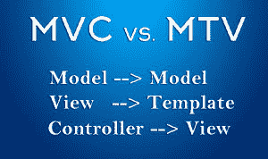

# 理解 Django 中的 MVC 模式

> 原文：<https://dev.to/kolokodess/understanding-the-mvc-pattern-in-django>

作为这篇文章的续篇，我为初学者提供了一个关于如何开始使用 Django 的教程。在此期间，我谈到了 Django 如何以一种新的方式拥抱流行的模型-视图-控制器模式，以及第一次理解它会有一点困难(是的，我也花了一段时间理解它)
所以在这篇文章中，我将更深入地了解 MVC 模式是如何工作的，以及它如何在范围上与 Django 相关联。

MVC 模式是一种软件架构模式，它将数据表示从处理用户交互的逻辑中分离出来(换句话说，减轻您的压力:)，它作为一个概念出现已经有一段时间了，并且自出现以来一直在以指数级的速度增长。它也被描述为创建客户机-服务器应用程序的最佳方式之一，所有最好的 web 框架都是围绕 MVC 概念构建的

为了分解它，这里有一个 MVC 概念的概述；

**Model** :它处理你的数据表示，它充当存储在数据库本身中的数据的接口，还允许你与你的数据进行交互，而不必被底层数据库的所有复杂性所困扰。

**视图**:顾名思义，它代表了您在浏览器上看到的 web 应用程序或在桌面应用程序的 UI 中看到的内容。

**控制器**:提供逻辑来处理视图中的表示流或更新模型的数据，即，它使用编程逻辑来计算通过模型从数据库中提取并传递给视图的内容，还通过视图从用户处获取信息，并通过改变视图或通过模型更新数据来实现给定的逻辑，为了使其更简单，将其视为引擎室。

现在我们已经理解了 MVC 的一般概念，理解它在不同框架中是如何实现的可能是另一项任务，因为一些框架(包括 Django)喜欢以另一种方式实现相同的功能，这使得理解每一层实际发生的事情有点困难。

我们如何将它与 Django 中的范围联系起来？

即使 Django 遵循 MVC 模式，它也更喜欢在实现中使用自己的逻辑，框架考虑处理 MVC 本身的控制器部分，并让大多数好的东西发生在模型-模板-视图中，这就是为什么 Django 通常被称为 MTV 框架。

**在 MTV 模式中:**

**模型**:就像 MVC 模式中的模型解释一样，这也与数据之间的接口或关系占据相同的位置，包含了与数据访问和验证相关的一切。

**Template** :这与 MVC 模式中的视图有关，因为表示层处理框架中的表示逻辑，并且基本上控制应该显示什么以及如何向用户显示。

**视图**:该部分与 MVC 模式中的控制器相关，处理所有的业务逻辑，并返回给各自的模板。它充当模型和模板之间的桥梁

这其中最令人困惑的一点就是 Django 建议视图应该包含业务逻辑而不是单独的表示逻辑，因为在标准 MVC 模式和模板中，它单独处理所有的表示逻辑，而 MVC 模式根本不包含模板组件。因此，与标准 MVC 模式相比，Django 的设计也被称为*模型-模板-视图+控制器*，其中控制器经常被省略，因为它已经是框架的一部分。
尽管在深入开发之前理解这种模式真的很有帮助，但最终最重要的是，你能够完成工作，谢天谢地 Django 帮助提供了一个面向编程效率的生态系统:)。

觉得这篇文章有帮助？别忘了推荐分享:)

*原载于我的媒体刊物[此处](https://medium.com/shecodeafrica/understanding-the-mvc-pattern-in-django-edda05b9f43f)T3】*