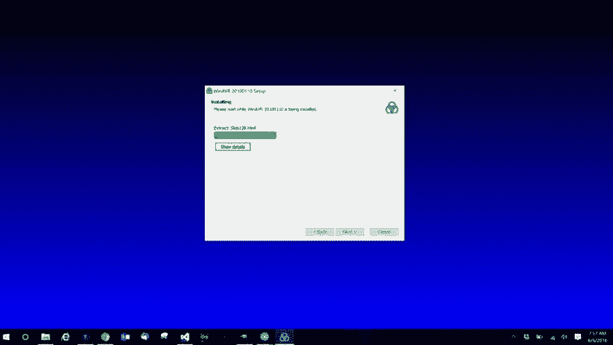
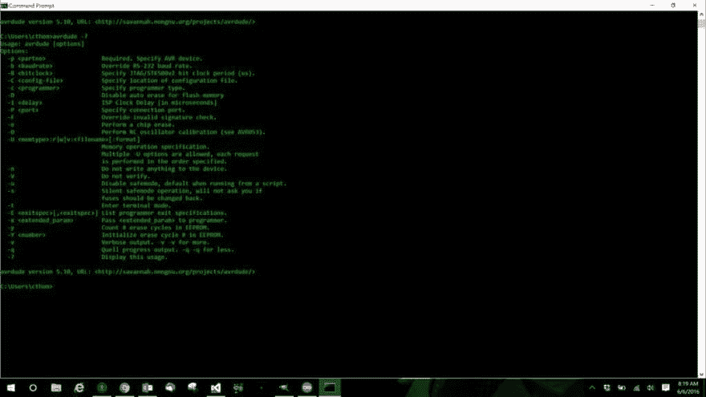
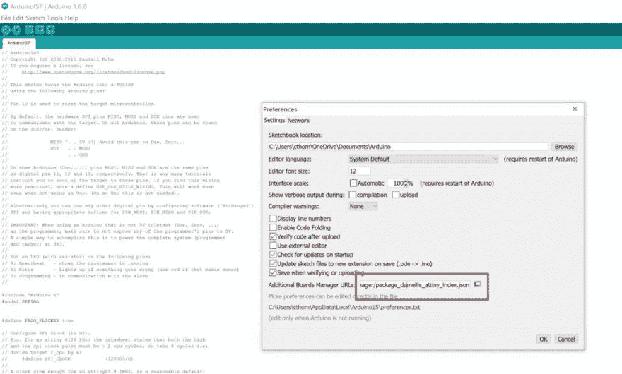
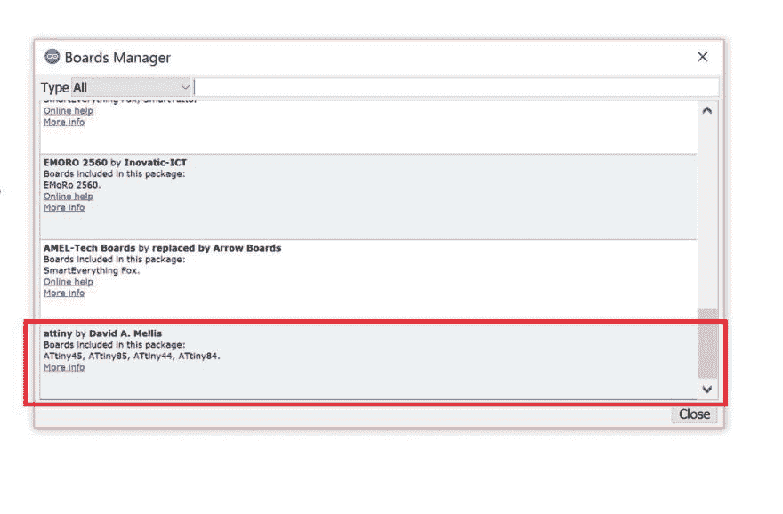
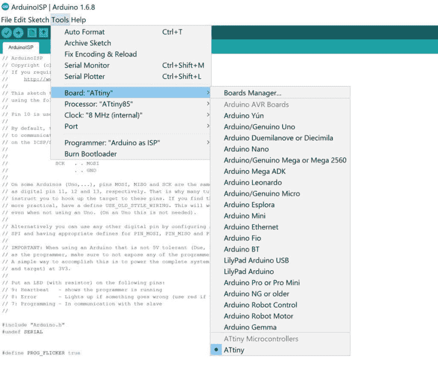
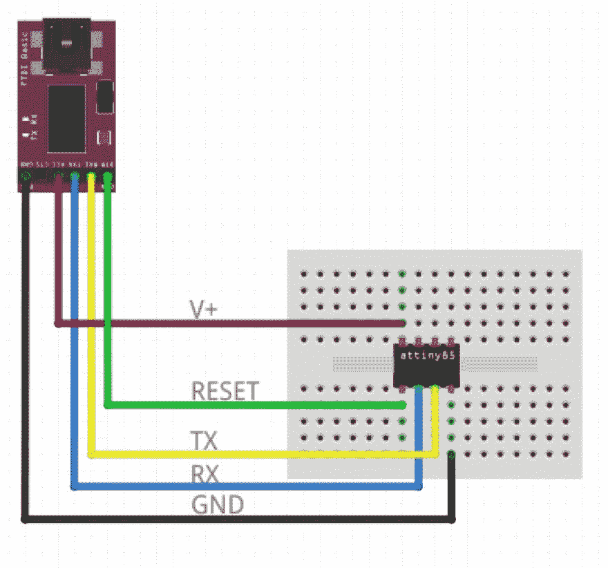

# 通过 UART 将 Arduino 或 AVR 程序上传到 ATtiny84/85

> 原文：<https://dev.to/ladvien/upload-arduino-or-avr-programs-to-attiny8485-over-uart-20e4>

这篇文章将向你展示如何使用一个双线接口(UART)将 Arduino 草图上传到 ATtiny85。简而言之，我们将使用一个 [Arduino Uno 作为 ISP 程序员](https://www.arduino.cc/en/Tutorial/ArduinoISP)将 [TinySafeBootloader](http://jtxp.org/tech/tinysafeboot_en.htm) 烧录到 ATtiny85 上。在初次刻录引导加载程序后，我们可以使用任何 FTDI 兼容的 USB 转 UART 对 ATtiny85 进行编程。并且可以遵循非常相似的步骤来对 ATtiny84 做同样的事情。

有一些要求和大量的设置需要:

#### 先决条件:

*   ATtiny85 / 84 或 ATmega328P
*   Windows 10
*   Arduino Uno(或兼容的，这将用于一次性将引导加载程序刻录到 ATtiny85)
*   [FTDI 或兼容 UART](http://www.ebay.com/itm/NF-FTDI-FT232RL-USB-to-TTL-Serial-Converter-Adapter-Module-5V-3-3V-For-Arduino-/2218473463540)
*   TinySafeBoot 上传器
*   [Arduino IDE](https://www.arduino.cc/en/Main/Software)
*   [AVRDUDE](https://sourceforge.net/projects/winavr/)

#### 有用成分:

*   电路板按钮
*   220-330 欧姆电阻器
*   发光二极管

## 为什么？

许多人可能会问，“真的，为什么我要大费周章地在 ATtiny85 上安装一个引导加载程序，而使用 Arduino ISP 就没那么麻烦了？”好问题。

这篇文章并不是独立的。这样做的全部目的是为无线上传 Arduino 草图或 AVR 二进制文件准备 ATtiny85(实际上是任何 ATtiny orATmega uCs)。

## 第一步:上传 ArduinoISP 草图

[T2】](https://res.cloudinary.com/practicaldev/image/fetch/s---Pb0Mp7B--/c_limit%2Cf_auto%2Cfl_progressive%2Cq_auto%2Cw_880/https://ladvien.cimg/2017-06-09-upload-arduino-or-avr-programs-attiny85-uart/02_img_2017-06-09-upload-arduino-or-avr-programs-attiny85-uart.jpg)

上传 ArduinoISP 草图
有几个关于如何将 Arduino 用作 ISP 的指南:

*   [用 Arduino](https://www.youtube.com/watch?v=muP1dp73Mdg) 编程 AVR(视频)
*   [使用 Arduino 作为 AVR ISP(系统内程序员)](https://www.arduino.cc/en/Tutorial/ArduinoISP)

但是为了以防万一，请简要概述一下步骤。

在将 Arduino Uno 连接到 ATtiny85 之前，您需要将 Arduino ISP 草图安装到 Arduino Uno 上。这是内置在 Arduino IDE 中的。

*   文件->示例- > 11。ArduinoISP - > ArduinoISP

然后点击上传按钮。ArduinoISP 草图上传后，是时候将我们的引导程序烧录到 ATtiny85 上了。如上图所示，将您的 ATtiny85 连接到 Arduino Uno。

## 第二步:连接 ATtiny85 和 Arduino

[T2】](https://res.cloudinary.com/practicaldev/image/fetch/s---Pb0Mp7B--/c_limit%2Cf_auto%2Cfl_progressive%2Cq_auto%2Cw_880/https://ladvien.cimg/2017-06-09-upload-arduino-or-avr-programs-attiny85-uart/02_img_2017-06-09-upload-arduino-or-avr-programs-attiny85-uart.jpg)

现在 ArduinoISP 的草图已经上传了，是时候把我们的引导程序烧到 ATtiny85 上了。继续将您的 ATtiny85 连接到 Arduino Uno，如图所示。

## 第三步:安装 AVRDUDE

[T2】](https://res.cloudinary.com/practicaldev/image/fetch/s--kyDR3TFW--/c_limit%2Cf_auto%2Cfl_progressive%2Cq_auto%2Cw_880/https://ladvien.cimg/2017-06-09-upload-arduino-or-avr-programs-attiny85-uart/04_img_2017-06-09-upload-arduino-or-avr-programs-attiny85-uart.jpg)

现在，我们需要安装 WinAVR

*   [WinAVR 下载](https://sourceforge.net/projects/winavr/)

## 第四步:在 ATtiny85 上刻录 TinySafeBootloader

[T2】](https://res.cloudinary.com/practicaldev/image/fetch/s--v6VMMr0G--/c_limit%2Cf_auto%2Cfl_progressive%2Cq_auto%2Cw_880/https://ladvien.cimg/2017-06-09-upload-arduino-or-avr-programs-attiny85-uart/05_img_2017-06-09-upload-arduino-or-avr-programs-attiny85-uart.jpg)

在 ATtiny85
上烧录 TinySafeBootloader 一旦 AVRDUDE 成功安装，进入开始菜单并键入

*   煤矿管理局

这将打开 Windows 命令提示符。现在，让我们确保安装了 AVRDUDE。类型:

*   阿弗瑞德

然后按回车键。您应该会看到类似于图像中的输出。

**请听我的警告** 我们将要做的事有可能会毁了你的一生 85。更具体地说，如果我们在 ATtiny85 上设置错误的保险丝，可能会导致芯片无法使用。也就是说，让我们花点时间谈谈我们正在做的事情。

此时，我们的 Arduino Uno 被设置为 ISP。我们计划使用 AVRDUDE 来告诉 ISP 将 TinySafeBootloader 刻录到我们的 ATtiny85 上。在此过程中，我们还将在 ATtiny85 上设置保险丝。这些保险丝是告诉 ATtiny85 如何行动的记忆位。在任何支持的 ATtiny 上使用 TinySafeBoot 需要设置两个。

ATtiny85 和 ATtiny84(或任何其他受支持的 ATtiny):

1.  SELFPRGEN -必须置位以从固件启用闪存写入
2.  应设置 BODLEVEL，以避免在不安全的设备上电期间闪存损坏。

如果您遵循 ATmega 系列的指南，保险丝需要:

1.  BOOTRST - activated 允许 MCU 在每次硬件复位时跳转到 Bootloader 部分。
2.  应设置 BODLEVEL，以避免在不安全的设备上电期间闪存损坏。
3.  BOOTSZ=11 -为 Bootloader 部分保留 512 个字节。
4.  BLB -设置为模式 2 或 3，以保护引导加载器部分免受固件不希望的写访问。

如果你不太相信我，或者你想了解更多关于保险丝的信息，这里有一个很好的解释。

*   [AVR 保险丝](https://embedderslife.wordpress.com/2012/08/20/fuse-bits-arent-that-scary/)

使用 AVRDUDE 烧录 bootloader 时，保险丝设置将被写入 ATtiny85。欢迎您使用漂亮的嵌入式 web 应用程序来计算自己的保险丝:

*   [AVR 保险丝计算器](http://www.engbedded.com/fusecalc/)

不过，我已经提供了对 ATtiny 84、85 和 ATmega328P 进行编程所需的两个命令。复制第一个命令并将其粘贴到 Windows 提示符下。如果命令成功，复制第二个命令。如果两个命令都成功，那么现在您应该已经在 ATtiny 或 ATmega 芯片上安装了 TSB。

要上传的 AVRDUDE 命令:

#### at tiny 85 1 MHz

```
avrdude -P COM# -b 19200 -c avrisp -p t85 -v -e -U lfuse:w:0x62:m -U hfuse:w:0xdd:m -U efuse:w:0xfe:m
avrdude -P COM# -b 19200 -c avrisp -p t85 -v -e -U flash:w:tsb_tn85_b3b4_20150826.hex
ATtiny85 at 8mhz

avrdude -P COM# -b 19200 -c avrisp -p t85 -v -e -U lfuse:w:0xe2:m -U hfuse:w:0xdd:m -U efuse:w:0xfe:m
avrdude -P COM# -b 19200 -c avrisp -p t85 -v -e -U flash:w:tsb_tn85_b3b4_20150826.hex 
```

Enter fullscreen mode Exit fullscreen mode

#### at tiny 84 1 MHz

```
avrdude -P COM# -b 19200 -c avrisp -p t84 -v -e -U lfuse:w:0x62:m -U hfuse:w:0xdf:m -U efuse:w:0xfe:m
avrdude -P COM# -b 19200 -c avrisp -p t84 -v -e -U flash:w:tsb_tn84_a0a1_20150826.hex 
```

Enter fullscreen mode Exit fullscreen mode

#### at tiny 84 8 MHz

```
avrdude -P COM# -b 19200 -c avrisp -p t84 -v -e -U lfuse:w:0xe2:m -U hfuse:w:0xdf:m -U efuse:w:0xfe:m
avrdude -P COM# -b 19200 -c avrisp -p t84 -v -e -U flash:w:tsb_tn84_a0a1_20150826.hex 
```

Enter fullscreen mode Exit fullscreen mode

#### 8mhz 的 ATtmega328P

```
avrdude -P COM# -b 19200 -c avrisp -p m328p -v -e -U lfuse:w:0xFF:m -U hfuse:w:0xDA:m -U efuse:w:0x05:m
avrdude -P COM# -b 19200 -c avrisp -p m328p -v -e -U flash:w:tsb_m328p_d0d1_20150826.hex 
```

Enter fullscreen mode Exit fullscreen mode

#### 16mhz 时的 ATmega328P

```
avrdude -P COM# -b 19200 -c avrisp -p m328p -v -e -U efuse:w:0x05:m -U hfuse:w:0xD6:m -U lfuse:w:0xFF:m
avrdude -P COM# -b 19200 -c avrisp -p m328p -v -e -U flash:w:tsb_m328p_d0d1_20150826.hex 
```

Enter fullscreen mode Exit fullscreen mode

如果你有任何问题，请在下面的评论中留下你的问题。

## 第五步:为 ATtiny 板卡设置 Arduino

[T2】](https://res.cloudinary.com/practicaldev/image/fetch/s--gFdv2oip--/c_limit%2Cf_auto%2Cfl_progressive%2Cq_auto%2Cw_880/https://ladvien.cimg/2017-06-09-upload-arduino-or-avr-programs-attiny85-uart/06_img_2017-06-09-upload-arduino-or-avr-programs-attiny85-uart.jpg)

为 ATtiny 板设置 Arduino-1
您需要将 ATtiny 板支持添加到 Arduino IDE 中。这可以通过以下方式完成:

*   文件->首选项

然后在标有“附加公告板管理器 URL”的框中输入以下内容

*"[https://raw . githubusercontent . com/damellis/attiny/ide-1.6 . x-boards-manager/package _ damellis _ attiny _ index . JSON](https://raw.githubusercontent.com/damellis/attiny/ide-1.6.x-boards-manager/package_damellis_attiny_index.json)"*

## 步骤 6:为 ATtiny 板卡设置 Arduino

[T2】](https://res.cloudinary.com/practicaldev/image/fetch/s--KDfO8yiq--/c_limit%2Cf_auto%2Cfl_progressive%2Cq_auto%2Cw_880/https://ladvien.cimg/2017-06-09-upload-arduino-or-avr-programs-attiny85-uart/07_img_2017-06-09-upload-arduino-or-avr-programs-attiny85-uart.jpg)

然后转到，

*   工具->电路板->电路板管理器

现在您已经添加了附加电路板 URL，应该有一个选项:

*   大卫·梅里斯的《阿蒂尼》

安装此软件包。

## 第七步:选择 ATtiny85

[T2】](https://res.cloudinary.com/practicaldev/image/fetch/s--_R0GT3o4--/c_limit%2Cf_auto%2Cfl_progressive%2Cq_auto%2Cw_880/https://ladvien.cimg/2017-06-09-upload-arduino-or-avr-programs-attiny85-uart/08_img_2017-06-09-upload-arduino-or-avr-programs-attiny85-uart.jpg)

选择 ATtiny 85
现在，您应该有 attini 组列在下面

*   工具->电路板- > ATtiny

选择你正在使用的处理器和速度，然后输入你想上传的程序。完成代码后，请访问:

*   草图->导出编译的二进制文件

通常，Arduino IDE 负责上传，但是，它不知道如何与 TinySafeBootloader 接口。这就是米露上传程序的用武之地。

## 第八步:下载上传程序

下载上传器
下载我的米露上传器(Windows 10)。它只需要花费数十亿美元；不，这是免费的。

米露上传者

警告:此上传程序正在运行中。如果你想深入了解它的来源，可以在这里找到:

米露上传源

最终，我可能会为 Mac 和 iOS 重新编写这个应用程序。但是首先要把 Windows 版本的漏洞清除掉。

## 第九步:将 UART IC 连接到 ATtiny85

[T2】](https://res.cloudinary.com/practicaldev/image/fetch/s--lvluJn2---/c_limit%2Cf_auto%2Cfl_progressive%2Cq_auto%2Cw_880/https://ladvien.cimg/2017-06-09-upload-arduino-or-avr-programs-attiny85-uart/09_img_2017-06-09-upload-arduino-or-avr-programs-attiny85-uart.jpg)

将 UART IC 连接到 ATtiny85
如图所示，将 UART IC 连接到 ATtiny85。

## 第十步:上传 Arduino 草图到 ATtiny85

该上传草图了！

打开米露上传器
选择您的 FTDI 芯片所连接的 COM 端口
设置波特率在 9600-56700 之间
点击“连接”
然后点击连接“连接到 TSB”
如果找到芯片，它将显示连接芯片的信息
使用“打开文件”导航到我们在步骤 8 中导出的二进制文件(确保选择不包含引导程序的版本)。
文件完全加载后，点击“写文件”按钮
恭喜，如果一切顺利，你的草图现在应该在 ATtiny85 上了！
如果不是，那么，让我们来排除故障:

如果你点击“重置”按钮会发生什么？这会将 DTR 线发送到低电平，然后发送到高电平，本质上是重置 ATtiny85
您是否意外选择了二进制文件中包含的引导加载程序版本？
是否选择了正确的 COM 端口？通常，windows 会将蓝牙桥列为 COM 端口，这可能会造成混淆。
你试过更低的波特率吗？TSB 使用软件串行，在较高的波特率下工作不太好。
我做错了吗？如果是这样的话，给我发一条线或者留下评论——我会尽力的。