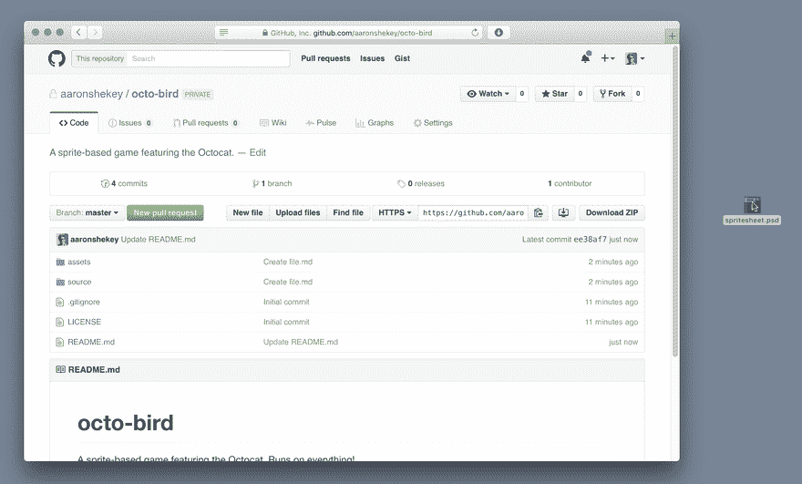

# Github 新的直接上传功能的使用案例

> 原文：<https://dev.to/ben/use-cases-for-githubs-new-direct-upload-feature>

GitHub [今天](https://github.com/blog/2105-upload-files-to-your-repositories)宣布开发者现在可以直接从浏览器上传文件到代码库。尽管大多数程序员通过命令行与 GitHub 进行交互，但考虑到 GitHub 已经允许用户通过浏览器与[进行交互以完成各种任务，你可能会惊讶于这个功能还没有出现。我概述了用户能够立即使用这一新特性的四种方式。](https://help.github.com/articles/github-flow-in-the-browser/)

## 快速更改图像和其他资产

如果开发人员的客户需要在公司网站的团队页面上更新个人资料图片，那么在本地打开项目并进行更改和提交代码可能会很麻烦。通过浏览器直接添加文件会更容易，让您的维护体验更轻松、更愉快。如果你离开了你的开发机器，在那里做一个简单的改变可能是不切实际或者不可能的，这是特别有用的。

## 将博客文章添加到 GitHub Pages 网站

在 Github 上主持 Jekyll 博客的开发人员您可能有兴趣在您的桌面环境中制作一篇文章，并将其直接拖到浏览器中立即发布。这可能只是体验上的一次适度升级，但如果说休闲博客作者多年来学到了什么，那就是过程中的任何摩擦都足以消除发表的动机。

## 非技术性贡献

技术和非技术之间的界限总是模糊的，但是 Git 的学习曲线是陡峭的，它没有意义作为对项目做出贡献的事实障碍。通过浏览器上传是大多数人都熟悉的一种体验，这将允许更多的人在有意义的情况下合作完成项目。

## 一般文件转储

根据开发者的工作流程，将文件转储到 Github 可能比使用 [Dropbox](dropbox.com) 或 [Google Drive](https://drive.google.com/) 更容易。我不能说 GitHub 是否有意成为这些其他服务的直接竞争对手，但对于许多已经熟悉 GitHub 环境的开发者来说，这肯定更容易。在我看来，如果 GitHub 确实选择通过未来的特性决策来鼓励这种行为，这个用例可能会产生最大的影响。

## 

*文件上传正在进行*

## 这是一个净正数

社区最近也有对 GitHub T1 的抱怨，但是它在编程世界中是如此的根深蒂固，以至于离开这个平台对大多数人来说是不切实际的。由于这种相互依赖，开发者社区需要希望 Github 能够以正确的方式带来改进平台的特性。虽然这并没有直接解决一些问题，但它是一个补充功能，并没有剥夺 Github 的核心功能。