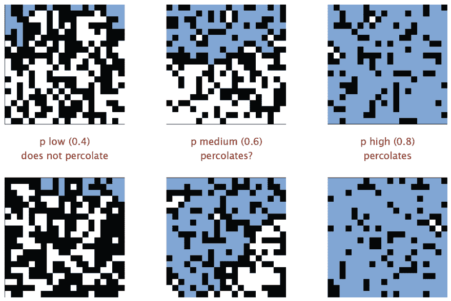
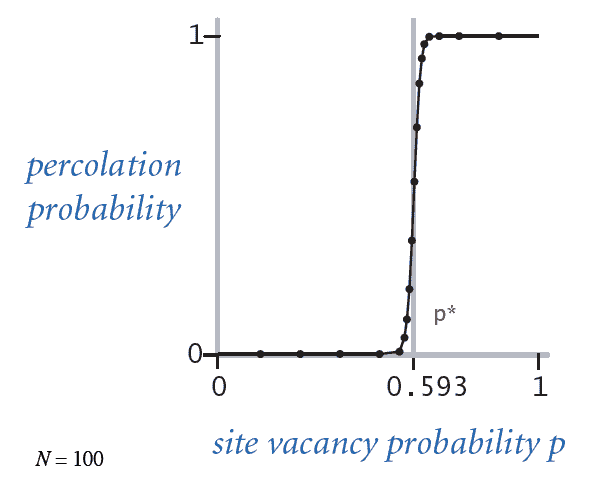

# 利用 Go 和蒙特卡罗方法获取逾渗阈值

> 原文：<https://dev.to/nilbot/using-go-and-monte-carlo-method-to-obtain-percolation-threshold-4m86>

> 本文的灵感来自罗伯特·塞奇威克凯文·韦恩的《算法》第一部分的幻灯片。图 1 和图 2 是从 15UnionFind.PDF[*](https://d396qusza40orc.cloudfront.net/algs4partI/slides/15UnionFind.pdf)第 51 页和第 52 页的原始幻灯片中截取的
> 
> 我的知识有限，我的文章肯定有缺陷。请不要犹豫给我留下反馈/建议/纠正/咆哮

# 逾渗和阈值

在计算机科学中，尤其是算法中，有一个涉及解决动态连通性的主题。弄清楚一条路径/路线是否与其他路径/路线相连接广泛适用于设计现实世界问题的解决方案。

例如，在许多物理系统中，我们有一个 N 乘 N 的正方形网格模型，网格中的块可以是开放的，也可以是封闭的。当且仅当存在连接顶部开放站点和底部开放站点的路径时，我们称系统网格是渗透的。就像解决一个迷宫问题，在一个巨大的网格上是非常令人厌倦和无效的(列举所有的可能性)。在这里检查两个组件是否连接，强力将花费`$O(n^2)$`时间)来获得渗透状态。因此，我们需要一个有效的算法来解决这个渗流问题。确定网格的 2 个子集是否连通，可以像图论中一样建模为连通分量，这涉及到集合论中的等价关系:

> 在集合 X 上，运算~是一个等价关系 iffa ~ aif a~b then b~aif a~b 和 b~c then a~c

直观上，子图(组件)是“等价的”当且仅当它们有相同的根。因为我们不需要跟踪原始子图的形状，所以我们可以对解决方案进行建模，以支持尽可能扁平的树状数据结构来保证查找速度，以及一些 Connect ( **union** )操作来合并两个子图。换句话说，我们可以选择联合查找算法来解决逾渗问题。

然而，关于渗透还有一个更有趣的后续问题:如果所有的网格块都有打开的可能性`p`(阻塞的将是`(1-p)`)，那么整个系统渗透的可能性是多少？想象一个 N 乘 N 用户网格的社交网络，每个用户都有`p`能够与他/她的邻居交流的可能性，第一排用户与底层用户链接的几率是多少？

[T2】](https://res.cloudinary.com/practicaldev/image/fetch/s--l6bZoOtg--/c_limit%2Cf_auto%2Cfl_progressive%2Cq_auto%2Cw_880/https://blog.nilbot.net/img/percolation.png)

我们观察到，在某个`p`以上，系统最有可能渗透。这个临界阈值`p`叫做逾渗阈值。它似乎是一个常数，依赖于晶格结构。

[T2】](https://res.cloudinary.com/practicaldev/image/fetch/s--OfzQU6Bt--/c_limit%2Cf_auto%2Cfl_progressive%2Cq_auto%2Cw_880/https://blog.nilbot.net/img/percolation-probability.png)

没有计算逾渗阈值的直接解决方案。但是我们肯定可以模拟这个问题，如果我们做足够次数的实验，我们将有信心通过实验结果确定一个近似值。

本文是关于使用 Go 和蒙特卡罗模拟来获得正方形格子/网格的渗流阈值的近似的演示。

# 接近

由于像蒙特卡罗这样的模拟需要重复大量的随机实验才能得到可信的结果，所以我们在这里讨论的数字类通常以百万计。运行这样的模拟可能很有挑战性，如果我们有

1.  低效实验(软件限制)
2.  缓慢的计算机(硬件限制)

第一点可以通过使用更有效的算法来克服。然而，更快的机器可能不可用，特别是自 2000 年以来，新计算引擎的趋势是走向多核而不是更高的频率。这就是为什么并行通常是解决这类问题的方法。我选择使用 Go 是因为一方面，它是一种神奇的系统语言，速度快，表现力强，是 C 程序员最熟悉的语言；另一方面，它对并发编程有一流的支持。虽然 Hoare 的 CSP 论文已经存在了几十年，但是很少有主流语言采用这个概念。

# 并发分析

模拟中的每个实验都是相互独立的，这是我们应用并行性的完美切入点。主要是我们需要满足条件

$ $ \ begin { equation } p _ { linear }(x)= p _ { parallel }(x)\ end { equation } $ $
with
$ $ \ begin { equation } p _ { linear }(x)= \dfrac{\sum^n{p(x)}}{n}\end{equation}$$

其中 n 是所有实验的次数，`$p(x)$`是产生渗流的实验`$x$`的概率。

将`$w$`表示为每个工人必须执行的工作量，而`$c$`表示所有工作的数量，并行版本需要交付

$ $ \ begin { equation } p _ { parallel }(x)= \dfrac{\sum^c \sum^w{p(x)}}{n} \ text {，with } w\cdot c = n\end{equation}$$

# 实验

理想情况下，如果我们可以用随机开放站点的方式构建一个网格，我们需要做的就是调用网格上的 Find 函数(上一节中的`$p(x)$`)。

如果我要用开放的站点随机填充一个完全阻塞的网格，我将花费网格时间的最大值`SIZE`来构建一个渗透。此外，如果我一次又一次地重复随机构造，并记录我在每个实验中产生渗滤的步骤`$\rightarrow$`，当制作这个记录步骤的直方图时，我会有一个看起来像正态分布的图，其中心在*期望值*。这个*期望值*正是想要的`$p$`，因为潜在的 pdf(概率密度函数)就是该图所表示的。

重述和修改我们的公式。

设`$s(x)$`为`$x$`实验中产生渗流的**步骤**；`$n$`被实验的数量；`$g$`是网格中的块数(大小)。

$$\begin{equation}p(x)=\dfrac{\sum^n{s(x)}}{n\cdot g } \ end { equation } $ $

因为`$\dfrac{s(x)}{g} = p(x)$`，我们也可以在顶层平行这种方法。

## 高级算法

在最初被阻挡的正方形网格上随机填充开放的位置，相当于获得随机排列的数字`$0...N$` - `$1$`，其中`$N$`是网格的大小。Go 库的`rand`包可以提供开箱即用的功能。

在每个站点打开时，我需要将打开的站点连接到它的邻居， ***iff*** 邻居也被打开。

伪代码中的算法

```
Step := 0
LOOP number in Permutation
    OBTAIN Neighbors of number
    LOOP neighbor in Neighbors
        IF neighbor is open
            Connect / Union number with neighbor
            Step++
                IF Percolates / Find
                    RETURN Step
                END IF
        END IF
    END LOOP
END LOOP 
```

## 构造和联合查找

现在，我们需要使用廉价而智能的数据结构来构建网格，以支持我们高效的 union find 算法。设网格的大小为`$Size = N^2$`，N 为其边长。一个加权压缩的 Union-Find 可以在`$O(N+Mlg^*N)$`时间内同时实现 Union 和 Find。这个 Union-Find 需要两个大小为`$N^2$`的数组，一个(标记为`P`)表示每个元素的父关系/子图所有权，另一个(标记为`S`)表示该组件的大小(用于权重比较)。

此外，为了维护块的开放状态，我需要一个布尔数组`$N^2$`。最后，为了简化对顶部边缘和底部边缘的建模，我们可以在原来的`P`数组中添加两个虚拟站点`$N^2 + 1$`和`$N^2 + 2$`，网格 ***渗透*** ** iff**

$$\begin{equation}N^2+1 和 N^2+2\end{equation}$$
是有联系的。

# 代码

代码包含 1 个名为 connectivity 的包，它包含 2 个组件:`unionfind`和`percolation`。两个组件都被导出，您可以在自己的项目中使用它。要运行模拟，请参见下一节。

## 链接

在 [Github](https://github.com/nilbot/algo.go) 上完成源代码

## 获取代码

```
go get github.com/nilbot/algo.go/connectivity 
```

## 一些片段

一个模拟器界面:

```
type Simulator interface {
    Simulate() int64
    mark(n int)
    Clear()
} 
```

模拟中使用的数据结构

```
type PercolationSimulator struct {
    Size int
    Marked []bool
    l int
    connect *WeightedCompressed
} 
```

及其构造

```
func NewPercolationSimulator(N int) *PercolationSimulator {
    result := &PercolationSimulator{
        Size: N * N,
        Marked: make([]bool, N*N),
        l: N,
        connect: NewWeightedCompression(N*N + 2),
    }
    for i := 0; i != N; i++ {
        result.connect.Union(i, result.Size)
    }
    for i := N * (N - 1); i != N*N; i++ {
        result.connect.Union(i, result.Size+1)
    }
    return result
} 
```

两个 for 循环的诀窍是分别在顶部和底部边缘连接两个额外的虚拟站点。

为了获得随机排列，从 math/rand 包中调用`(r *rand) Perm(int)`。

```
// return a slice of pseudo-random permutation of [0,n)
func getPermutation(n int) []int {
    seed := time.Now().UnixNano() % 271828182833
    r := rand.New(rand.NewSource(seed))
    return r.Perm(n)
} 
```

和标记开放站点，如前一节伪代码所述:

```
// mark (paint) the block as white
func (p *PercolationSimulator) mark(n int) {
    if p.Marked[n] {
        return
    }
    p.Marked[n] = true
    neighbors := getDirectNeighbours(n, p.l)
    for _, adj := range neighbors {
        if p.Marked[adj] {
            p.connect.Union(n, adj)
        }
    }
} 
```

您还可以访问 [godoc](http://godoc.org/github.com/nilbot/algo.go/connectivity) 进行概述

# 结果和基准

## 运行测试和基准测试

```
cd $GOPATH/github.com/nilbot/algo.go/connectivity
go test -bench Simulate 
```

## 结果

基准测试

```
BenchmarkSimulate 100000 21375 ns/op 
```

是在 2013 款 i7 8G MacbookAir 上实现的。在同一台机器上运行 1000 万次迭代的模拟产生了

```
ran 1000000 simulations, got result 0.59377084 
```