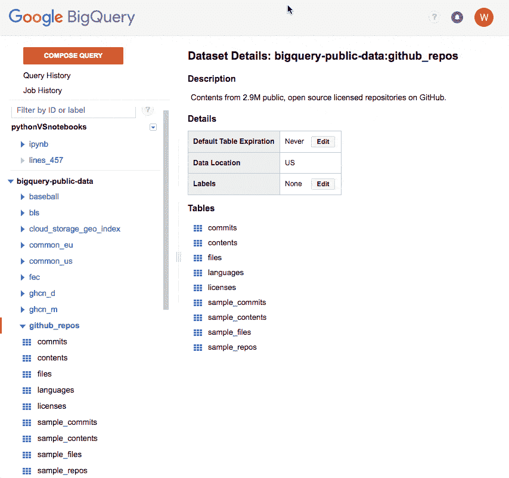

# 使用 Google 的 BigQuery 更好地理解 Python 生态系统

> 原文：<https://dev.to/walker/using-googles-bigquery-to-better-understand-the-python-ecosystem>

当谈到编程时，了解你同时代的人正在使用的工具是很重要的。这不仅是了解行业趋势的好方法，而且有助于你在与其他程序员交流时形成共同的词汇。

就我而言，我最近更多地使用 Python 进行数据分析，并发现自己想知道其他数据科学家最常用的包是什么。当然，我可以谷歌“数据科学的最佳 Python 包”，但本着统计学的精神，我想做出数据驱动的决定，而不是依赖轶事。此外，谷歌还有另一个有用的工具:BigQuery。

如果你想在大数据的海洋中畅游，体验谷歌的海量资源，甚至只是练习你的 SQL，那么 BigQuery 是一个值得你关注的工具。BigQuery 上可供公众翻找的数据集包括 2009 年以来纽约市的每一次出租车出行，2008 年以来旧金山的每一次 311 电话，以及 2016 年赛季的每一次 MLB 投球。

不过，出于我的目的，相关的公共数据集来自 GitHub，其中包括超过 1.45 亿个唯一提交和超过 1.6 亿个文件的内容。通过查询这个数据集并找到流行的扩展名、公共文件名和常用的包，您可以感受到更大的编码世界，而无需实际打开任何单独的脚本。(谷歌的 Felipe Hoffa 负责监管数据集的推出，[对来自社区的整洁分析进行连续记录](https://medium.com/google-cloud/github-on-bigquery-analyze-all-the-code-b3576fd2b150#.mtuxwf2k7)。)

我知道我必须比仅仅检查可用的 Python 文件更深入一点。虽然数据科学越来越受欢迎，但它仍然只是 Python(当今最流行和最通用的语言之一)的广阔用例宇宙中的一个普通邻居。任何特定于数据科学的见解都将被更普遍地使用 Python 所创造的更大趋势所淹没。**如果有的话，我想搜索*的内容。ipynb* 文件而不是*文件。py* 文件，因为前者适用于 Jupyter(以前的 IPython)笔记本。**

与从命令行运行 Python 脚本相比，使用笔记本的主要优势在于，您可以执行离散的代码块而不是整个文件，并且可以内联显示图形。这种灵活性使笔记本电脑成为想要创建即时可视化或处理大型数据集而无需重新运行整个分析的数据科学家的首选，我猜想这将反映在流行的*中。ipynb* 包。于是我开始对比数百万的*。py* 和*。GitHub 数据集中的 ipynb* 文件。

BigQuery 可以通过命令行或各种语言的客户端库获得，但我更喜欢 Web UI(部分原因是我在相邻的浏览器选项卡中搜索 SQL 和 regex 语法...).一旦登录我的谷歌账户，我就可以前往 GitHub 数据集并点击“文件”表，这样我就可以查询它:

[T2】](https://res.cloudinary.com/practicaldev/image/fetch/s--6N4OrUkG--/c_limit%2Cf_auto%2Cfl_progressive%2Cq_66%2Cw_880/https://d1ax1i5f2y3x71.cloudfront.net/items/3G3U023q252n1B3A0D3L/Screen%2520Recording%25202017-03-28%2520at%252004.57%2520PM.gif%3FX-CloudApp-Visitor-Id%3D2119651)

实际上，需要两个表:我需要从 **contents** 表中选择行，这些行的 id 来自名称以*结尾的 **files** 表的子集。py* :

```
SELECT * FROM [bigquery-public-data:github_repos.contents]
WHERE id IN (
    SELECT id FROM [bigquery-public-data:github_repos.files]
    WHERE RIGHT(path, 3) = '.py'); 
```

需要注意的是，根据谷歌的规则，结果(540 万个 Python 脚本)足够大，需要有自己的表，所以如果你想做类似的事情，你需要创建一个谷歌云平台账户，并申请一张信用卡。您的第一个 1tb 的处理数据是免费的，但由于错误或低效的查询，我仍然设法为这个项目支付了大约 10 美元的费用。

一旦那个查询的结果被存放在一个新的个人表中，我就对 Jupyter notebooks ( `WHERE RIGHT(path, 6) = '.ipynb'`)运行等价的查询，留给我不同批次的*。py* 内容和*。ipynb* 目录。

确定 10 个最受欢迎的软件包。py 文件并不太棘手，尤其是使用谷歌的 Francesc Campoy 的指南作为参考。在以短语“import”或“from”开头的任何新行(`SELECT SPLIT(content, '\n') as line`)处分割每个文件的文本后(因为有两种主要的方式来加载 Python 包)，我使用了一个识别下一个单词的正则表达式来获取所有包:

```
SELECT REGEXP_EXTRACT( line, r'(?:\S+\s+)(\S+)' ) as package, count(*) as n
FROM (
    SELECT SPLIT(content, '\n') as line
    FROM [pythonvsnotebooks:ipynb.py_contents]
    HAVING LEFT(line, 7) = 'import ' OR LEFT(line, 5) = 'from ')
GROUP BY package
ORDER BY n DESC
LIMIT 10; 
```

这给了我:

|  | 包裹 | n |
| --- | --- | --- |
| one | 操作系统（Operating System） | One million forty-eight thousand nine hundred and eighty-one |
| Two | [计]系统复制命令（system 的简写） | Eight hundred and twenty-nine thousand one hundred and fifty-six |
| three | __ 未来 _ _ | Six hundred and ninety-one thousand two hundred and twenty-two |
| four | 时间 | Four hundred and twenty-four thousand four hundred and thirty-four |
| five | 记录 | Four hundred and four thousand six hundred and seventy-eight |
| six | 关于 | Four hundred and three thousand one hundred and ninety-three |
| seven | numpy | Three hundred and ninety-four thousand and sixty-nine |
| eight | 日期时间 | Three hundred and seventy-three thousand two hundred and seventy-two |
| nine | json | Two hundred and eighty-two thousand six hundred and seventy-two |
| Ten | unittest | Two hundred and seventy-eight thousand five hundred and twelve |

这里没有什么特别令人惊讶的。这些包中的大部分都是 Python 备受推崇的标准库的一部分。例如，`os`、`sys`和`re`分别需要与操作系统交互、访问由解释器维护的变量和使用正则表达式。这些是非常“通用”的包，它们确实足够流行，以至于淹没了一些更小众的东西的结果，比如数据科学。

为笔记本设计同样的桌子稍微复杂一些。每个内容值的格式实际上是一个 JSON，因为笔记本支持各种单元格类型(如代码、注释或降价)，因此需要一个更复杂的数据类型，而不仅仅是一个长字符串。

可能有一种更优雅的方式来处理这种额外的复杂性，但我的黑客意识到，在*【n】*上拆分原始 JSON 文本将成功地选择新的代码行。我不得不在某些情况下为包标题构建逻辑，意外地引入一些附加字符(`WHEN package LIKE '%\\n",'`)，但最终结果是干净的:

```
SELECT
CASE WHEN package LIKE '%\\n",' THEN LEFT(package, LENGTH(package) - 4)
ELSE package
END as package, n
FROM (
    SELECT REGEXP_EXTRACT( line, r'(?:\S+\s+)(\S+)' ) as package, count(*) as n
    FROM (
        SELECT SPLIT(content, '\n      \"') as line
        FROM [pythonvsnotebooks:ipynb.ipynb_contents]
        HAVING LEFT(line, 7) = 'import ' OR LEFT(line, 5) = 'from ')
    GROUP BY package
    ORDER BY n DESC)
LIMIT 10; 
```

屈服:

|  | 包裹 | n |
| --- | --- | --- |
| one | numpy | Nine thousand three hundred and forty-four |
| Two | matplotlib.pyplot | Five thousand seven hundred and fifteen |
| three | 熊猫 | Four thousand four hundred and sixty-nine |
| four | 操作系统（Operating System） | One thousand nine hundred and forty |
| five | matplotlib | One thousand seven hundred and fourteen |
| six | IPython .显示器 | One thousand six hundred and twenty-seven |
| seven | [计]系统复制命令（system 的简写） | One thousand five hundred and seventy-seven |
| eight | __ 未来 _ _ | One thousand two hundred and forty-four |
| nine | sklearn | One thousand one hundred and sixty-two |
| Ten | 时间 | One thousand and six |

由于 Jupyter 笔记本电脑的流行程度要低得多，总数量比第一张表中的数量要小，但流行包的顺序是有趣的。`numpy`已经跃居榜首，标准库包的受欢迎程度已经被数据分析工具`pandas`和可视化工具`matplotlib`超越。第九个是机器学习库，`sklearn`。这些是我一直在寻找的数据科学交易工具，一旦大量不相关的 Python 代码被删除，它们就会浮出水面。

很高兴看到我的直觉在 Jupyter 笔记本上得到验证，它显然主要用于统计分析。但是这个项目真正的乐趣是玩 BigQuery，感受在几秒钟内筛选大量数据的能力。我鼓励读者探索在 GitHub 数据集上完成的其他一些分析，并亲自尝试一下 BigQuery。在 3tb 的数据中可以发现很多东西...