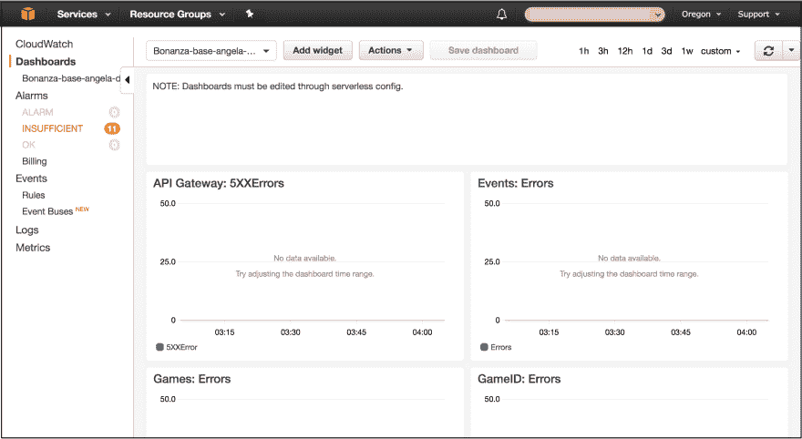

# 使用无服务器配置部署 AWS CloudWatch 仪表板

> 原文：<https://dev.to/angelariggs/using-serverless-config-to-deploy-an-aws-cloudwatch-dashboard-292l>

*本文最初发表在我的博客上，[http://Angela Riggs . github . io](http://angelariggs.github.io/blog/using-serverless-config-deploy-aws-cloudwatch-dashboard)。*

* * *

我的团队最近的项目非常有趣——这是一个 JavaScript 项目，包括使用无服务器框架来部署各种 AWS Lambda 功能(例如，上传到 S3 桶并向我们构建的 API 发出请求)。作为 QA 工程师，我的部分职责是在 AWS 中建立一个 CloudWatch 仪表板。仪表板可以在 CloudWatch 服务中手动创建，但我想通过代码部署来创建仪表板。

在这个项目之前，我没有任何使用 AWS 的经验，所以我真的很兴奋能够开始使用它。本周我花了几天时间浏览文档和编写代码，并在周四成功部署了我的仪表板！我还为其中一个指标添加了警报，并通过 LogicMonitor 创建了一个单独的监控板。我从完成这项工作中获得了很多乐趣！我想分享我遇到的一些技术文档陷阱，我是如何克服它们的，以及一般来说如何通过代码设置配置来部署 AWS CloudWatch 仪表板。

[T2】](https://res.cloudinary.com/practicaldev/image/fetch/s--AD-jPZqj--/c_limit%2Cf_auto%2Cfl_progressive%2Cq_auto%2Cw_880/https://thepracticaldev.s3.amazonaws.com/i/9u740c4s3noklntroguf.png)

## 文档入门

我从关于 [AWS 资源类型](http://docs.aws.amazon.com/AWSCloudFormation/latest/UserGuide/aws-properties-cw-dashboard.html)的文档开始，特别是 AWS::CloudWatch::Dashboard 部分。它给出了 JSON 和 YAML 的例子(大多数文档也是如此)，但是 YAML 实际上只介绍了这么多，稍后您会看到。我从 YAML 开始，因为那是我们的无服务器配置使用的——加上 YAML 写起来太好了(我总是在 JSON 中忘记花括号！).这让我开始了我的配置:

```
Type: "AWS::CloudWatch::Dashboard"
  Properties:
    DashboardName: String
    DashboardBody: String 
```

Enter fullscreen mode Exit fullscreen mode

从那里，这些文档把我带到了 CloudWatch 仪表板的[模板片段](http://docs.aws.amazon.com/AWSCloudFormation/latest/UserGuide/quickref-cloudwatch.html#cloudwatch-sample-dashboard-sidebyside)，在那里我意识到我需要在我已经拥有的东西前面加一行。这里是您的第一个提示:`Type`属性上面的行可以是您想要的任何内容。在此之前，我真的没有任何 YAML 的经验，所以这可能更广为人知，但我在代码中从他们的命名示例开始。文档也没有提到 DashboardName 属性的命名标准，但是请注意它不接受空格(这是我在尝试第一次部署后才发现的)。最后是:

```
DashboardSideBySide
  Type: "AWS::CloudWatch::Dashboard"
    Properties:
      DashboardName: Bonanza-Dashboard
      DashboardBody: ’{}’
DashboardSideBySide 
```

Enter fullscreen mode Exit fullscreen mode

`DashboardBody`的片段示例很大程度上没有帮助——水平滚动一个巨大的 JSON 对象是如此痛苦！这种格式基本上是不可读的。我又在文档中翻找了一些，老实说，我不记得我是如何找到下一个有用的页面的。但是当然我会为你链接到它:[仪表板主体结构&语法](http://docs.aws.amazon.com/AmazonCloudWatch/latest/APIReference/CloudWatch-Dashboard-Body-Structure.html)。这是仪表板配置的真正内容。这是一个相当简单的复制/填写场景，只有几个例外。

## 度量数组

首先是`metrics`数组:在标题为“dashbody Object:Metric Widget:Format For Each Metric in the Array”的部分中，它给出了格式并描述了每一项是什么:Namespace、MetricName、DimensionName、DimensionValue。我已经看过了关于度量维度的文档，所以我知道我们的每个 Lambdas 都有四个维度名称(错误、持续时间、限制和调用)，我使用了维度值属性的文档。我通过函数名进入 cloud watch>Metrics>Lambdas>找到了函数名。这让我得到了我的`MetricName`、`DimensionName`和`DimensionValue`值，但是`Namespace`到底是什么？我到处都找不到它！幸运的是，我做了一些随机的事情，并设法注意到当我到达一个列出名称空间的页面时——如果你有更好的方法，请留下评论！我的步骤是:通过函数名将 CloudWatch >度量> Lambdas >添加到 Lambdas 列表中。lambdas 在一个窗口中列出，该窗口有三个选项卡:所有指标、图形化指标和图形选项。选中某个指标的复选框，请注意,( 1)出现在图表化指标选项卡中。转到那个选项卡，您会看到一堆关于您选择的指标的信息——包括名称空间！我完全是偶然发现这一点的——肯定有其他方法。

[T2】](https://res.cloudinary.com/practicaldev/image/fetch/s--rEex-h49--/c_limit%2Cf_auto%2Cfl_progressive%2Cq_auto%2Cw_880/https://thepracticaldev.s3.amazonaws.com/i/iqpf2lsvsl3n21thx3fp.png)

这就把我的配置带到了:

```
DashboardSideBySide:
      Type: AWS::CloudWatch::Dashboard
      Properties:
        DashboardName: "Bonanza-Dashboard"
        DashboardBody:
          '{
            "widgets":[
              {
                "type":"metric",
                "x":0,
                "y":0,
                "Width":12,
                "Height":6,
                "properties":{
                   "metrics":[
                      [
                         "AWS/Lambda",
                         "Errors",
                         "FunctionName",
                         "base-dev-events"
                      ]
                     ],
                     "period":60,
                     "stat":"Sum",
                     "region":"us-west-2",
                     "title":"Events: Errors",
                     "view":"timeSeries",
                     "yAxis":{
                       "left":{
                         "min":0,
                         "max":50
                     }
                   }
                  }
                }
          }' 
```

Enter fullscreen mode Exit fullscreen mode

## 文档陷阱

嗯，算是吧。

那个配置代码片段是 post-pitfall(我向你保证会有陷阱！).看到那边的阵列了吗？(我在上一节中提到的带有`NameSpace`、`MetricName`和`Dimensions`的那个。)我的部署最初失败，引用了“仪表板主体无效；error code:InvalidParameterInput”，我就是想不出哪里出错了。我的一个同事 Keith 过来帮忙排除故障，我们花了几分钟令人困惑的时间，一致认为它看起来确实应该可以工作。然后 Keith 有了一个奇妙的故障诊断见解，我们意识到文档使用方括号来表示一个数组，并表示同一个数组中的可选参数！

这是文档:

[T2】](https://res.cloudinary.com/practicaldev/image/fetch/s--Bc38Ftwp--/c_limit%2Cf_auto%2Cfl_progressive%2Cq_auto%2Cw_880/https://thepracticaldev.s3.amazonaws.com/i/nvtpqu8e5djtwiywk59b.png)

这真是一个掌脸的时刻。向下滚动到每个项目的 docs 部分，验证 yes - NameSpace 和 MetricName 是必需的，而 DimensionName 和 DimensionValue 不是必需的。

因此，我调整了配置，去掉了那些多余的方括号，运行了 deploy，并准备好欣赏我漂亮的仪表板。

不完全是。

现在部署失败，引用了无效的 JSON。很公平——我一直在交换一些东西，很容易忘记花括号和方括号，所以我通过 linter 运行我的代码。`Expecting ':', got ','`。我又看了看我的代码，然后看了看文档。

[T2】](https://res.cloudinary.com/practicaldev/image/fetch/s--3anMNPRc--/c_limit%2Cf_auto%2Cfl_progressive%2Cq_auto%2Cw_880/https://thepracticaldev.s3.amazonaws.com/i/sg5gpmsfg0j7nh74acbt.png)

果然，他们确实用了逗号而不是冒号！`{DimensionName,DimensionValue}`应该是`{DimensionName:DimensionValue}`。轻松修复，我将踏上成功部署之路…

嗯，差不多了。

这让我想起了“仪表板主体无效”部署失败。原来*逗号*是对的。是*对象语法*错了！那些花括号根本不属于那里。我通过查看文档并思考“如果技术作者只是犯了一个错误，该怎么办？”同一层上的其他项目都没有被分成不同的对象，那么为什么会有这些呢？所以我就把它们拿出来试了试，果然，这就是阻断器。请让我的痛苦帮助你有更好的体验——忽略那些花括号。

## 最终配置

我将其他一切都保留为默认值。我为每个指标小部件选择了 12 列的宽度，因为我希望仪表板有两列小部件，这样可以更容易地浏览信息。在添加了一个文本小部件，并对小部件在仪表板中的位置进行了一些调整之后，这就是我最终的配置:

```
MetricsDashboard:
      Type: AWS::CloudWatch::Dashboard
      Properties:
        DashboardName: "Bonanza-${self:service}-${opt:stage}-dashboard"
        DashboardBody:
          '{
            "widgets":[
              {
                "Type":"text",
                // "x" is where (out of 24 columns) the widget will be placed.
                // 0 means the far left.
                "x":0,
                "y":0, // this places the widget at the top of the dashboard.
                "width":24,
                "height":3,
                "properties":{
                   // A nice note for other devs
                   "markdown":"NOTE: Dashboards must be edited through serverless config."
                }
              },
              {
                   "type":"metric",
                   "x":0,
                   "y":1,
                   "Width":12, // So this widget will take up half the dashboard width.
                   "height":6,
                   "properties":{
                      "metrics":[
                       [
                          "AWS/Lambda",
                          "Errors",
                          "FunctionName",
                          "${self:service}-${opt:stage}-events"
                       ]
                    ],
                    "period":60,
                    "stat":"Sum",
                    "region":"us-west-2",
                    "title":"Events: Errors",
                    "view":"timeSeries",
                    "yAxis":{
                      "left":{
                        "min":0,
                        "max":50
                    }
                  }
                 }
              },
              {
                 "type":"metric",
                 "X":12, // This widget will start at the halfway point of the dashboard width...
                 "y":1,
                 "width":12, // ...and take up half the dashboard (12/24 columns)
                 "height":6,
                 "properties":{
                    "metrics":[
                     [
                        "AWS/Lambda",
                        "Errors",
                        "FunctionName",
                        "${self:service}-${opt:stage}-games"
                     ]
                  ],
                  "period":60,
                  "stat":"Sum",
                  "region":"us-west-2",
                  "title":"Games: Errors",
                  "view":"timeSeries",
                  "yAxis":{
                    "left":{
                      "min":0,
                      "max":50
                  }
                }
               }
            },
            {
             "type":"metric",
             "x":0,
             // all metric widgets go under the text widget
             // so each metric widget has a "y" value of `1`
             // vs the text widget’s value of `0`.
             "y":1,
             "width":12,
             "height":6,
             "properties":{
                "metrics":[
                   [
                      "AWS/Lambda",
                      "Errors",
                      "FunctionName",
                      // We can deploy with different services and stages,
                      // so now the dashboard will display whatever service/stage was deployed
                      "${self:service}-${opt:stage}-searchteams"
                   ]
                ],
                  "period":60,
                  "stat":"Sum",
                  "region":"us-west-2",
                  "title":"Search Teams: Errors",
                  "view":"timeSeries",
                  "yAxis":{
                    "left":{
                      "min":0,
                      "max":50
                  }
                }
              }
            }
          ]
      }' 
```

Enter fullscreen mode Exit fullscreen mode

现在我已经有了一个成功部署的仪表板！如果您对在 AWS 中设置度量警报感兴趣，您可以在这里找到那个[的文档；如果你想在 LogicMonitor 中设置一个单独的闹钟，你可以在这里](http://docs.aws.amazon.com/AWSCloudFormation/latest/UserGuide/aws-properties-cw-alarm.html)找到那个[的文档，在这里](https://www.logicmonitor.com/support/monitoring/cloud/adding-your-aws-account-to-logicmonitor/)找到[的文档。老实说，我发现这一点非常有趣——我希望我的经验能让您的配置更加顺利！](https://www.logicmonitor.com/support/monitoring/cloud/aws-configuration/)

***你以前用过 AWS 或者 Serverless 吗？你做过哪些很酷的事情，或者发现了哪些陷阱？留下评论让我知道！**T3】*