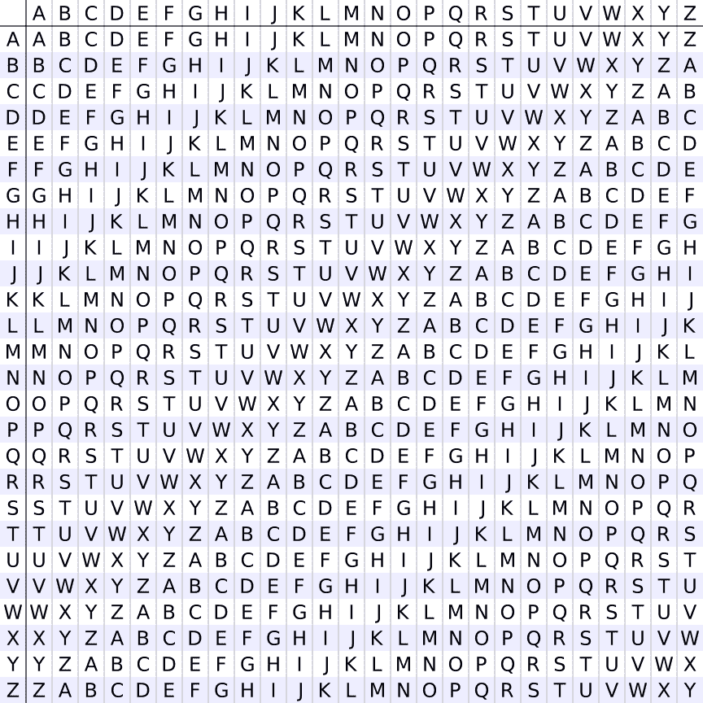

# “使用 Vigenère 密码通过 Javascript 加密消息”

> 原文：<https://dev.to/vincecampanale/using-the-vignere-cipher-to-encrypt-a-message-with-javascript>

从技术上讲，本文是三部分系列的第 3 部分，但是不要担心，前两部分对于理解这一部分并不重要(这是更有趣的部分 tbh)。

如果你好奇的话，下面是其他的链接:
[使用维根涅密码加密信息(第一部分)](http://www.vincecampanale.com/blog/2017/01/20/vignere-cipher-part1/)
[使用维根涅密码加密信息(第二部分)](http://www.vincecampanale.com/blog/2017/02/01/vigenere-cipher-part2/)

在第 1 部分中，我简要介绍了 Vigenère 密码，并讨论了解决它的两种方法(我能想到的两种方法——肯定还有其他方法)。在[第 2 部分](http://www.vincecampanale.com/blog/2017/02/01/vigenere-cipher-part2/)中，我介绍了第一种方法，它本质上是一种带有动态移位号的凯撒密码。在这一部分中，我将使用神奇的 Vigenère 表来逐步介绍更有趣的解决方案——这也是它真正想要完成的方式。

Vigenère 餐桌看起来像这样:

[T2】](https://res.cloudinary.com/practicaldev/image/fetch/s--rG-bvxzx--/c_limit%2Cf_auto%2Cfl_progressive%2Cq_auto%2Cw_880/https://upload.wikimedia.org/wikipedia/commons/thumb/9/9a/Vigen%25C3%25A8re_square_shading.svg/864px-Vigen%25C3%25A8re_square_shading.svg.png)

###### 作者布兰登·t·菲尔兹([cdated](//commons.wikimedia.org/w/index.php?title=User:Cdated&action=edit&redlink=1 "User:Cdated (page does not exist)"))——根据[作者](https://en.wikipedia.org/wiki/User:Matt_Crypto "en:User:Matt Crypto")[Vigenere-square.png](//commons.wikimedia.org/wiki/File:Vigenere-square.png "File:Vigenere-square.png")改编:用户:马特·加密。该版本由 Inkscape 中的 [bdesham](//commons.wikimedia.org/wiki/User:Bdesham "User:Bdesham") 创建，并由 [cdated](//commons.wikimedia.org/w/index.php?title=User:Cdated&action=edit&redlink=1 "User:Cdated (page does not exist)") 修改，以包括可视指南。这张[矢量图像](https://en.wikipedia.org/wiki/Vector_images "w:Vector images")是用 [Inkscape](//commons.wikimedia.org/wiki/Help:Inkscape "Help:Inkscape") 创建的。，公共领域，[链接](https://commons.wikimedia.org/w/index.php?curid=15037524)

现在不要担心破译那个庞然大物，当我检查构建这个东西的代码时，你会有更深的理解。

该过程分为四个主要功能:`generateAlphabet`功能、`generateVigenereTable`功能、`encodeWithTable`功能，当然还有`vigenereCipherWithTable`功能。注意:这个解决方案是相当必要的，我希望在未来以一种更加声明性的方式重新实现它，所以请在 Twitter[@ _ Vince campanele](https://twitter.com/_vincecampanale)或 [dev.to](https://dev.to/vincecampanale) 上关注我的幽默和更新(当然都是关于 JS 的)。

计划是这样的:

```
1) Generate an alphabet starting with a given letter (a in the first column, b in the second, etc) - note: the alphabet must wrap around to the beginning when it reaches z
2) Generate a Vigenere table
  - The keys consist of the standard alphabet (a-z)
  - Each key's value is an alphabet starting with that key and wrapping back   around to a (each value is 26 letters)
3) Encode the message by looking up each letter of the original message in the   keys of the Vigenere table, then traversing the table to get the value from the   character code of the keyword letter  
4) Put it all together in the final function 
```

Enter fullscreen mode Exit fullscreen mode

### 第一步:构建`generateAlphabet`函数

在这个函数中，参数将是一个起始索引。我们将迭代 26 个字符代码，从提供的起始索引开始。据推测，第一个字符代码将是 97，他们将从那里上升。为了考虑超过 122 的 char 代码，我们在`String.fromCharCode`方法中添加了一些 if/else 逻辑。三元运算符允许我们保持代码简洁。

```
function generateAlphabet(start) {
  let alphabet = [];
  //from start index to 26 chars later
  for (let i = start; i < start + 26; i++) {
    //convert the char code into a letter and push it to the alphabet array
    alphabet.push(String.fromCharCode(
      i > 122 ? i - 26 : //if char code > 122, return code - 26, else
      i < 97  ? i + 26 : //if char code < 97, return code + 26, else
      i                  //just return the code
    ));
  }
  return alphabet; //return the alphabet array
} 
```

Enter fullscreen mode Exit fullscreen mode

### 第二步:构建`generateVigenereTable`函数

专门用一个函数来生成具有不同起始字符代码的字母表，这使我们能够保持 Vigenère 表函数出奇的简单。

我们需要做的就是实例化一个空对象`table`。用标准字母表加载该对象的键，从字母“a”开始(字符代码 97)。然后，对于表中的每个键，我们从键的索引开始生成一个字母表。因此，第二个键(“b”)的字母以 b 开头，以 a 结尾。第三个键(“c”)的字母以 c 开头，以 b 结尾，以此类推。

代码:

```
//generate an object, where each key is a letter and each value is another alphabet
function generateVigenereTable() {
  let table = {}; //instantiate a temporary object to hold the table
  table.keys = generateAlphabet(97); //set the keys of the object equal to the standard alphabet (starting at 97)
  table.keys.forEach((key, index) => { table[key] = generateAlphabet(97 + index) });  //set the value of each key as the alphabet
  return table; //return the table
} 
```

Enter fullscreen mode Exit fullscreen mode

### 第三步:使用 Vigenère 表对每个字符进行编码

这是解决方案中最重要的一步，也是我们使用 Vigenère 餐桌的地方。请参阅注释中的逐行解释。

```
function encodeWithTable( message, keywordStr ) {
  let messageArray = message.split(''); //split the message into an array
  let keywordArray = keywordStr.split(''); //split the keyword string into an array
  messageArray.forEach((letter, index) => { //for each letter and index in the message array
    let messageChar = letter; //make a temp variable to hold the letter
    let keywordChar = keywordArray[index]; //get the corresponding letter from the keyword string using the index

    let keywordCharIndex = keywordChar.charCodeAt(0) - 97; //get the index of the keyword by subtracting 97 from the charcode
    let vigenereTable = generateVigenereTable(); //create a vigenere table

    let cipherChar = vigenereTable[messageChar][keywordCharIndex]; //look up the corresponding letter in the table

    messageArray[index] = cipherChar; //replace the letter in the message with the cipher letter
  });
  return messageArray.join(''); //convert the messageArray back to a string and return it
} 
```

Enter fullscreen mode Exit fullscreen mode

### 第四步:实际功能

既然我们已经花了时间来分解我们的问题并编写了完整的帮助函数，那么密码函数本身就没什么特别的。事实上，它与第 2 部分中的函数相同，只是现在我们用 Vigenère 表进行编码，而不是用无聊的旧凯撒密码。

```
function vigenereCipherWithTable(message, keyword = "lemon") {
  for ( let i = 0; i < message.length; i++ ) {
    keyword += keyword; // repeat the keyword a bunch of times
  }
  let keywordStr = keyword.substr( 0, message.length ); // cut the keyword string so it's the same length as the message
  let ciphertext = encodeWithTable( message, keywordStr ); // encode the string using the vigenere table
  return ciphertext //return the cipher text!
} 
```

Enter fullscreen mode Exit fullscreen mode

现在你知道了！与你的朋友来回传递秘密信息，玩得开心...祝你解码顺利...；)

希望这是愉快的和有帮助的。给我发一封电子邮件或发一条推文给我，告诉我你的意见、问题、抱怨和建议。

直到下次☮